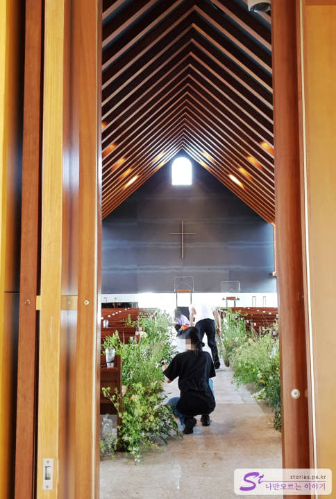

전날 한라산을 다녀왔기 때문에 상당히 피곤한 상태였습니다. 그리고 오늘은 제주를 떠나는 마지막 날이라 힘들지 않은 일정으로 잡았습니다.

첫 번째 방문지는 중문 위쪽 안덕면에 있는 **방주교회**를 다녀왔습니다.  
방주교회는 세계적인 건축가 **이타미 준**이라는 예명을 가지고 있는 재일교포 2세 **유동룡**님이 노아의 방주를 모티브로 설계를 했다고 합니다. 딱 봐도 노아의 방주의 모습을 연상할 수 있습니다.

적당한 크기의 주차장을 가지고 있어서 주차에는 걱정이 없습니다. 또한 앞쪽에 방주 카페도 있어서 잠시 커피를 마시며 쉴 수도 있습니다.

노아의 방주를 연상할 수 있도록 인공수조위에 건물이 들어서 있습니다. 지붕은 금속으로 되어 있는지 눈이 부시도록 반짝이고 있습니다. 의도적으로 이게 지붕인지 하늘인지 구분하기 어렵게 그런 소재를 사용하지 않았나 싶습니다. 그리고 이 건물은 실제로 주일날 예배를 드리는 교회입니다. 예배 안내가 있네요. 예배를 드리는 시간에는 예배에 방해가 되지 않도록 주의해야 할 필요가 있습니다.

인공 수조 때문에라도 노아의 방주를 떠올리게 되어 있습니다. 길게 직선으로 시원하게 뻗어 있는 모습이 범상치 않은 모습을 보여 줍니다.

한창 꽃을 준비하는 것을 보니 결혼식인 것 같습니다. 이날이 금요일이니 아무래도 토요일에 결혼식이 있는 것 같습니다.  
살짝 내부를 봤는데 지붕의 모습과 십자가가 걸려있는 강대상의 모습이 설계한 건축가의 능력을 확인하기에 부족하지는 않는 것 같습니다.

건물의 반대편입니다. 여기서 쳐다보면 더욱더 노아의 방주가 떠오릅니다. 하늘과 물과 잔디밭과 건물이 너무 자연스럽게 어우러져 있습니다.  
마침 배가 너무 아파 화장실을 찾았는데, 건물 내부의 지하에도 교육관 같은 넓은 장소도 있었고 화장실도 있었습니다. 화장실의 인테리어 마감재를 보니 상당히 고가의 제품을 사용한 듯 보입니다.

좋네요. ㅎㅎ

## 비용

비용은 무료입니다. 다만 예배시간만 조심해 주시면 될 것 같습니다.

## 여행지 정보

- 주소 : 제주 서귀포시 안덕면 산록남로762번길 113
- 연락처 : 064-794-0611
- URL : http://www.bangjuchurch.org

<iframe src='https://www.google.com/maps/embed?pb=!1m18!1m12!1m3!1d3334.5263619123843!2d126.38524901549029!3d33.30505206418016!2m3!1f0!2f0!3f0!3m2!1i1024!2i768!4f13.1!3m3!1m2!1s0x350c5bc9843121f7%3A0x73c683f9d3f005f2!2z67Cp7KO86rWQ7ZqM!5e0!3m2!1sko!2skr!4v1669996990579!5m2!1sko!2skr' class='embed-responsive-item' allowfullscreen></iframe>

