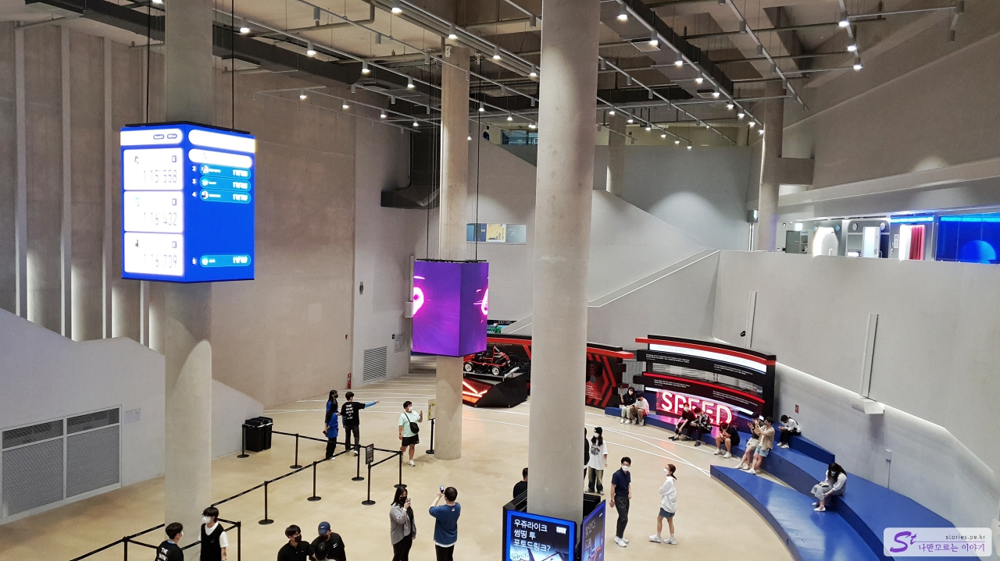
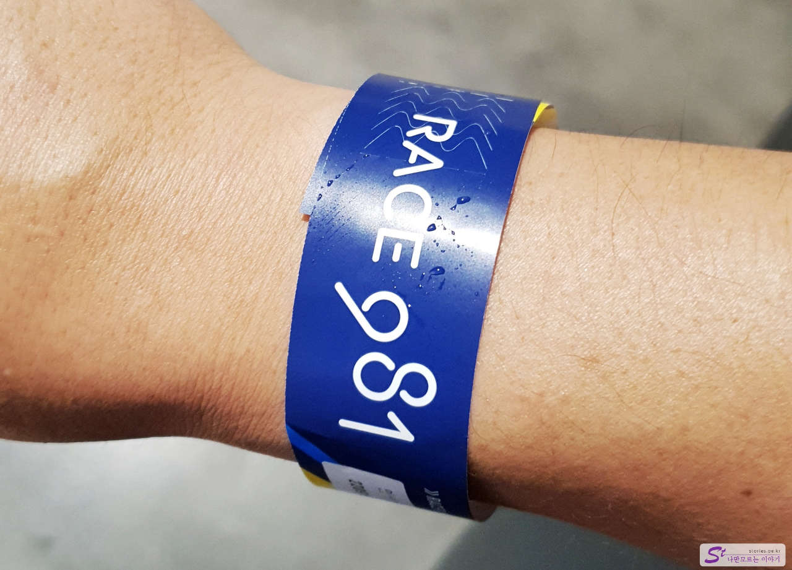
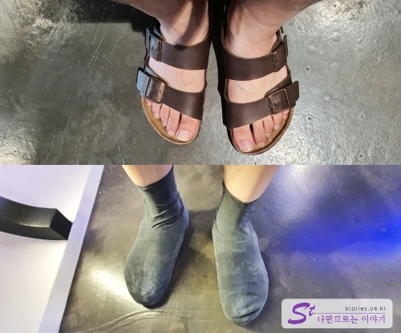
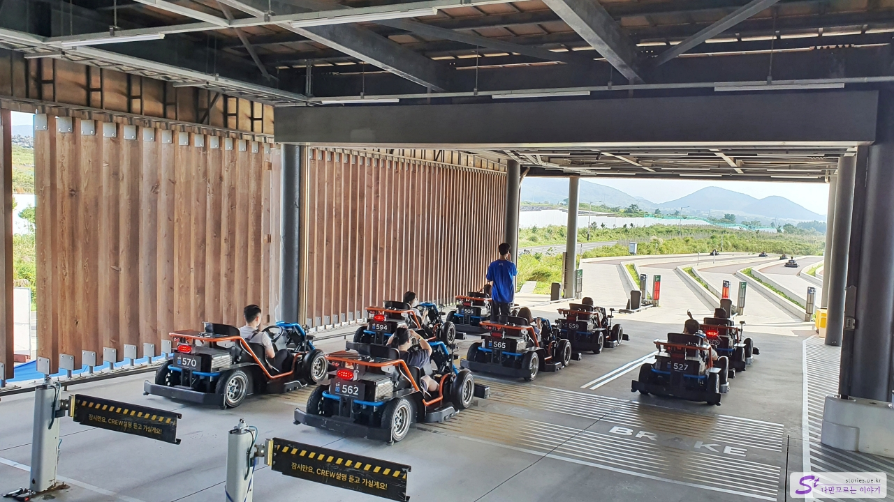

I went to **9.81 Park** near Aewol, the last course of my trip to Jeju. The Kart Rider feels like only children will ride, but the 9.81 cart is fully automated and modern, so it operates quite sophisticatedly. The price is expensive, but it was a place that I enjoyed a lot more than I thought.

Let's go to the entrance. Even though the entrance looks a bit like that, you can't take your eyes off the modernized facilities as soon as you enter.

There are no photos on the blog, but there is a place where you can buy tickets first when you enter the entrance, and there are steps to help you purchase each kiosk. The fact that there's a step is proof that it's not easy to buy^^ They were explaining something, but I gave up the tickets and just went in. You don't have to go in with a ticket. Tickets are only needed when riding a cart.

If you come inside a little more, you can meet this high-rise place. That's cool. ^^ We're going to wait here and go to the boarding place.

After many twists and turns, I installed an app on my smartphone and purchased a two-seater boarding pass. If you buy it, you will be given a wristband that can be worn on the wrist given by Lotte World as above. When you board this strap, you have to let the cart recognize you can proceed.

I wear slippers a lot in summer, but I can't get on board if I wear slippers. Fortunately, you can buy rubber shoes at the store there, but you can get on if you wear them on top of your slippers. \*\*I think the price was about 2,000 won.

I wait to ride a cart. The car is automated, but when racing in real life, it runs without power. In other words, it's a downhill form. But you can still feel the speed.

Finally, it's your next turn. It's a tense moment. First-time passengers explain how to board, so if you're not a fool, you don't have to worry too much.

You can't take pictures during the race, so you should keep your smartphone or camera well so that it doesn't fall outside. There is a camera installed in the cart, so after the race, the video is sent to the installed app.

After a short but thrilling race of about a minute and a half, you get back to square one. Ironically, as opposed to the actual car race, the cart's power comes in at this time. And it's completely automatic and it's back to square one along the way. It takes a long time to go back and it's fun. I took a picture then.

## Cost

There are ways to purchase boarding passes from the mobile app and on-site, and there are more advantages to purchasing from the app. Therefore, it is recommended to install the app on your smartphone first and purchase it. You can also receive videos of racing with this app later.

| goods                                   | prices     |
| --------------------------------------- | ---------- |
| 981 Full Package                        | KRW 49,500 |
| 9 hours of racing and playing           | KRW 29,500 |
| Full package with child                 | KRW 79,500 |
| Single-seater racing 3 times (APP only) | KRW 39,500 |
| Two-seater racing (APP only)            | KRW 37,500 |
| APP only                                | KRW 3,500  |
| Arena (APP only)                        | KRW 9,000  |
| Ringo Bumper Car (APP only)             | KRW 5,000  |

## Time of entry

- Operating hours: 09:00 - 18:00 (Racing operating hours - 9:00 - 17:40)

## Travel destination information

- Address: 880-24, Cheondeok-ro, Aewol-eup, Jeju-si
- Contact: 1833-9810
- URL : https://www.981park.com/

<iframe src='https://www.google.com/maps/embed?pb=!1m18!1m12!1m3!1d3331.2290902657764!2d126.36433981549179!3d33.39118695972213!2m3!1f0!2f0!3f0!3m2!1i1024!2i768!4f13.1!3m3!1m2!1s0x350cfcaee389e537%3A0xb1b8a666bc10abe1!2zOS44MSDtjIztgaw!5e0!3m2!1sko!2skr!4v1670229821592!5m2!1sko!2skr' class='embed-responsive-item' allowfullscreen></iframe>

## Parking information

There is a large free parking lot, so you don't have to worry about parking.
