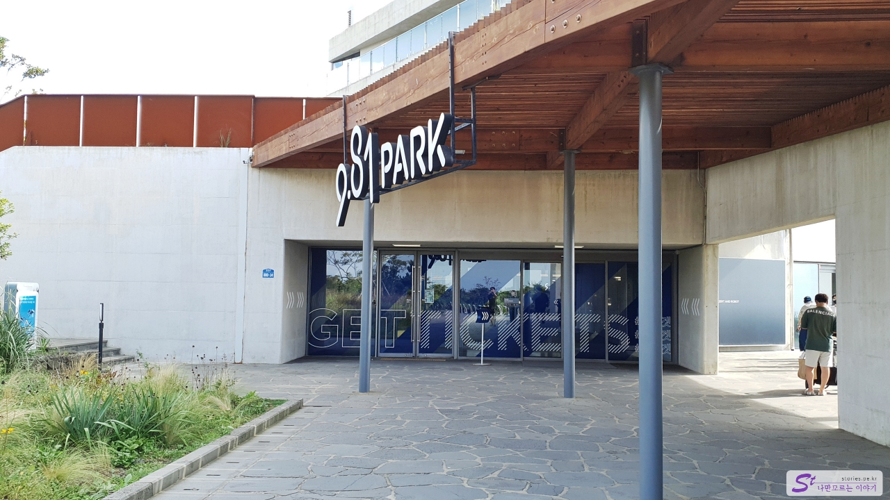
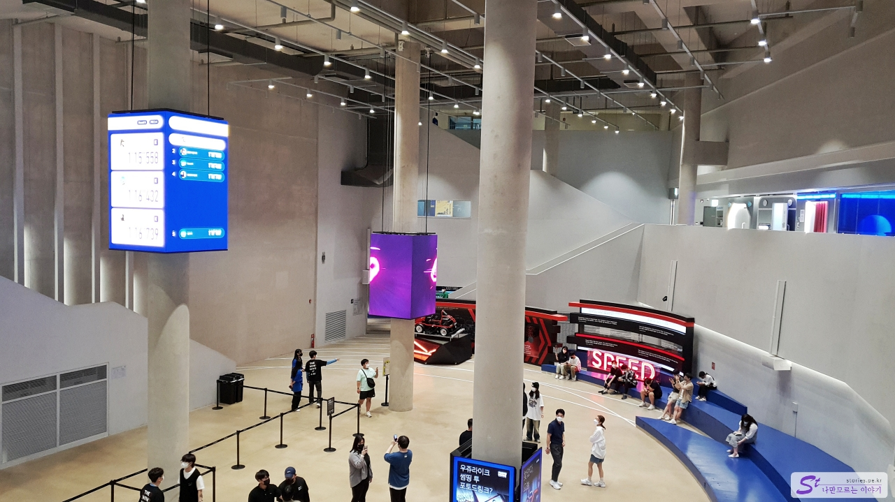
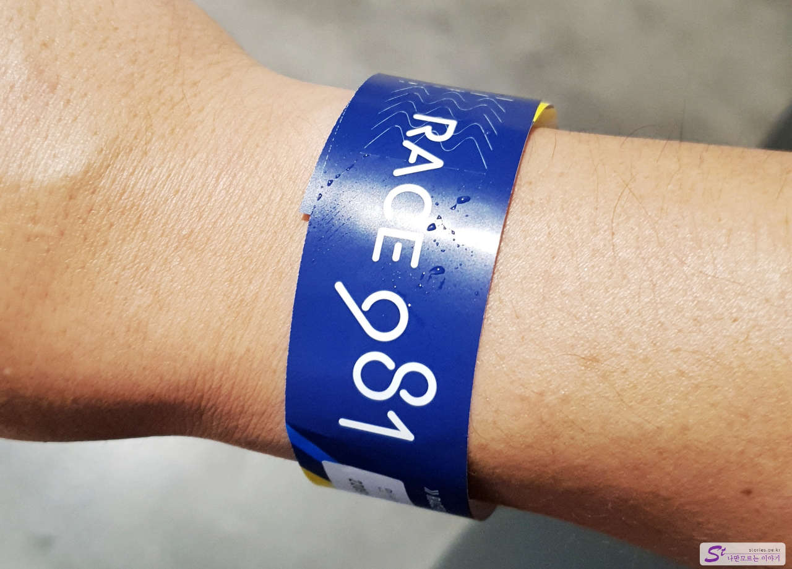
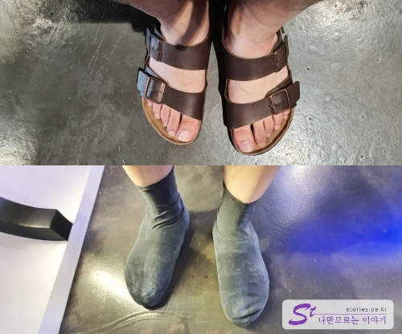
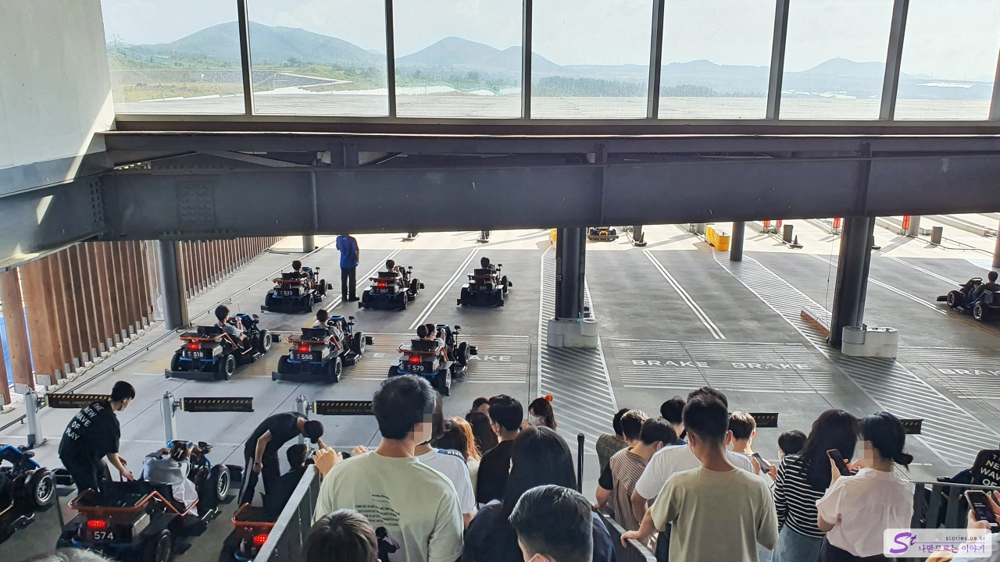
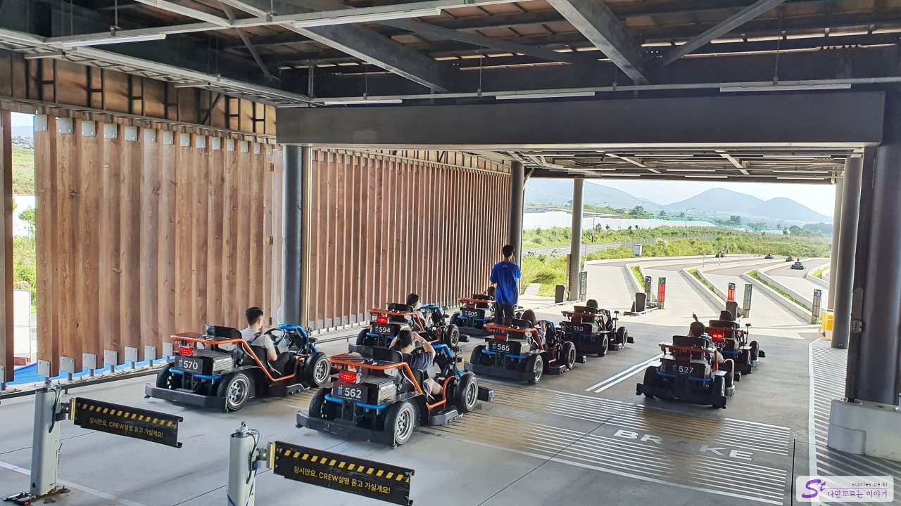
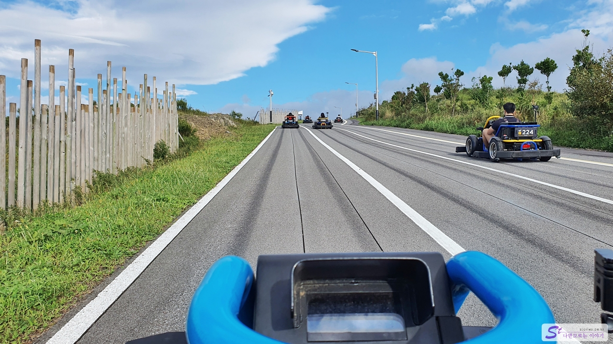

이번 제주여행의 마지막 코스인 애월 쪽에 있는 **9.81파크**를 다녀왔습니다. 카트라이더는 어린이만 탈것 같은 느낌이지만 9.81의 카트는 완전 자동화되어 있고 현대화되어 있어서 상당히 세련되게 운영하고 있습니다. 가격은 비싼데 생각했던 것보다 훨씬 재미있게 즐겼던 곳이었습니다.

일단 입구로 들어섭니다. 입구가 보기에는 좀 그래 보여도 들어서자마자 현대화된 시설에 눈을 뗄 수 없습니다.

블로그에 사진은 없지만 입구에 들어서면 먼저 매표를 할 수 있는 장소가 있고 키오스크마다 구매를 도와주는 스텝들이 있습니다. 스텝이 있다는 예기는 구매가 쉽지 않다는 반증이겠지요^^ 뭐라 뭐라 설명을 하는데, 일단 매표를 포기하고 그냥 들어갔습니다. 꼭 매표를 하고 들어갈 필요는 없습니다. 매표는 카트를 탈 때만 필요합니다.

좀 더 안으로 들어오면 이렇게 층고가 높은 장소를 만날 수 있습니다. 멋있지요 ^^ 이곳에서 대기를 하고 탑승 장소로 이동하게 되어 있습니다.

우여곡절 끝에 스마트폰에 앱을 설치하고 2인승 2회 탑승권을 구매했습니다. 구매를 하면 위와 같이 롯데월드에서 주는 손목에 찰 수 있는 팔목띠를 줍니다. 이 띠를 탑승할 때 카트에 인식을 시켜야 진행할 수 있습니다.

여름에는 슬리퍼를 많이 신는데 슬리퍼를 신으면 탑승이 되지 않습니다. 다행히 그곳 상점에서 고무 덧신을 살 수 있는데 슬리퍼 위에 신으면 탑승이 가능합니다. **가격이 약 2,000원** 정도 했던 것 같습니다.

카트를 타기 위해 대기를 합니다. 차는 자동화되어 있지만 실제 레이싱을 할 때는 동력이 없는 무동력으로 달립니다. 다시 말하면 내리막길을 달리는 형태입니다. 그래도 상당한 속도감을 느낄 수 있습니다.

드디어 다음 차례군요. ㅎㅎ 긴장되는 순간입니다. 처음 탑승을 하는 사람들은 탑승 방법에 대해 설명을 해 주기 때문에 바보가 아니라면 크게 걱정하지 않아도 됩니다.

레이스 중에는 사진촬영이 불가하기 때문에 스마트폰이나 카메라는 밖으로 떨어지지 않게 잘 보관해야 합니다. 카트에 카메라가 설치되어 있어서 레이스가 끝난 다음에 동영상을 설치된 앱으로 발송해 줍니다.

약 1분 30초 정도의 짧지만 짜릿한 레이스를 끝내고 다시 원점으로 되돌아옵니다. 아이러니하게도 실제 자동차 레이스와 반대로 이때 카트의 동력이 들어옵니다. 그리고 완전 자동으로 자기가 길을 따라 원점으로 되돌아갑니다. 이 되돌아가는 시간도 길고 재미가 있네요. 요때 사진 한번 찍어봤습니다.

## 비용

탑승권을 모바일 앱에서 구매하는 방법과 현장에서 구매하는 방법이 있는데, 앱에서 구매하는 방법이 더 이점이 있습니다. 그래서 가능하면 스마트폰에 먼저 앱을 설치하고 구매하시는 것이 좋습니다. 나중에 이 앱으로 레이싱했던 동영상도 받아 볼 수 있습니다.

| 상품                       | 가격     |
| -------------------------- | -------- |
| 981 풀패키지               | 49,500원 |
| 9시한정 레이싱하고놀랩     | 29,500원 |
| 아이와함께 풀패키지        | 79,500원 |
| 1인승 레이싱 3회(APP only) | 39,500원 |
| 2인승 레이싱 2회(APP only) | 37,500원 |
| 스포츠랩(APP only)         | 3,500원  |
| 아레나(APP only)           | 9,000원  |
| 링고 범퍼카(APP only)      | 5,000원  |

## 입장시간

- 운영시간 : 09:00 - 18:00 (레이싱 운영시간 - 9:00 ~ 17:40)

## 여행지 정보

- 주소 : 제주 제주시 애월읍 천덕로 880-24
- 연락처 : 1833-9810
- URL : https://www.981park.com/

<iframe src='https://www.google.com/maps/embed?pb=!1m18!1m12!1m3!1d3331.2290902657764!2d126.36433981549179!3d33.39118695972213!2m3!1f0!2f0!3f0!3m2!1i1024!2i768!4f13.1!3m3!1m2!1s0x350cfcaee389e537%3A0xb1b8a666bc10abe1!2zOS44MSDtjIztgaw!5e0!3m2!1sko!2skr!4v1670229821592!5m2!1sko!2skr' class='embed-responsive-item' allowfullscreen></iframe>

## 주차정보

넓은 무료 주차장이 있어서 주차 걱정은 없습니다.
