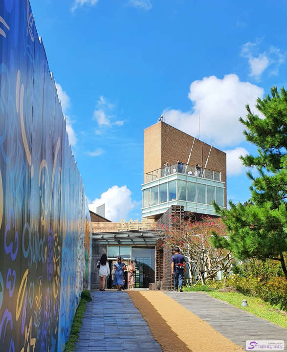
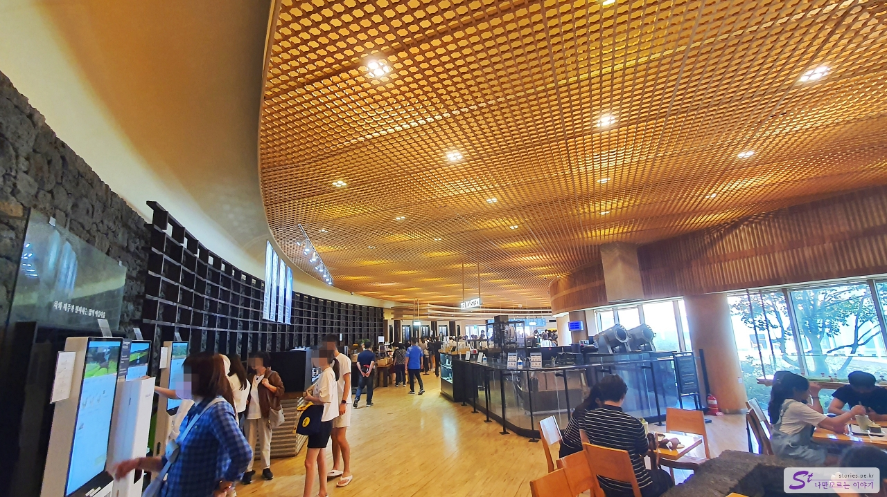
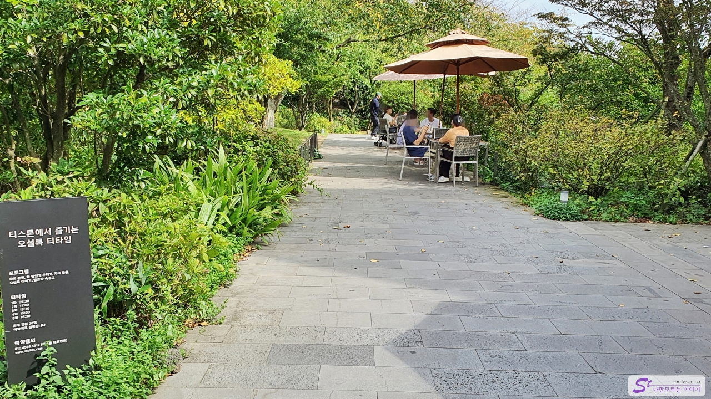
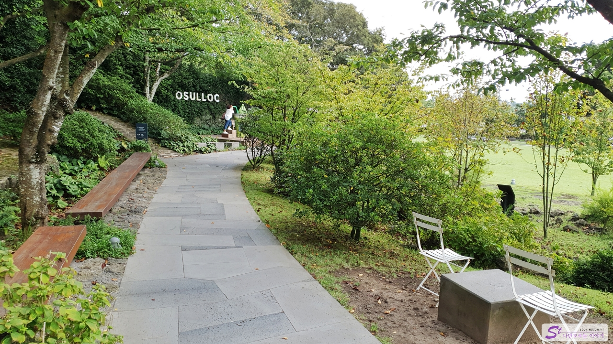
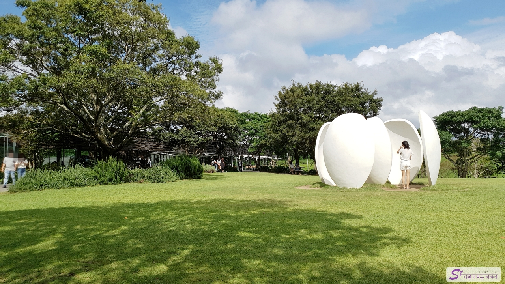
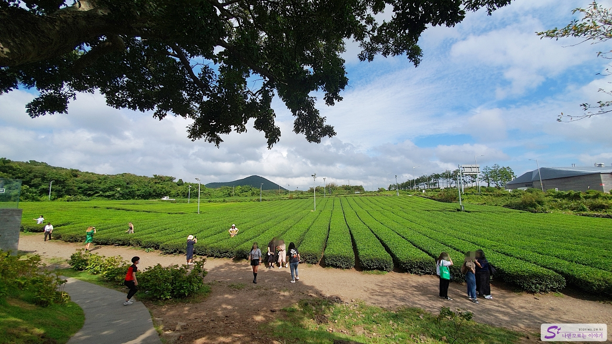

Another famous thing was added to Jeju called Samdado Island, which seems to be green tea. Jeju, which has a clear sky, seems to be the best condition for the green tea industry to develop.

Launched in 1979 when a company named AMOREPACIFIC cultivated a green tea field on Jeju Island **Ossullocha**, **Ossullocha** made a beverage product under the brand **Sullocha**, which is now better known as Ossullocha** in Jeju Island in 2001. Perhaps that's why if you go to Osulloch, you can see the AmorePacific brand **Innisfree\*\* building with it.

There are green tea fields all around and the main entrance to the T-museum in the middle.

Once you pass through the main gate, you will naturally head to the T-Museum building. You can go inside the building along this road.

It includes a space to introduce tea culture, a rest area to relax, a sales space to sell various teas, and a cafe space to drink beverages.

Drinks can be ordered using kiosks.  
You can take a break here or buy a set of green tea gifts that are good for your acquaintances as a gift to celebrate your trip.

If you come out on the other side of the T-Museum, you can go outside. It is also tasteful to bring drinks outside on a suitable day. If you go to the left of the picture, you can go to a place called T-stone, but we pass

In the picture above, if you go up the hill along the road on the left, you will also encounter a large space.

You can visit the Innisfree Jeju House\*\* right away. There are cosmetics, perfumes, and programs where you can experience various things. Above all, the building and interior itself are so nicely decorated that it's worth going in at least once.

And in front of the building, there is a wide spread of grass.

If you go straight ahead after passing the Innisfree Jeju House building, you can see the wide green tea fields. And you can see a lot of people taking pictures here. Not only Koreans but also foreigners came to take pictures.

After a round like this, I met Oh Seol-rok on the way out to the main gate. I thought it would come out pretty if I took a picture, so I took it when no one was there. ^^

## Cost

Admission is free. You can think of the cost of buying a product or a cafe drink at the T-museum.

## Time of entry

- Operating hours: 09:00 - 18:00
- Time required: Approximately 1 hour round trip
- Closed: 24/7

## Travel destination information

- Address: 15 Osullok, Shinhwa Station, Andeok-myeon, Seogwipo-si, Jeju
- Contact point: 064-794-5312
- - URL : https://www.osulloc.com

<iframe src='https://www.google.com/maps/embed?pb=!1m18!1m12!1m3!1d2803.99754440884!2d126.29103967575976!3d33.30485674425736!2m3!1f0!2f0!3f0!3m2!1i1024!2i768!4f13.1!3m3!1m2!1s0x350c5d1219ebcc11%3A0xb8a71289da43cad1!2z7Jik7ISk66GdIO2LsCDrrqTsp4Dsl4Q!5e0!3m2!1sko!2skr!4v1670224464729!5m2!1sko!2skr' class='embed-responsive-item' allowfullscreen></iframe>

## Parking information

The parking lot is spacious but there are many people. When the main parking lot is full, the parking guide will guide you to other parking lots 2 or 3 nearby.
