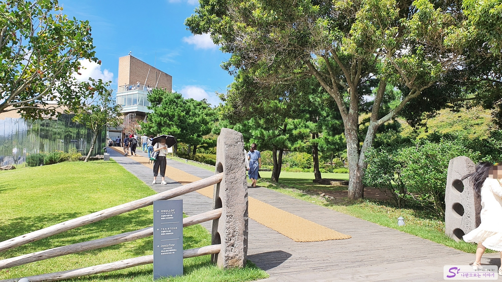
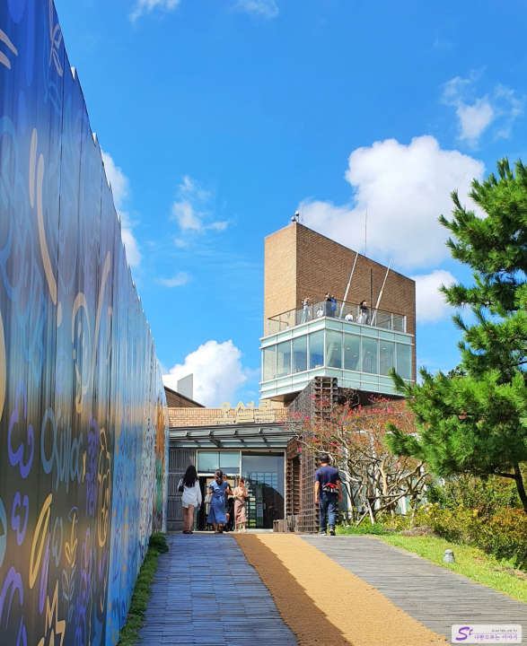
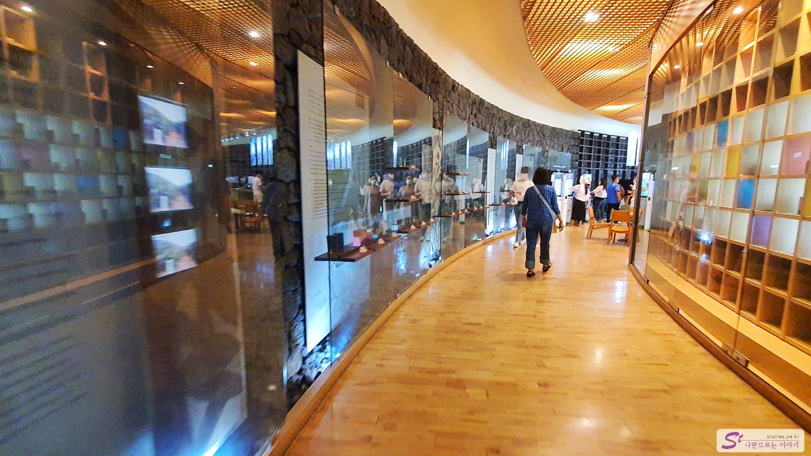
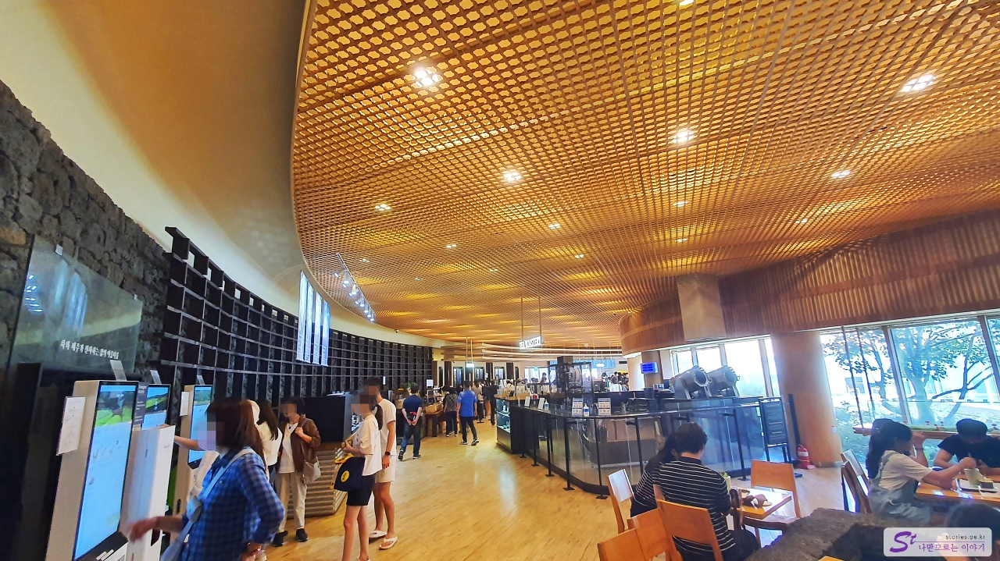
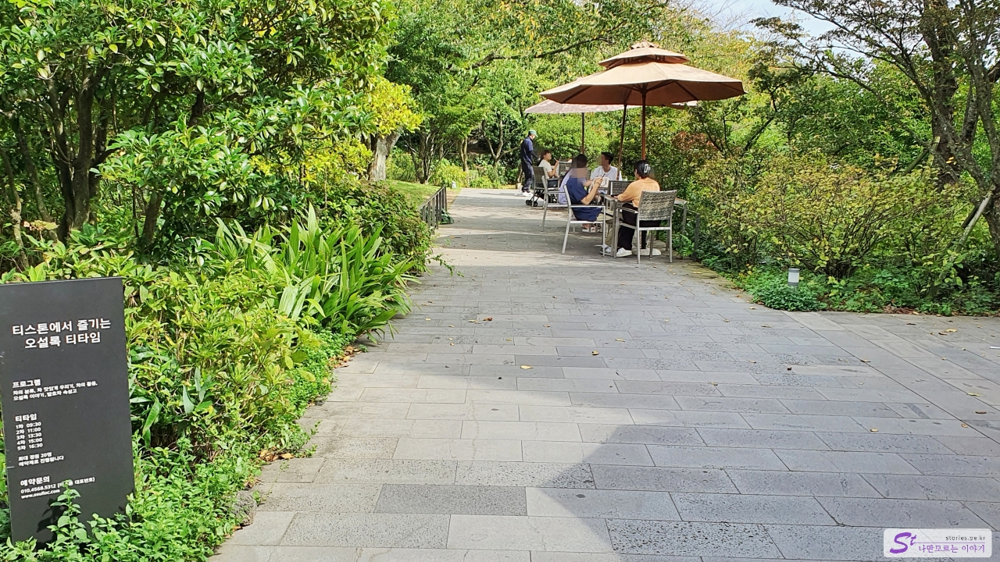
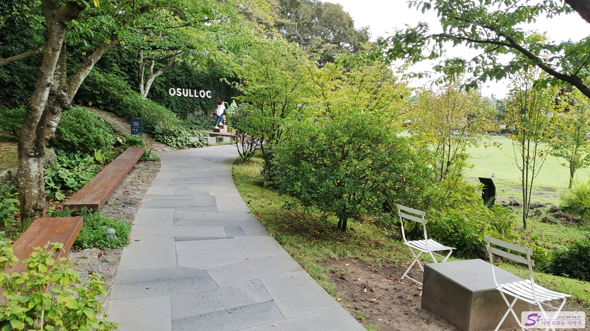
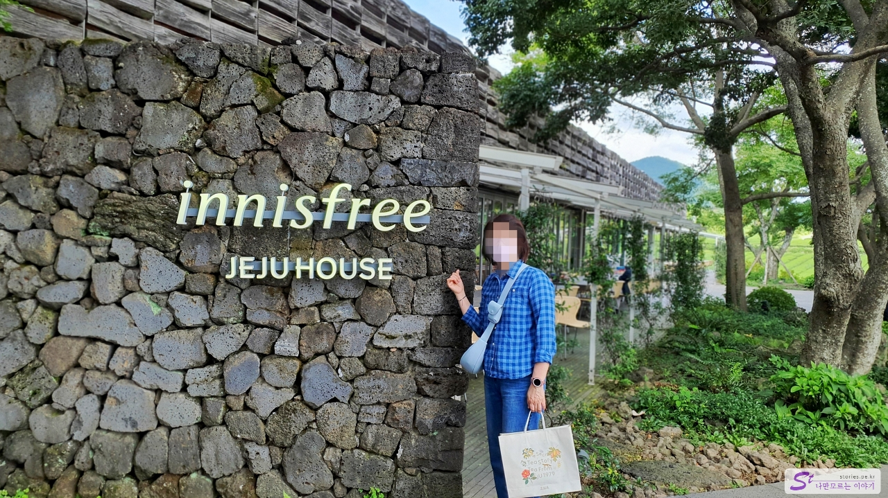
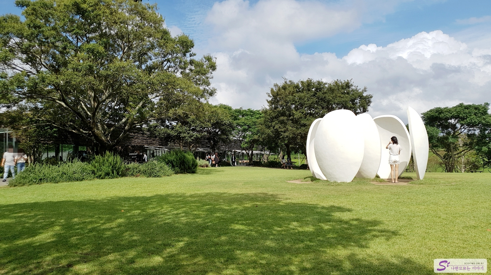
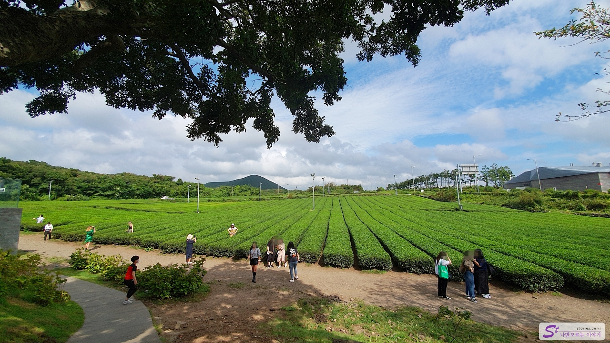
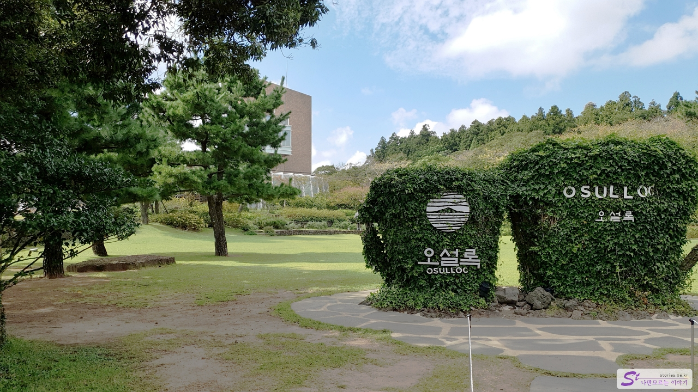

삼다도라고 하는 제주에 또 하나 유명한 것이 추가되었는데, 그것이 녹차인 것 같습니다. 맑은 하늘을 가지고 있는 제주는 녹차 산업이 발달할 수 있는 최적의 조건인 것 같습니다.

**아모레퍼시픽**이라는 회사가 1979년에 제주도의 녹차밭을 개간하면서 시작한 **오설록**은 예전에 **설록차**라는 브랜드로 음료 상품을 만들었었는데 2001년도에 제주도 **오설록 티뮤지엄**을 개관하면서 현재는 오설록이라는 브랜드로 더 잘 알려지게 되었습니다. 그래서인지 오설록에 가면 아모레퍼시픽 브랜드인 **이니스프리** 건물도 함께 있는 것을 볼 수 있습니다.

주위의 사방으로 녹차밭이 있고 그 중간에 티뮤지엄으로 들어가는 정문이 있습니다.

일단 정문을 통과하면 자연스럽게 동선이 티뮤지엄 건물로 향하게 됩니다. 이 길을 따라 건물 내부로 들어가시면 됩니다.

이곳에는 차 문화에 대해 소개하는 공간과 쉴 수 있는 휴식공간, 다양한 차를 판매하는 판매 공간, 그리고 음료를 마실 수 있는 카페 공간으로 되어 있습니다.

음료는 키오스크를 활용하여 주문할 수 있습니다.  
이곳에서 잠시 쉬어 갈 수도 있고 여행 기념으로 지인에게 선물하기 좋은 녹차 선물 세트를 구매할 수도 있습니다.

티뮤지엄의 반대쪽으로 나오게 되면 야외로 나올 수 있습니다. 적당한 날에는 실외에 음료를 가지고 나와서 마시는 것도 운치가 있습니다. 사진의 왼쪽으로 간다면 티스톤이라는 곳도 가 볼 수 있지만 저희는 패스~~

위의 사진에서 왼쪽의 길을 따라 언덕을 올라가면 또 넓은 공간의 장소를 만나게 됩니다.

바로 **이니스프리(innisfree) 제주하우스**를 만나볼 수 있습니다. 이곳에서는 화장품, 향수, 그리고 각종 체험을 할 수 있는 프로그램들이 있습니다. 무엇보다도 건물과 인테리어 자체가 너무 멋있게 꾸며져있어서 한 번쯤 들어가 볼 만합니다.

그리고 그 건물 앞에는 넓게 펼쳐져 있는 잔디밭이 있습니다.

이니스프리 제주하우스 건물을 지나쳐 더 앞쪽으로 직진을 하면 넓게 펼쳐져 있는 녹차밭을 볼 수 있습니다. 그리고 수많은 사람들이 이곳에서 기념사진을 찍고 있는 모습을 볼 수 있습니다. 한국 사람뿐만 아니라 외국 사람들도 엄청 많이 와서 사진을 찍고 있었습니다.

이렇게 한 바퀴를 돌고 다시 정문으로 나가는 길에 오설록 조형물을 만나게 되었습니다. 사진을 찍으면 이쁘게 나올 것 같아 아무도 없을 때 한번 찍어봤네요. ^^

## 비용

입장료는 무료입니다. 티뮤지엄에서 상품이나 카페 음료를 사 먹을 정도의 비용을 생각하시면 됩니다.

## 입장시간

- 운영시간 : 09:00 - 18:00
- 소요시간 : 왕복 약 1시간
- 휴무일 : 연중무휴

## 여행지 정보

- 주소 : 제주 서귀포시 안덕면 신화역사로 15 오설록
- 연락처 : 064-794-5312
- URL : https://www.osulloc.com

<iframe src='https://www.google.com/maps/embed?pb=!1m18!1m12!1m3!1d2803.99754440884!2d126.29103967575976!3d33.30485674425736!2m3!1f0!2f0!3f0!3m2!1i1024!2i768!4f13.1!3m3!1m2!1s0x350c5d1219ebcc11%3A0xb8a71289da43cad1!2z7Jik7ISk66GdIO2LsCDrrqTsp4Dsl4Q!5e0!3m2!1sko!2skr!4v1670224464729!5m2!1sko!2skr' class='embed-responsive-item' allowfullscreen></iframe>

## 주차정보

주차장은 넓은데 사람이 많습니다. 매인 주차장이 가득 차면 주차안내원이 주위에 있는 다른 2, 3 주차장으로 안내를 해 줍니다.
