Even a commoner can take a day trip to Mt. Halla Baeknokdam if he wants. We went there on October 5th, and we would like to post based on the information we learned from the trip.  
We're not a mountain climber either, but we've been practicing apartment stairs for about a month to climb Hallasan Mountain. That's why Mt. Halla is hard, but if you have the will, you can go.

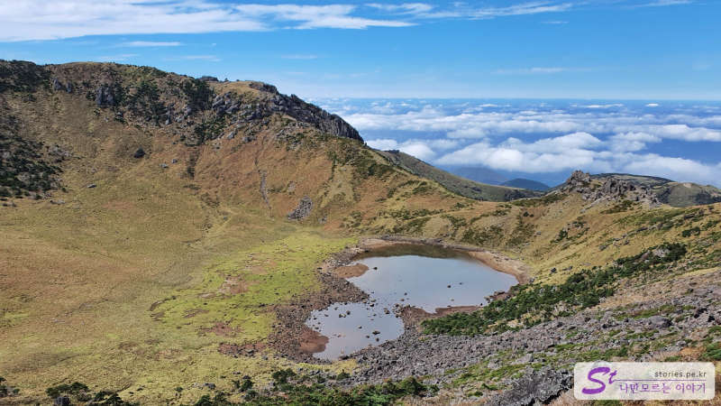

# Preparation in advance

It takes about 9 hours to get to Baeknokdam on Hallasan Mountain on a regular walk. As the distance is the distance, it is recommended to secure some basic physical strength.  
Stair exercise is helpful because most of the roads alternate between stone fields and uphill on the deck path.  
You must wear hiking boots and mid-neck hiking boots that hold your ankles are good. It's a stone field, so there's a high probability that your ankle will be bent.  
Climbing sticks are very helpful when you go down the mountain, so it's better to prepare them. If you tie the hiking stick to the outside of the bag, you can take it on the plane.  
It's a one-day trip, so you have to pack all your luggage in your backpack and take it into the plane. It is also recommended that you take the front seat where you can get off as soon as possible.

## Supplies

### Required

- Climbing bags, hiking boots, hiking sticks
- Gimbap for lunch, behavioral meals (chocolate bar, bread, etc.), water (about 3 per person), garbage bags
- Hiking hats, gloves, windbreakers
- Personal medicine, Tylenol, digestive medicine, antidiarrheal, fucidine, bandage, compression bandage

### Options

- Auxiliary battery, battery cable, sunglasses, multi scarf, towel, hiking socks, LED head lantern, panchowooi
- Insulation water (500ml), bowl noodles, wooden chopsticks, wet tissue, tissue, fruit

## Reservation for Hallasan Mountain Climbing

If you want to go up Mt. Halla to Seongpanak or Gwaneumsa Temple, you have to make a reservation for climbing first.

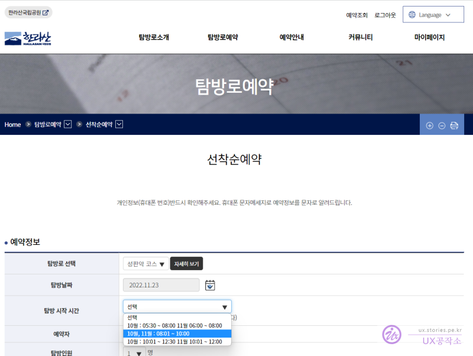

> https://visithalla.jeju.go.kr/reservation/firstComeStep.do

The date and climbing time will be selected on a first-come, first-served basis, and if you are going back on the day, select the time **08:00 to 10:00**.  
06:00 to 08:00 is a difficult time to arrive even if you take the first flight, and 10:00 to 12:00 is a difficult time to climb Baeknokdam. (Although the time varies slightly from season to season, you may be controlled from the azalea shelter to Baeknokdam Mountain. During the spring and autumn seasons, access to Baeknokdam is restricted after 12:30 p

## an air ticket reservation

Next, you need to buy a flight ticket.
Since it's a one-day climb to Hallasan Mountain, you must book a flight ticket for ** departing at around 6 a.m. and ** returning at around 9 p.m.  
Air tickets are usually cheap on Tuesdays, Wednesdays, and Thursdays. We bought a flight ticket departing on Wednesday and it cost 75,000 won per person.
It is recommended to use Asiana or Korean Air for departure flights if possible. In the case of low-cost flights, if you don't have any luck, the plane stops far from the departure hall and takes a bus to the departure hall, so it takes a long time, so you can miss the bus to Seongpanak.  
If you have purchased a flight ticket, it is recommended that you access the airline app and reserve a seat in the front in advance.

# on the same day

## Gimpo Airport

On the day of departure...  
I have to arrive at Gimpo Airport at 5 a.m.  
And if you want to save even a little bit of parking, I recommend parking in the parking lot of the Gimpo Airport Freight Building.  
The parking fee for the Gimpo Airport parking lot is 20,000 won and the cargo building is 12,000 won. You can save about 8,000 won. The distance is not as far as I thought.

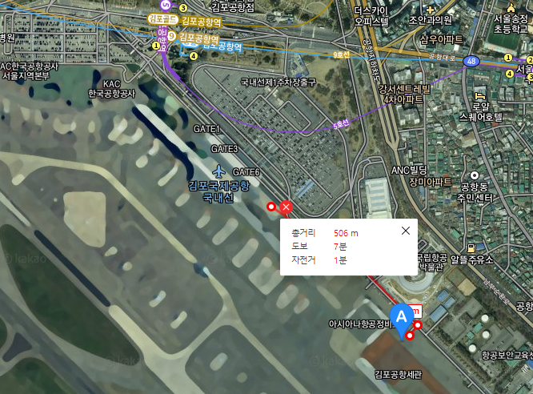

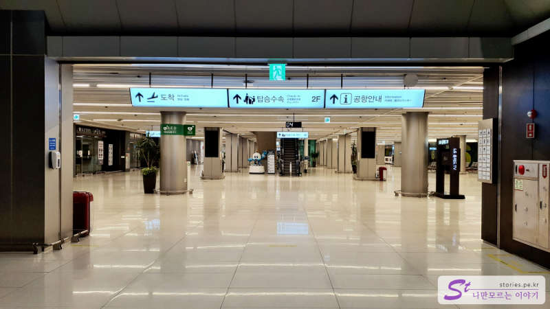  
If you walk about 5 to 7 minutes from the cargo office, you can enter the Gimpo Airport building. I don't think it's too far compared to regular domestic parking lots.  
There is no checked baggage, so you can check in on your mobile and enter the departure hall right away.  
When you enter the departure hall, there is a CU convenience store, and it seems to be open from 5:00 to 5:30 for the first flight guest. You can buy gimbap or triangular gimbap to eat at Hallasan Mountain here. You can have a simple breakfast.

## Jeju Airport

If you leave Gimpo Airport at 6 o'clock, you usually arrive at Jeju Airport around 7:10. If you rush out of the departure hall, you can take the bus to Seongpanak (No. 181)** from **gate\*\*1 at 7:20.  
If you miss this bus, you should take a taxi to Seongpanak.

So, if you plan to take a bus, it is better to use Asiana or Korean Air for departure flights to reduce the time from the plane to the departure.

> - \*\*Bus 181: Jeju Airport -> Seongpanak (departure from airport at 7:20)
> - Bus 182: Seongpanak -> Jeju Airport
> - Bus information: http://bus.jeju.go.kr/schedule/viewNew/181

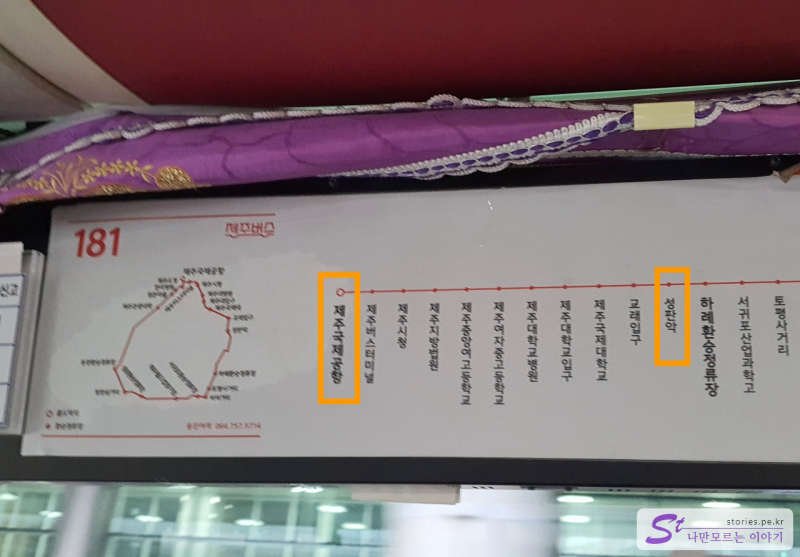

#### Fee and time

- **Bus No. 181**
  - Fee: Approximately 2,200 won
  - Time: It takes about 1 hour
- **Taxi**
  - Fee: Approximately 20,000 won
  - Time: It takes about 40 minutes

## Mt. Halla

The advantage of taking a bus or taxi is that you can experience both Seongpanak and Gwaneumsa Temple. You can go up to Seongpanak and come down to Gwaneumsa Temple, or vice versa.  
It is difficult to climb Gwaneumsa Temple, so if you are a beginner, I recommend you to go up to Seongpanak and come down to Gwaneumsa Temple. That's how we went up.

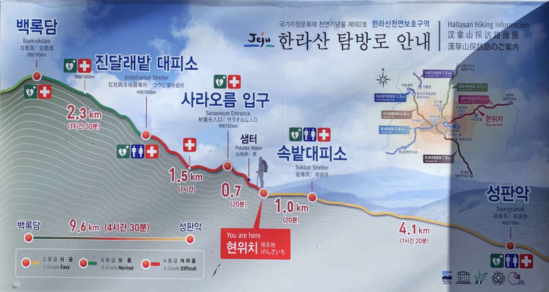
The Seongpanak course is as above.  
It takes about an hour and a half from the entrance to the inner field shelter, about two hours from the inner field shelter to the azalea field shelter, and about an hour and a half from the azalea field shelter to Baeknokdam, although there are individual differences, it takes about four and a half hours to five hours one way.  
You may think it will be fast when you come down, but you can think of it as taking as long as you go up because you come down from a very tired state.

### Seongpanak Rest Area

If you took the bus, you would arrive at Seongpanak approximately 8 o'clock or \*\*8:10 o'clock.

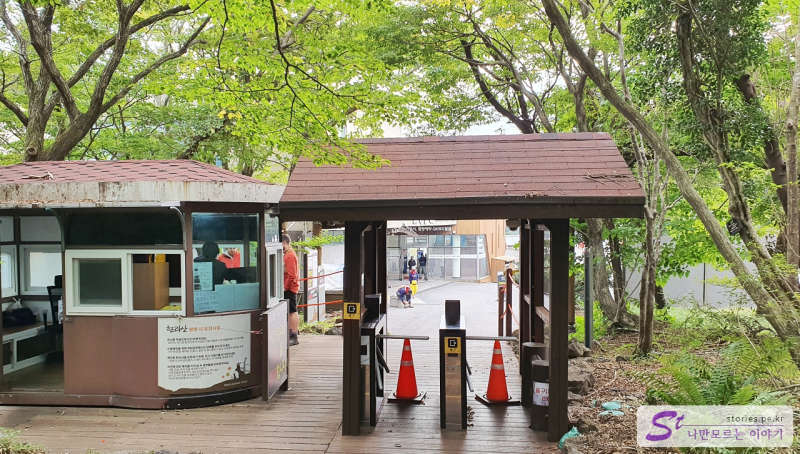
You can do a simple personal maintenance at the rest area and pass through the entrance of Seongpanak.

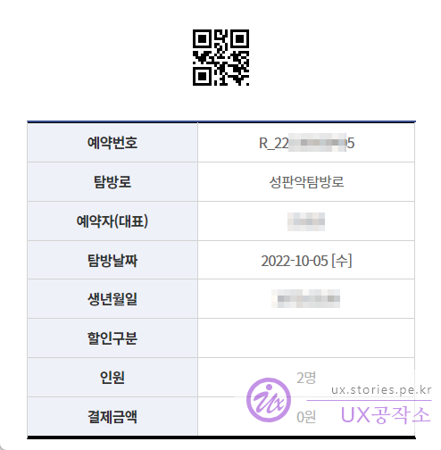
Before you pass through the entrance, you must show the barcode through the link in the text message you received when you made the reservation.

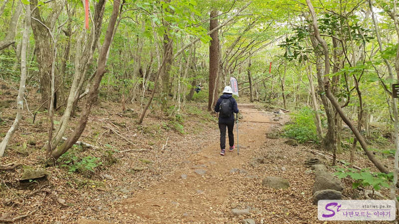
It takes about an hour to an hour and a half to get to the inner field shelter, but it's not a difficult road to take a walk.

### an inner-field shelter

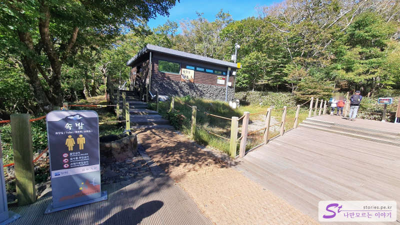
It's the first shelter, the inner field shelter. It's a place where you can rest for a while because there's a rest area and a bathroom. There is an outdoor space and it is narrow, but there is also an indoor space, so you can stay and rest for a while in case of rain.  
If there is no problem in particular, it is recommended to take a short rest for 5 to 10 minutes here and go up.

### an azalea shelter

If you go up diligently for about two hours from the inner field shelter, you will feel the sky is open, and that is the azalea field shelter.

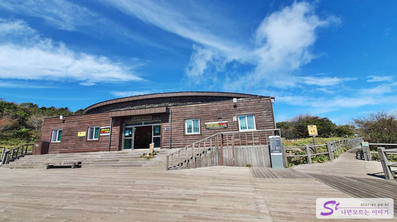
The azalea field shelter occupies a fairly large space. I heard there was a store in the past, but we don't sell anything now. So you have to buy all the kimbap, ramen, and water and come up.  
But just here! There is a place to throw away the ramen soup, so if you eat a bowl, you can throw away the leftover soup or scraps. There are no other rest areas, so if you are planning to eat ramen, I recommend you to eat here and take care of it.  
I'll take a break for about 30 minutes here, and now I'm going up to Baeknokdam. The climbing course from here to Baeknokdam is formidable.

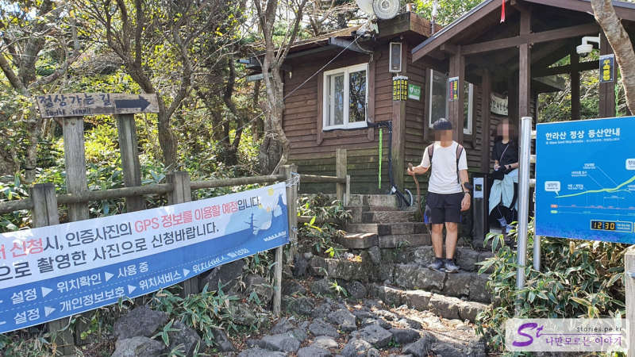
Although the time to pass through varies slightly from season to season, the entrance is controlled after 12:30 in spring and autumn.
We arrived at around 11:20, ate bowl noodles for about 30 minutes, rested with bread, and passed \*\*at 11:50 p.m.

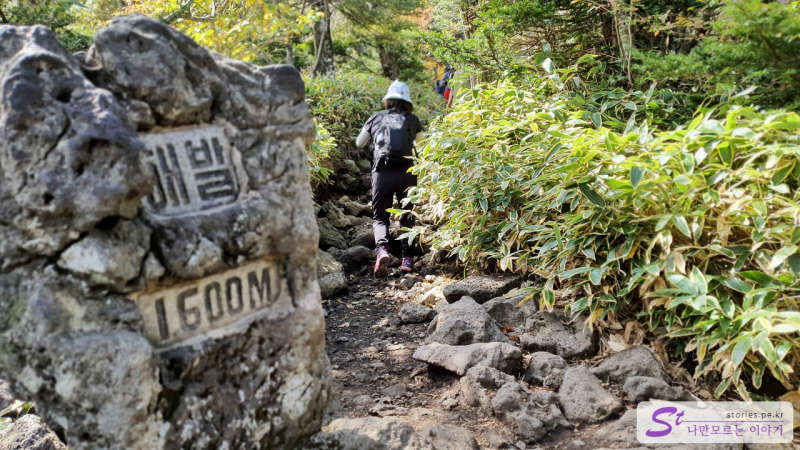
It went up to 1600 meters above sea level. After that, a difficult road emerges.

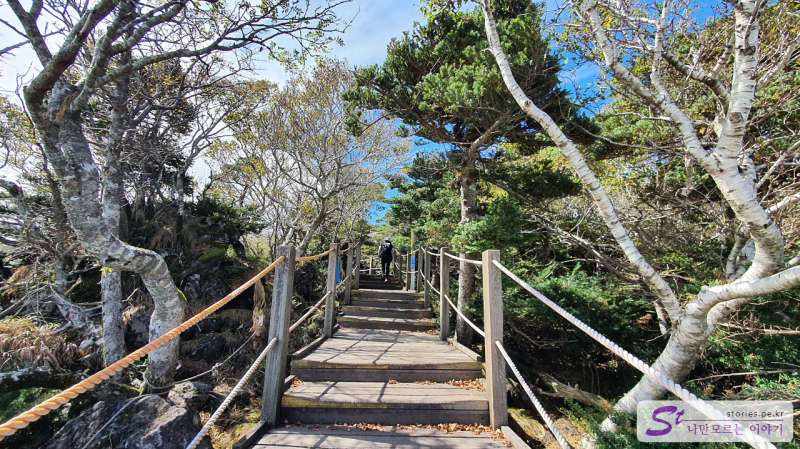
At the beginning of this place, stone paths and deck stairs alternate.

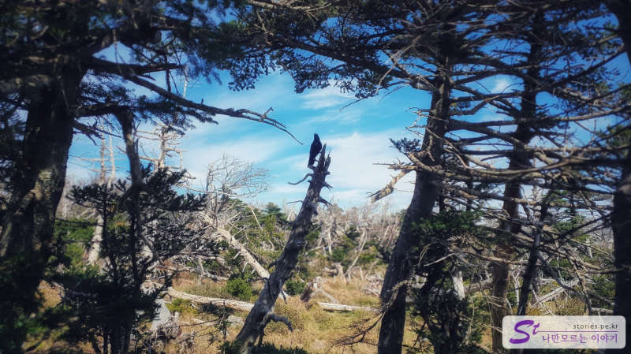
There are dead white dead trees all over the place, and you can see a nice view.  
Why are there so many crows?

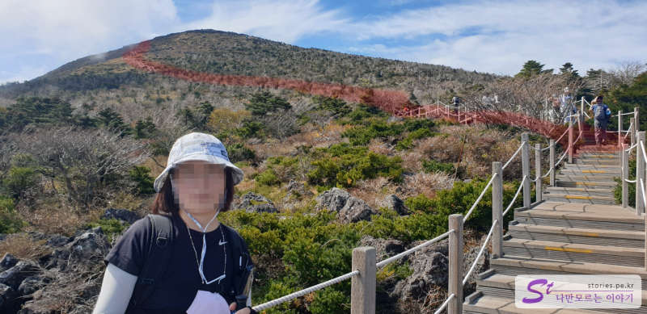
It's cool when you see endless stairs in the distance, but I really want to give up thinking about how to get there. Still, if you walk up the stairs right in front of you, you will find yourself at the top.  
All the red parts of the picture are made up of stairs.

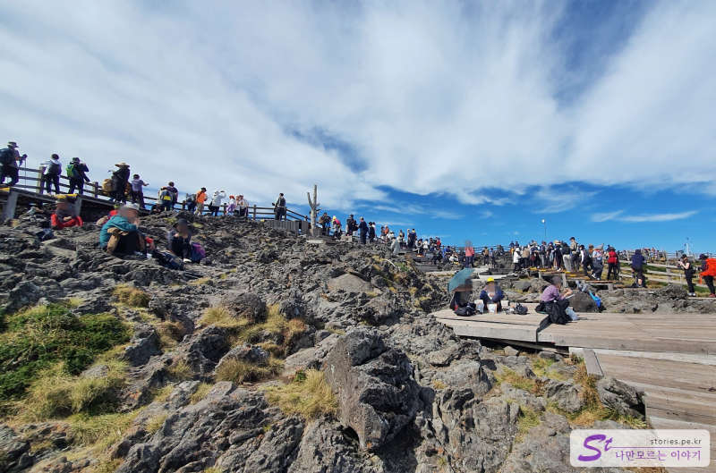
By the time my body and mind are getting tired, I finally meet the top, and I meet many people who came before me.

### White-green wall

If you climb up the mountain for an hour and a half, you will encounter a really wonderful Baekrokdam.

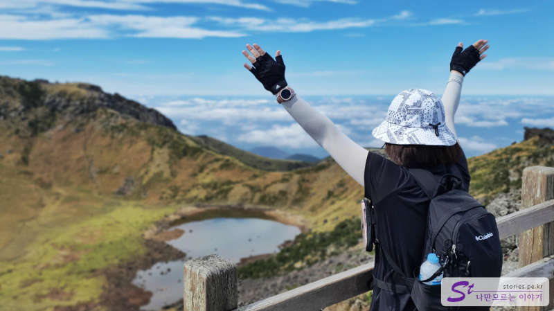
When I see myself standing with Baekrokdam at a place higher than the clouds, the hard things disappear as if I washed away.

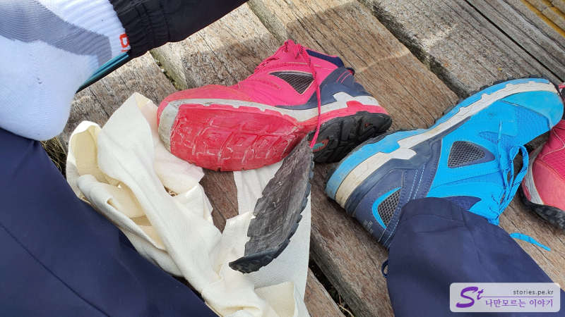
It's a North Face shoe, but the sole fell off. It's a shoe that I haven't worn for a long time, and I stepped on basalt for five hours, so my shoe fell off because I was stressed out.  
I fell off the top of the mountain, unfortunately, and fortunately, thanks to the manager in Baeknokdam, I borrowed a pressure bandage and wrapped it around and came down. If it fell in the middle of the climb or on the way down, I think it would have been quite a disaster.  
Thank you.

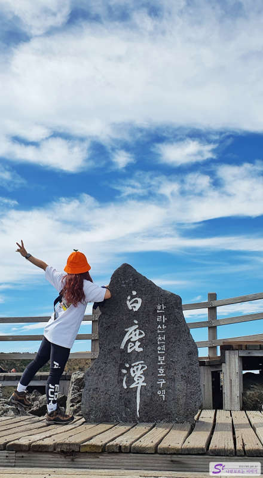
It is a Baekrokdam marker where countless people line up to take pictures. We just took a picture of the sign.

### To apply for a certificate

To get the certificate, you need to turn on your smartphone's GPS location, take a picture, and apply for climbing certification on the website that you booked for climbing before.

> Climbing certification website: https://visithalla.jeju.go.kr/certi/regist.do

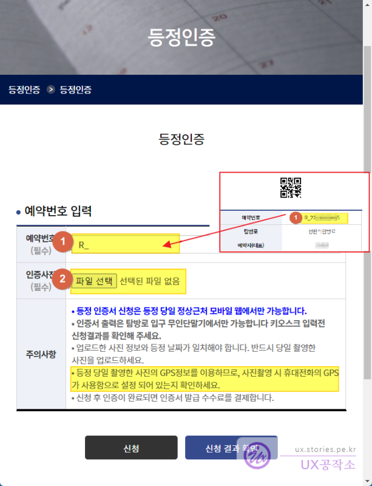
If you enter the above information and apply, the examination will proceed. Then, you can print it out with an unmanned output machine at Seongpanak Rest Area or Gwaneumsa Rest Area after you go down the mountain.

### Coming Down from Baeknokdam

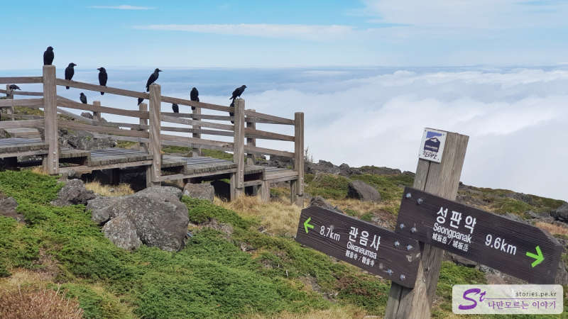
The forked road splits at the top. If you go to the right, you will find Seongpanak, and if you go to the left, you will find Gwaneumsa Temple.  
We usually go back down in the right direction, but since we came here by bus, we came up to Seongpanak and went down in the direction of Gwaneumsa Temple.  
The course of Gwaneumsa Temple is terrible, but the course of Gwaneumsa Temple is worth visiting even for beginners.

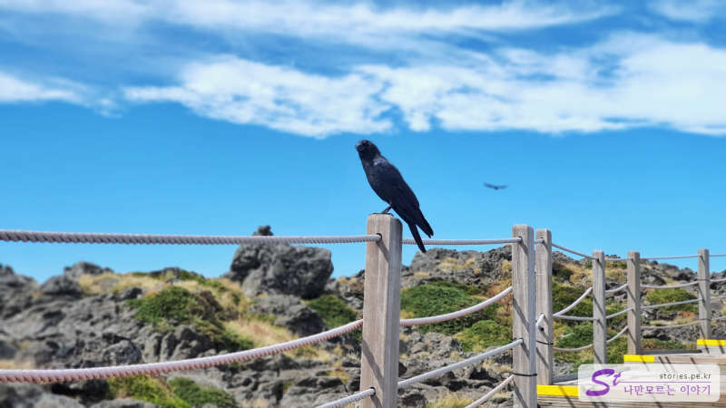
Why are there so many crows...

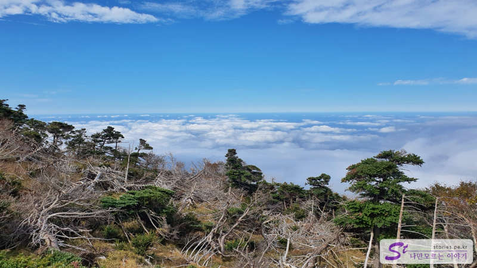
It's the descending road of Gwaneumsa Temple, and this place is also very nice. We're above the clouds.

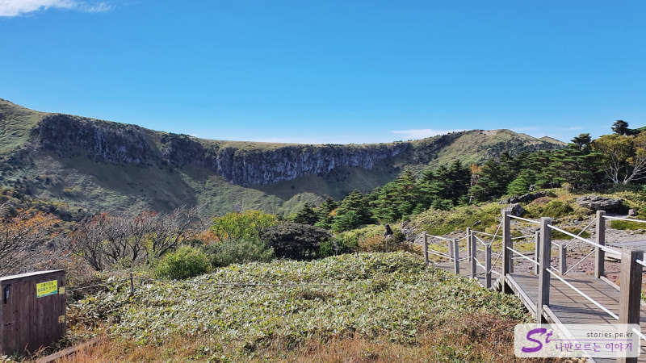
It's a mountain that looks like a folding screen. It's so spectacular in real life.

### Triangle Peak Shelter

If you come down for about an hour and a half, you will find the Samgakbong Shelter.  
It's about 3:10 p.m. on time. The sun is high, so there seems to be a lot of time left to go down, but it's a bit tight. Because you have to go down 3 to 4 hours more to go down, it can be dangerous because you can't see the road at the end without a lantern. We barely came down with the light on our phones. If taking a picture with a cell phone had even worn out the battery... I still feel dizzy. (Fortunately, we took a portable battery.)

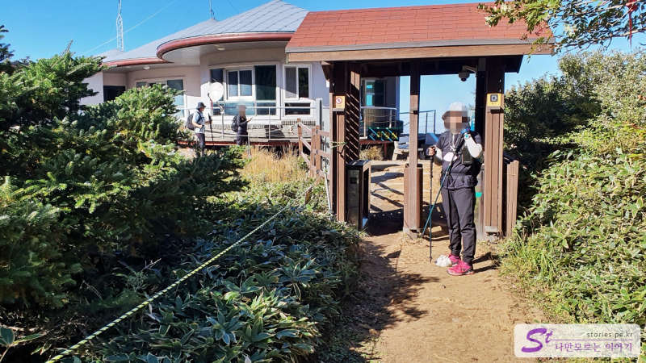
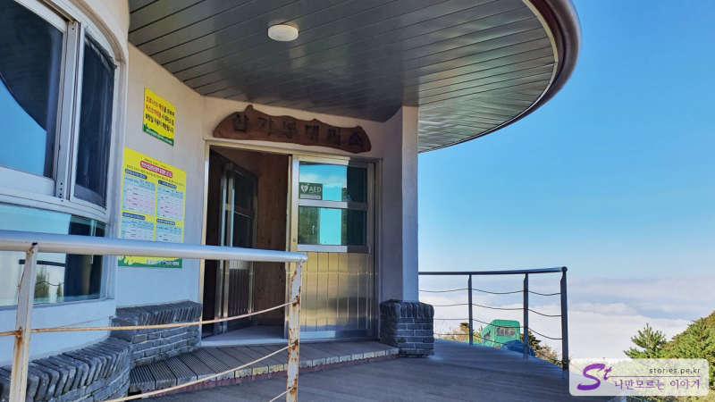

Samgakbong Shelter has a bathroom and a place to rest indoors. If possible, it's better to rest moderately and start early.  
After that, it is only a simple rest area (Tamla Valley toilet), but there is no rest area.

### Gwaneumsa Rest Area

The time we arrived at the Gwaneumsa Rest Area is approximately **about 7:30 p.m.**. So it's been over 5 hours since I got off the mountain. It was tough, and it took a lot more time than it did when I went up \*\* the soles of hiking boots. crying  
It was October, so I couldn't see well because the sun went down from around 6:30 p.m. I managed to find my way down by relying on the cell phone flash.  
A lot of people passed us when we went down, and we came down almost at the end, so if you're an ordinary person, you can set up a time to go down from 4:30 to 5 hours earlier than us.  
I barely came down like that and printed out a climbing certificate. I remember the printing cost was 1,000 won.

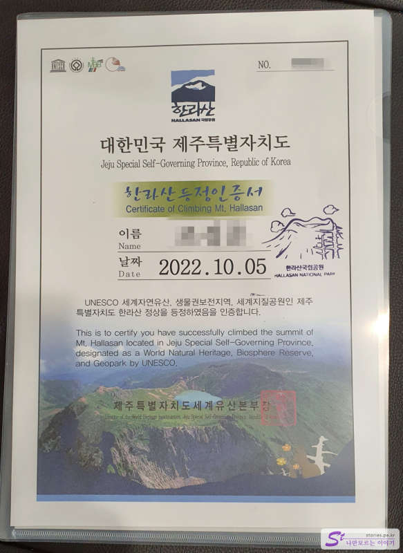
It's nothing big, but I feel proud when I see it. Hahaha

#### How to get to the airport from Gwaneumsa Rest Area

There aren't many trains coming to the airport from Gwaneumsa Temple. I think there is a bus, but the term is too long to wait It can be exhausting.  
The best way is to use a taxi, but even this taxi is hard to catch. Even if you apply for it in Kakao Taxi or Uti Taxi, it is not well assigned. (It is better to register a payment card in Kakao or Uti in advance.)

It's not an official method, but it's also a good idea to share your own seat. There will be several people who catch taxis around. Then, we will pay half of the taxi fare and share a table.  
We were lucky to catch a taxi and we happened to know someone (two people) who was going to the airport nearby, so we shared some of the expenses and went to the airport together.  
The taxi fare is **15,000 won to 20,000 won from Gwaneumsa Rest Area to the airport** You can be expected.

# Cost

- Airfare (round trip): KRW 75,000
- Parking fee (freight building): 12,000 won
- Bus fare to Seongpanak: 2,000 won (20,000 won if it was a taxi)
- Taxi fare from Gwaneumsa Temple to the airport: 16,000 won
