평민이라도 마음만 먹으면 당일치기로 한라산 백록담을 찍고 올 수 있습니다. 저희는 10월 5일 날 다녀왔는데, 다녀오면서 알게 된 정보를 토대로 포스팅을 해보려고 합니다.  
저희도 산을 많이 타는 사람은 아니고 그저 한라산을 올라가기 위해 아파트 계단 연습을 한 달 정도 한 수준입니다. 그렇기 때문에 한라산은 힘들기는 하지만 의지만 있다면 충분히 다녀올 수 있습니다.

# 사전 준비

한라산 백록담까지 보통 평민의 걸음으로 왕복 9시간 정도 걸립니다. 거리가 거리인 만큼 기초 체력은 어느 정도 확보해 놓는 것이 좋습니다.  
길이 대부분 돌밭, 데크 길의 오르막이 번갈아 나오기 때문에 계단 운동이 도움이 됩니다.  
등산화는 꼭 신으셔야하고 발목까지 잡아주는 중목 등산화가 좋습니다. 돌 밭이라 발목이 꺾일 확률이 높습니다.  
등산 스틱은 하산할 때 많은 도움이 되니 준비해 가는 것이 좋습니다. 등산 스틱은 가방 외부에 잘 묶어놓으면 비행기에 가지고 탈 수 있습니다.  
당일치기이기 때문에 수화물 위탁은 하지 마시고 배낭에 모든 짐을 싸서 비행기 안으로 가지고 들어가야 합니다. 또한 자리는 가능한 한 빨리 내릴 수 있는 앞쪽 자리로 잡는 것이 좋습니다.

## 준비물

### 필수

- 등산 가방, 등산화, 등산 스틱
- 점심 식사용 김밥, 행동식(초코바, 빵 등등..), 물(인당 3개 정도), 쓰레기봉투
- 등산 모자, 등산장갑, 바람막이
- 개인 약, 타이레놀, 소화제, 지사제, 후시딘, 대일밴드, 압박붕대

### 옵션

- 보조배터리, 배터리 케이블, 선글라스, 멀티스카프, 수건, 등산양말, LED 헤드랜턴, 판초 우의
- 보온 물(500ml), 사발면, 나무젓가락, 물티슈, 휴지, 과일

## 한라산 등반 예약

한라산을 성판악이나 관음사로 올라가려면 먼저 등반 예약을 해야 합니다.

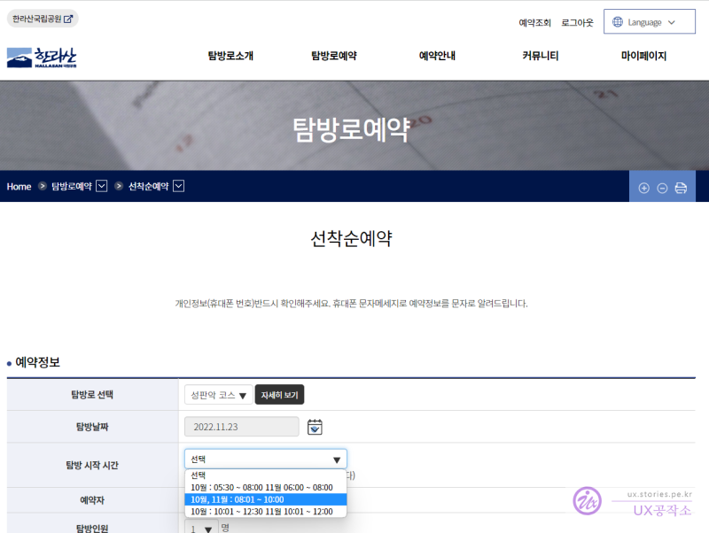

> https://visithalla.jeju.go.kr/reservation/firstComeStep.do

날짜와 등반 시간을 선착순 선택하게 되는데, 당일로 다녀올 경우는 **08:00 ~ 10:00**의 시간을 선택해 합니다.  
06:00 ~ 08:00은 첫 비행기를 타도 도착하기 어려운 시간이고 10:00 ~ 12:00는 백록담에 올라가기 어려운 시간대입니다. (계절별로 시간이 약간씩 다르지만 진달래밭 대피소에서 백록담 입산 통제를 당할 수 있습니다. 춘추 절기 때는 12시 30분 이후로는 백록담 출입을 통제합니다.)

## 항공권 예매

다음으로 항공권을 구매해야 합니다.
당일치기 한라산 등반이기 때문에 **출발하는 비행기는 꼭 아침 6시 근처**의 비행기 표를, **돌아오는 비행기는 저녁 9시 근처**의 비행기를 예매하시면 됩니다.  
보통 화, 수, 목요일의 항공권 가격이 쌉니다. 저희는 수요일 출발하는 항공권을 구매 했고 인당 왕복 75,000원이 들었습니다.
출발 비행기는 가능하면 아시아나 또는 대한항공을 이용하는 것이 좋습니다. 저가 항공일 경우 운이 없으면 출국장과 먼 곳에 비행기가 멈추고 버스를 타고 출국장으로 이동하기 때문에 시간이 오래걸려서 성판악으로 가는 버스를 놓칠 수 있습니다.  
비행기 표를 구매했다면 해당 항공사 앱으로 접속해서 자리를 앞쪽 자리로 미리 예약하는 것이 좋습니다.

# 당일

## 김포공항

출발 당일..  
김포공항에 새벽 5시에 도착해야 합니다.  
그리고 주차비를 조금이라도 아끼려면 김포공항 화물청사 주차장에 주차하는 것을 추천드립니다.  
김포공항 주차장의 주차비가 20,000원이고 화물청사는 12,000원입니다. 8,000원 정도 세이브할 수 있네요. 거리도 생각보다 멀지 않습니다.

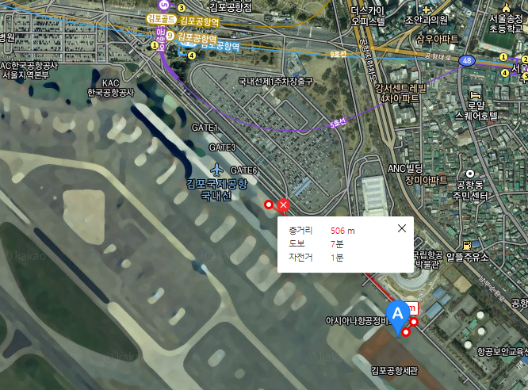

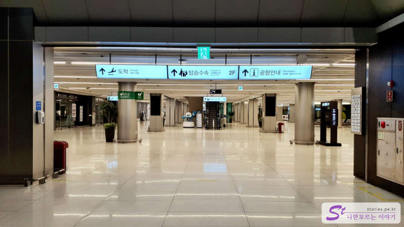  
화물청사에서 대략 5분 ~7분 걷게 되면 김포공항 건물로 들어갈 수 있습니다. 일반 국내선 주차장에 비해도 많이 멀다는 생각은 들지 않습니다.  
위탁 수화물이 없으므로 모바일로 셀프 체크인을 하고 바로 출국장에 들어가면 됩니다.  
출국장에 들어서면 CU 편의점이 있는데 첫 비행기 손님을 위해 5시 ~ 5시 30분쯤에 오픈을 하는것 같습니다. 이곳에서 한라산에서 먹을 김밥이나 삼각김밥을 사셔도 됩니다. 간단하게 아침식사를 해도 되고요.

## 제주 공항

김포공항에서 6시에 출발했으면 보통 제주공항에 7시 10분쯤에 도착을 합니다. 그러면 서둘러서 출국장을 빠져나오면 **1번 게이트** 쪽에서 **7시 20분에 있는 성판악행 버스 (181번)** 를 탈 수 있습니다.  
만약 이 버스를 놓치게 된다면 택시를 타고 성판악으로 가야 합니다.

그래서 버스를 타려고 계획했다면 비행기에서 출국장까지 시간을 줄이기 위해 출발 비행기는 가능하면 아시아나 또는 대한항공을 이용하는 것이 좋습니다.

> - **181번 버스 : 제주공항 -> 성판악 (7시 20분 공항 출발)**
> - 182번 버스 : 성판악 -> 제주공항
> - 버스 정보 : http://bus.jeju.go.kr/schedule/viewNew/181

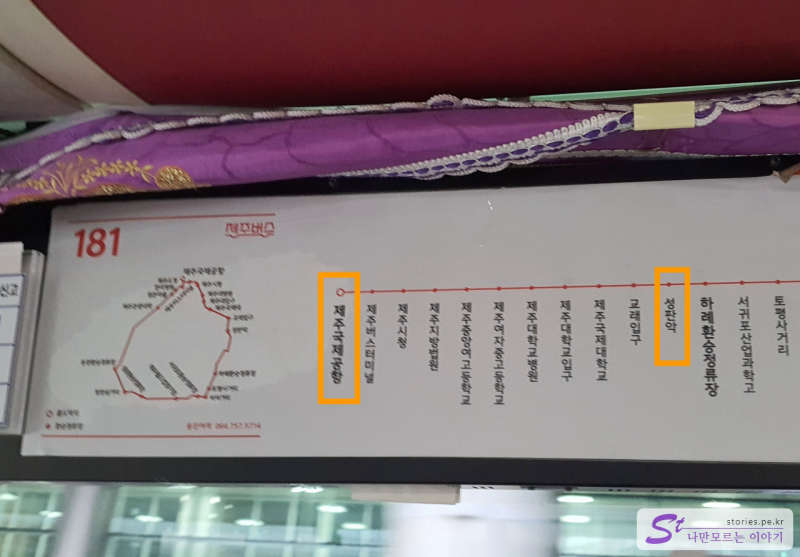

#### 요금과 시간

- **181번 버스**
  - 요금 : 약 2,200원
  - 시간 : 약 1시간 정도 소요
- **택시**
  - 요금 : 약 20,000원
  - 시간 : 약 40분 정도 소요

## 한라산

버스나 택시를 탔을 경우 유리한 점은 성판악과 관음사를 모두 경험할 수 있다는 것입니다. 성판악으로 올라갔다가 관음사로 내려와도 되고 그 반대로 진행해도 됩니다.  
관음사의 등반이 힘들기 때문에 초보인 경우 성판악으로 올라가서 관음사로 내려오는 것을 추천드립니다. 저희도 그렇게 올라갔습니다.

성판악 코스는 위와 같습니다.  
입구에서 속밭 대피소까지는 대략 1시간 30분, 속밭 대피소에서 진달래밭 대피소까지는 대략 2시간, 진달래밭 대피소에서 백록담까지 1시간 30분 정도 해서, 개인차는 있겠지만 대략 편도 4시간 30분에서 5시간이 걸립니다.  
내려올 때는 빠르겠지라고 생각할 수도 있겠으나 상당히 지쳐있는 상태에서 내려오기 때문에 내려오는 시간도 올라갈 때의 시간만큼 걸린다고 보시면 됩니다.

### 성판악 휴게소

버스를 탔다면 대략 성판악에 8시 또는 **8시 10분쯤**에 도착을 하게 됩니다.

휴게소에서 간단한 개인정비를 하고 성판악 입구를 통과하면 됩니다.

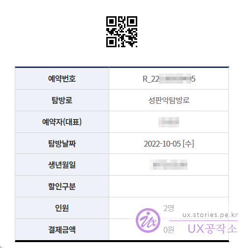
입구를 통과하기 전에 예약할 때 받은 문자메시지의 링크를 통해 바코드를 보여줘야 합니다.

속밭 대피소까지는 대략 1시간에서 1시간 30분 정도 걸리는데 산책 정도의 어렵지 않은 길입니다.

### 속밭 대피소

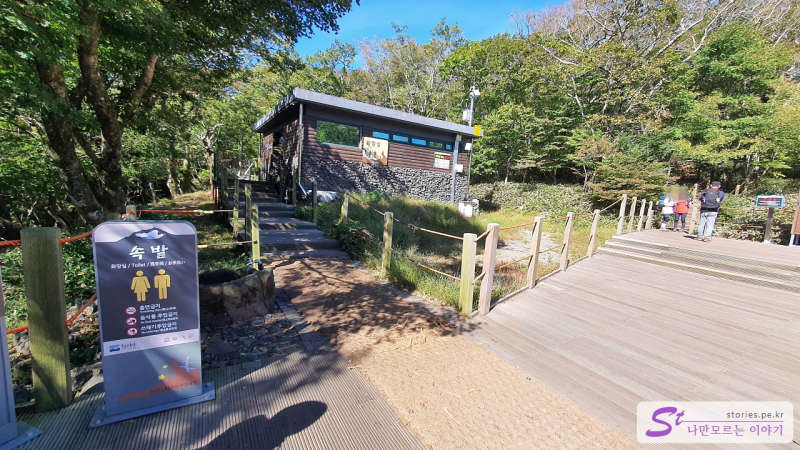
첫 번째 대피소인 속밭 대피소입니다. 휴게 공간과 화장실이 있어서 잠깐 쉴 수 있는 공간입니다. 야외의 공간도 있고 좁지만 실내의 공간도 있어 우천 시에도 잠시 머물며 쉴 수 있습니다.  
특별히 문제가 없으면 여기에서 5~10분 정도 간단히 쉬고 올라가는 것이 좋습니다.

### 진달래밭 대피소

속밭 대피소에서 약 2시간 정도 부지런히 올라가다 보면 하늘이 탁 트이는 느낌이 들 텐데, 그곳이 진달래밭 대피소입니다.

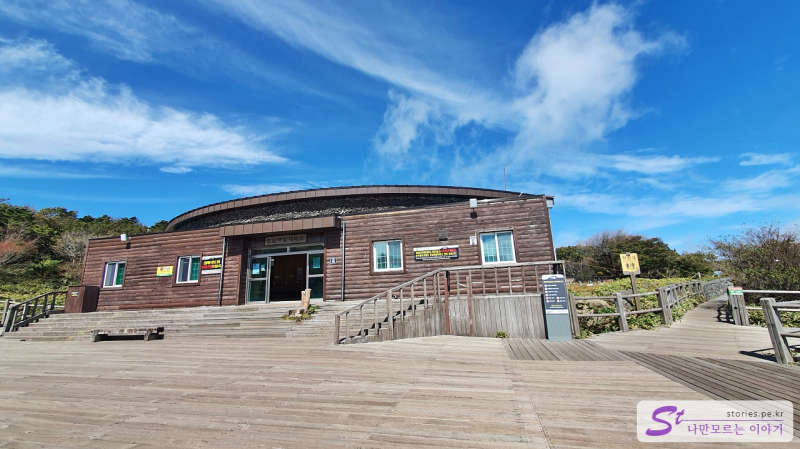
진달래밭 대피소는 상당히 넓은 공간을 차지하고 있습니다. 예전에는 매점이 있었다고 하는데, 현재는 아무것도 판매하고 있지 않습니다. 그래서 김밥이나 라면, 물 등을 모두 사가지고 올라와야 합니다.  
그래도 여기에만 딱!! 라면 국물을 버리는 곳이 있어서 사발면 먹다 남은 국물이나 찌꺼기를 버릴 수 있습니다. 다른 휴게소에는 없으니 라면을 먹을 생각이라면 여기에서 먹고 처리하는 것을 추천드립니다.  
여기에서 30분 정도 휴식을 취하고 이제 본적적으로 백록담으로 올라갑니다. 여기에서 백록담까지의 등반코스가 만만치 않습니다.

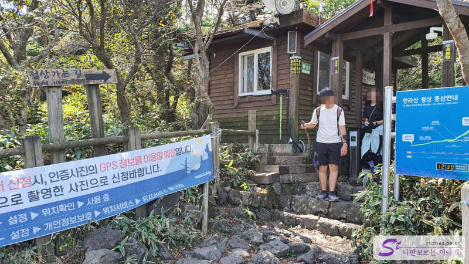
계절별로 통과할 수 있는 시간이 약간씩 다르긴 하지만 봄, 가을에는 12시 30분이 넘으면 입산을 통제합니다.  
저희는 11시 20분쯤 도착해서 30분 정도 사발면도 먹고 빵도 먹으며 쉰 다음에 **11시 50분에 통과**를 했습니다.

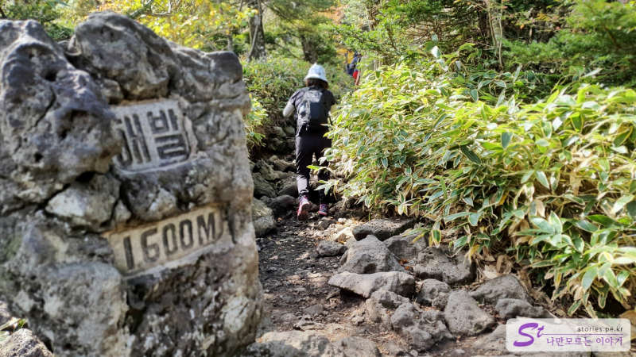
해발 1600M까지 올라갔네요. 이후부터 힘든 길이 나타납니다.

여기도 초입 부분은 돌길과 데크계단이 번갈아 가며 나옵니다.

하얀 죽은 고사목이 여기저기 있는데 나름 멋진 풍경을 볼 수 있습니다.  
왜 이리 까마귀는 많은지....

저 멀리 끝없는 계단이 보일 때는 멋있기도 하지만 저길 어떻게 가나ㅠㅠ 라는 생각에 정말 포기하고 싶은 생각이 들 정도 있습니다. 그래도 바로 앞의 계단만 보고 걸어 올라가다 보면 정상에 다다라 있는 자신을 발견하게 됩니다.  
사진의 빨간색으로 칠한 부분이 모두 계단으로 이루어져 있습니다.

몸과 마음이 지쳐갈 때쯤 드디어 정상을 만나게 되고 나보다 먼저 온 수많은 사람들도 만나게 됩니다.

### 백록담

그렇게 1시간 30분을 오르다 보면 정말 멋진 장관의 백록담을 만나게 됩니다.

저 멀리 구름보다 높은 위치에 백록담과 함께 서 있는 나를 보면 정말 힘들었던 것들이 씻은 듯이 사라집니다.

나름 노스페이스 신발인데 밑창이 떨어져 버렸습니다. 오랫동안 신지 않았던 신발이기도 하고 5시간 동안 현무암을 밟고 와서 신발이 스트레스를 받아서 그런지 떨어져 버렸습니다.  
불행인지 다행인지 산 정상에서 떨어졌고 다행히 백록담에 계신 관리자 분 덕분에 압박붕대를 빌려서 칭칭 감고 내려왔습니다. 오르는 중간에 떨어졌던가 내려가는 도중에 떨어졌으면 상당히 낭패를 봤을 것 같습니다.  
감사합니다.

수많은 사람들이 사진을 찍기 위해 줄을 서고 있는 백록담 표지석입니다. 저희는 그냥 표지석만 찍었습니다.

### 인증서 신청하기

인증서를 받기 위해서는 스마트폰의 GPS 위치가 적용되도록 켜고 사진을 찍어서 전에 등반 예약했던 그 웹사이트에서 등정 인증을 신청 해야 합니다.

> 등정 인증 웹사이트 : https://visithalla.jeju.go.kr/certi/regist.do

위의 정보를 입력하고 신청하면 심사를 진행합니다. 그러면 하산한 후에 성판악휴게소나 관음사 휴게소에서 무인 출력기로 출력을 할 수 있습니다.

### 백록담에서 내려오기

갈림길은 정상에서 갈라집니다. 오른쪽으로 가면 성판악, 왼쪽으로 가면 관음사 방향입니다.  
보통 오른 방향으로 다시 내려가지만 저희는 버스를 타고 온지라 성판악으로 올라와서 관음사 방향으로 내려갔습니다.  
올라오는 관음사 코스는 끔찍하지만 내려가는 관음사 코스는 초보자도 가볼만합니다.

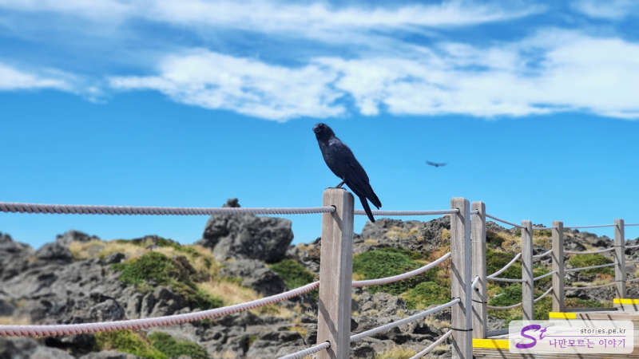
까마귀는 왜 이리 많은지...

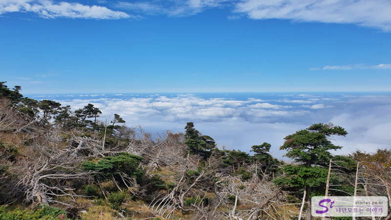
관음사의 하산길이며 이곳 역시 너무 멋집니다. 우리가 구름보다 위에 있네요.

병풍처럼 보이는 산입니다. 실제로 보면 너무 장관입니다.

### 삼각봉 대피소

1시간 30분 정도 내려오면 삼각봉 대피소가 나옵니다.  
대략 시간상으로 오후 3시 10분 정도 됩니다. 해도 높게 떠있고 해서 하산 시간이 많이 남은 것 같지만 다소 촉박한 시간입니다. 왜냐하면 내려가는데만 앞으로 3~4시간은 더 내려가야 하기 때문에 랜턴이 없으면 마지막에 길이 보이지 않아 위험해질 수 있습니다. 저희도 핸드폰 라이트로 겨우 비추면서 내려왔습니다. 만약 핸드폰으로 사진찍는다고 배터리마저 닳아 없어졌었다면 정말... 지금도 아찔합니다. (저희는 다행히 보조배터리를 가져가서 살았습니다.)

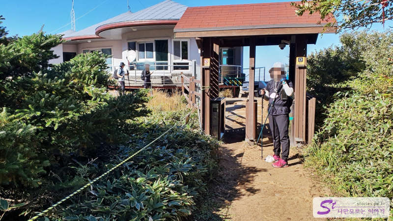
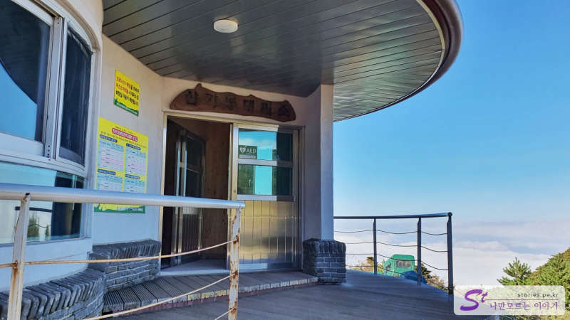

삼각봉 대피소는 화장실이 있고 실내에서 쉴만한 공간도 있습니다. 가능하면 적당히 쉬고 빨리 출발하는 것이 좋습니다.  
이후로는 간이 휴게소(탐라계곡 화장실) 정도이지 휴게소는 없다고 보시면 됩니다.

### 관음사 휴게소

저희가 관음사 휴게소에 도착한 시간은 대략 **오후 7시 30분 정도**입니다. 그러니까 하산 시간이 대략 5시간이 넘었네요. 힘들기도 했고 **등산화 밑창도 나가고 해서** 올라갈 때보다 더 많은 시간이 걸린것 같네요. ㅠㅠ  
10월이라 6시 30분 정도부터 해가 져서 잘 보이지 않았습니다. 휴대폰 플래시에 의지해서 겨우 길을 찾아 내려왔습니다.  
저희가 내려갈 때 많은 사람들이 저희를 지나쳐 내려갔고 저희가 거의 마지막쯤에 내려왔으니 보통 사람이라면 저희보다 빠른 4시 30분에서 5시간 정도를 하산 시간으로 잡으시면 될 것 같습니다.  
그렇게 겨우 내려와서 등반 인정서를 출력해서 받았습니다. 출력할때 비용이 1,000원이였던 기억이 나네요.

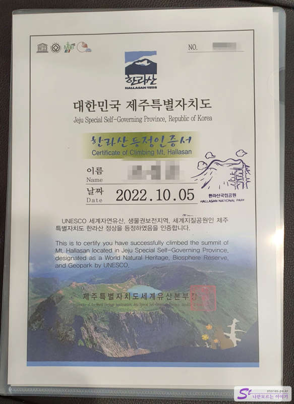
대단한 건 아니지만 보고있으면 왠지 뿌듯하네요. ㅎㅎㅎ

#### 관음사 휴게소에서 공항으로 오는 방법

관음사에서 공항으로 오는 차편이 정말 많지 않습니다. 버스가 하나 있긴 한 것 같은데 텀이 너무 길어서 기다리다 지칠 수 있습니다.  
가장 좋은 방법은 택시를 이용하는 방법인데, 이 택시마저도 잘 잡히지 않습니다. 카카오 택시나 우티 택시에서 신청을 해도 잘 배정이 되지 않습니다. (카카오나 우티에 미리 결제카드를 등록해 놓는것이 좋습니다.)

정식 방법은 아니지만 자체 합석을 하시는 것도 좋은 방법입니다. 주위에 택시를 잡는 사람들이 여럿 있을 것입니다. 그러면 택시비를 반씩 지불하기로 하고 합석을 하는 방법입니다.  
저희는 운 좋게 저희가 택시를 잡았고 근처에 공항 가시는 분(2인)을 우연히 알게 되어 비용을 일부 쉐어하고 같이 타고 공항으로 갔습니다.  
택시비는 **관음사 휴게소에서 공항까지 15,000원 ~ 20,000원 정도** 예상하시면 됩니다.

# 비용

- 항공비(왕복) : 75,000원
- 주차비(화물청사) : 12,000원
- 성판악까지 버스비 : 2,000원 (택시였다면 20,000원)
- 관음사에서 공항까지 택시비 : 16,000원
