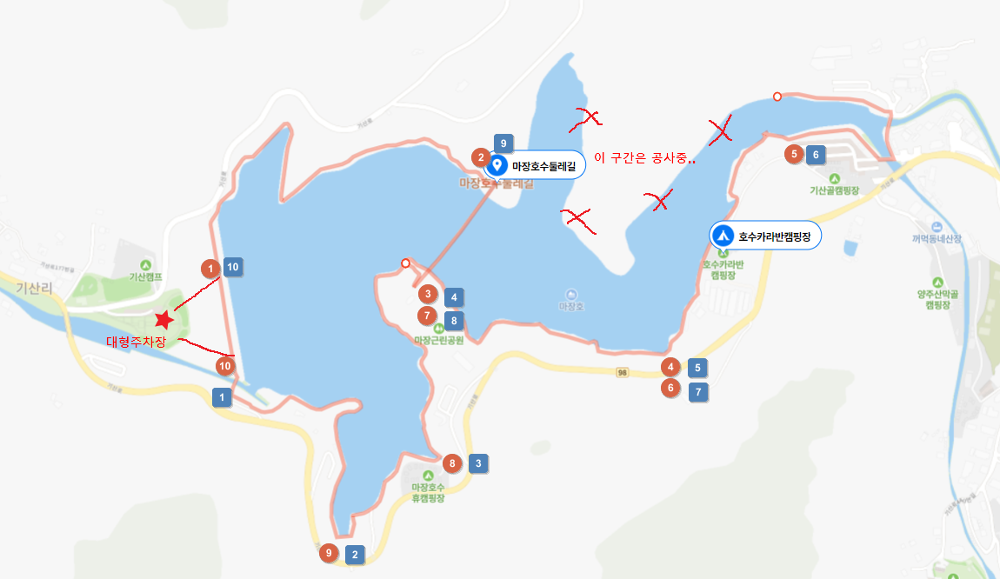

Let me introduce you to a walk that is close to Seoul and is good to go suddenly.  
Majang Lake in Gwangtan, Paju is there. There are many parking lots and there are also suspension bridges across the lake, so it's good to take a walk for about 1 to 2 hours.

  
There are 1 to 7 public and private parking lots around the lake, so I don't think there will be a big problem with parking. We parked in the public parking lot at Kisan Camp, which is the largest parking lot nearby. Large buses are also available for parking.

## Course

The course usually runs in two directions, as shown in the map above: **Red circular direction**, as opposed to **blue square direction**. It doesn't matter much in either direction.

It's an uphill staircase from the parking lot to the lake. If you go up here, there's no way to go up next. The blue sky is so nice.  
The suspension bridge of Majang Lake is between No. 2 and No. 3 in the red circular direction. This is a must-see section. It's thrilling and nice because it's a bridge that shakes a little bit in the wind.

  
The rest are like walking on flat land, so it's good to take a walk slowly and easily.

## Points of Attention

I wish the entire Dulle-gil was connected, but the northeast section is currently under construction, so I can't walk.  
I hope that it will be better if the construction is completed soon so that I can look around the entire lake.

## the time of one's

I went there on October 10, 2022.

## Cost

There is no additional admission fee and you only have to pay for the parking lot.

## Travel destination information

- Address: 466-3 Gisan-ri, Gwangtan-myeon, Paju-si, Gyeonggi-do
- Contact number: 031-950-1941
- URL : https://naver.me/IgNAKAUO
