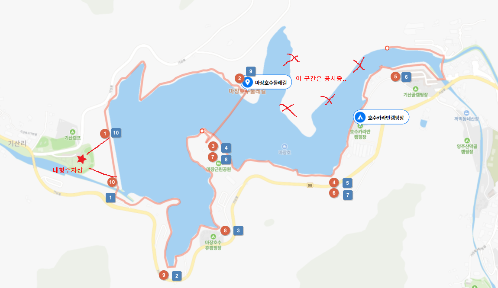
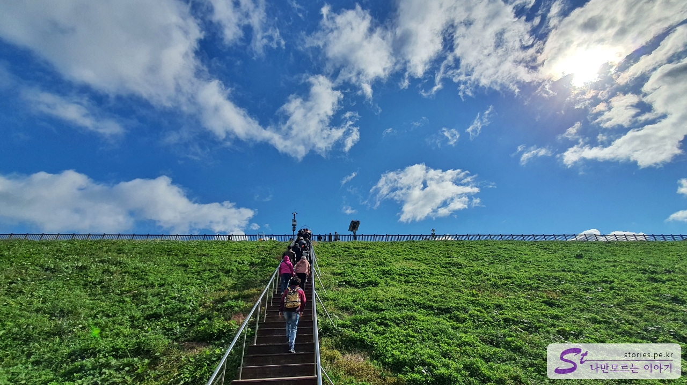

서울에서 가깝고 갑자기 다녀오기에 좋은 산책길을 소개합니다.  
파주 광탄에 있는 마장호수가 그곳인데요. 주차장도 많고 호수를 가로지르는 출렁다리도 있어서 1시간 ~ 2시간 정도 산책하기에 좋습니다.

  
주차장은 호수 주변에 1~7의 공영, 개인 주차장이 있어서 주차에 큰 문제는 없을 것 같습니다. 저희는 기산 캠프에 있는 공영 주차장에 주차를 했는데, 근처 주차장 중 가장 큰 주차장입니다. 대형 버스도 주차가 가능하게 되어 있습니다.

## 코스

코스는 보통 2가지 방향으로 진행하는데, 위의 지도처럼 **빨간 원형의 방향**으로 도는 방법과 반대로 **파란 네모의 방향**으로 도는 방법이 있습니다. 어느 방향이든 크게 문제 될 것은 없습니다.

주차장에서 호수로 올라가는 오르막 계단입니다. 여기만 오르면 그다음은 힘들게 오르는 길은 없습니다. 파란 하늘이 너무 멋지네요.  
빨간 원형의 방향 중 2번과 3번 사이가 마장호수 출렁다리입니다. 여기는 꼭 건너봐야 하는 구간입니다. 바람에 약간씩 흔들리는 다리라 스릴 있고 좋습니다.

  
나머지는 평지를 걷는 정도의 수준이라 천천히 쉬엄쉬엄 산책하기 좋습니다.

## 주의 사항

둘레길이 전체가 연결이 되어 있으면 좋겠는데, 현재 북동쪽 구간은 공사 중이라 걸을 수 없게 되어 있습니다.  
조만간 공사가 끝나면 호수 전체를 둘러볼 수 있어서 더 좋을 것 같은 기대를 해봅니다.

## 방문 시기

2022년 10월 10일에 다녀왔어요.

## 비용

별도의 입장료는 없고 주차장 비용만 지불하면 됩니다.

## 여행지 정보

- 주소 : 경기 파주시 광탄면 기산리 466-3
- 연락처 : 031-950-1941
- URL : https://naver.me/IgNAKAUO
