In the evening, I stopped by the Deokpyeong Natural Rest Area on Yeongdong Expressway before heading to Oak Valley. Because there is **Starlight Garden OOOZOOO** in the rest area.

> **Deokpyeong Natural Rest Area**  
> Both up and down use the same rest area, such as toilets, shops, rest areas, dog shelters, starlight gardens, etc. It's one of the few great highway rest areas with a wide variety of attractions, food and relaxation. If you have a chance, I recommend you to stop by.

# Starlight Garden OOOZOOO

As the title suggests, this place is open for a fee and starts at 5 p.m. every day. So if you want to go to the Starlight Garden OOOZOOO, you have to go in the evening.

There is a way to get there through Deokpyeong Rest Area, which is a highway, and there is a way to get to Premium Outlet Road, which is a regular road. We are going to take the expressway anyway, so we entered the Deokpyeong Natural Rest Area (Gangneung direction).

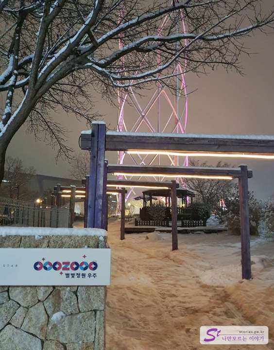

Milestones and wooden pillar doors have been made so that you can go to Starlight Garden from the rest area. There is also a natural shelter and a dog playground where dogs can run around.

As you go up about 50 meters, you will see **OOOZOOO** at the large entrance.

You can either make a ticket on the spot or make a ticket online (Naver reservation). The scenery of snow on Christmas coming up is cold, but it was quite cool.

It's a building-shaped light that you can see a lot in Luminarie. They do a light show at a fixed time. We saw this a lot, so we just passed it ^^

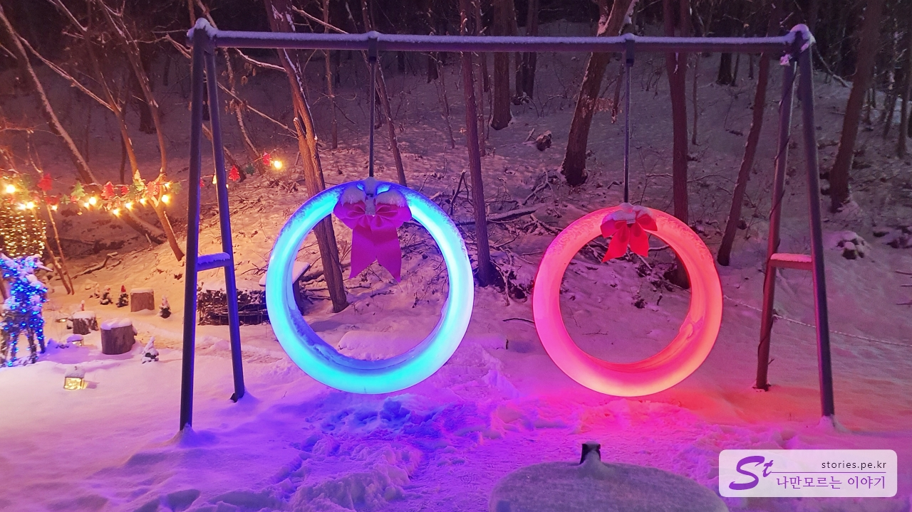

It's a light swing. I think I can endure a certain amount of weight, but adults and people who weigh a lot are a little anxious. But, uh... It's not a swing, it's a picture. You just need to take a picture and come out. Haha

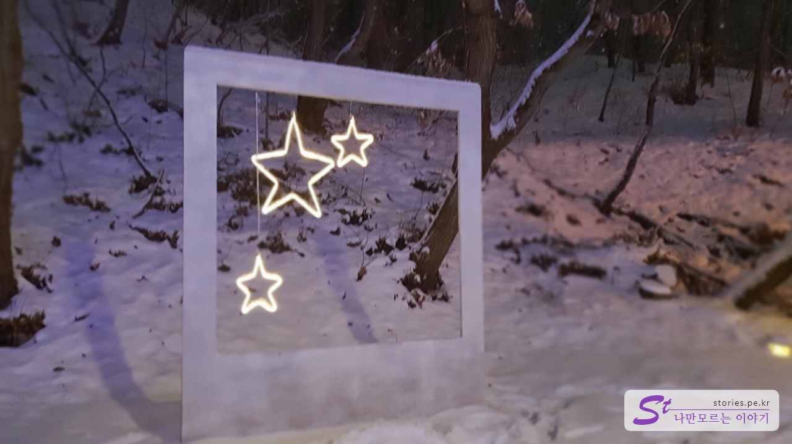

It's a starlight frame next to it. If you take it well, the picture comes out pretty.

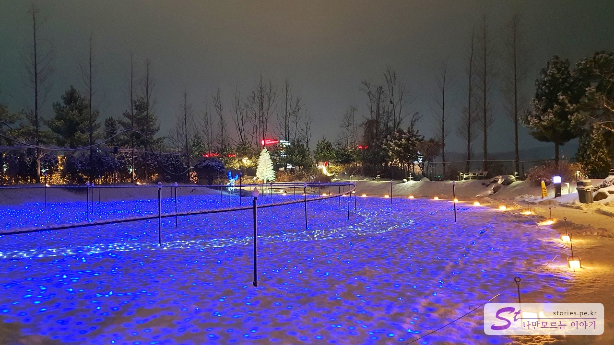

If you walk a little, you can see the light lake. I made a moving light by laying the light on the floor. It's slightly covered with snow, so it's a nice reflection of the light.

It's a camping site. You can't actually sit down, but it's for display. I'm sure they made it for you to take a picture Hah!

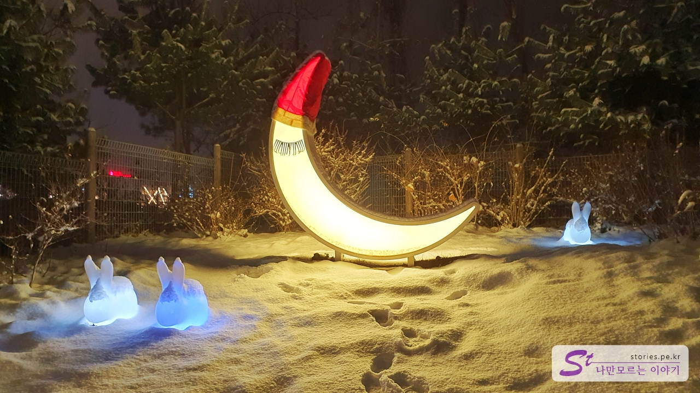

It's a half moon and a jade rabbit.

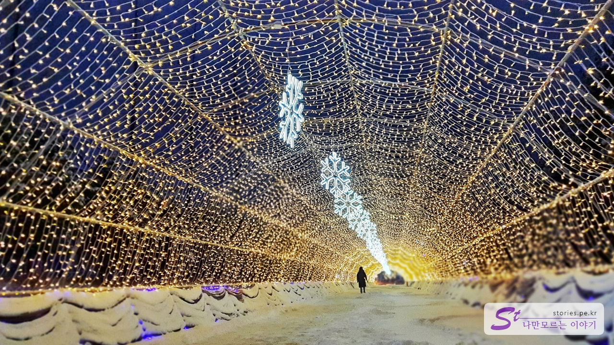

It's the Starlight Tunnel. It's the best place to take pictures. It's good to give a sense of perspective as a vanishing point, and if the camera is good, if you lower the depth and blur the background, you can get a better work. I can only do this much because I'm using a smartphone

It's like an entrance to a mysterious country. If you go through the entrance, you'll see a blue country I like the color.

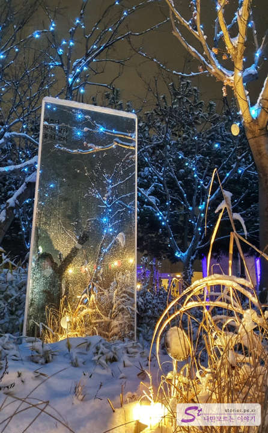

If you enter the blue country, there are two mirrors standing all of a sudden. Even if you take a picture with this mirror in the background, it creates a cool picture. I feel like Alice in Wonderland. (I'm using it as my Kakaotalk background picture. h)

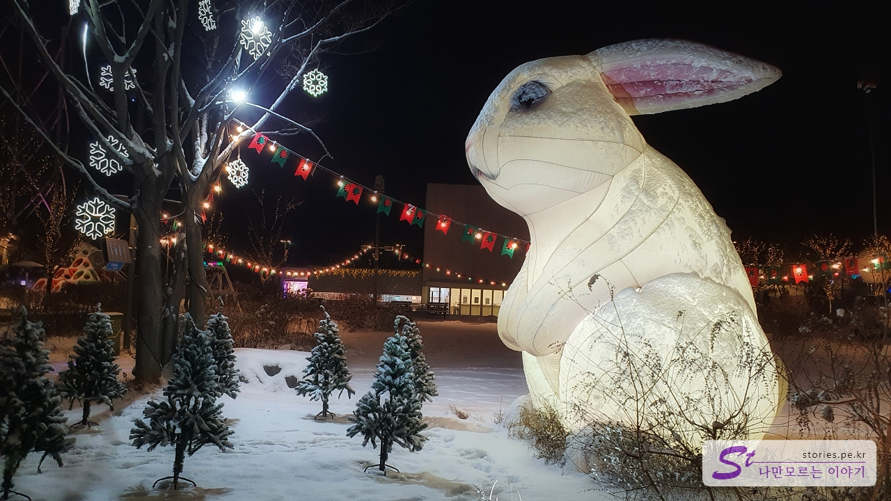

Starlight Garden is a huge rabbit that acts as a landmark in the OOOZOOO. It's two to three times as tall as a human. I've taken a lot of pictures here, but I'm only going to upload one.

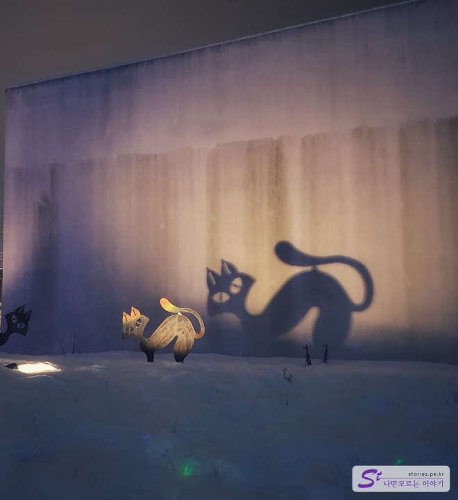

It's a pretty stray cat. The shadow looks more like a cat than a cat. It's made to look at the shadows.

It's a starlight curtain. I saw an avatar (the path of water) a few days ago, and it kind of feels like that. If I had a tail, I'd try to communicate.

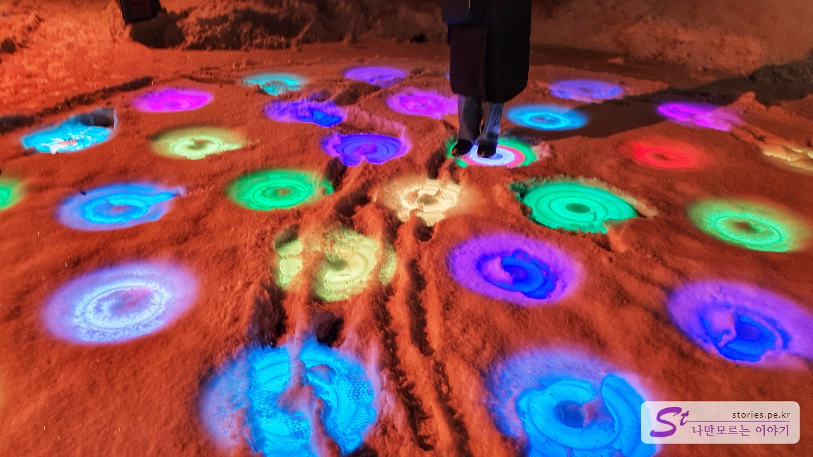

The snow is piled up here, so it feels more like it. If you step on the circle with your feet, the light changes, so I think the children will love it. We've been playing here for a long time.

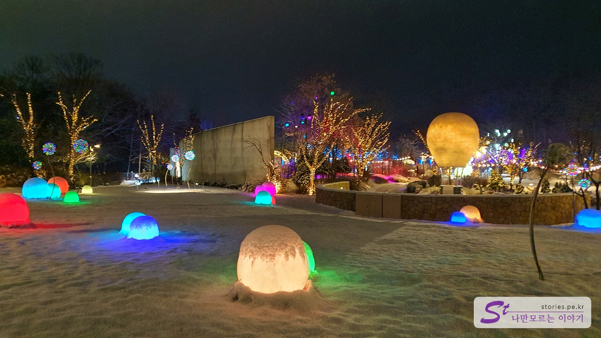

The whole background is pretty.

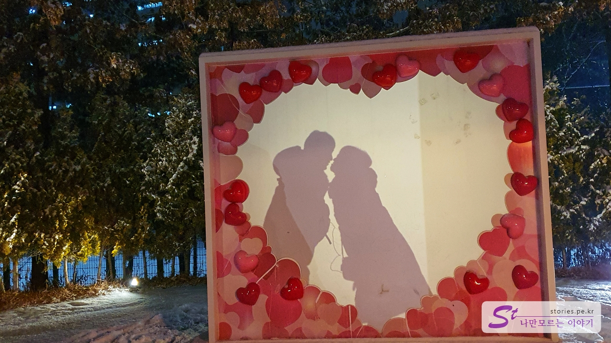

There's also a place where you can take a silhouette like this. We also took it with the help of the lady around us. I didn't know, but looking at the picture, my wife is more active. Haha

There must be a rabbit in the concept of Starlight Garden. There are cute rabbits here and there. It's pretty when I put it together.

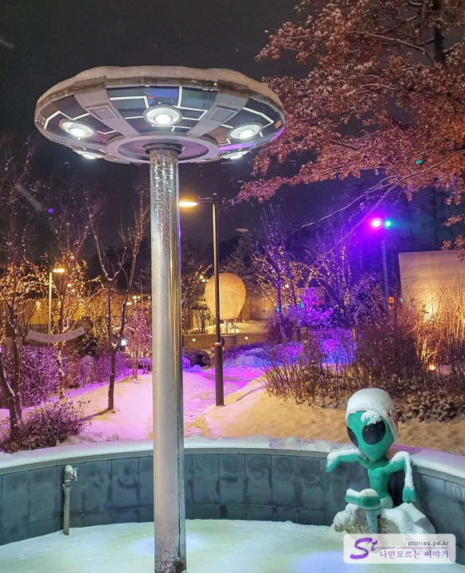

You can also meet aliens. I think I'm here for a sauna, but it's snowing.

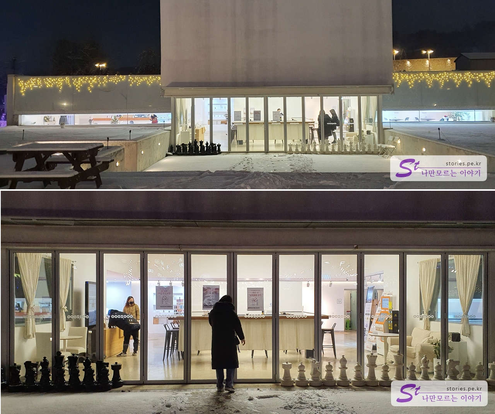

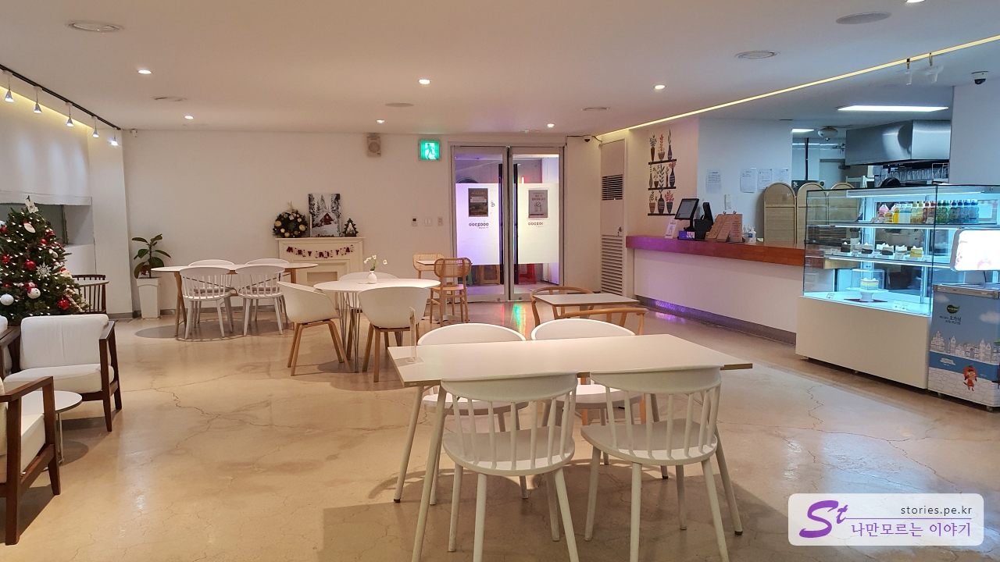

It's the only place in the garden where you can relax indoors. It's a place that prevents the heat in summer and the cold in winter. You can drink here, print souvenirs, photos, and recharge batteries.

## Cost

I don't think it's cheap, but I don't think it's a waste to actually use it.

You can make on-site reservations and Internet reservations (Naver reservations). You can buy it for 9,000 won because there is a 25% discount on the Internet.

- Night (Adult: 14 years old or older): 12,000 won (Internet discount: 9,000 won)
- Night (child: 36 months to 13 years old): KRW 6,000
- Internet purchase
  - - OOOZOOO 구매 : https://shop.qpos.kr/main.php?CD=ooozooo
  - Naver worship: https://m.booking.naver.com/booking/5/bizes/109912/items/4734303?area=bmp&service-target=map-pc&theme=place

## Time of entry

- Operating hours: 17:00 - 23:00 (operating in the evening)
- Time required: About 1 hour round trip
- Closed days: It will be closed in case of bad weather, so please contact us on-site before visiting.

## Travel destination information

- Address: 287-76, Deoki-ro 154beon-gil, Majang-myeon, Icheon-si, Gyeonggi-do, Republic of Korea
- Contact: 031-645-0002
- - URL : http://www.ooozooo.co.kr

<iframe src='https://www.google.com/maps/embed?pb=!1m18!1m12!1m3!1d3176.2710960075296!2d127.39240163940049!3d37.241274953522485!2m3!1f0!2f0!3f0!3m2!1i1024!2i768!4f13.1!3m3!1m2!1s0x3564a96746154dc5%3A0x8769c40ca54ba746!2z67OE67mb7KCV7JuQIOyasOyjvA!5e0!3m2!1sko!2skr!4v1671595273687!5m2!1sko!2skr' class='embed-responsive-item' allowfullscreen></iframe>

## Parking information

You can park at Deokpyeong Rest Area or near the premium outlet.

- Parking with premium outlet: San 50-3 Dancheon-ri, Hobeop-myeon, Icheon-si, Gyeonggi-do
