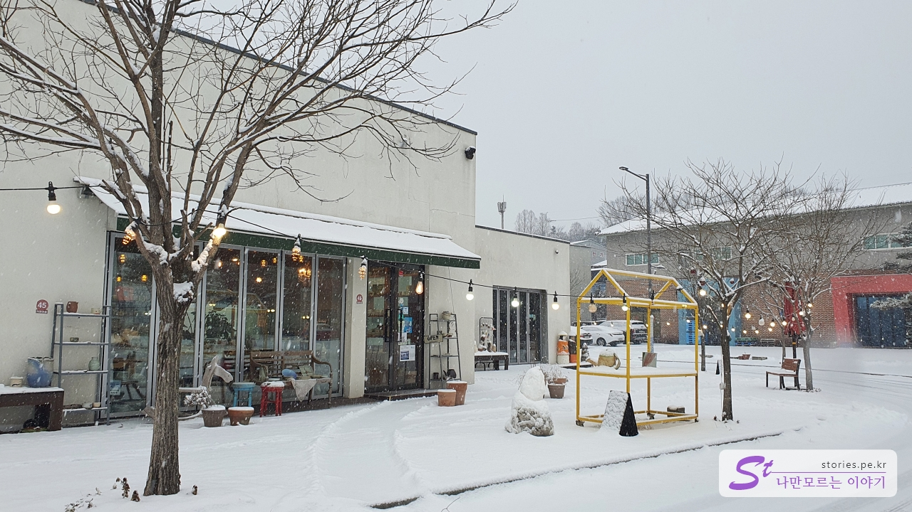

In order to exhaust the remaining vacation at the end of the year, I went on a simple trip around Icheon, Wonju, and Donghae for two nights and three days. On the first day of the trip, it snowed unexpectedly, so the itinerary was a little twisted, but if I didn't have teeth, I went to the gums somehow.

I went to Yes Park on a snowy day. Originally, I was going to walk around Yespark and feel the streets, see artful pottery in the store, and buy some...

The plan failed, and I was comforted by just moving very slowly through the streets in a warm car, looking out the window at the store building and the pottery on display. It was nice to look around like this. I recommend it as one of the best ways to travel in cold winter or hot summer.

# Looking around Ye's Park

Yespark is a ceramic village that Icheon City, famous for its ceramics, planned in 2014 and opened in 2018 with the aim of attracting artists and tourism. It doesn't seem to be as active as I thought, but I think it's a good place to travel easily.

We entered through gate \*\*1. It was cold and snowy, so I couldn't see any tourists. So it was good to drive around very slowly.

I found a noticeable building, a guitar-shaped building. As you can see from the appearance of the building, it's a place to make guitars.

It's a street I'd have walked if I had walked. We'll see you from afar and pass right away

Since the village is large, there must be a circular train going around the village. I've seen some train stops around town. I think it would be good to use it when you walk around.

There are many of these sculptures all over the village. Since it is an art village, there are many wonderful works all over the street.

The works of the snowy environment have their own charm.

If there were one or two jars, it wouldn't have been very impressive, but after collecting them together, they look pretty like art.

Cups can also look artistic depending on how you display them. I remember Marcel Duchamp had displayed a toilet as a work of art.

The scenery of the snowy street is so cool.

It's a composition that we don't know if we're looking at the work or if the works are looking at us. Hah!

It's a family statue in the center of the village. It was amazing that the snow on the child's head looked like my dog, Ttori.

It's a revolving intersection in the center of the village that you can see when you enter gate 2.

There is an amusement park where children can play, but it seems to be closed because it is winter.

## Cost

Visiting the village is free and it costs about the cost of purchasing or experiencing pottery in the village.

## Time of entry

- Operating hours: 24 hours
- Time required: It took about 30 minutes to 1 hour to travel by car. It'll take longer if I walk around, right?
- Closed: 24/7

## Travel destination information

- Address: 5, Ceramic Arts-ro, Sindun-myeon, Icheon-si, Gyeonggi-do
- Contact number: 031-638-1994
- - URL : https://www.facebook.com/yesparkkorea

You can enter and exit from Icheon rest area on the 2nd Jungbu Expressway.

The village itself is quite large, and there are four gates in total, so you can enter and exit in many ways. The district is divided into villages **Byul Village**, **Horang Village**, **Sabuchak-gil**, and **Gama Village**.
Parking is also easy because there are parking lots everywhere.
