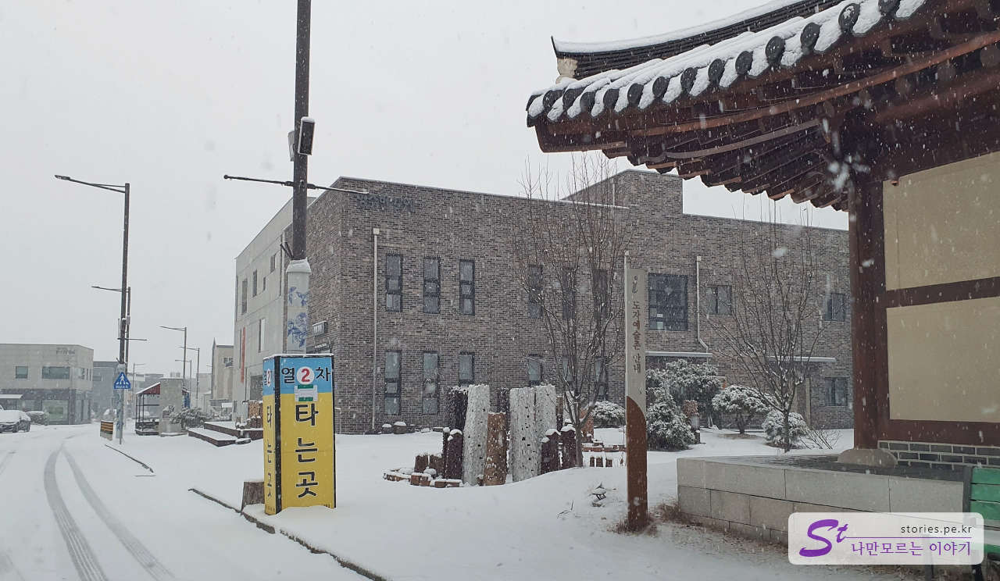
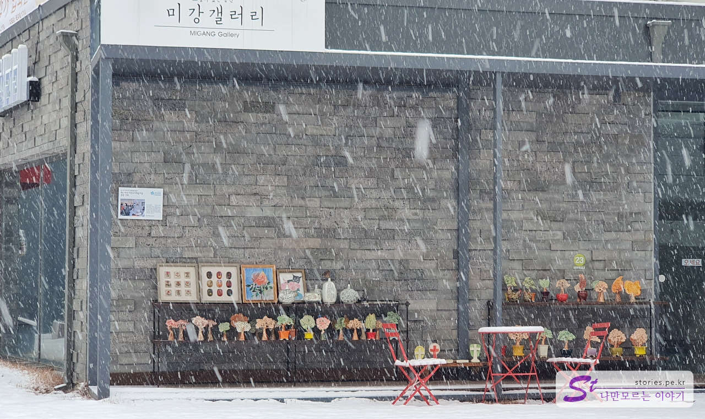
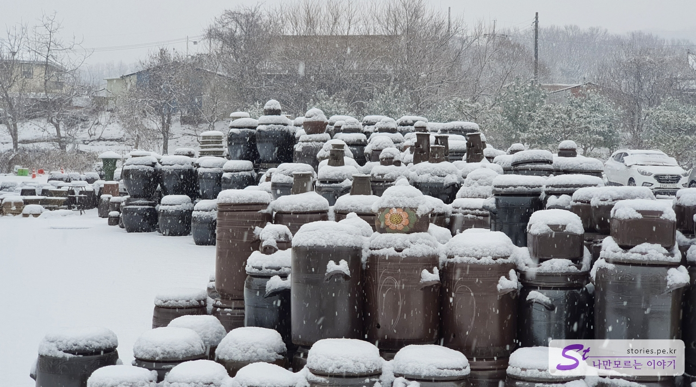
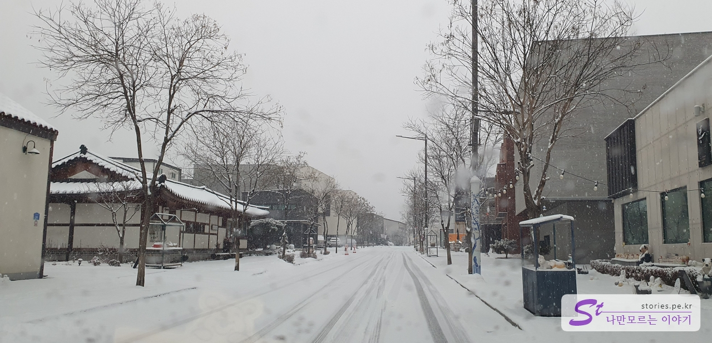
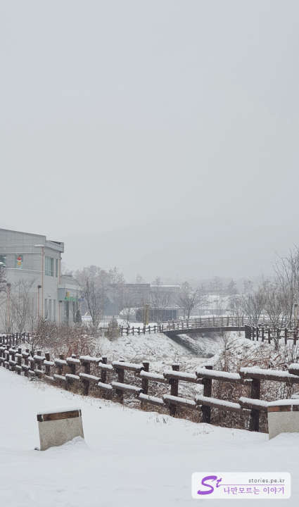
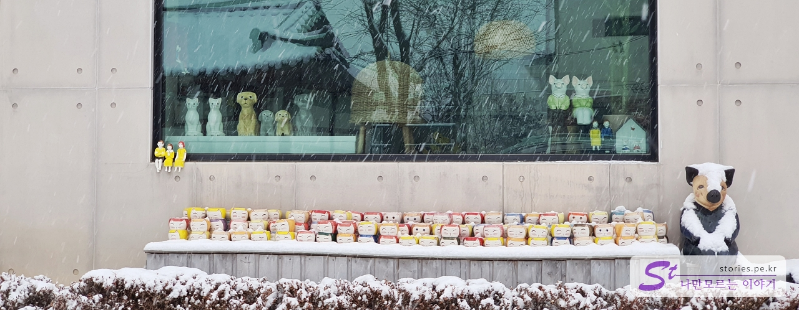
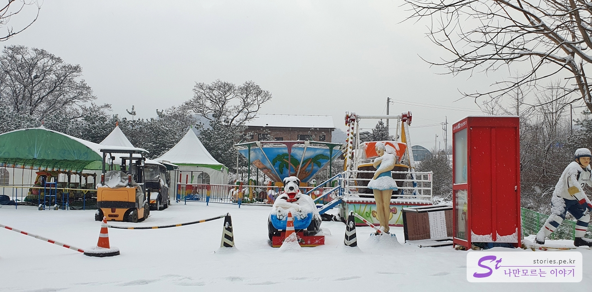
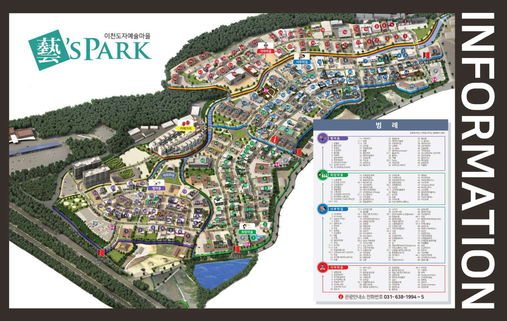

연말에 남아있는 휴가를 소진하기 위해서 2박 3일로 이천, 원주, 동해를 한 바퀴 도는 간단한 여행을 다녀왔습니다. 여행을 시작한 첫날 예기치 않게 눈이 내리는 바람에 여행 일정이 좀 꼬이기는 했지만 그래도 이가 없으면 잇몸이라고 어떻게든 다녀왔습니다.

눈 오는 날 예스파크를 다녀왔습니다. 원래는 예스파크를 거닐면서 거리도 느껴보고 상점에서 예술성 있는 도자기도 보고 몇 개 구입도 하고 하려 했으나...

그런 계획은 실패로 돌아가고 그냥 따뜻한 자동차 안에서 거리를 아주 천천히 이동하면서 창밖으로 상점 건물과 전시된 도자기를 보면서 마음의 위안을 받았습니다. 이렇게 구경하는 것도 나름 좋았습니다. 추운 겨울이나 더운 여름에는 아주 좋은 여행 방법 중 하나로 추천합니다.

# 예스파크(Ye'sPark) 구경하기

예스파크는 도자기로 유명한 이천시가 예술가들과 관광의 유치를 목적으로 2014년에 계획해서 2018년에 개장을 한 도자기 마을입니다. 생각했던 것보다 많이 활성화가 되지는 못한 것 같으나 나름 쉬엄쉬엄 여행하기에 좋은 장소라는 생각이 듭니다.

저희는 **1번 게이트**를 통해서 들어갔습니다. 춥기도 하고 눈도 오고 해서 관광객의 모습은 찾아볼 수 없었습니다. 그래서 차를 타고 아주 천천히 돌아보기에 좋았습니다.

눈에 띄는 건물을 발견했는데, 기타 모양의 건물입니다. 건물의 모습에서도 알 수 있듯이 기타를 제작하는 곳이라고 하더군요.

걸어 다녔더라면 걸어봤을 거리입니다. 저희는 먼발치에서 보고 바로 패스~

마을이 넓다 보니 마을을 도는 순환열차가 있나 봅니다. 마을을 돌면서 열차 타는 곳을 몇 군데 봤네요. 걸어 다닐 때 이용하면 좋을 것 같습니다.

마을 곳곳에 이런 조형물들이 많이 있습니다. 예술마을이다 보니 거리 곳곳에 멋진 작품들이 많습니다.

눈이 오는 환경의 작품들도 나름 운치가 있네요.

항아리가 한두 개 있으면 별 감흥이 없었겠지만 잔뜩 모아놓고보니 예술품같이 이쁘네요.

컵도 디스플레이를 어떻게 하냐에 따라 예술적으로 보일 수 있습니다. 마르셀 뒤샹이 변기를 예술작품이라고 전시를 했던 기억이 나네요.

눈 오는 거리의 풍경이 너무 멋있습니다.

우리가 작품을 구경하는 건지, 작품들이 우리를 구경하는 건지 모를 구성입니다. ㅎ

마을의 중앙에 있는 가족 동상입니다. 아이의 머리에 쌓인 눈이 꼭 우리 집 강아지 또리를 닮아서 신기했네요.

2번 게이트로 들어오면 볼 수 있는 마을 중앙의 회전교차로입니다.

무슨 아이들이 놀만한 놀이공원이 있는데, 겨울이라 그런지 휴장인 것 같습니다.

## 비용

마을 관람은 무료이고 마을에서 도자기를 구입하거나 체험하는 비용 정도가 소요됩니다.

## 입장시간

- 운영시간 : 24시간
- 소요시간 : 차량으로 이동 시 대략 30분~1시간 정도 소요되었습니다. 걸어 다니면 더 걸리겠죠?
- 휴무일 : 연중무휴

## 여행지 정보

- 주소 : 경기 이천시 신둔면 도자예술로5번길
- 연락처 : 031-638-1994
- URL : https://www.facebook.com/yesparkkorea

제2중부고속도로 이천 휴게소에서 옆길로 진출입 할 수 있습니다.

마을 자체가 상당히 넓은 편이고 게이트도 총 4개가 있어서 여러 방면으로 진출입할 수 있습니다. 구역이 마을로 구분되어 있으며 **별마을**, **회랑마을**, **사부작길**, **가마마을**로 4개로 구분되어 있습니다.
주차장도 곳곳에 마련되어 있어 주차도 수월합니다.

## 인근 맛집

> [[곤지암 맛집] 육칼(육개장 칼국수)과 육전이 맛있는 동동국수](https://blog.stories.pe.kr/603)
