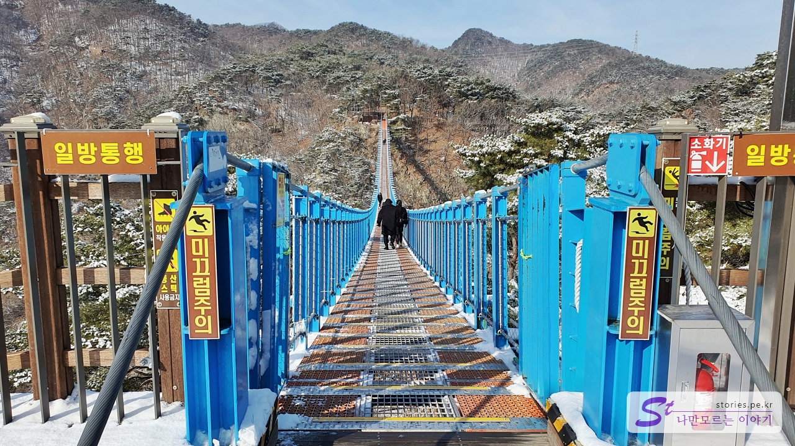
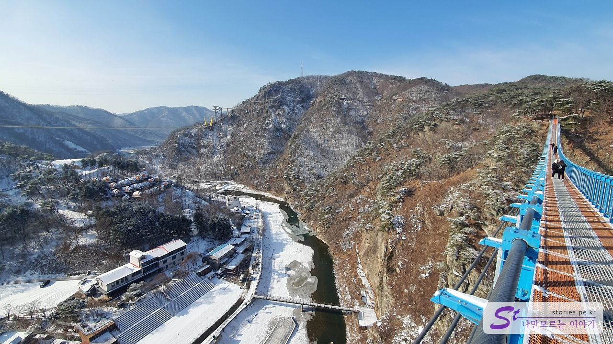
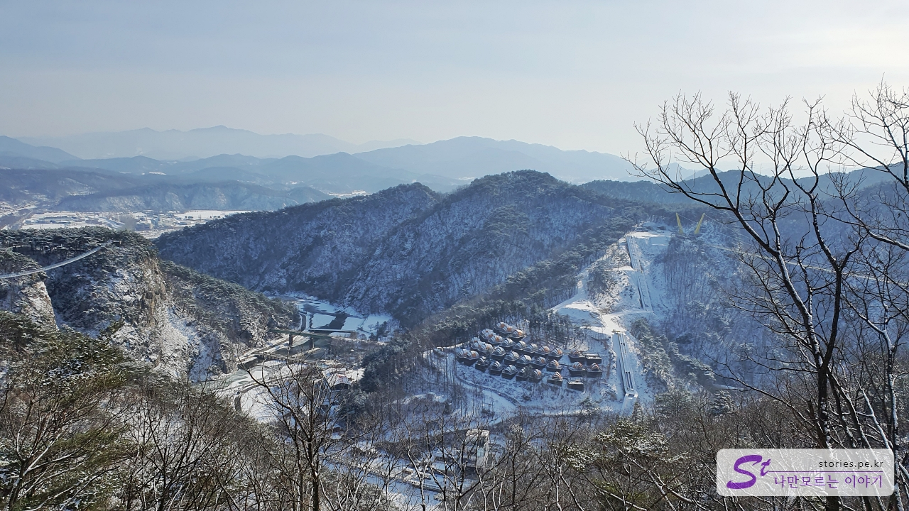
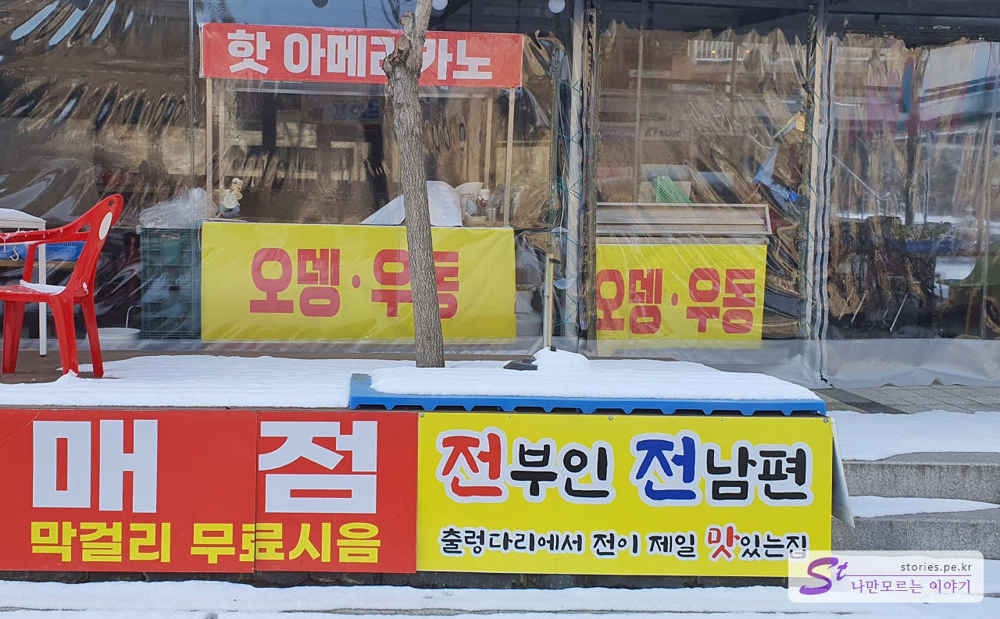

여행 2일째 첫 번째 여행지는 **소금산 그랜드밸리(간현관광지)** 입니다. 예전에 방문했을 때는 출렁다리까지만 건너고 다시 되돌아오는 코스였는데, 작년(2021년 12월)에 전 구간을 그랜드 오픈하며 다녀오게 되었습니다.

# 소금산 그랜드밸리(간현관광지)

원래는 간현 관광지로 명명되다가 원주에서 이곳을 랜드마크화 시키면서 소금산 그랜드밸리로 명칭을 홍보하는 것 같습니다.

소금산 그랜드밸리의 매표소는 진입로를 따라 무인 매표소를 포함해서 3군데가 있습니다. 주차장 앞 상점들을 지나면 바로 무인 매표소가 나타납니다. 만약 사람이 붐비는 성수기 때라면 여기를 건너뛰고 다음 매표소에서 구매하는 것이 좋습니다. 저희가 방문했을 때는 겨울철 비수기라 무인 매표소와 2번째 매표소는 운영을 하지 않고 마지막 매표소에서만 표를 판매하고 있었습니다.

첫 번째 무인 매표소를 지나면 출렁다리로 가는 길에 두 번째 상점들이 모여있는 길을 지나게 됩니다.

첫 번째 나오는 다리를 건너게 됩니다. 저 멀리 오른쪽에 보이는 철길은 소금산 레일바이크가 다니는 길입니다. 나중에 레일바이크도 한번 타보고 싶네요.

다리를 건너면 2번째 매표소가 나타납니다. 여기는 무인 매표소와 유인 매표소가 같이 운영되고 있습니다. 저희가 갔을 때는 여기도 운영을 하고 있지 않았습니다.

2번째 매표소 바로 옆으로 2번째 다리가 있습니다. 여름에 찾아온다면 다리에 `ㄷ` 모양의 기둥에서 시원하라고 안개가 뿌였게 뿌려집니다.

다리로 건너면 바로 3번째 상점들이 나타납니다. 식당과 기념품들을 구매할 수 있습니다.

이 상점을 지나면 바로 3번째 이자 마지막 매표소가 나타나고 여기에서 매표를 하시면 됩니다. 그리고 바로 여기가 한 바퀴 순환하는 소금산 그랜드밸리가 시작되는 곳이기도 합니다.

매표를 하면 이렇게 팔목에 찰 수 있는 표를 줍니다. 나중에 출렁다리 광장에 들어설 때 입구에서 QR코드를 찍어야 입장을 할 수 있습니다.

예전에는 매표를 하면 원주 지역상품권을 줬었는데, 그랜드밸리 전체가 개통되면서 이제는 지역상품권을 주지 않는 것 같습니다. ㅠㅠ

나무데크를 타고 일단 산 위로 올라가야 합니다. 그래도 꽤 힘들게 올라가야 합니다. 그래도 데크로되어 있어서 불편하지는 않습니다.

올라가다 보면 원주에서 운영하며 가까운 곳에 있는 원주 레일바이크에 대한 소개를 하는 표지판이 보입니다. 나중에 한번 레일바이크도 타볼까 합니다.

그렇게 5분 정도를 더 올라가면 소금산 출렁다리를 탈 수 있는 입구가 나오게 됩니다. 여기에 포토존도 있으니 기념사진을 한번 남겨보는 것도 좋겠지요~

바로 옆에 광장이 아주 넓게 펼쳐져 있습니다. 나무데크로 되어 있어서 비가 오나 눈이 오나 쾌적한 상태를 하고 있습니다.

그러면 이제 출렁다리를 만날 수 있습니다. 소금산 그랜드밸리에는 2개의 다리가 있는데 여기는 출렁다리, 조금 더 가면 울렁다리라고 불리는 다리가 있습니다.

저기 멀리 보이는 공중에 떠있는 한 줄이 **울렁다리** 입니다. 출렁다리를 지나 잔도길을 따라가면 스카이타워에 연결되어 있는 울렁다리를 만날 수 있는데 그 다리를 건너 내려오는 코스로 되어 있습니다.

출렁다리 아래가 간현 관광지의 **나오라 쇼 광장** 입니다. 바람이 불면 다리가 흔들리면서 스릴을 느낄 수 있습니다.

출렁다리를 다 건너면 출구를 통해 나올 수 있습니다.

출렁다리를 나오면 2가지 길이 나오는데 내려가는 길과 소금잔 도로 올라가는 길입니다. 예전에 왔을 때는 소금 잔도 길로는 갈 수 없었고 바로 돌아서 내려가는 코스만 있었습니다. 21년 12월에 개통이 되면서 이제는 소금 잔도 길로 갈 수 있으며 내려가는 길은 막아 놓고 있었습니다.

소금 잔도 길로 올라가는 길에 오른쪽으로 하늘정원이 보입니다. 공사하시는 분들이 부지런히 추가 작업을 하고 있었습니다. 아마도 하늘정원을 꾸며 놓는 것 같았습니다. 내년 봄이나 여름이 되면 하늘정원도 오픈이 되어 많은 사람들이 찾을 것 같습니다.

그렇게 5분 정도 올라가면 또 다른 큰 광장이 나옵니다. 이곳에서 한 번 더 쉬어 갈 수 있습니다.

사실 제가 소화 기능이 좋지 않아서 주차장 입구에서 화장실을 다녀왔었는데, 올라오는 도중 급똥의 습격으로.. 거의 미칠 뻔했었습니다. 다행히 이곳에 반가운 화장실을 만날 수 있어서 어찌나 반가웠던지...

남자화장실은 대변기 1개, 소변기 1개로 되어 있는 작은 화장실이라 성수기에는 최대한 주차장 화장실에서 비우고 올라오는 것이 좋을 것 같습니다. 경쟁이 치열할듯하네요.

이제 광장을 지나 소금 잠도 길로 출발하면 됩니다.

데크산책로를 통해서 좀 더 편안하게 잔도길로 향할 수 있습니다.

데크산책길을 걸으면서 볼 수 있는 풍경입니다. 저 멀리 피톤치드 캠핑장(글램핑)이 보이네요.

데크산책로가 끝나면 이제 소금 잔도 길이 나옵니다. 잔도 길이란 절벽에 기둥을 가로로 연결해서 벽을 타고 지나가는 길을 말합니다. 제가 가 본 곳 중에 멋진 잔도길을 가지고 있는 곳이 있는데 한탄강을 끼고 있는 주상절리 길입니다. 아래 포스팅을 참고하세요~

> [[철원 가볼 만한 곳] 철원 한탄강 주상절리 길 잘 다녀오는 방법 (비용, 팁) 바로 가기](https://blog.stories.pe.kr/581)

잔도길입니다. 아찔아찔합니다. 여기서부터 집사람은 무섭다고 난리 난리를~~

이곳에서 바라본 풍경도 너무 멋집니다. 눈이 와서 그런지 더 멋진 풍경을 볼 수가 있었습니다.

이제 잔도길의 마지막 구간입니다. 여기를 지나면 스카이 타워가 나타나게 됩니다.

스카이타워의 꼭대기로 연결이 되어 있고 이 스카이타워를 타고 아래로 내려와서 울렁다리를 건너게 됩니다.

스타이타워입니다. 바닥이 보여서 아찔아찔합니다.

꼭대기가 꼭 헬기가 내려도 될 것처럼 생겼습니다. 여기도 중앙은 철판인데 옆쪽으로 가면 아래가 보이도록 되어 있습니다.

이제는 울렁다리를 건너야 합니다. 여기도 많이 흔들립니다. 뭐.. 그걸 즐기러 온 것이지만..

여기는 유리바닥으로 되어있는 구간이 있어서 더욱 아찔합니다.  
이제 울렁다리를 지나면 마지막입니다. 이제 내려오는 길만 남았습니다. 아까 위에서 본 피톤치드 캠핑장을 지나서 나오라 쇼 광장까지 지나게 됩니다.

피톤치드 캠핑장 앞을 지나서 내려오게 되어 있습니다. 아마 23년도에는 울렁다리를 건넌 다음 바로 에스컬레이터를 타고 바로 아래로 내려올 수 있을 것 같습니다. 현재 공사 중이네요.

내려오면 바로 커피집을 만날 수 있습니다. 힘들게 한 바퀴 돌고 시원한 아이스 아메리카노를 먹으면 더위가 싹 날아갈 것 같습니다.  
아이돌 아이브도 여기서 커피를 먹었다는 광고판이 있더라고요. 저희도 2층에서 아이스 아메리카노를 한잔 마시며 쉬고 갔습니다. 커피의 가격도 관광지라고 특별히 비싸지는 않았습니다. 일반적인 투썸플레이스의 가격을 하고 있어서 바가지를 쓰지는 않습니다.

투썸플레이스를 나와 조금 내려오면 이제는 나오라쑈 광장을 만나게 됩니다. 여기에서 공연도 하고 앞쪽에 있는 강에서 미디어 파사드와 음악 분수쇼를 볼 수 있게 되어 있습니다. 저희가 갔을 때는 겨울이라 공사 중이었습니다.

나오는 길에 재미있는 식당이 있어서 찍어봤네요 ㅎㅎ 전부인, 전남편.. 전집입니다.

마지막에 놀이 시설과 관광안내도를 볼 수가 있습니다. 이게 끝나는 곳에 있어서 무슨 의미가 있을까 싶네요.

그리고 다리를 건너서 조금만 더 가면 아까 들어갔던 입구가 나오게 됩니다. 이렇게 한 바퀴를 돌면 소금강 그랜드밸리를 완주하게 됩니다.

## 비용

주차비는 따로 없었고 입장료는 아래와 같습니다.

### 소금산 그랜드밸리 입장료

| 항목             | 가격    | 비고                                        |
| ---------------- | ------- | ------------------------------------------- |
| 정상요금         | 9,000원 | 대인 만 13세 이상                           |
| 정상요금         | 5,000원 | 소인 만 7세~만 12세                         |
| 우대금액(대인)   | 8,000원 | 만 65세 이상, 한 부모, 다자녀, 장애인, 단체 |
| 우대금액(소인)   | 4,500원 | 만 65세 이상, 한 부모, 다자녀, 장애인, 단체 |
| 강원도민(대인)   | 7,000원 |                                             |
| 강원도민(소인)   | 4,000원 | 소인 만 7세~만 12세                         |
| 국가유공자(대인) | 6,000원 |                                             |
| 국가유공자(소인) | 3,500원 | 소인 만 7세~만 12세                         |
| 원주시민(대인)   | 5,000원 |                                             |
| 원주시민(소인)   | 3,000원 | 소인 만 7세~만 12세                         |

### 나오라 쇼 입장료 (4~10월 운영)

| 항목             | 가격    | 비고                                        |
| ---------------- | ------- | ------------------------------------------- |
| 정상요금         | 5,000원 | 대인 만 13세 이상                           |
| 정상요금         | 3,000원 | 소인 만 7세~만 12세                         |
| 우대금액(대인)   | 4,500원 | 만 65세 이상, 한 부모, 다자녀, 장애인, 단체 |
| 우대금액(소인)   | 2,500원 | 만 65세 이상, 한 부모, 다자녀, 장애인, 단체 |
| 강원도민(대인)   | 4,000원 |                                             |
| 강원도민(소인)   | 2,000원 | 소인 만 7세~만 12세                         |
| 국가유공자(대인) | 3,500원 |                                             |
| 국가유공자(소인) | 1,500원 | 소인 만 7세~만 12세                         |
| 원주시민(대인)   | 3,000원 |                                             |
| 원주시민(소인)   | 1,000원 | 소인 만 7세~만 12세                         |

## 입장시간

- 운영시간
  - 동절기 : 11 ~ 4월 15:30분 종료
  - 하절기 : 5 ~ 10월 16:30분 종료
- 소요시간 : 왕복 약 2시간 정도 소요
- 휴무일 : 매주 첫 번째, 세 번째 월요일, 추석 당일, 설날 당일 휴장, 천재지변, 기상 특보, 시설 개보수 시 휴장

## 여행지 정보

코스는 일방통행이며 총 2시간 정도 소요됩니다.

간현관광지에 대한 약도입니다. 왼쪽에 에스컬레이터라고 되어있는데 현재 공사 중에 있고 봄이나 여름에는 운영을 할듯합니다.

소금산 그랜드밸리로 오는 버스/기차 시간표입니다. 대부분 자가용을 가지고 오긴 하는데 그 외의 교통편 이용 시 참고하시면 될 것 같습니다.

- 주소 : 강원 원주시 지정면 소금산길 12
- 연락처 : 033-749-4860
- URL : https://www.wonju.go.kr/tour/contents.do?key=5517&

<iframe src='https://www.google.com/maps/embed?pb=!1m18!1m12!1m3!1d1333.2768620683726!2d127.83366088708043!3d37.36417359883217!2m3!1f0!2f0!3f0!3m2!1i1024!2i768!4f13.1!3m3!1m2!1s0x0%3A0x620b7bb0432a7cdd!2z6rCE7ZiE6rSA6rSR7KeAKOyGjOq4iOyCsOq3uOuenOuTnOuwuOumrCk!5e0!3m2!1sko!2skr!4v1671639117733!5m2!1sko!2skr' class='embed-responsive-item' allowfullscreen></iframe>

## 주차정보

주차장은 1, 2주차장으로 되어 있어서 성수기 주말이 아닌 경우는 주차에 큰 문제는 없습니다. 현재 겨울이라 그런지 주차요금은 받지 않고 있었습니다.

## 인근 맛집

인근에 간현 돈가스 집이 있는데 맛이 괜찮습니다.
아래 포스팅을 참고하세요.

> [[원주 여행] 간현관광지 소금산 그랜드밸리에 가기 전에 들린 돈가스 맛집 [간현돈까스]](https://blog.stories.pe.kr/605)
