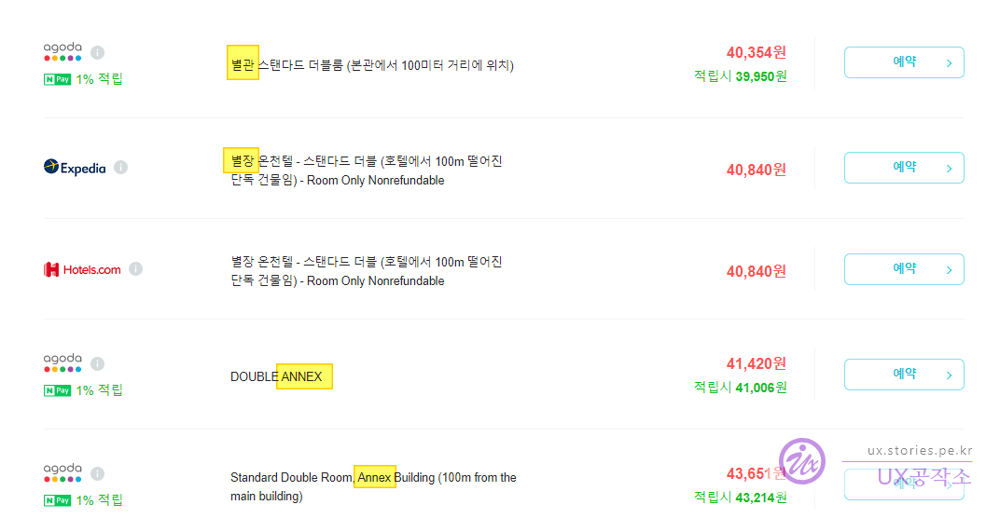
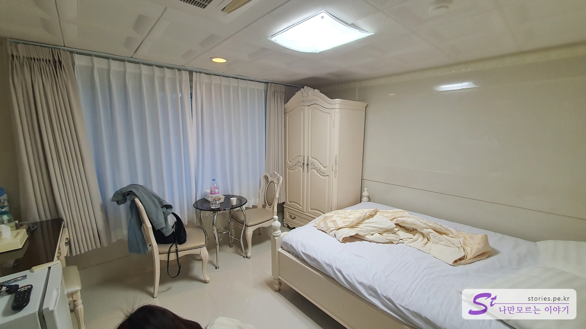
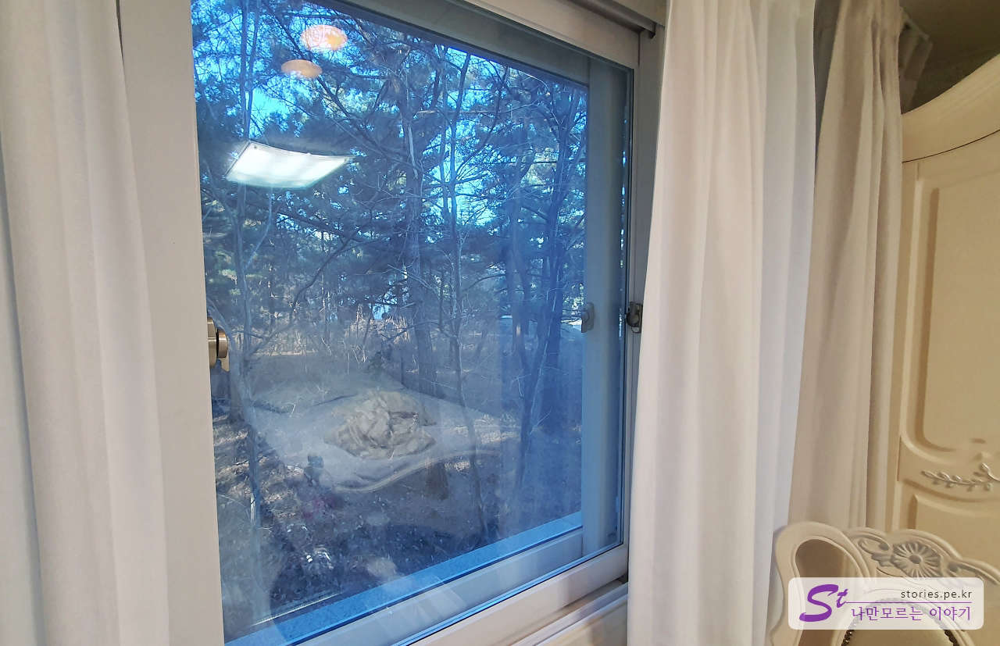
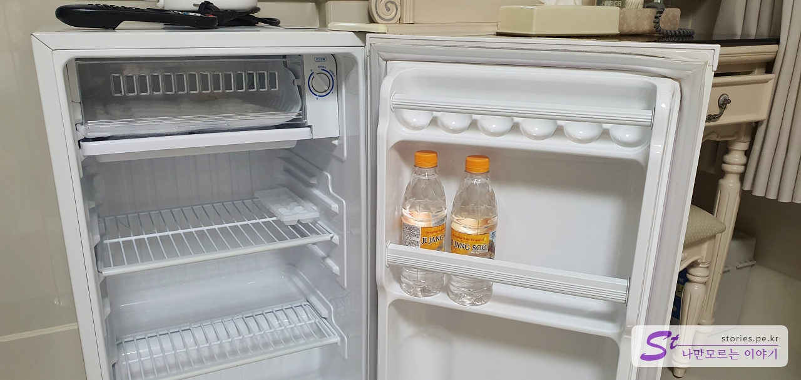

I came to the East Sea from Wonju. I made a reservation at Naver in advance and checked in with anticipation.

At first, I entered through the main entrance of the hotel with expectations, but... After being rejected, I went to the annex in bewilderment when I heard the story, "You should go to the -- uh -- go to the annex and sleep!"

The annex is located about 100 meters away from the main building and looks like a temple.

**What is this?!**

I don't usually post things at the dorm. I decided to leave it because I felt so unfair, absurd, and ashamed. I found the accommodation on Naver and made a reservation at Agoda. I knew information about the annex.

As above, I filtered out the places that read **Vacation, Annex, ANNEX** at the East Sea Ocean Hot Spring Convention Hotel.  
There are no such letters in the information of the accommodation **first-come, first-served accommodation**, and the photo was in the main building, not the annex, and the price was around 60,000 won I made a reservation thinking that this is not an annex.  
It was, after all, an annex.  
If the price is 100,000 won, I think we should just think of it as an annex.

# Donghaeyang Hot Spring Convention Hotel Annex

I wouldn't have been angry if the annex was managed like a hotel, but it was not as good as a motel for almost 30,000 won.

Maybe because the ceiling is low inside, it felt so stuffy and narrow. The bed was also a cheap mattress, and the spring was dead on the corner.

Still, if the view was toward the beach, I would have cooled my anger by looking at the sea, but I was looking at the mountain. I gave you 60,000 won. What is this...

There was a small refrigerator, and they gave me 2 free water, and the water... It's a brand I've never heard of. It says Jijangsu. Can I eat it?That's what I thought, so I didn't even touch it.

Donghaeyang Hot Spring Convention Hotel is famous for hot springs, so I expected hot springs. The bathtub should be in the form of a whirlpool and water should come out of the nozzle next to it, but it didn't come out at all. It's just a shape. And each nozzle has rust...

There is no temperature control. It's just... It's 25 degrees, and it's still there even if you turn the dial. The temperature doesn't go up or down. 25 degrees is over!  
I paid 60,000 won for the accommodation...

The mirror is worn out. crying

## Cost

**If you look at the villa, annex, ANNEX**, you can get it at a low price of 40,000 won.  
You can pay up to 80,000 won if you are fooled like me and buy the main building.  
If you're just going to stay in the annex, you'd better just look for another motel.

## Accommodation information

- Address: 6285, Donghae-daero, Donghae-si, Gangwon-do, Republic of Korea
- Contact point: 0507-1374-0703
- - URL : https://www.msgh.kr

<iframe src='https://www.google.com/maps/embed?pb=!1m18!1m12!1m3!1d3161.407963623654!2d129.08462281557334!3d37.59255653039462!2m3!1f0!2f0!3f0!3m2!1i1024!2i768!4f13.1!3m3!1m2!1s0x3561c6a35125172f%3A0x6238cd78219c2c5f!2z64-Z7ZW067O07JaR7Jio7LKc7Luo67Kk7IWY7Zi47YWU!5e0!3m2!1sko!2skr!4v1671718866896!5m2!1sko!2skr' class='embed-responsive-item' allowfullscreen></iframe>

## Parking information

There's a parking lot.

## Other Matters

Donghaeyang Hot Spring Convention Hotel is a hotel operated by **Daejinseonghoe**, such as **Daesun Jinri Bridge**, as if it smells from the building. If you are sensitive to religion, you should skip this place.
