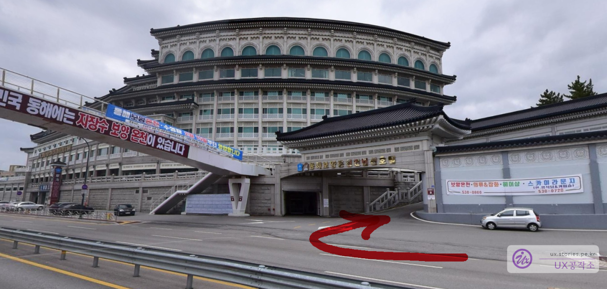
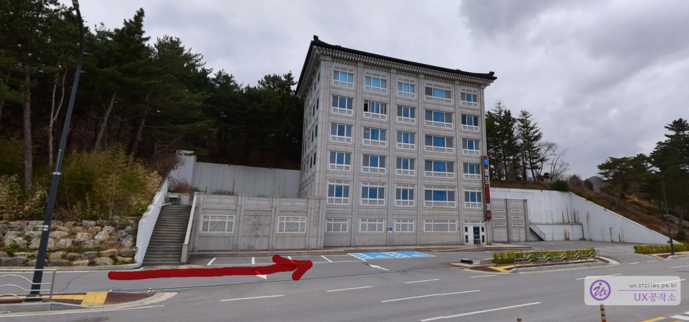
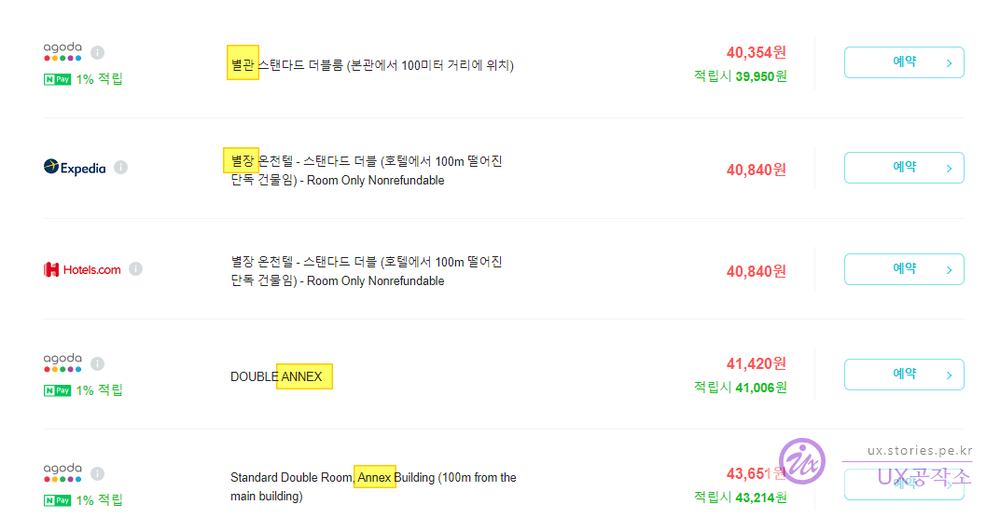
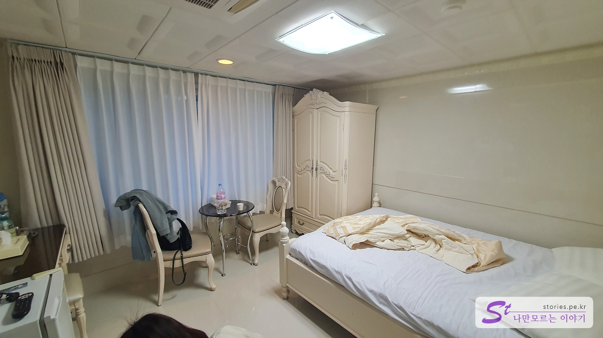
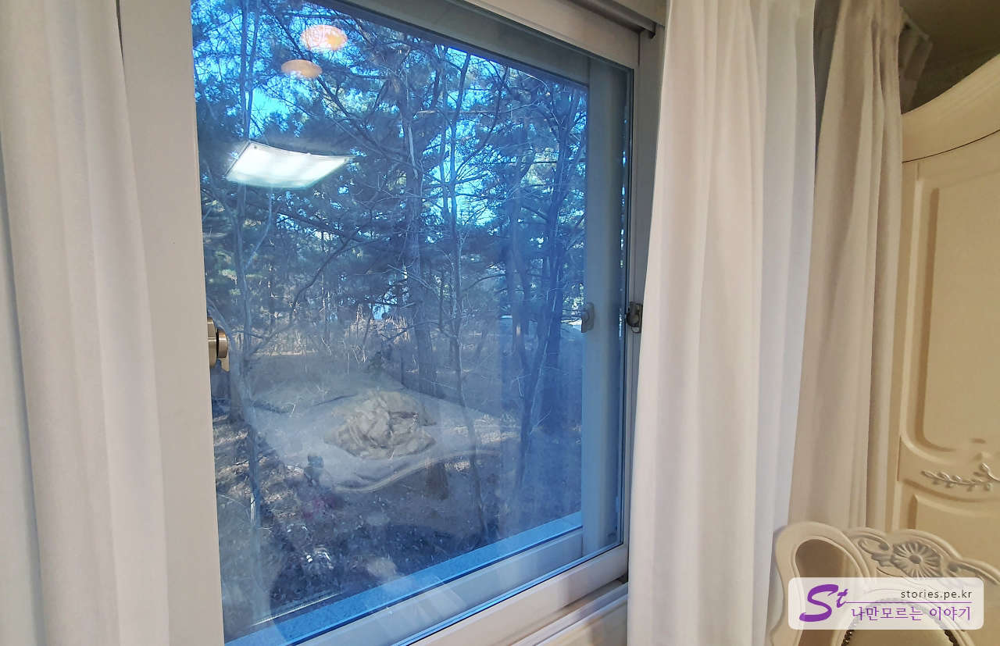
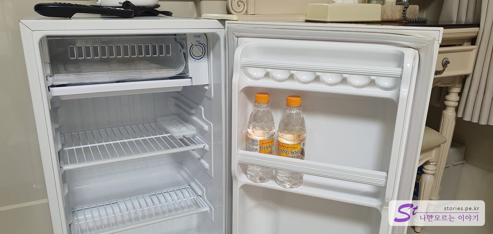
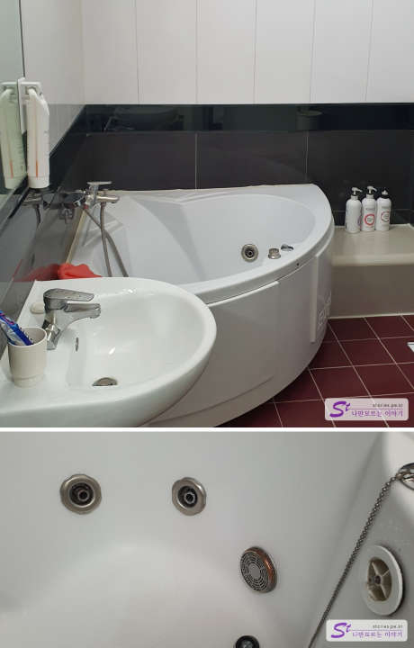
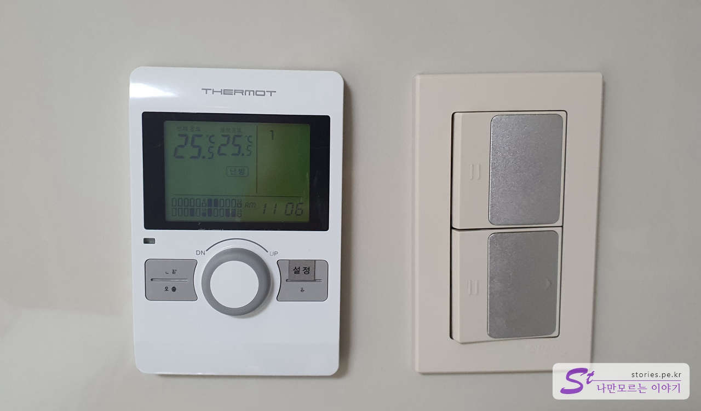
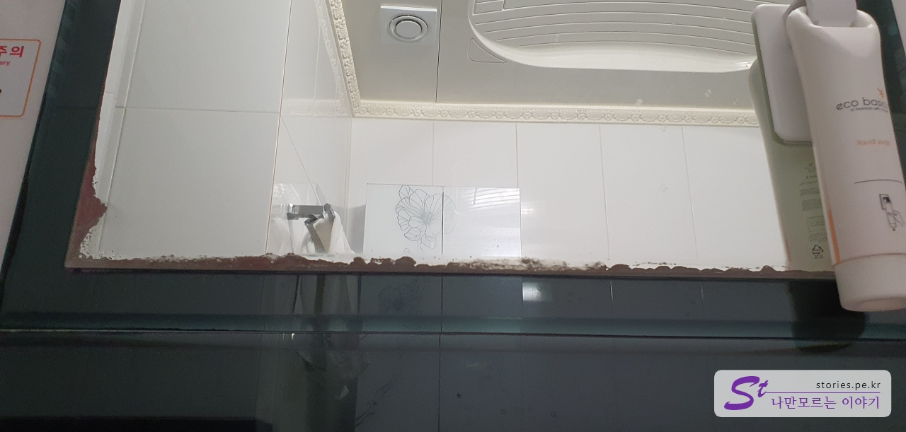

원주에서 동해로 왔습니다. 미리 네이버에서 숙소 예약을 하고 기대를 가지며 숙소 체크인을 했습니다.

처음에는 기대를 가지고 호텔의 주 출입구를 통해 들어갔으나.... 거절을 당하고, "넌 저 ~ 어 ~ 기 별관으로 가서 자야 해!!" 라는 이야기를 듣고 황당해 하며 별관으로 갔습니다.

별관은 본관에서 약 100m 정도 떨어진 위치에 **절**같이 생긴 건물입니다.

**이게 뭡니까?!!**

내가 웬만하면 숙소 포스팅은 하지 않는데... 너무 억울하고 황당하고 자괴감이 들어서 남기기로 했습니다. 네이버에서 숙소를 찾고 아고다에서 예약을 했습니다. 별관에 대한 정보도 알고 있었고요.

위와 같이 동해보양온천컨벤션호텔에서 **별장, 별관, ANNEX**라고 쓰여있는 곳은 거르고 걸렀는데..  
숙소의 정보에 저런 글자는 없고 **선착순 숙소 배정** 이라는 제목에, 사진도 별관이 아닌 본관 사진이었고 가격도 6만원대라서 **아!! 이곳은 별관이 아니구나**라고 생각하고 예약을 했는데..  
결국 별관이었던 것이었습니다.  
그냥 가격대가 10만원이하면 그냥 별관이라고 생각해야 할 것 같습니다.

# 동해보양온천컨벤션호텔 별관

별관이 호텔처럼 관리가 되면 그나마 화가 나지 않았을 텐데, 그냥 거의 3만원짜리 모텔보다도 좋지 못했습니다.

실내는 천장이 낮아서 그런지 너무 답답하고 좁게 느껴졌습니다. 침대도 싸구려 매트리스인지 모서리 쪽은 스프링이 푹 죽어있었습니다.

그래도 전망이 바닷가 쪽이었으면 바다를 보면서 화를 식혔을 텐데 떡하니 산을 바라보고 있었습니다. 6만원이나 줬는데... 이게 뭡니까...

소형 냉장고가 있었고 물 2개를 서비스로 넣어줬는데, 물도 뭐.. 듣도 보도 못한 브랜드입니다. 지장수라고 되어있던데... 먹어도 될까?라는 생각이 들어서 손도 대지 않았습니다.

동해보양온천컨벤션호텔이 온천으로 유명하다고 해서 그나마 온천을 기대했습니다. 욕조가 월풀 형태로 옆의 노즐에서 물이 나와야 하는데 전혀 나오지 않았습니다. 그냥 모양으로 있는 것입니다. 그리고 각 노즐마다 녹이 있어서...

온도 조절도 되지 않습니다. 그냥 딱.. 25도이고 다이얼을 돌려도 요지부동입니다. 온도가 올라가지도 내려가지도 않습니다. 그냥 25도 끝!!!  
숙소비로 6만원이나 냈는데...

거울도 다 낡아빠져서.. ㅠㅠ

## 비용

**별장, 별관, ANNEX**을 기준으로 본다면 싸게는 4만원대에 구할 수 있습니다.  
저같이 바보같이 속아서 본관인가 하고 구매할 경우 8만원까지도 지불할 수 있습니다.  
그냥 별관에 묵을 생각이라면 그냥 다른 모텔을 알아보는 게 좋을 것 같습니다.

## 숙소 정보

- 주소 : 강원 동해시 동해대로 6285
- 연락처 : 0507-1374-0703
- URL : https://www.msgh.kr

<iframe src='https://www.google.com/maps/embed?pb=!1m18!1m12!1m3!1d3161.407963623654!2d129.08462281557334!3d37.59255653039462!2m3!1f0!2f0!3f0!3m2!1i1024!2i768!4f13.1!3m3!1m2!1s0x3561c6a35125172f%3A0x6238cd78219c2c5f!2z64-Z7ZW067O07JaR7Jio7LKc7Luo67Kk7IWY7Zi47YWU!5e0!3m2!1sko!2skr!4v1671718866896!5m2!1sko!2skr' class='embed-responsive-item' allowfullscreen></iframe>

## 주차정보

주차장 있습니다.

## 기타 사항

동해보양온천컨벤션호텔은 건물에서부터 냄새가 나는 것처럼 **대순진리교**와 같은 **대진성주회**에서 운영하는 호텔입니다. 종교에 민감하신 분들이라면 이곳은 거르시는 것이 좋습니다.
