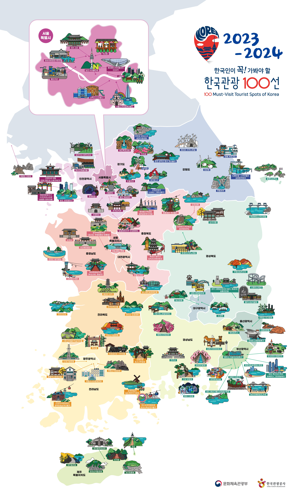

Every two years, the Ministry of Culture, Sports and Tourism and the Korea Tourism Organization announce the 100 best tourist destinations to visit next year and the year after next by analyzing big data, local government recommendations, and on-site verification. Compared to the tourist attractions I actually visited, I don't think I just made it by selecting it roughly from the table. I think it's a very meaningful place.

This time, we announced 100 Korean tourist attractions that are good to visit in 2023 and 2024, so we should refer to this tourist attraction for the next two years Hah!

## Seoul, South Korea

| Number | Place                                                      | Address             | Contact      |
| ------ | ---------------------------------------------------------- | ------------------- | ------------ |
| 1      | Seoul Forest                                               | Seongdong-gu, Seoul | 02-460-2905  |
| 2      | Lotte World Tower Seoul Sky                                | Songpa-gu, Seoul    | 1661-2000    |
| 3      | Ikseon-dong                                                | Jongno-gu, Seoul    | 02-734-0222  |
| 4      | Changdeokgung Palace and Sponsored [UNESCO World Heritage] | Jongno-gu, Seoul    | 02-3668-2300 |
| 5      | Gyeonghui Palace                                           | Jongno-gu, Seoul    | 02-724-0274  |
| 6      | Lotte World                                                | Songpa-gu, Seoul    | 1661-2000    |
| 7      | Seochon Village                                            | Jongno-gu, Seoul    | 02-2148-1114 |
| 8      | Gyeongbokgung                                              | Jongno-gu, Seoul    | 02-3700-3900 |
| 9      | Deoksugung                                                 | Jung-gu, Seoul      | 02-771-9951  |
| 10     | Dongdaemun Design Plaza (DDP)                              | Jung-gu, Seoul      | 02-2153-0000 |
| 11     | Namsan Seoul Tower                                         | Yongsan-gu, Seoul   | 02-3455-9277 |
| 12     | Changgyeonggung                                            | Jongno-gu, Seoul    | 02-762-4868  |
| 13     | Starfield COEX Mall                                        | Gangnam-gu, Seoul   | 02-6002-5300 |
| 14     | Front street of Cheong Wa Dae                              | Jongno-gu, Seoul    | 02-120       |
| 15     | Hongdae                                                    | Mapo-gu, Seoul      | 02-323-2240  |

## Gyeonggi Province

| Number | Place                                       | Address                     | Contact       |
| ------ | ------------------------------------------- | --------------------------- | ------------- |
| 1      | Jarasum                                     | Gapyeong-gun, Gyeonggi-do   | 031-580-4632  |
| 2      | Gwangmyeong Cave                            | Gwangmyeong-si, Gyeonggi-do | 070-4277-8902 |
| 3      | Suwon Hwaseong [UNESCO World Heritage]      | Suwon, Gyeonggi             | 031-290-3600  |
| 4      | Heyri Art Village                           | Paju-si, Gyeonggi-do        | 031-946-8551  |
| 5      | Yangpyeong Dumulmeori                       | Yangpyeong-gun, Gyeonggi-do | 031-770-1001  |
| 6      | Imjingak, Paju (Peace Nuri Park)            | Paju, Gyeonggi-do           | 031-953-4744  |
| 7      | Seoul Land                                  | Gwacheon City, Gyeonggi     | 02-509-6000   |
| 8      | Korean Folk Village                         | Yongin-si, Gyeonggi-do      | 031-288-0000  |
| 9      | Everland                                    | Yongin, Gyeonggi            | 031-320-5000  |
| 10     | Anseong Farm Land                           | Anseong City, Gyeonggi      | 031-8053-7979 |
| 11     | Jaein Falls (Hantan River National Geopark) | Yeoncheon-gun, Gyeonggi-do  | 031-839-2289  |

## Gangwon Province

| Number | Place                                            | Address                     | Contact      |
| ------ | ------------------------------------------------ | --------------------------- | ------------ |
| 1      | Chuncheon Samaksan Lake Cable Car                | Chuncheon City, Gangwon     | 033-250-5403 |
| 2      | Dochae Bigol Sky Valley                          | Donghae City, Gangwon       | 033-530-2042 |
| 3      | Museum Mountain                                  | Wonju-si, Gangwon-do        | 033-730-9000 |
| 4      | Nami Island                                      | Chuncheon City, Gangwon     | 031-580-8114 |
| 5      | Dojebi-gol Haerang Observatory                   | Donghae-si, Gangwon-do      | 033-530-2042 |
| 6      | Wondae-ri birch forest (whispering birch forest) | Inje-gun, Gangwon-do        | 033-460-8036 |
| 7      | Ganhyeon Tourist Site                            | Wonju-si, Gangwon-do        | 033-733-1330 |
| 8      | Daegwallyeong Special Tourist Zone               | Pyeongchang-gun, Gangwon-do | 033-330-2799 |
| 9      | Hantangang River (National Geopark, Goseokjeong) | Cheorwon-gun, Gangwon-do    | 031-834-2211 |
| 10     | Mureung Valley                                   | Donghae City, Gangwon       | 033-539-3700 |
| 11     | Gangneung Coffee Street                          | Gangneung-si, Gangwon-do    | 033-640-4537 |

## Busan, South Korea

| Number | Place                                               | Address            | Contact      |
| ------ | --------------------------------------------------- | ------------------ | ------------ |
| 1      | Gamcheon Culture Village                            | Saha-gu, Busan     | 051-204-1444 |
| 2      | Haeundae Green Railways (Mipo to Songjeong section) | Haeundae-gu, Busan | 051-749-4536 |
| 3      | Busan Lotte World                                   | Busan Gijang-gun   | 1661-2000    |
| 4      | Gwangalli SUP Zone                                  | Suyeong-gu, Busan  | 051-610-4951 |
| 5      | Busan X the Sky                                     | Busan Haeundae-gu  | 051-731-0098 |
| 6      | Skyline Luge (Busan)                                | Gijang-gun, Busan  | 051-722-6002 |
| 7      | Songdo Beach, Busan                                 | Seo-gu, Busan      | 051-240-4000 |
| 8      | Songjeong Beach                                     | Haeundae-gu, Busan | 051-749-5800 |
| 9      | Yongdusan Jagalchi Special Tourist Zone             | Jung-gu, Busan     | 051-600-4000 |
| 10     | Taejongdae (Busan National Geopark)                 | Yeongdo-gu, Busan  | 051-888-3637 |
| 11     | Songdo Yonggung Cloud Bridge                        | Seo-gu Busan       | 051-240-4087 |
| 12     | Haeundae Beach                                      | Busan Haeundae-gu  | 051-749-5700 |
| 13     | Gwangalli Beach Theme Street                        | Busan Suyeong-gu   | 051-610-4848 |

## Daegu, South Korea

| Number | Place                                            | Address          | Contact      |
| ------ | ------------------------------------------------ | ---------------- | ------------ |
| 1      | Suseongmot Recreation Area                       | Daegu Suseong-gu | 053-666-2863 |
| 2      | Daegu Seomun Market & Seomun Market Night Market | Daegu Jung-gu    | 053-256-6341 |
| 3      | Daegu Dongseong-ro Street                        | Daegu Jung-gu    | 053-627-1337 |
| 4      | Daegu Apsan Park                                 | Daegu Nam-gu     | 053-625-0967 |

## Incheon, South Korea

| Number | Place                           | Address              | Contact      |
| ------ | ------------------------------- | -------------------- | ------------ |
| 1      | Incheon Chinatown               | Incheon Jung-gu      | 032-777-1330 |
| 2      | Ganghwa Original City Storywork | Ganghwa-gun, Incheon | 032-930-3562 |
| 3      | Songdo Central Park             | Incheon Yeonsu-gu    | 032-837-4753 |
| 4      | Songwol-dong Donghwa Village    | Jung-gu, Incheon     | 032-760-6480 |
| 5      | Baengnyeongdo                   | Ongjin-gun, Incheon  | 032-899-2612 |
| 6      | Daecheongdo                     | Ongjin-gun, Incheon  | 032-899-3610 |

## Gwangju, South Korea

| Number | Place                                   | Address         | Contact      |
| ------ | --------------------------------------- | --------------- | ------------ |
| 1      | Mudeungsan National Park                | Gwangju Dong-gu | 062-227-1187 |
| 2      | National Asian Cultural Center          | Gwangju Dong-gu | 1899-5566    |
| 3      | May 18 Memorial Park                    | Seo-gu, Gwangju | 062-376-5197 |
| 4      | Yangrim Historical and Cultural Village | Nam-gu, Gwangju | 062-676-4486 |

## Daejeon, South Korea

| Number | Place            | Address         | Contact      |
| ------ | ---------------- | --------------- | ------------ |
| 1      | Hanbat Arboretum | Seo-gu, Daejeon | 042-270-8474 |

## Ulsan, South Korea

| Number | Place                             | Address         | Contact      |
| ------ | --------------------------------- | --------------- | ------------ |
| 1      | Yeongnam Alps                     | Ulju-gun, Ulsan | 052-204-2931 |
| 2      | Jangsaengpo Whale Culture Village | Nam-gu, Ulsan   | 052-226-0980 |
| 3      | Daewangam Park                    | Dong-gu, Ulsan  | 052-209-3738 |
| 4      | Taehwagang National Garden        | Jung-gu, Ulsan  | 052-229-7562 |

## Sejong City

| Number | Place                     | Address | Contact      |
| ------ | ------------------------- | ------- | ------------ |
| 1      | Sejong National Arboretum | Sejong  | 044-251-0001 |

## North Chungcheong Province

| Number | Place                                         | Address                         | Contact      |
| ------ | --------------------------------------------- | ------------------------------- | ------------ |
| 1      | Songnisan Theme Park Monorail                 | Boeun-gun, Chungbuk             | 043-542-7998 |
| 2      | Jungang Tower Park (Chungju)                  | Chungju-si, Chungbuk            | 043-842-0532 |
| 3      | Chungju Tangeumho Lake Rainbow Road           | Chungju-si, Chungcheongbuk-do   | 043-842-0531 |
| 4      | Cheongpung Lakeside Cable Car                 | Jecheon City, Chungcheongbuk-do | 043-643-7301 |
| 5      | Mancheonha Skywalk                            | Danyang-gun, Chungbuk           | 043-421-0014 |
| 6      | Danyang River Jando                           | Danyang-gun, Chungbuk           | 043-422-1146 |
| 7      | Dodamsambong                                  | Danyang-gun, Chungbuk           | 042-422-3037 |
| 8      | Boeun Beopjusa Temple [UNESCO World Heritage] | Boeun-gun, Chungbuk             | 043-543-3615 |

## South Chungcheong Province

| Number | Place                                                                | Address                          | Contact      |
| ------ | -------------------------------------------------------------------- | -------------------------------- | ------------ |
| 1      | Sudeoksa                                                             | Yesan-gun, Chungcheongnam-do     | 041-330-7700 |
| 2      | Royal Tombs of King Muryeong and Royal Tombs [UNESCO World Heritage] | Gongju-si, Chungcheongnam-do     | 041-856-3151 |
| 3      | Gwanbuk-ri Ruins and Busosanseong Fortress [UNESCO World Heritage]   | Buyeo-gun, Chungcheongnam-do     | 041-830-2880 |
| 4      | Seodong Park and Gungnamji                                           | Buyeo-gun, Chungcheongnam-do     | 041-830-2953 |
| 5      | Gongju Gongsanseong [UNESCO World Heritage]                          | Gongju-si, Chungcheongnam-do     | 041-856-7700 |
| 6      | Kkotji Beach                                                         | Taean-gun, Chungcheongnam-do     | 041-670-2691 |
| 7      | Daecheon Beach                                                       | Boryeong City, Chungcheongnam-do | 041-933-7051 |
| 8      | Seosan Haemi-eupseong                                                | Seosan-si, Chungcheongnam-do     | 041-661-8005 |

## North Gyeongsang Province

| Number | Place                                               | Address                                   | Contact      |
| ------ | --------------------------------------------------- | ----------------------------------------- | ------------ |
| 1      | Spacewalk                                           | Pohang City, Gyeongbuk                    | 054-270-5176 |
| 2      | Jukbyeon Coast Skyrail                              | Uljin-gun, Gyeongsangbuk-do               | 054-783-8881 |
| 3      | Mungyeong Dansan Monorail                           | Mungyeong City, Gyeongsangbuk-do          | 054-572-7273 |
| 4      | Ulleung Island                                      | Ulleung Island, North Gyeongsang Province | 054-790-6454 |
| 5      | Bulguksa Temple in Gyeongju [UNESCO World Heritage] | Gyeongju City, Gyeongsangbuk-do           | 054-746-9913 |
| 6      | Juwangsan National Park                             | Cheongsong-gun, Gyeongsangbuk-do          | 054-870-5300 |
| 7      | Jusanji (Cheongsong National Geopark)               | Cheongsong-gun, Gyeongsangbuk-do          | 054-870-6111 |
| 8      | Sosuseowon [UNESCO World Heritage]                  | Yeongju, Gyeongsangbuk-do                 | 054-634-3310 |
| 9      | Gyeongju Daereungwon                                | Gyeongju-si, Gyeongsangbuk-do             | 054-750-8650 |
| 10     | Dokdo                                               | Ulleung Island, North Gyeongsang Province | 054-790-6644 |
| 11     | Seokguram, Gyeongju [UNESCO World Heritage]         | Gyeongju, Gyeongsangbuk-do                | 054-746-9933 |

## South Gyeongsang Province

| Number | Place                                    | Address                        | Contact      |
| ------ | ---------------------------------------- | ------------------------------ | ------------ |
| 1      | Geochang Hang Aging Healing Land         | Geochang-gun, Gyeongnam        | 055-940-7930 |
| 2      | DPIRANG                                  | Tongyeong City, Gyeongnam      | 1544-3303    |
| 3      | Danghangpo Tourist Site                  | Goseong-gun, Gyeongsangnam-do  | 055-670-4501 |
| 4      | Gimhae Gaya Theme Park                   | Gimhae City, Gyeongnam         | 055-340-7900 |
| 5      | Hwangmaesan County Park                  | Hapcheon-gun, Gyeongsangnam-do | 055-930-4752 |
| 6      | Jinjuseong                               | Jinju-si, Gyeongsangnam-do     | 055-749-5171 |
| 7      | Yeojwacheon Stream (Cherry Blossom Spot) | Changwon, Gyeongnam            | 055-548-4508 |

## North Jeolla Province

| Number | Place                                                   | Address                   | Contact      |
| ------ | ------------------------------------------------------- | ------------------------- | ------------ |
| 1      | Gochang Ungok Ramsar Wetland                            | Gochang-gun, Jeollabuk-do | 063-560-2720 |
| 2      | Jeonju Hanok Village, Jeonbuk [Slow City]               | Jeonju, Jeonbuk           | 063-282-1330 |
| 3      | Gogunsan Islands                                        | Gunsan City, Jeollabuk-do | 063-454-3335 |
| 4      | Naejangsan National Park                                | Jeongeup-si, Jeollabuk-do | 063-538-7875 |
| 5      | Seonyudo                                                | Gunsan City, Jeollabuk-do | 063-454-7280 |
| 6      | Maisan Provincial Park                                  | Jinan-gun, Jeollabuk-do   | 063-430-8751 |
| 7      | Iksan Wanggung-ri Historic Site [UNESCO World Heritage] | Iksan City, Jeollabuk-do  | 063-859-4631 |
| 8      | National Taekwondo Center                               | Muju-gun, Jeollabuk-do    | 063-320-0114 |
| 9      | Muju Bandi Land                                         | Muju-gun, Jeollabuk-do    | 063-324-1155 |

## South Jeolla Province

| Number | Place                                                                           | Address                     | Contact          |
| ------ | ------------------------------------------------------------------------------- | --------------------------- | ---------------- |
| 1      | Let's all live happily – Cheongeunsa Temple's win-win path and pine forest path | Gurye-gun, Jeollanam-do     |
| 2      | Suncheon Bay Wetland (formerly Suncheon Bay Natural Ecological Park)            | Suncheon City, Jeollanam-do | 1577-2013        |
| 3      | Hallyeohaesang National Park (Odongdo)                                          | Yeosu-si, Jeollanam-do      | 061-659-1819     |
| 4      | Mokpo Marine Cable Car                                                          | Mokpo City, Jeollanam-do    | 061-244-2600     |
| 5      | Expo Fair (Expo Marine Park)                                                    | Yeosu-si, Jeollanam-do      | 1577-2012        |
| 6      | Dolsando                                                                        | Yeosu-si, Jeollanam-do      | 061-690-2038     |
| 7      | Mokpo Modern History Hall 1                                                     | Mokpo City, Jeollanam-do    | 061-242-0340     |
| 8      | Mokpo Modern History Hall 2                                                     | Mokpo City, Jeollanam-do    | 061-270-8728     |
| 9      | Juknokwon                                                                       | Damyang-gun, Jeollanam-do   | 061-380-2680     |
| 10     | Yeosu Maritime Cable Car                                                        | Yeosu City, Jeollanam-do    | 061-664-7301     |
| 11     | Seomjingang Train Village                                                       | Gokseong-gun, Jeollanam-do  | 061-362-74618635 |

## Jeju Island

| Number | Place                                               | Address             | Contact      |
| ------ | --------------------------------------------------- | ------------------- | ------------ |
| 1      | Udo (Ocean Provincial Park)                         | Jeju City           | 064-728-1527 |
| 2      | Jeju Olle Trail                                     | Jeju                |
| 3      | Hallasan Mountain (Jeju National Geopark)           | Jeju City           | 064-710-3945 |
| 4      | Seongsan Ilchulbong [UNESCO World Natural Heritage] | Seogwipo City, Jeju | 064-710-7923 |
| 5      | Jeju Stone Culture Park                             | Jeju City           | 064-710-7731 |
| 6      | Bijarim                                             | Jeju City           | 064-710-7912 |
