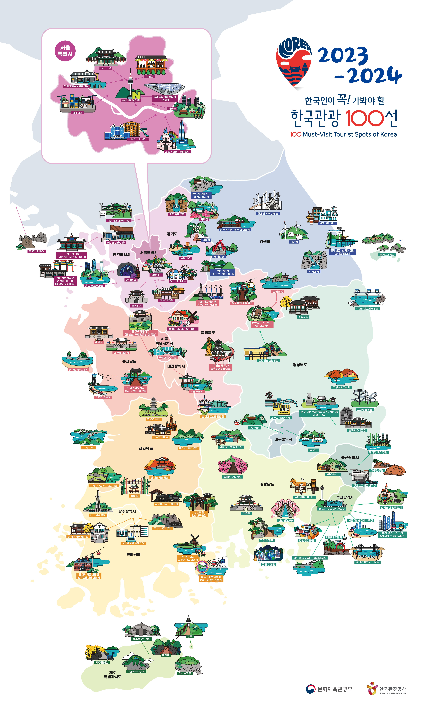

2년에 한 번씩 문화체육관광부와 한국관광공사에서 빅데이터, 지자체 추천, 현장검증 등으로 분석하여 내년, 내후년에 방문하면 좋을 관광지 **한국관광 100선**을 발표합니다. 제가 실제 관광했던 관광지와 비교해 보면 그냥 탁상에서 대충 선정해서 만들지는 않은것 같습니다. 상당히 의미 있는 장소라고 판단됩니다.

이번에 2023년과 2024년에 방문하기 좋은 **23_24한국관광100선**을 발표했으니 앞으로 2년 동안은 이 관광지를 참조해서 여행을 다녀봐야겠네요 ㅎ

## 서울

| 번호 | 장소                                  | 주소        | 연락처       |
| ---- | ------------------------------------- | ----------- | ------------ |
| 1    | 서울숲                                | 서울 성동구 | 02-460-2905  |
| 2    | 롯데월드타워 서울스카이               | 서울 송파구 | 1661-2000    |
| 3    | 익선동                                | 서울 종로구 | 02-734-0222  |
| 4    | 창덕궁과 후원 [유네스코 세계문화유산] | 서울 종로구 | 02-3668-2300 |
| 5    | 경희궁                                | 서울 종로구 | 02-724-0274  |
| 6    | 롯데월드                              | 서울 송파구 | 1661-2000    |
| 7    | 서촌마을                              | 서울 종로구 | 02-2148-1114 |
| 8    | 경복궁                                | 서울 종로구 | 02-3700-3900 |
| 9    | 덕수궁                                | 서울 중구   | 02-771-9951  |
| 10   | 동대문디자인플라자(DDP)               | 서울 중구   | 02-2153-0000 |
| 11   | 남산서울타워                          | 서울 용산구 | 02-3455-9277 |
| 12   | 창경궁                                | 서울 종로구 | 02-762-4868  |
| 13   | 스타필드 코엑스몰                     | 서울 강남구 | 02-6002-5300 |
| 14   | 청와대 앞길                           | 서울 종로구 | 02-120       |
| 15   | 홍대                                  | 서울 마포구 | 02-323-2240  |

## 경기

| 번호 | 장소                                                              | 주소        | 연락처        |
| ---- | ----------------------------------------------------------------- | ----------- | ------------- |
| 1    | 자라섬                                                            | 경기 가평군 | 031-580-4632  |
| 2    | [광명동굴](https://blog.stories.pe.kr/355)                        | 경기 광명시 | 070-4277-8902 |
| 3    | 수원 화성 [유네스코 세계문화유산]                                 | 경기 수원시 | 031-290-3600  |
| 4    | 헤이리 예술마을                                                   | 경기 파주시 | 031-946-8551  |
| 5    | [양평 두물머리](https://blog.stories.pe.kr/354)                   | 경기 양평군 | 031-770-1001  |
| 6    | 파주 임진각(평화누리공원)                                         | 경기 파주시 | 031-953-4744  |
| 7    | 서울랜드                                                          | 경기 과천시 | 02-509-6000   |
| 8    | 한국민속촌                                                        | 경기 용인시 | 031-288-0000  |
| 9    | [에버랜드](https://blog.stories.pe.kr/453)                        | 경기 용인시 | 031-320-5000  |
| 10   | 안성팜랜드                                                        | 경기 안성시 | 031-8053-7979 |
| 11   | [재인폭포 (한탄강 국가지질공원) ](https://blog.stories.pe.kr/488) | 경기 연천군 | 031-839-2289  |

## 강원

| 번호 | 장소                                                           | 주소        | 연락처       |
| ---- | -------------------------------------------------------------- | ----------- | ------------ |
| 1    | 춘천 삼악산 호수케이블카                                       | 강원 춘천시 | 033-250-5403 |
| 2    | [도째비골스카이밸리](https://blog.stories.pe.kr/609)           | 강원 동해시 | 033-530-2042 |
| 3    | 뮤지엄산                                                       | 강원 원주시 | 033-730-9000 |
| 4    | 남이섬                                                         | 강원 춘천시 | 031-580-8114 |
| 5    | [도째비골 해랑전망대](https://blog.stories.pe.kr/609)          | 강원 동해시 | 033-530-2042 |
| 6    | 원대리 자작나무 숲 (속삭이는 자작나무 숲)                      | 강원 인제군 | 033-460-8036 |
| 7    | [간현관광지](https://blog.stories.pe.kr/606)                   | 강원 원주시 | 033-733-1330 |
| 8    | 대관령 관광특구                                                | 강원 평창군 | 033-330-2799 |
| 9    | [한탄강(국가지질공원, 고석정)](https://blog.stories.pe.kr/581) | 강원 철원군 | 031-834-2211 |
| 10   | [무릉계곡](https://blog.stories.pe.kr/527)                     | 강원 동해시 | 033-539-3700 |
| 11   | [강릉커피거리](https://blog.stories.pe.kr/494)                 | 강원 강릉시 | 033-640-4537 |

## 부산

| 번호 | 장소                                                          | 주소          | 연락처       |
| ---- | ------------------------------------------------------------- | ------------- | ------------ |
| 1    | [감천문화마을](https://blog.stories.pe.kr/283)                | 부산 사하구   | 051-204-1444 |
| 2    | 해운대 그린레일웨이(미포~송정 구간)                           | 부산 해운대구 | 051-749-4536 |
| 3    | 부산롯데월드                                                  | 부산 기장군   | 1661-2000    |
| 4    | 광안리 SUP Zone                                               | 부산 수영구   | 051-610-4951 |
| 5    | 부산엑스더스카이                                              | 부산 해운대구 | 051-731-0098 |
| 6    | 스카이라인 루지(부산)                                         | 부산 기장군   | 051-722-6002 |
| 7    | 부산 송도해수욕장                                             | 부산 서구     | 051-240-4000 |
| 8    | 송정해수욕장                                                  | 부산 해운대구 | 051-749-5800 |
| 9    | 용두산 자갈치 관광특구                                        | 부산 중구     | 051-600-4000 |
| 10   | [태종대 (부산 국가지질공원) ](https://blog.stories.pe.kr/284) | 부산 영도구   | 051-888-3637 |
| 11   | 송도용궁구름다리                                              | 부산 서구     | 051-240-4087 |
| 12   | 해운대해수욕장                                                | 부산 해운대구 | 051-749-5700 |
| 13   | 광안리해변 테마거리                                           | 부산 수영구   | 051-610-4848 |

## 대구

| 번호 | 장소                            | 주소        | 연락처       |
| ---- | ------------------------------- | ----------- | ------------ |
| 1    | 수성못 유원지                   | 대구 수성구 | 053-666-2863 |
| 2    | 대구 서문시장 & 서문시장 야시장 | 대구 중구   | 053-256-6341 |
| 3    | 대구 동성로거리                 | 대구 중구   | 053-627-1337 |
| 4    | 대구앞산공원                    | 대구 남구   | 053-625-0967 |

## 인천

| 번호 | 장소                                              | 주소        | 연락처       |
| ---- | ------------------------------------------------- | ----------- | ------------ |
| 1    | [인천 차이나타운](https://blog.stories.pe.kr/535) | 인천 중구   | 032-777-1330 |
| 2    | 강화 원도심 스토리워크                            | 인천 강화군 | 032-930-3562 |
| 3    | 송도 센트럴파크                                   | 인천 연수구 | 032-837-4753 |
| 4    | 송월동 동화마을                                   | 인천 중구   | 032-760-6480 |
| 5    | 백령도                                            | 인천 옹진군 | 032-899-2612 |
| 6    | 대청도                                            | 인천 옹진군 | 032-899-3610 |

## 광주

| 번호 | 장소               | 주소      | 연락처       |
| ---- | ------------------ | --------- | ------------ |
| 1    | 무등산국립공원     | 광주 동구 | 062-227-1187 |
| 2    | 국립아시아문화전당 | 광주 동구 | 1899-5566    |
| 3    | 5·18 기념공원      | 광주 서구 | 062-376-5197 |
| 4    | 양림역사문화마을   | 광주 남구 | 062-676-4486 |

## 대전

| 번호 | 장소       | 주소      | 연락처       |
| ---- | ---------- | --------- | ------------ |
| 1    | 한밭수목원 | 대전 서구 | 042-270-8474 |

## 울산

| 번호 | 장소                                              | 주소        | 연락처       |
| ---- | ------------------------------------------------- | ----------- | ------------ |
| 1    | 영남 알프스                                       | 울산 울주군 | 052-204-2931 |
| 2    | 장생포 고래문화마을                               | 울산 남구   | 052-226-0980 |
| 3    | 대왕암공원                                        | 울산 동구   | 052-209-3738 |
| 4    | [태화강 국가정원](https://blog.stories.pe.kr/568) | 울산 중구   | 052-229-7562 |

## 세종

| 번호 | 장소           | 주소 | 연락처       |
| ---- | -------------- | ---- | ------------ |
| 1    | 국립세종수목원 | 세종 | 044-251-0001 |

## 충북

| 번호 | 장소                               | 주소        | 연락처       |
| ---- | ---------------------------------- | ----------- | ------------ |
| 1    | 속리산테마파크모노레일             | 충북 보은군 | 043-542-7998 |
| 2    | 중앙탑공원(충주)                   | 충북 충주시 | 043-842-0532 |
| 3    | 충주 탄금호 무지개길               | 충북 충주시 | 043-842-0531 |
| 4    | 청풍호반케이블카                   | 충북 제천시 | 043-643-7301 |
| 5    | 만천하 스카이워크                  | 충북 단양군 | 043-421-0014 |
| 6    | 단양강 잔도                        | 충북 단양군 | 043-422-1146 |
| 7    | 도담삼봉                           | 충북 단양군 | 042-422-3037 |
| 8    | 보은 법주사[유네스코 세계문화유산] | 충북 보은군 | 043-543-3615 |

## 충남

| 번호 | 장소                                                | 주소        | 연락처       |
| ---- | --------------------------------------------------- | ----------- | ------------ |
| 1    | 수덕사                                              | 충남 예산군 | 041-330-7700 |
| 2    | 공주 무령왕릉과 왕릉원[유네스코 세계유산]           | 충남 공주시 | 041-856-3151 |
| 3    | 관북리유적과 부소산성 [유네스코 세계유산]           | 충남 부여군 | 041-830-2880 |
| 4    | [서동공원과 궁남지](https://blog.stories.pe.kr/540) | 충남 부여군 | 041-830-2953 |
| 5    | 공주 공산성 [유네스코 세계유산]                     | 충남 공주시 | 041-856-7700 |
| 6    | 꽃지해수욕장                                        | 충남 태안군 | 041-670-2691 |
| 7    | 대천해수욕장                                        | 충남 보령시 | 041-933-7051 |
| 8    | 서산 해미읍성                                       | 충남 서산시 | 041-661-8005 |

## 경북

| 번호 | 장소                                           | 주소        | 연락처       |
| ---- | ---------------------------------------------- | ----------- | ------------ |
| 1    | [스페이스워크](https://blog.stories.pe.kr/573) | 경북 포항시 | 054-270-5176 |
| 2    | 죽변해안스카이레일                             | 경북 울진군 | 054-783-8881 |
| 3    | 문경단산 모노레일                              | 경북 문경시 | 054-572-7273 |
| 4    | 울릉도                                         | 경북 울릉도 | 054-790-6454 |
| 5    | 경주 불국사 [유네스코 세계문화유산]            | 경북 경주시 | 054-746-9913 |
| 6    | 주왕산국립공원                                 | 경북 청송군 | 054-870-5300 |
| 7    | 주산지 (청송 국가지질공원)                     | 경북 청송군 | 054-870-6111 |
| 8    | 소수서원 [유네스코 세계문화유산]               | 경북 영주시 | 054-634-3310 |
| 9    | 경주 대릉원 일원                               | 경북 경주시 | 054-750-8650 |
| 10   | 독도                                           | 경북 울릉도 | 054-790-6644 |
| 11   | 경주 석굴암 [유네스코 세계문화유산]            | 경북 경주시 | 054-746-9933 |

## 경남

| 번호 | 장소                | 주소        | 연락처       |
| ---- | ------------------- | ----------- | ------------ |
| 1    | 거창 항노화힐링랜드 | 경남 거창군 | 055-940-7930 |
| 2    | 디피랑(DPIRANG)     | 경남 통영시 | 1544-3303    |
| 3    | 당항포관광지        | 경남 고성군 | 055-670-4501 |
| 4    | 김해가야테마파크    | 경남 김해시 | 055-340-7900 |
| 5    | 황매산군립공원      | 경남 합천군 | 055-930-4752 |
| 6    | 진주성              | 경남 진주시 | 055-749-5171 |
| 7    | 여좌천(벚꽃명소)    | 경남 창원시 | 055-548-4508 |

## 전북

| 번호 | 장소                                         | 주소        | 연락처       |
| ---- | -------------------------------------------- | ----------- | ------------ |
| 1    | 고창 운곡람사르습지                          | 전북 고창군 | 063-560-2720 |
| 2    | 전북 전주 한옥마을 [슬로시티]                | 전북 전주시 | 063-282-1330 |
| 3    | [고군산군도](https://blog.stories.pe.kr/484) | 전북 군산시 | 063-454-3335 |
| 4    | 내장산국립공원                               | 전북 정읍시 | 063-538-7875 |
| 5    | [선유도](https://blog.stories.pe.kr/484)     | 전북 군산시 | 063-454-7280 |
| 6    | 마이산도립공원                               | 전북 진안군 | 063-430-8751 |
| 7    | 익산 왕궁리유적 [유네스코 세계유산]          | 전북 익산시 | 063-859-4631 |
| 8    | 국립태권도원                                 | 전북 무주군 | 063-320-0114 |
| 9    | 무주 반디랜드                                | 전북 무주군 | 063-324-1155 |

## 전남

| 번호 | 장소                                                             | 주소        | 연락처            |
| ---- | ---------------------------------------------------------------- | ----------- | ----------------- |
| 1    | 모두 행복하게 살자 – 천은사 상생의 길 및 소나무숲길              | 전남 구례군 |                   |
| 2    | 순천만습지 (구, 순천만자연생태공원)                              | 전남 순천시 | 1577-2013         |
| 3    | 한려해상국립공원 (오동도)                                        | 전남 여수시 | 061-659-1819      |
| 4    | 목포 해상케이블카                                                | 전남 목포시 | 061-244-2600      |
| 5    | [엑스포박람회장(엑스포해양공원)](https://blog.stories.pe.kr/273) | 전남 여수시 | 1577-2012         |
| 6    | 돌산도                                                           | 전남 여수시 | 061-690-2038      |
| 7    | 목포근대역사관 1관                                               | 전남 목포시 | 061-242-0340      |
| 8    | 목포근대역사관 2관                                               | 전남 목포시 | 061-270-8728      |
| 9    | 죽녹원                                                           | 전남 담양군 | 061-380-2680      |
| 10   | [여수 해상케이블카](https://blog.stories.pe.kr/273)              | 전남 여수시 | 061-664-7301      |
| 11   | 섬진강기차마을                                                   | 전남 곡성군 | 061-362-7461 8635 |

## 제주

| 번호 | 장소                                                                  | 주소          | 연락처       |
| ---- | --------------------------------------------------------------------- | ------------- | ------------ |
| 1    | [우도(해양도립공원)](https://blog.stories.pe.kr/585)                  | 제주 제주시   | 064-728-1527 |
| 2    | 제주 올레길                                                           | 제주          |
| 3    | [한라산 (제주도 국가지질공원)](https://blog.stories.pe.kr/582)        | 제주 제주시   | 064-710-3945 |
| 4    | [성산일출봉 [유네스코 세계자연유산] ](https://blog.stories.pe.kr/586) | 제주 서귀포시 | 064-710-7923 |
| 5    | 제주돌문화공원                                                        | 제주 제주시   | 064-710-7731 |
| 6    | [비자림](https://blog.stories.pe.kr/510)                              | 제주 제주시   | 064-710-7912 |
