A new tourist attraction has been added to the East Sea. After working hard on the construction, Dojevigol Sky Valley was opened in May 2021. Originally, Nongoldam-gil and Mukho Lighthouse in Donghae-myeon were famous as tourist attractions, but now **Dojae Bigol Sky Valley** seems to be more known to tourists.

# Haerang Observatory

Our accommodation is **Donghaeyang Hot Spring Convention Hotel** in front of Mangsang Beach nearby, so we stopped by **Haerang Observatory** first in the evening.

> [[DONGHAE TRAVEL] A very disappointing accommodation [DONGHAE YANG Hot Spring Convention Hotel]](https://blog.stories.pe.kr/608)

Haerang Observatory is an easy and simple section because it is a sea road that extends toward the sea without having to go up to the mountain. In addition, the lights are turned on in the evening, so it has a different charm from the daytime.

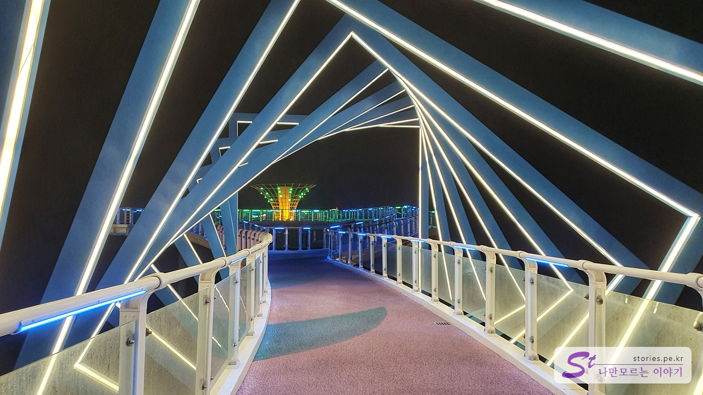

When you enter the observatory, the entrance to the pretty square sculpture is lit and welcomed.

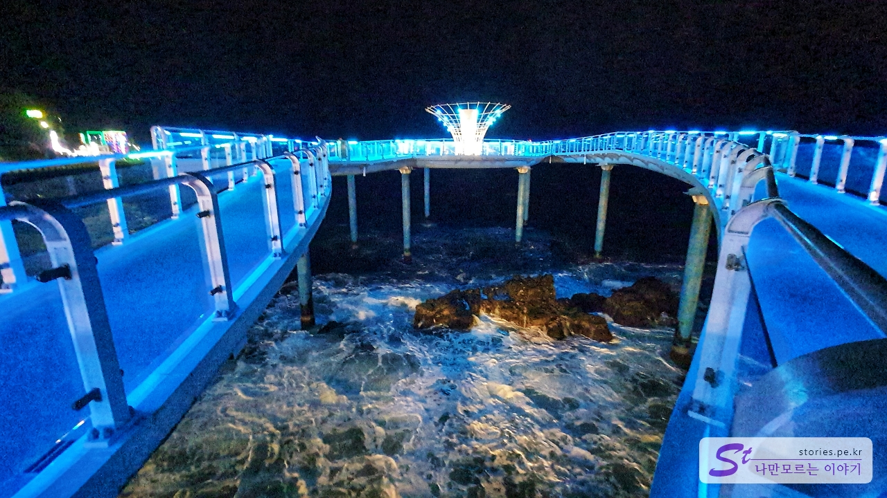

There is a stone island in the middle of the observatory road, so you can see the waves. It's dark because it's night, but you can see a cooler side with the lighting around you.

From Haerang Observatory, if you look in the direction of the Dojevigol Sky Valley, you can see a wonderful view with lights on. I'm thinking of going up to Sky Valley tomorrow.

I took some pictures of the sculpture on the way up. We'll see another side tomorrow afternoon, right?

# Sky Valley, Dochaevigol

I visited again the next morning around 10 a.m. **The way to the Dozebigol Sky Valley** is to go from the bottom as it is now, or from the top of the Mukho Lighthouse after looking around Nongoldam-gil.

We went up the road from below like we went yesterday.

You can meet an unmanned ticket office on the way. You have to book the entrance fee at the ticket office to go up. It currently costs 2,000 won per adult if you enter without riding other rides.

We paid 4,000 won for two tickets for two people.

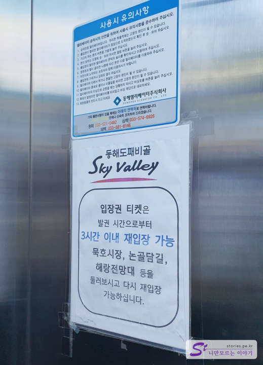

There is an elevator right next to the pillar, and you need to print the QR code of the ticket you purchased to get on. And you can leave and come back from Sky Valley within 3 hours, so you can re-enter if you visit Mukho Lighthouse, Nongoldam-gil, and Haerang Observatory.

If you take the elevator to the top, you can see the observatory right away. You can meet Super Tree sculptures, twin-shaped sculptures, and goblin sculptures. If you go to the sky observatory in front of you, the floor is made of glass, so you can look down dizzily.

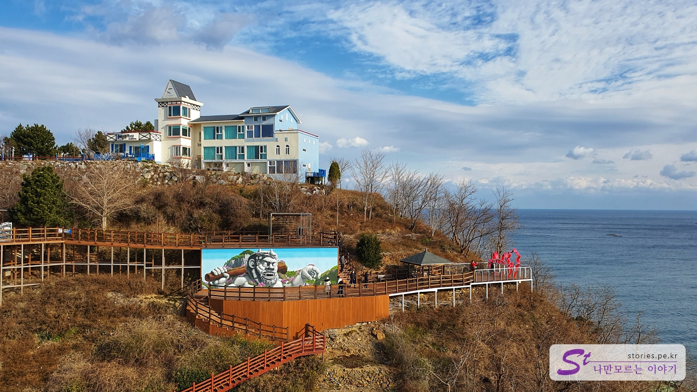

We're looking to the left. You can see the Dojabi sculpture and the observatory.

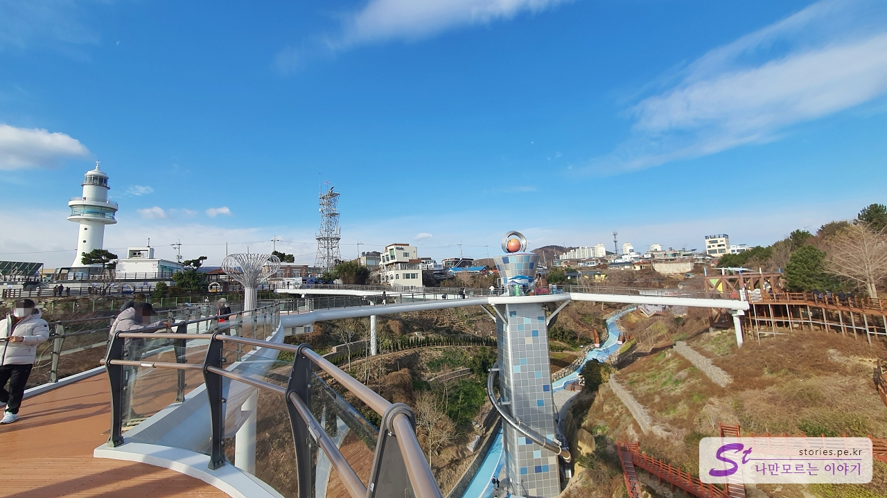

If you look back, you can see the scenery with Mukho Lighthouse. In the past, Mukho Lighthouse was more famous...

If you pay 3,000 won, you can ride the giant slide. They're saying it's scarier than I thought, but we're cold, so pass!

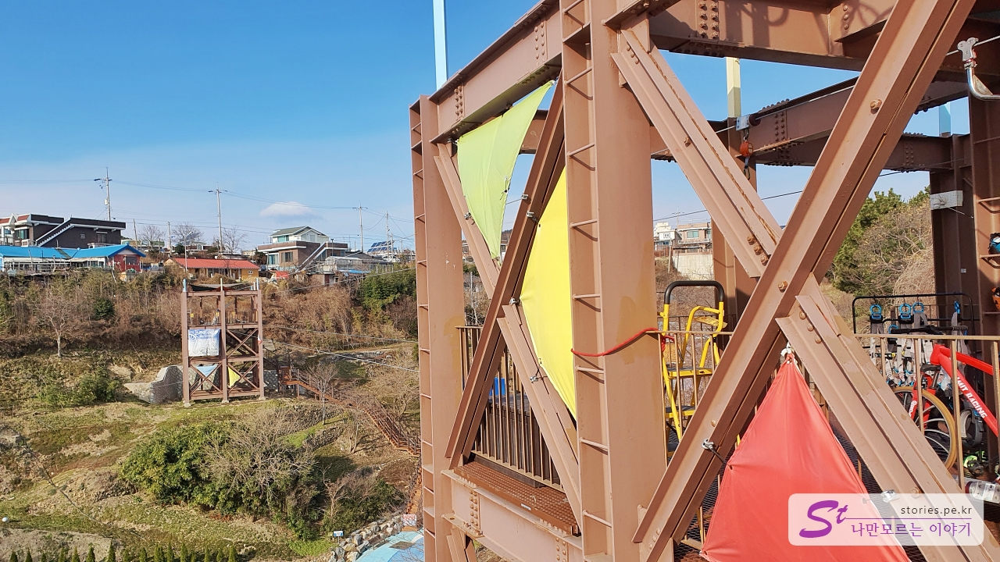

If you go to the left, you can also see the sky bike. The experience fee is 15,000 won, which is a bit expensive, but I think it would be worth a ride if you enjoy the thrill. Maybe because the weather is cold, no one is riding it. I'm a bit scared too

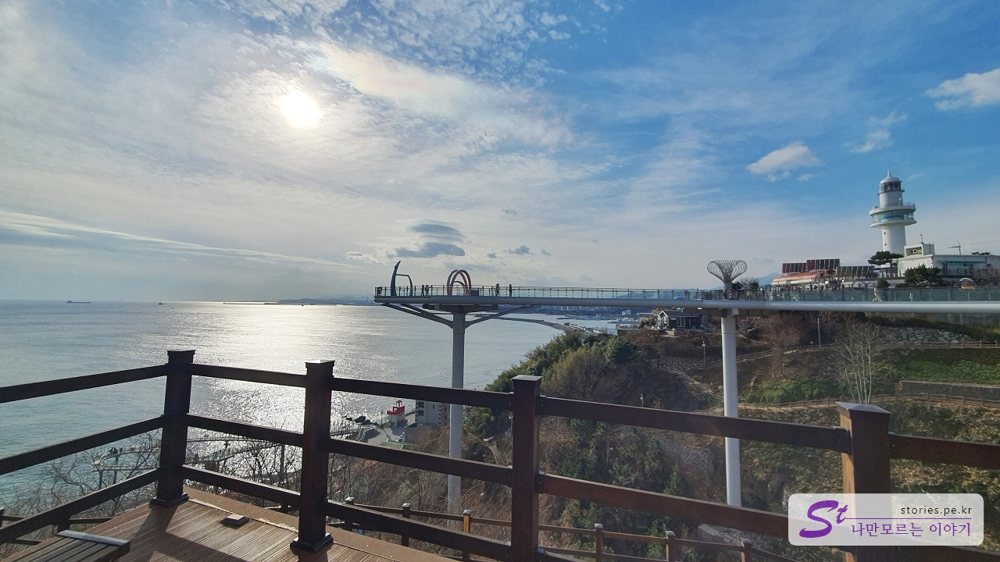

It's looking towards Mukho Lighthouse.

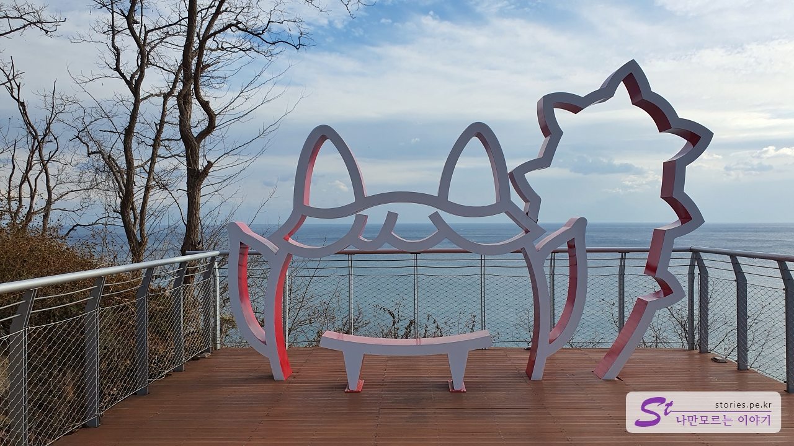

It's a cute dojabi model. It's good for taking pictures.

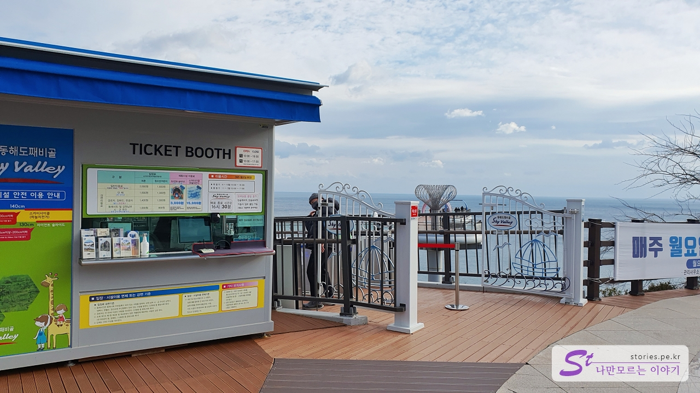

There is one more entrance below that goes to and from Mukho Lighthouse like an elevator entrance.  
If you leave here, you can meet Mukho Lighthouse right away. You can re-enter within 3 hours, so you can go out without any burden.

# Mukho Lighthouse

Before 2021, Mukho Lighthouse and Nongoldam-gil were famous tourist attractions in Mukho Port in the East Sea. The usual course was as follows.

> Mukho Port Public Parking Lot --> Nongoldam-gil --> Wind Hill --> Mukho Lighthouse  
> Now, you can assume that **Dodae Bigol Sky Valley** has been added after Mukho Lighthouse.

I'm in the opposite direction of this course, **Car park in front of Haerang Observatory --> Dozzae Bigol Sky Valley --> Mukho Lighthouse --> Nongoldam-gil --> The Hill of Wind --> Haerang Observatory**.

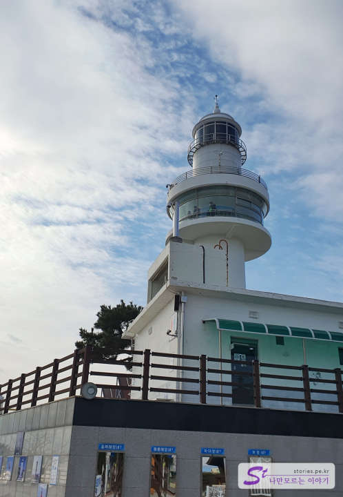

Mukho Lighthouse still serves as a lighthouse and also operates an observatory for tourists.

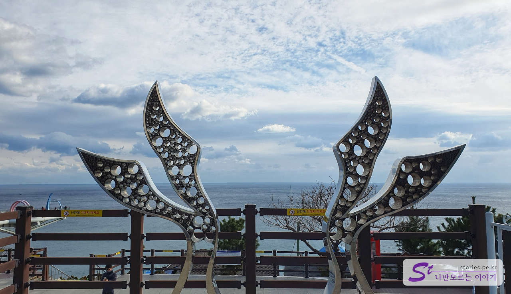

There's also a wing-shaped sculpture made of steel. If you take a picture in the middle of the sculpture, it looks like you have wings. ^^

It's an unknown photo spot. If you take a picture in a downward direction with a camera, you can take a pretty picture like this. ^^ You should always think about safety when taking pictures. It can be dangerous.

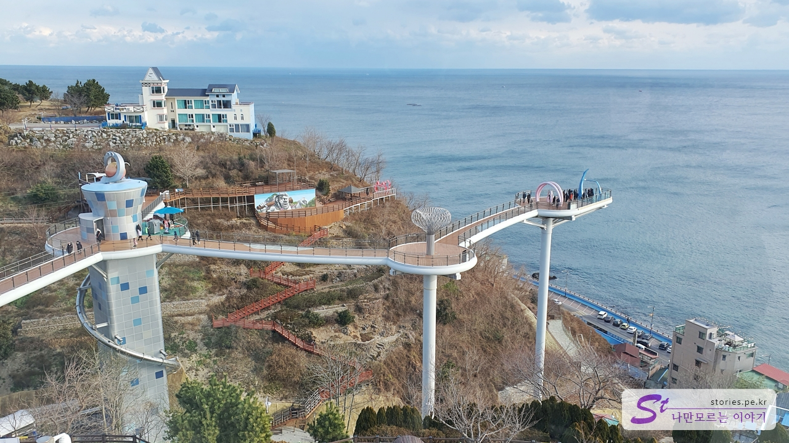

I took it from the observatory toward Sky Valley. Sky Valley across the sea is fresh.

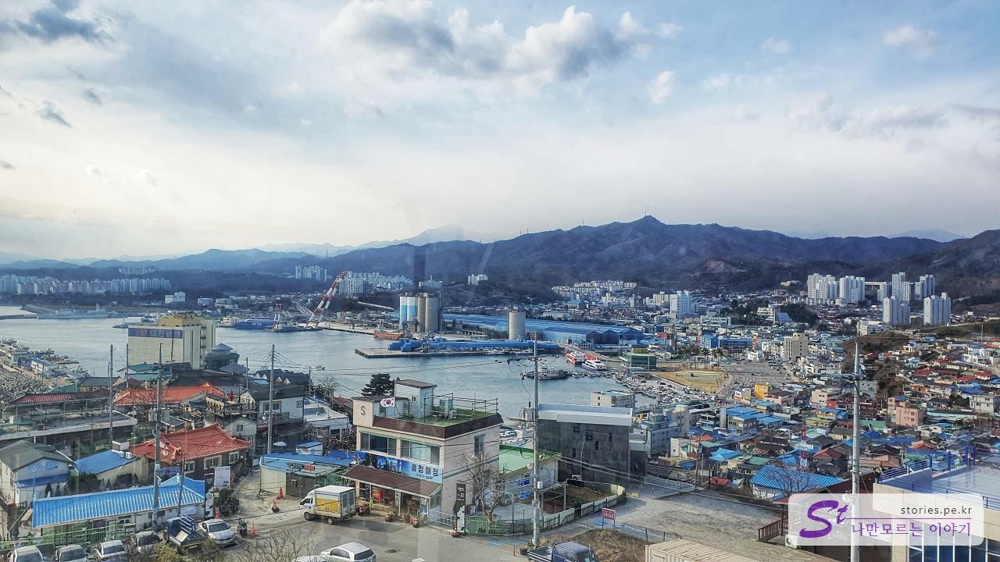

This time, I took a picture of Mukho Port on the other side. You can see a typical seaside town.

# Nongoldam-gil Road

I came down the lighthouse and walked along Nongoldam-gil this time. Nongoldam-gil is a place that was created when alley murals were popular for a long time, so it feels a little behind the trend, but it is clear that it is still a place to bring back memories.

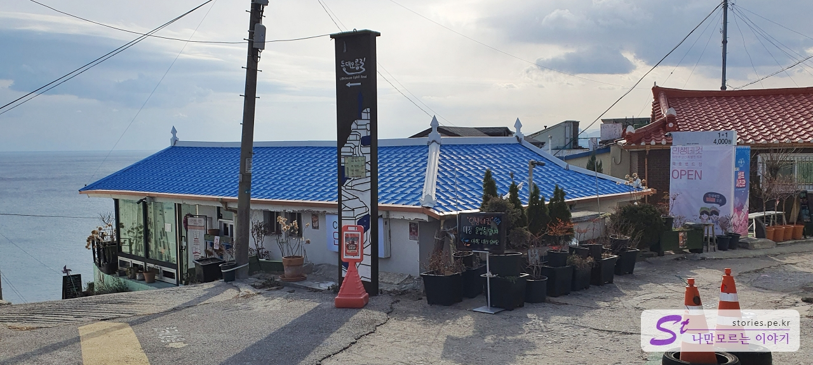

There is a possible direction to the left and a possible direction to the right. We went to the right first.

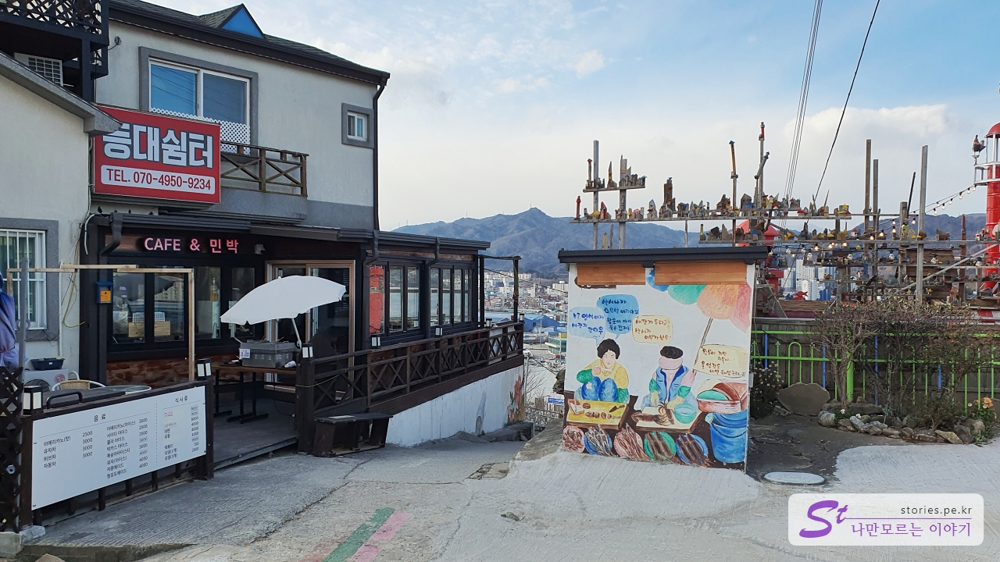

After passing the lighthouse shelter, I went down the alley and looked around. Nongoldam-gil is located in various directions, so it's good to take time to go around.

It is a store that sells and sells souvenirs while making outstanding handicrafts. It would be nice to go in and look around and buy it, right?

Usually, these kinds of murals cover the alleys. It's pretty ^^

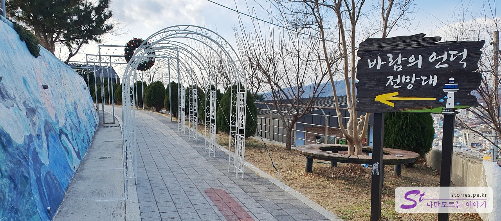

If you go down a little more, you'll see a sign to the Wind Hill Observatory. We took a moderate look at Nongoldam Road and moved toward the hill of the wind.

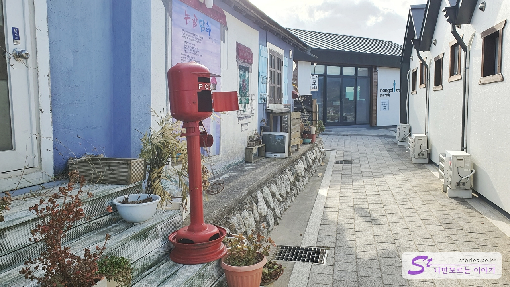

There are cafes and pensions on the hill of the wind. It's still quiet, but it's a cute and pretty landscape.

If you come back like that, you'll find **Wind Hill** and a slow mailbox. If you write a letter here and put it in, it will be delivered in about a year. It would be nice to write a letter to yourself or your lover in the future ^^

The wide square with wooden decks is the hill of the wind. I took a picture of a sculpture that says Nongoldam in English.

It's a sad statue. I made a statue of my wife and children waiting for my husband to return safely without dying.

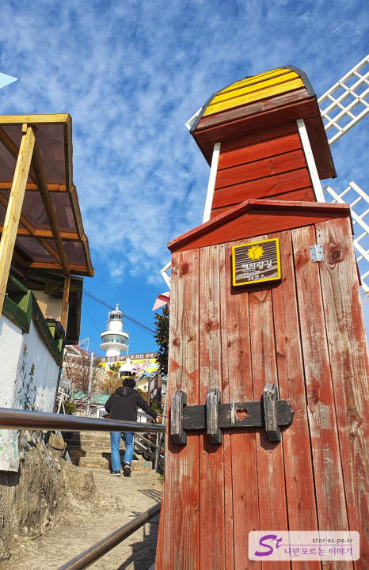

We turned around like that and came down toward the ocean observatory. The alley that comes down like this has a nice atmosphere. You can come down while looking around and taking pictures. However, since it is still a space where people actually live, you should be careful not to enter any house or too noisy.

I turned around and came down to the sun and observatory over there. I parked there.

## Cost

Admission is 2,000 won for adults and 1,600 won for teenagers/children.  
There are discounts for groups, senior citizens, and local residents.  
The experience facility is 3,000 won for Giant Slides and 15,000 won for Sky Cycles.

## Time of entry

- Operating hours
  - Summer (April to October): 10:00 to 18:00
  - Winter (November to March): 10:00 to 17:00
- Time required: About 2 hours round trip (Sky Valley, Lighthouse, Nongoldam-gil, Wind Hill)
- Closed: Closed every Monday (if Monday is a holiday, closed the next day)

## Travel destination information

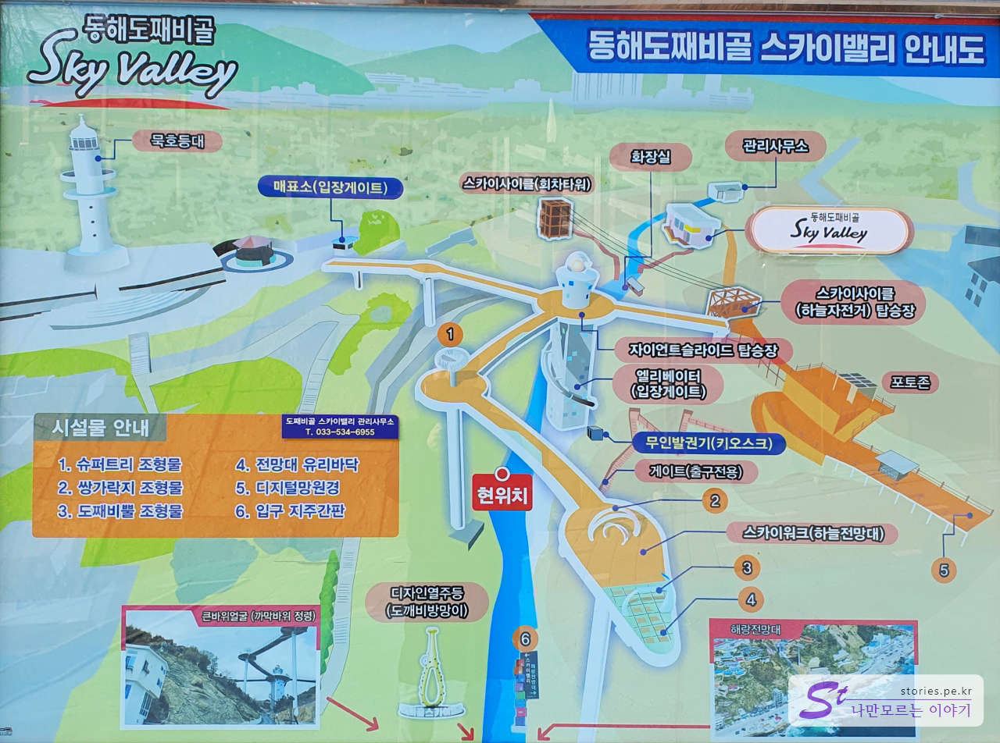

- Address: 2-109 Mukhojin-dong, Donghae-si, Gangwon-do
- Contact number: 033-534-6955

<iframe src='https://www.google.com/maps/embed?pb=!1m18!1m12!1m3!1d3163.0077313818174!2d129.1174670155725!3d37.55488163255265!2m3!1f0!2f0!3f0!3m2!1i1024!2i768!4f13.1!3m3!1m2!1s0x3561c7043cf93175%3A0x2cae625b779ec218!2z64-E7Ke467mE6rOoIOyKpOy5tOydtOuwuOumrA!5e0!3m2!1sko!2skr!4v1671784191401!5m2!1sko!2skr' class='embed-responsive-item' allowfullscreen>n></iframe>

## Parking information

You can use the public parking lot of Mukho Port or the beach parking lot near Haerang Observatory. It's free.
