동해에 새로운 관광명소가 추가되었습니다. 열심히 공사를 하더니만 2021년 5월부터 도째비골 스카이밸리를 개장했습니다. 원래는 동해하면 논골담길과 묵호등대가 관광지로 유명했으나 이제는 **도째비골스카이밸리**가 관광객에게 더 많이 알려진듯합니다.

# 해랑 전망대

저희는 숙소가 근처 망상해수욕장 앞에 있는 **동해보양온천컨벤션호텔**이라 저녁에 먼저 **해랑전망대**를 들르게 되었습니다.

> [[동해 여행]_너무나 실망스러웠던 숙소 [동해보양온천컨벤션호텔]](https://blog.stories.pe.kr/608)

해랑전망대는 산으로 올라갈 필요 없이 바다 쪽으로 뻗어있는 바닷길이라 쉽고 간단하게 돌아볼 수 있는 구간입니다. 게다가 저녁에는 조명이 켜져서 낮과는 다른 매력이 있는 곳입니다.

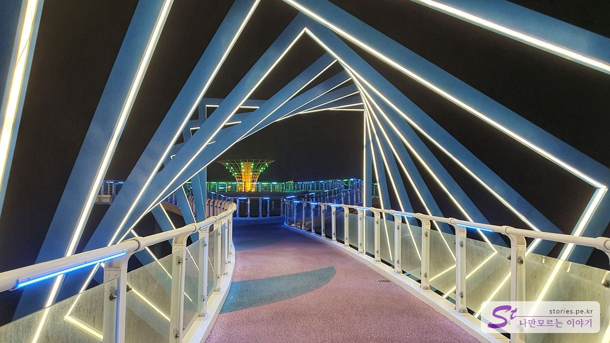

전망대에 들어서면 이쁜 사각형의 조형물 입구가 조명을 켜고 맞이해 줍니다.

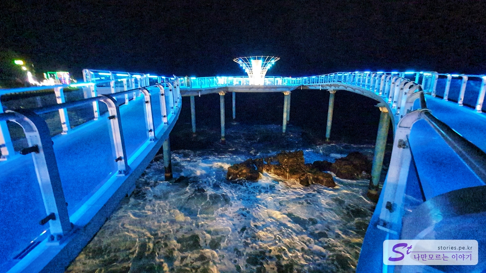

전망대 길의 가운데는 돌섬이 있어서 파도가 치는 모습을 볼 수 있습니다. 밤이라 어둡지만 주위의 조명으로 더 멋있는 모습을 볼 수 있습니다.

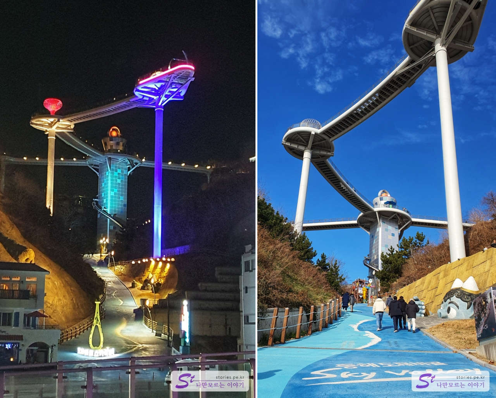

해랑전망대에서 도째비골 스카이밸리 방향으로 쳐다보면 조명이 켜져 있는 멋진 풍경을 볼 수 있습니다. 내일은 저기 위의 스카이밸리로 올라가 볼 생각입니다.

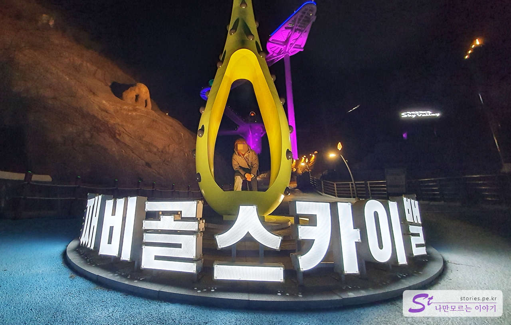

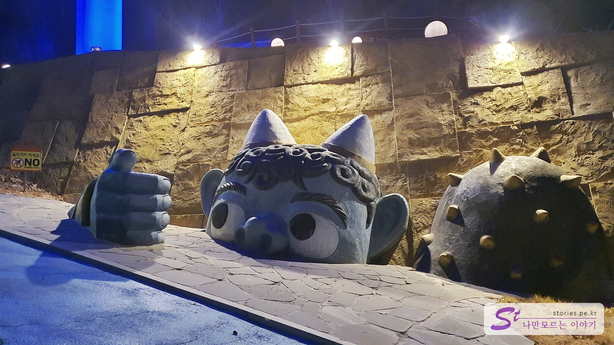

올라가는 길목에 있는 조각상에서 잠깐 사진을 몇 장 찍어봤습니다. 내일 낮에는 또 다른 모습을 볼 수 있겠지요?

# 도째비골 스카이밸리

다음날 아침 10시쯤 다시 방문했습니다. **도째비골스카이밸리**로 가는 길은 지금처럼 아래에서 가는 방법이 있고 논골담길 구경 후 묵호 등대가 있는 윗쪽에서 가는 방법도 있습니다.

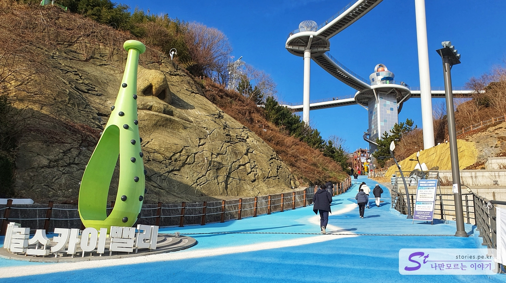

저희는 어제 갔던 것처럼 아래에서 길을 따라 올라갔습니다.

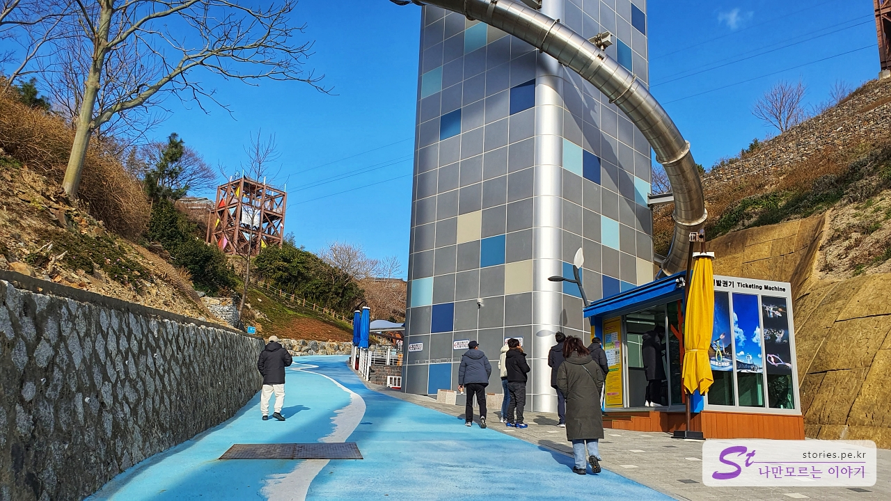

가다 보면 무인 매표소를 만날 수 있습니다. 매표소에서 입장료를 예매해야 올라갈 수 있습니다. 다른 놀이 기구를 타지 않고 입장만 한다면 어른은 현재 인당 2,000원이 소요됩니다.

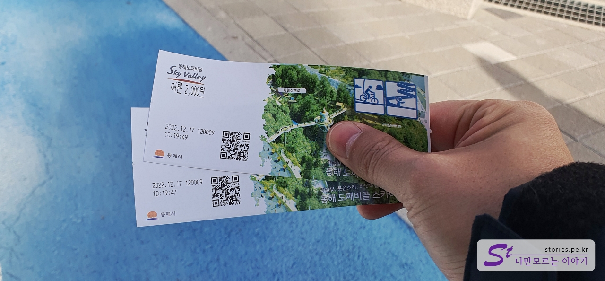

저희는 2명이라 4,000원을 내고 입장권 2장을 구매했습니다.

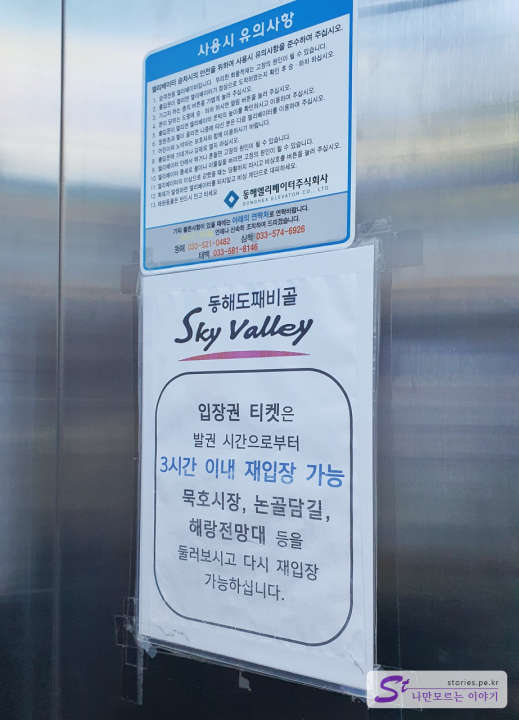

바로 기둥 쪽에 엘리베이터가 있는데 구입한 입장권의 QR코드를 찍어야 탑승을 할 수 있습니다. 그리고 3시간 이내로는 스카이밸리를 나갔다가 다시 들어올 수 있으므로 묵호등대, 논골담길, 해랑 전망대 등을 구경하고 오셔도 재입장이 가능합니다.

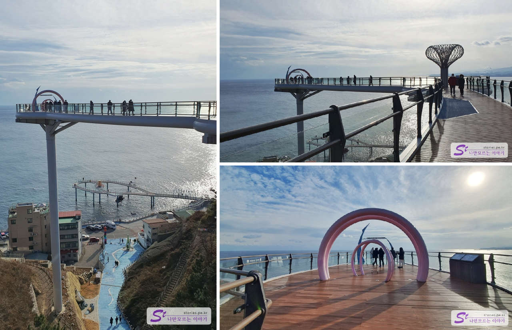

엘리베이터를 타고 꼭대기에 도착을 하면 바로 전망대를 볼 수 있습니다. 슈퍼 트리 조형물과 쌍가락지조형물, 도깨비뿔조형물을 만날 수 있습니다. 앞쪽에 하늘 전망대로 가보면 바닥이 유리로 되어있아 아찔하게 아래를 볼 수도 있습니다.

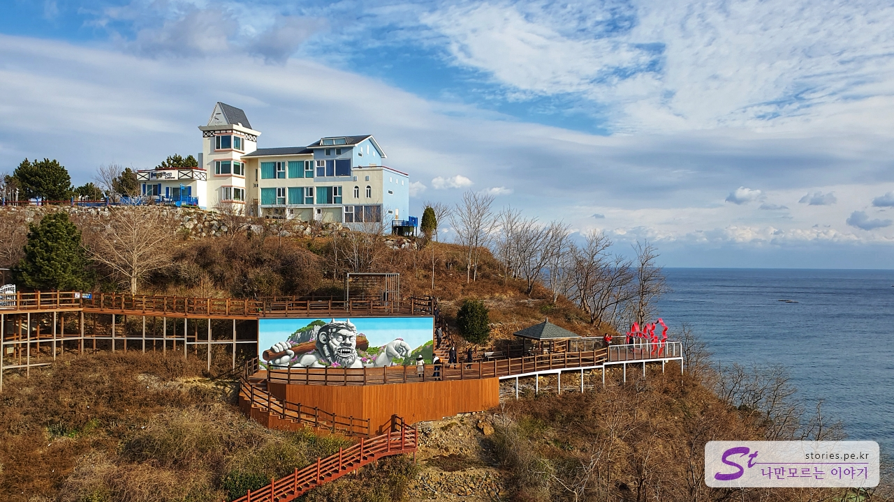

왼쪽을 본 모습입니다. 도째비 조형물과 전망대를 볼 수 있네요.

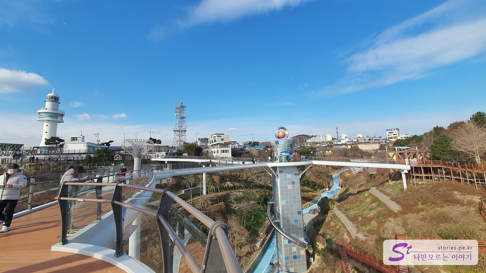

뒤를 돌아보면 묵호등대가 있는 풍경을 볼 수 있습니다. 예전에는 묵호등대가 더 유명했었는데...

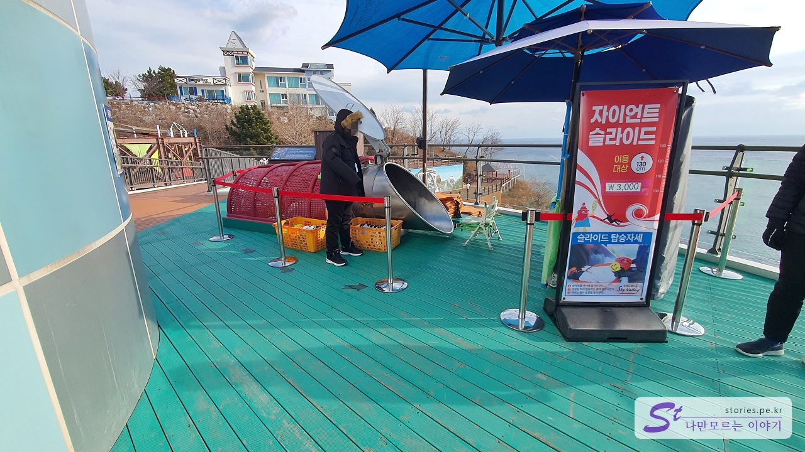

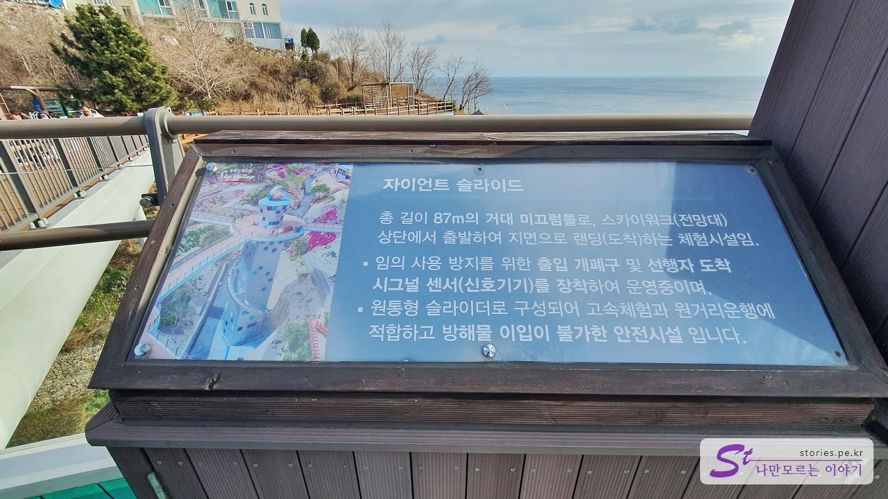

비용 3,000원을 지불하면 자이언트 슬라이드를 탈 수 있습니다. 생각보다 무섭다고 하는데, 저희는 추워서 패스~

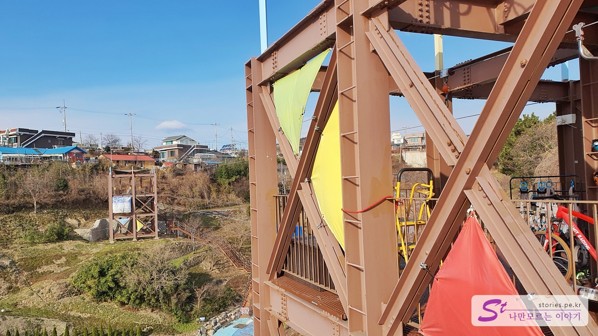

왼쪽으로 가보면 하늘자전거도 볼 수 있습니다. 체험비가 15,000원으로 다소 비싼 감은 있지만 스릴을 즐기는 사람이라면 한번 타볼만할 것 같습니다. 날씨가 추워서 그런지 타는 사람은 없네요.. 무섭기도 하고ㅎㅎㅎ

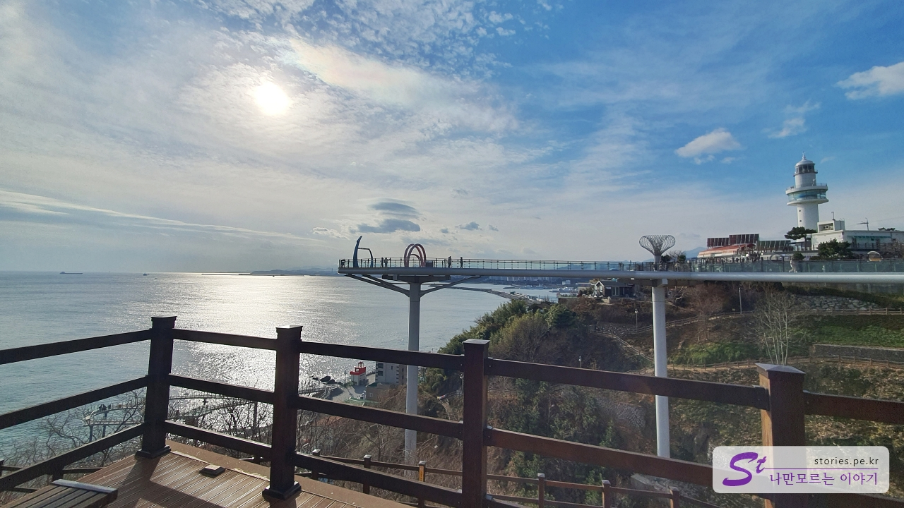

묵호등대 쪽을 바라본 모습입니다.

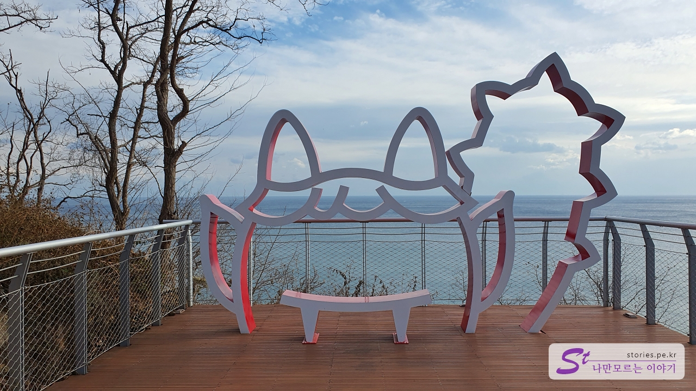

귀여운 도째비 모형입니다. 사진 찍기에 좋게 되어 있네요.

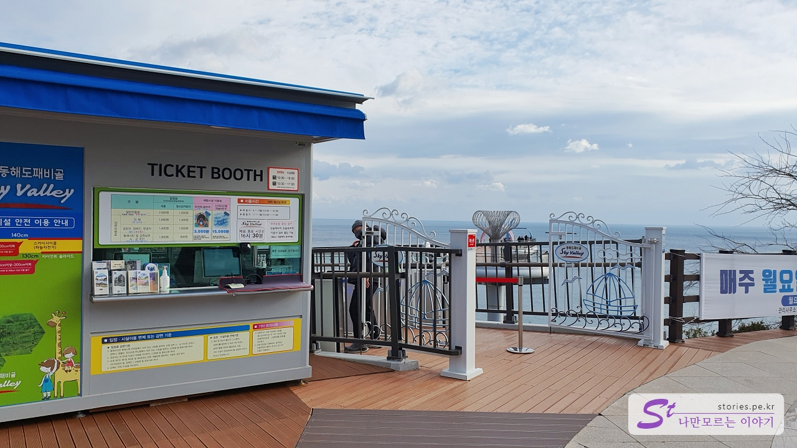

아래에 엘리베이터를 타는 출입구처럼 묵호등대 쪽으로 오갈 수 있는 출입구가 하나 더 있습니다.  
여기를 나가면 바로 묵호등대를 만날 수 있습니다. 3시간 이내라면 다시 재입장이 가능하니 부담 없이 나가볼 수 있습니다.

# 묵호등대

2021년 이전만 하더라도 동해 묵호항에서 유명한 관광지로는 묵호등대와 논골담길이였습니다. 보통 코스는 아래와 같았습니다.

> 묵호항 공영주차장 --> 논골담길 --> 바람의 언덕 --> 묵호등대  
> 지금은 묵호등대 다음에 **도째비골스카이밸리**가 추가되었다고 보시면 됩니다.

저는 이 코스의 반대 방향인 **해랑전망대앞 주차장 --> 도째비골스카이밸리 --> 묵호등대 --> 논골담길 --> 바람의 언덕 --> 해랑전망대** 입니다.

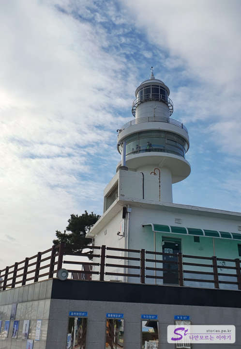

묵호등대는 현재도 등대의 역할을 하면서도 관광객을 위한 전망대도 운영을 하고 있습니다.

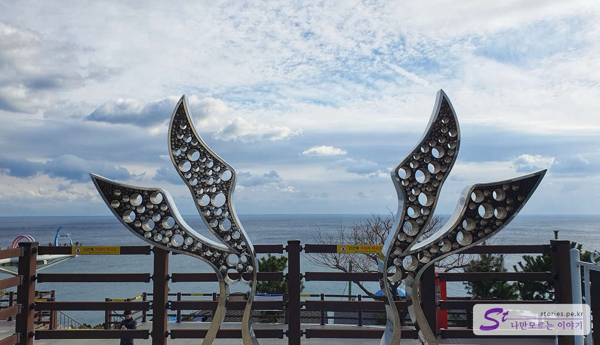

스틸로 만든 날개 모양의 조형물도 있네요. 조형물 가운데서 사진을 찍으면 마치 날개를 단것 같은 사진이 연출됩니다. ^^

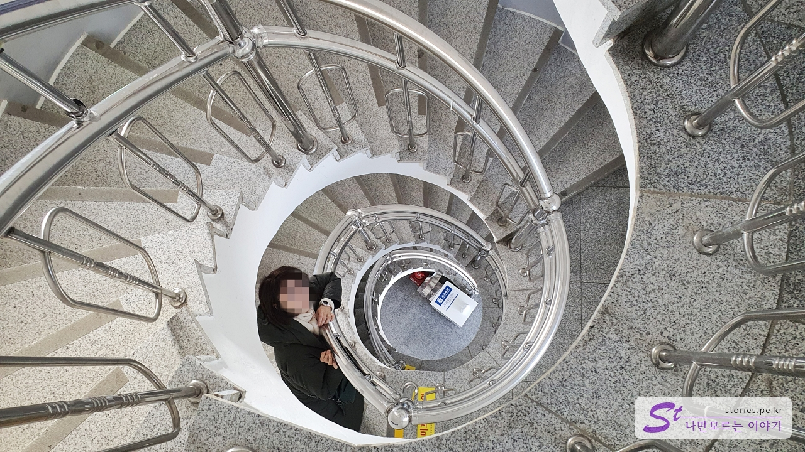

잘 알려져 있지 않은 포토스팟입니다. 카메라로 아래 방향으로 사진을 찍으면 이렇게 이쁜 사진이 찍혀요 ^^ 사진 찍을 때 항상 안전을 생각하셔야 합니다. 위험할 수 있어요.

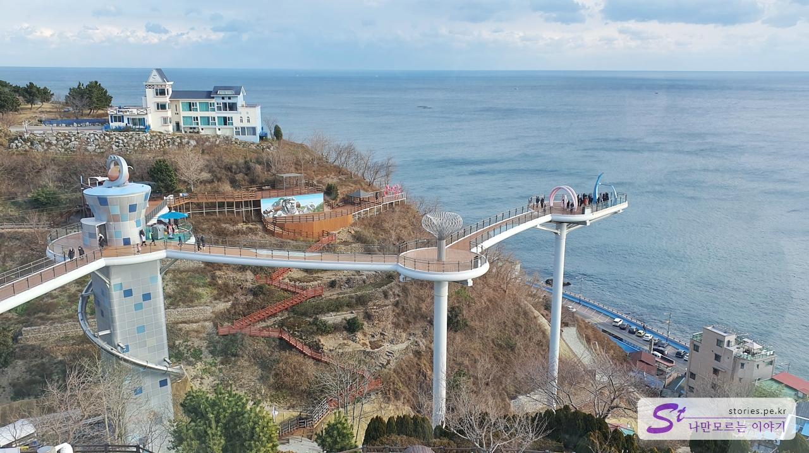

전망대에서 스카이밸리 방향으로 찍어봤습니다. 바다에 걸쳐있는 스카이밸리가 신선하네요.

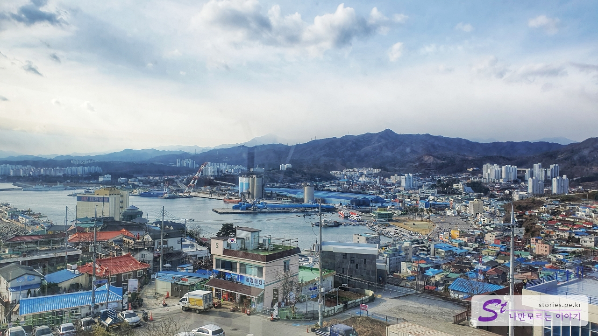

이번에는 반대쪽 묵호항도 찍어봤습니다. 전형적인 바닷가 마을의 모습을 볼 수 있네요.

# 논골담길

등대를 내려와서 이번에는 논골담길을 걸어봤습니다. 논골담길은 한참 골목길 벽화가 유행할 때 생겨난 곳이라 약간 유행에는 뒤처진 느낌이 나지만 그래도 아직 추억을 되살릴 수 있는 장소임에는 분명합니다.

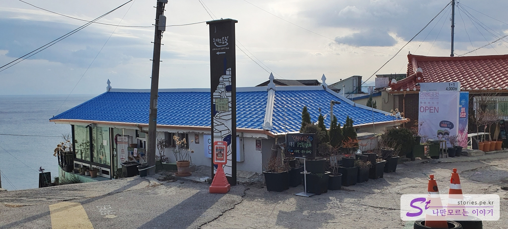

왼쪽으로 가능 방향과 오른쪽으로 가능 방향이 있습니다. 저희는 오른쪽으로 먼저 갔습니다.

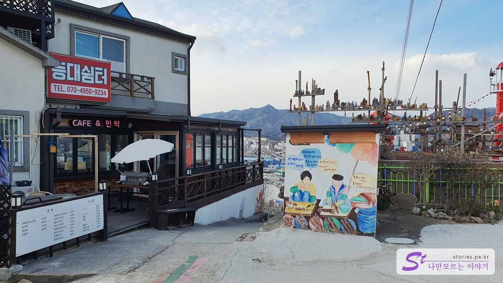

등대 쉼터를 지나서 골목으로 내려가면서 구경을 하였습니다. 논골담길이 방향이 여러 곳이라 시간을 가지고 여기저기 다녀보면 좋습니다.

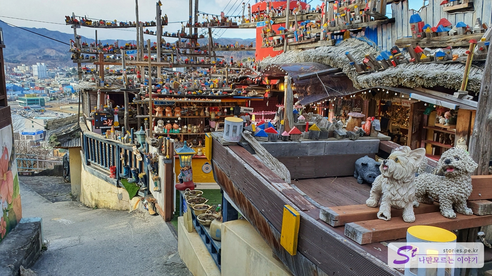

눈에 띄는 수공예품을 만들면서 팔기도 하고 기념품도 파는 상점입니다. 한번 들어가서 구경도 하고 구매도 하면 좋겠지요?

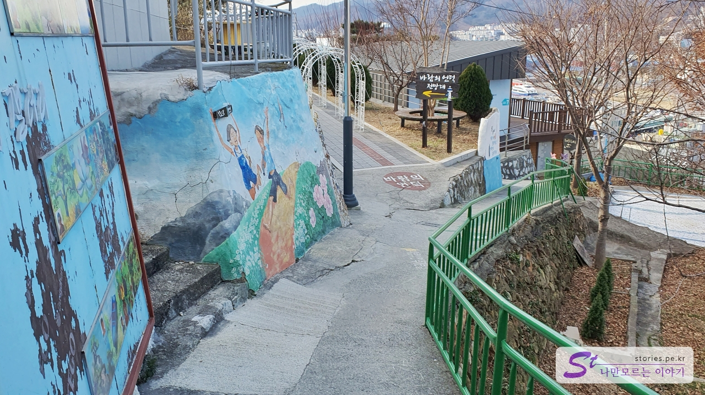

보통 이런 식의 벽화들이 골목길을 덮고 있습니다. 이뻐요 ^^

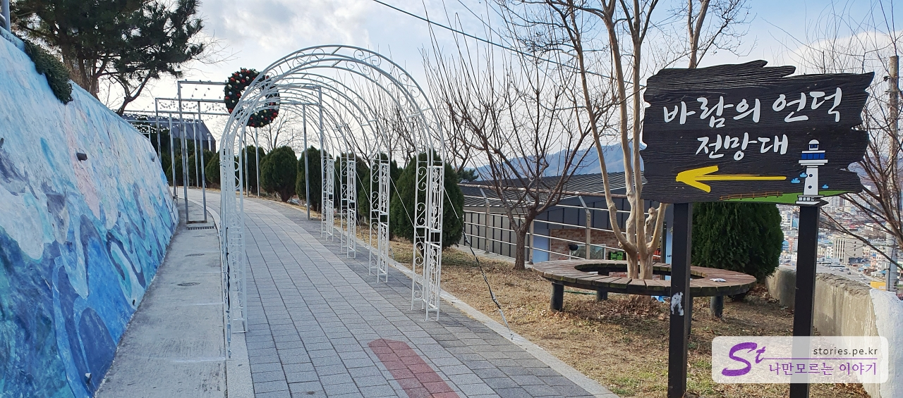

조금 더 내려오면 바람의 언덕 전망대로 가는 이정표가 나옵니다. 저희는 논골담길을 적당히 구경하고 바람의 언덕 방향으로 이동했습니다.

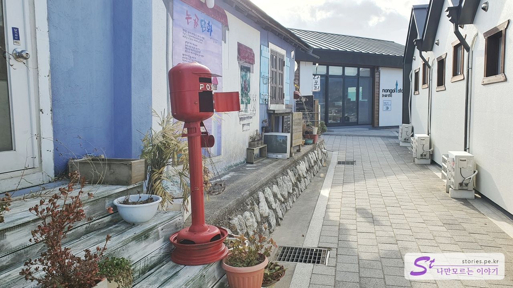

바람의 언덕에 카페도 있고 펜션도 있습니다. 아직은 한산하지만 아기자기하고 이쁜 풍경입니다.

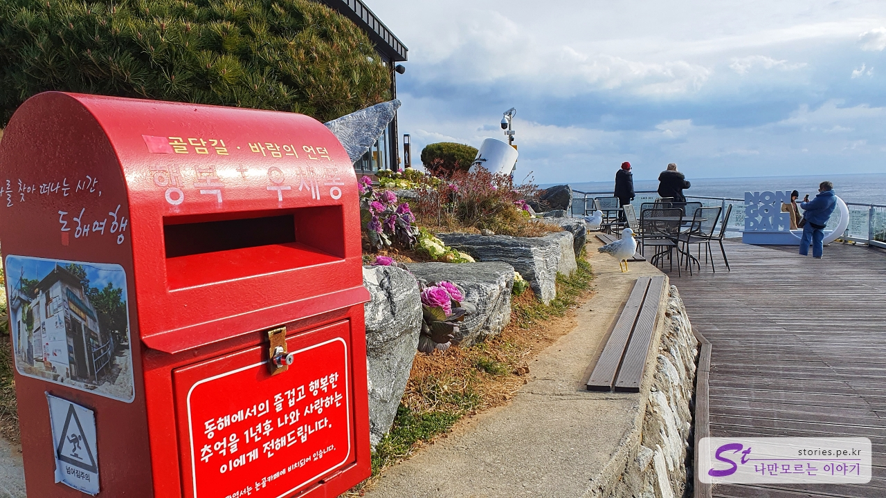

그렇게 돌아 나오면 **바람의 언덕**이 나오고 느릴 우체통도 나옵니다. 여기에 편지를 써서 넣으면 1년 후쯤에 배달이 됩니다. 미래의 본인이나 연인에게 편지를 한번 써 보는 것도 좋겠지요 ^^

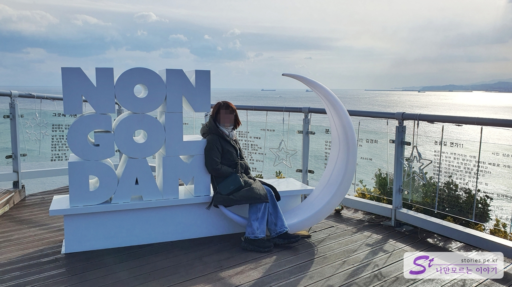

나무데크로 되어 있는 넓은 광장이 바람의 언덕입니다. 영어로 논골담이라고 쓰여있는 조형물에서 사진 한번 찍어봤습니다.

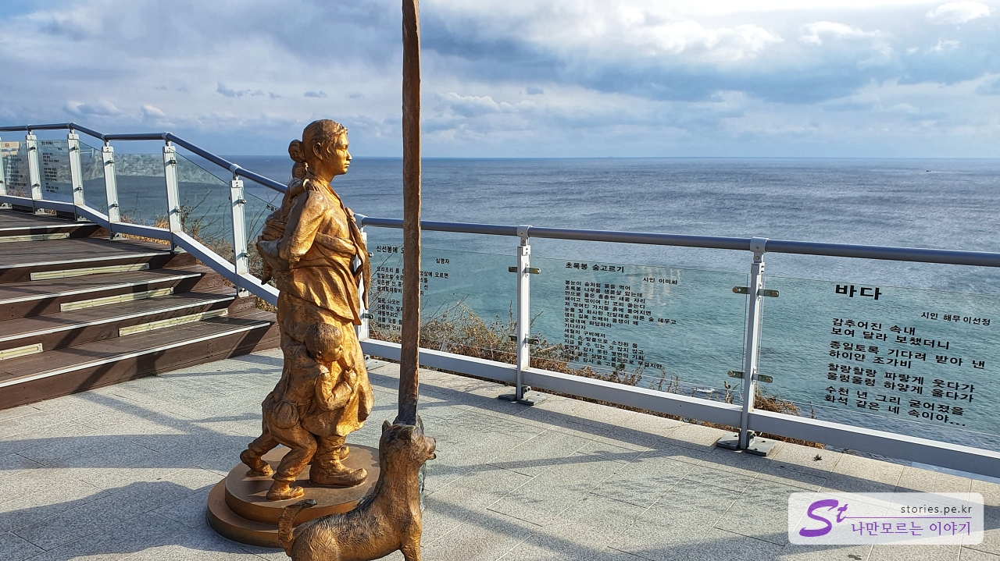

서글픈 동상입니다. 바다로 나간 남편이 죽지 않고 무사히 돌아오기만을 염원하며 기다리는 아내와 아이들을 동상으로 만들어놨네요.

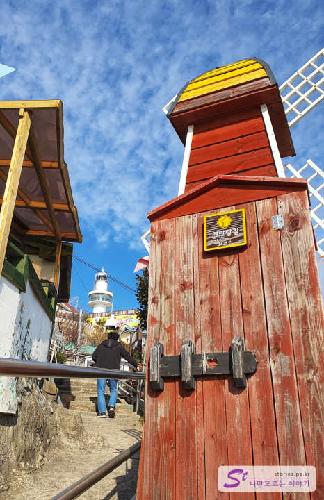

저희는 그렇게 돌아서 해랑 전망대 방향으로 내려왔습니다. 이렇게 내려오는 골목도 나름 운치가 좋습니다. 많이 구경하고 사진을 찍으면서 내려올 수 있습니다. 다만 아직도 사람들이 실제로 사는 공간이기 때문에 너무 시끄럽거나 아무 집에 들어가지 않도록 조심은 해야 합니다.

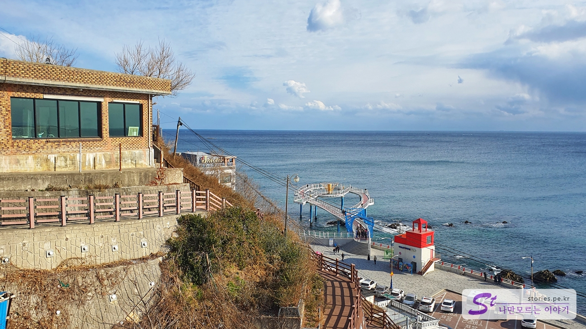

그렇게 돌아서 저기 보이는 해랑 전망대 쪽으로 내려왔습니다. 그곳에 주차를 해놨거든요.

## 비용

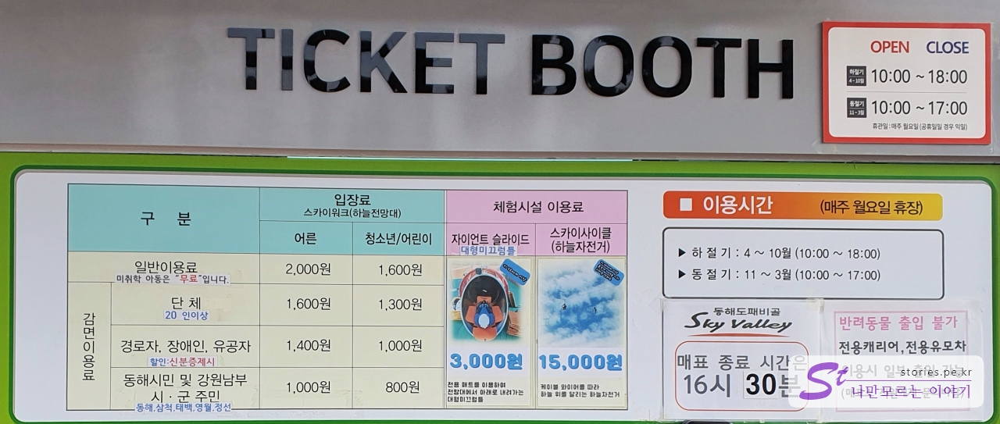

입장료는 어른 2,000원, 청소년/어린이가 1,600원입니다.  
단체나 경로자, 지역주민은 할인이 됩니다.  
체험시설은 자이언트 슬라이드가 3,000원, 스카이 사이클이 15,000원입니다.

## 입장시간

- 운영시간
  - 하절기 (4월 ~ 10월) : 10:00 ~ 18:00
  - 동절기 (11월 ~ 3월) : 10:00 ~ 17:00
- 소요시간 : 왕복 약 2시간 정도 소요 (스카이밸리, 등대, 논골담길, 바람의 언덕)
- 휴무일 : 매주 월요일 휴장(월요일이 공휴일인 경우 다음날 휴장)

## 여행지 정보

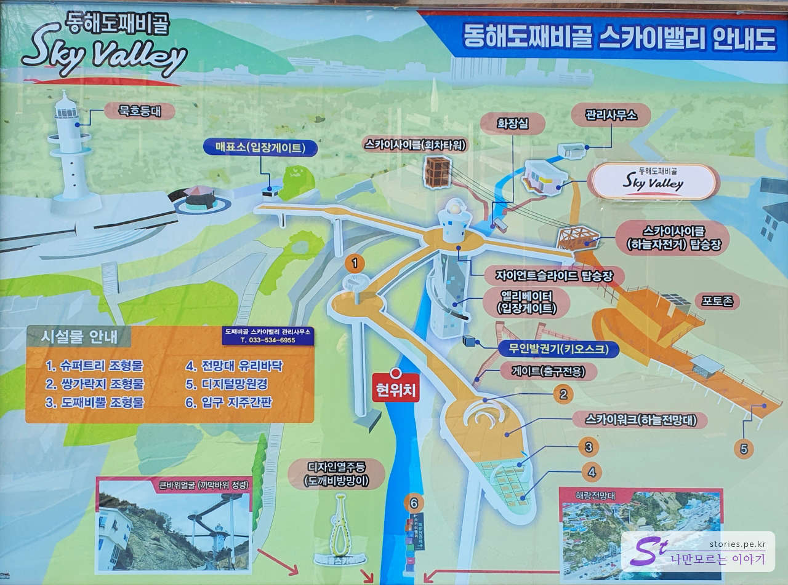

- 주소 : 강원 동해시 묵호진동 2-109
- 연락처 : 033-534-6955

<iframe src='https://www.google.com/maps/embed?pb=!1m18!1m12!1m3!1d3163.0077313818174!2d129.1174670155725!3d37.55488163255265!2m3!1f0!2f0!3f0!3m2!1i1024!2i768!4f13.1!3m3!1m2!1s0x3561c7043cf93175%3A0x2cae625b779ec218!2z64-E7Ke467mE6rOoIOyKpOy5tOydtOuwuOumrA!5e0!3m2!1sko!2skr!4v1671784191401!5m2!1sko!2skr' class='embed-responsive-item' allowfullscreen></iframe>

## 주차정보

묵호항 공영주차장이나 해랑전망대 쪽의 바닷가 주차장을 이용하시면 됩니다. 무료입니다.
