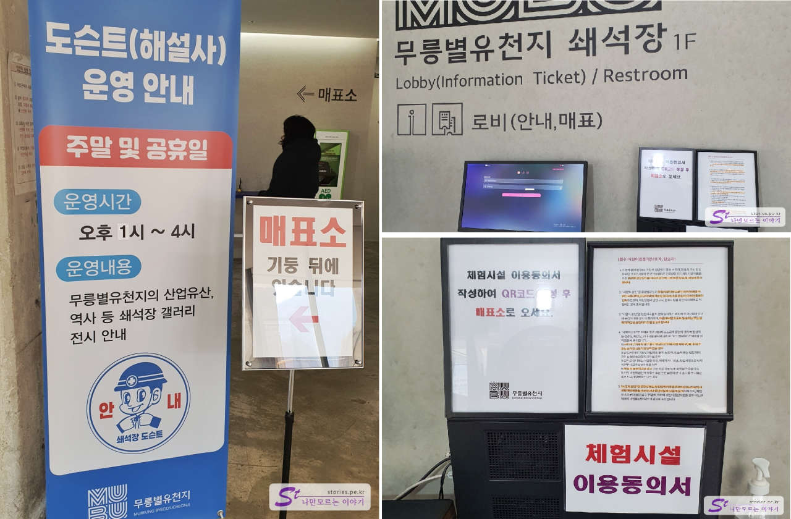
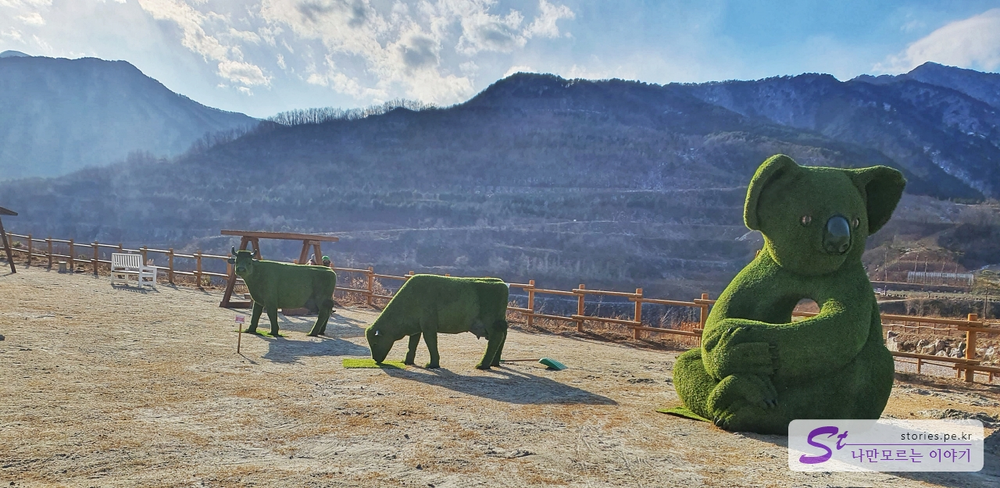
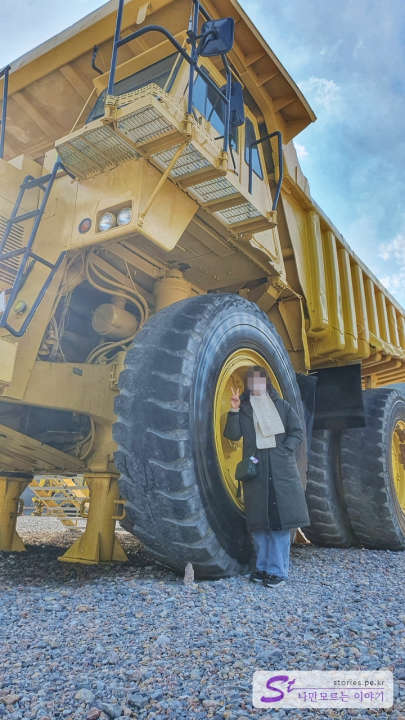
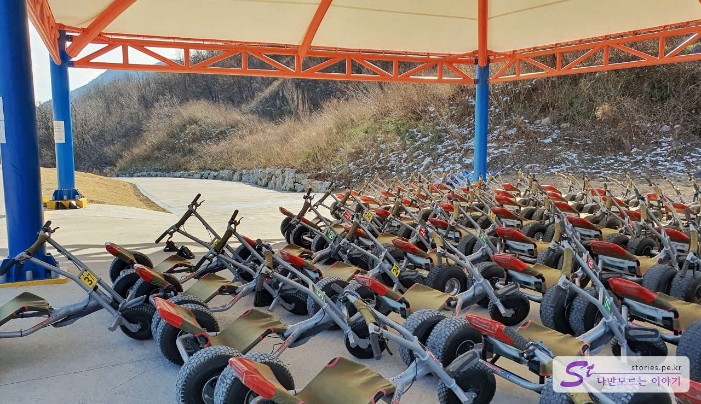
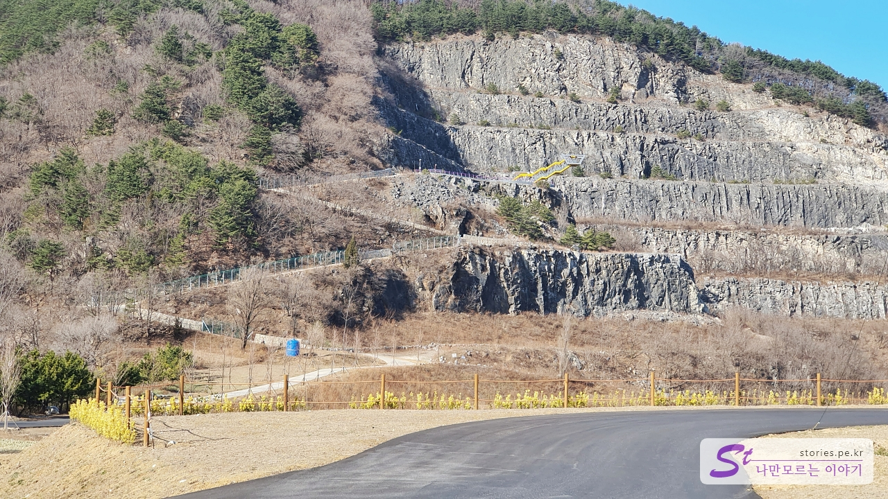
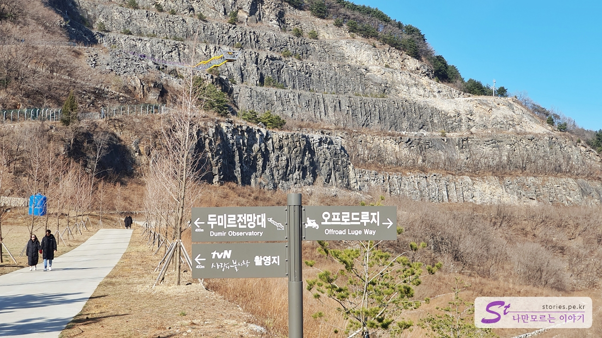
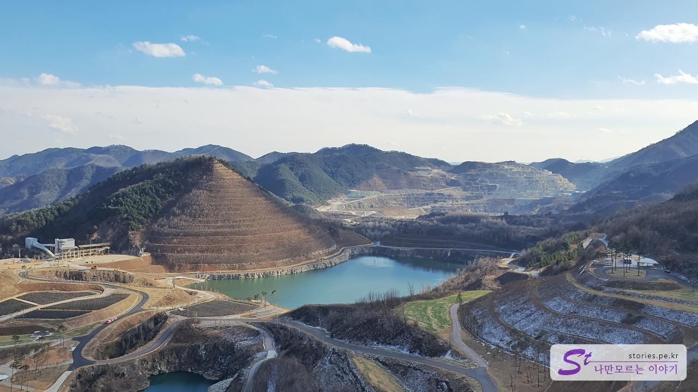
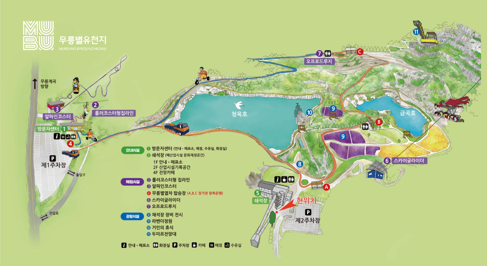
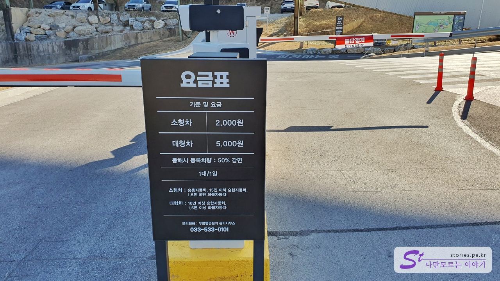

Ssangyong C&E, which had been mining limestone since the 1960s, has donated this place to Donghae City since the mining ended, and Donghae City has built various experience facilities and decorated it as a tourist destination. It started operating last year and started to gain popularity by appearing on various broadcasts this year. Free trains and buses operate regularly, 150 times the size of the soccer field.

# MureungbyulYucheonji

**MureungbyulYucheonji** has a total of 2 parking lots and we parked in parking lot 2 with a crushed stone yard.

You can find the floor information of this building by parking and moving to the entrance of the crate. Entering the parking lot is a multimedia hall with two basement floors, the first floor is a lobby, the second floor is a gallery, and the fourth floor is an observation cafe selling cement ice cream.

There is a graffiti-like mural at the entrance to the second basement floor. It's a collaboration of a famous artist.

On the second basement floor, there is a multimedia hall, which shows various videos about quarrying on TV.  
You can go to the lobby on the first floor through the stairs or take the elevator to the first floor.

You can buy tickets on the first floor. The docent is also open on crowded days such as weekends and holidays.  
You must fill out the consent form to use the experience facility. The experience facilities can be a little dangerous, so I think I'm getting consent.

If you enter without experience, you can pay between 4,000 won and 6,000 won per person. Tickets are worn on the wrist, but you don't have to wear them on the wrist. When you go out of the exit, you just need to print the QR code on the ticket when you enter.  
And if you have an entrance ticket, you can board a train or bus by Mureung.

If you go out of the entrance and look back, you can see the crushed stone building that we came out of. If you look around, you can see a variety of landscapes even though they are desolate.

You can see them trying to make the devastated landscape even a little green. We've laid the grass and made veal and koala-shaped topiary.

The quarry equipment is displayed right behind, but the truck wheels are bigger than humans.

## Dumir Observatory

Now you have to move to see **Dumir Observatory** from a crushed stone yard. I can walk, but it's quite far away, so I decided to take the Mureung Star train rather than walking. If you entered, you can ride it for free, so you don't have to walk. The train goes back and forth every 20 to 30 minutes.

It takes about 5 minutes by train and goes to the last stop, station C. Stop C is the starting point of the off-road luge and the stop to get to the Dumir Observatory.

We're not going to take the luge, so we have to go to the Dumir Observatory on the other side. It's a long distance.

If you go a little further, you will see a sign that says you know the way. We're going towards the Dumir Observatory.  
It's **Dumir**, not **Dumir**. If you know it half-heartedly, everyone says it's a crane observatory. (Laughing)  
It's not an easy road because you have to climb the slope by mountain, not flat land.

I finally came up to the observatory after a hard walk. You can see the Dumir Observatory.

Ssangyong C&E used it as a quarry and donated the quarry and named it Dumir as a token of gratitude. Dumir is said to speak pure Korean for SsangYong. **Du(two) + Mir(dragon)** I guess it's something like that.

You can go up to the observatory and see the view, but the view is not as good as you think because of the pillars.

This is \*\*Geumgok Lake from the observatory.

It's a full view. If you look at it like this, it's such a wonderful view. If you look on the right side of the picture, it is the Mureung Star Train C stop that we got off.

## cement ice cream

Take the Mureungbyeol train again and go up to the fourth floor of the building.\*\* There is a cafe on the 4th floor and they sell their signature cement ice cream.

There is an observation cafe on the 4th floor of the clavicle and a place where you can relax while drinking ice cream or drinks. There are wide windows all over the place and you can go out to the terrace outside the glass.

The store is not as big as I thought. There's also one operator. We also sell drinks and simple cookies here. And we also sell cement ice cream.

This is cement ice cream. The color must have been black sesame. There will be more dislikes if you sell ice cream of this color in the market, but it has become a signature ice cream since it is a quarry. I put a marshmallow on it, and the spoon that scoops ice cream is shaped like a shovel. LOL The price is 6,500 won, which is more expensive than I thought.

## Cost

The cost is largely divided into admission fees and experience facility fees, and the entrance fee is 4,000 won per person during the off-season and 6,000 won during the peak season. There are people eligible for a discount, so please refer to the picture above.  
Experience facilities include **Facilities One-time Ticket** and **Integrated Use Ticket** where you can use several things together.

## Operating hours

- Operating hours: 10:00 to 17:30
- Closed: Every Monday (if Monday is a public holiday, it is not the next public holiday)

## Travel destination information

The complex has parking lot 1 and 2 and parking lot 2 is directly connected to the crushed stone. In the center, there are two lakes, Cheongok Lake and Geumgok Lake.
The Mureung-specific train or bus, which is free to board when entering, runs round-trip every 20 to 30 minutes, so you can easily move experience facilities and viewing facilities.

### Experience facilities

There are four experience facilities and trains by Mureung.
Roller-coaster zip lines, alpine coasters, and off-road luge are more accessible than parking in parking lot 1.

- (1st parking lot) Roller coaster-type zip line: Experience facilities that hang from rails and ride down without power
- (1 Parking Lot) Alpine Coaster: Experience facility that descends on two rails by cart
- (1st parking lot) Off-road luge: Experience facilities that come down off-road in a non-powered cart
- (2nd parking lot) Sky Glider: The most representative experience facility on the broadcast, and the experience facility where four people board at the same time and hang down from the rope

### Spectator facilities

The viewing facilities include a quarry equipment display, lavender garden, giant rest, and Dumir Observatory, and parking in the second parking lot is accessible.

- Address: Igi-ro 97 (Samhwa-dong), Donghae-si, Gangwon-do, Yucheon-ji by Mureung
- Contact point: 033-533-0101
- - URL : https://dh.go.kr/tour/mubu
  

  <iframe src='https://www.google.com/maps/embed?pb=!1m18!1m12!1m3!1d3166.6134663725534!2d129.02982161557085!3d37.46984733741662!2m3!1f0!2f0!3f0!3m2!1i1024!2i768!4f13.1!3m3!1m2!1s0x3561bd8ae6d8f651%3A0x3537eb8a3e9a197f!2z66y066aJ67OE7Jyg7LKc7KeA!5e0!3m2!1sko!2skr!4v1672115627505!5m2!1sko!2skr' class='embed-responsive-item' allowfullscreen></iframe>
  

## Parking information

The parking lot consists of parking lot 1 and 2 and is operated for a fee. We went to parking lot 2.
**If you're planning to experience an Alpine Coaster, Roller Coaster zip line, or Off-road Luge, you'd better go to Parking Lot 1**, and **If you're going for Sky Glider or viewing, you'd better go to Parking Lot 2**.

The parking fee is 2,000 won for a private car. There is a parking fee adjuster on B2F, so you can pay indoors or in the parking lot. It's all unmanned.

## a good restaurant nearby

> [DONGHAE's famous restaurant, Chodang Jjolmyeon Soft Tofu](https://blog.stories.pe.kr/610)
