1960년대부터 석회석을 채광하던 쌍용C&E가 현재 채광이 종료되어 이 장소를 동해시에 기부채납했고 동해시에서는 이 장소를 그냥 매립하는 것이 아니라 다양한 체험시설을 만들어 관광지로 꾸며놓은 곳이 있습니다. 작년에 운영을 시작했고 올해 다양한 방송에 나오면서 인기를 끌기 시작했습니다. 축구장 150배 면적의 크기로 무료 열차와 버스가 주기적으로 운영을 하고 있습니다.

# 무릉별유천지

**무릉별유천지**는 총 2개의 주차장이 있고 저희는 쇄석장이 있는 제2 주차장에 주차를 했습니다.

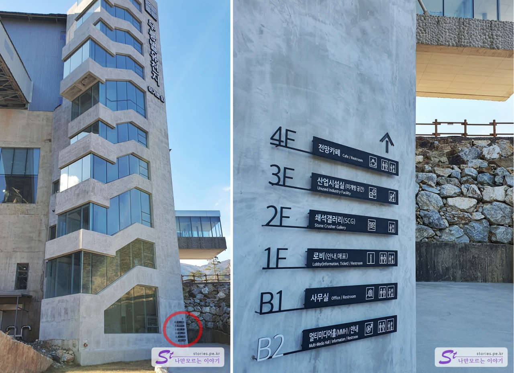

주차를 하고 쇄석장 입구로 이동하면 이 건물의 층 정보를 알 수 있습니다. 주차장으로 들어가는 위치가 지하 2층인 멀티미디어홀이고 1층이 로비, 2층이 갤러리, 4층이 시멘트 아이스크림을 파는 전망 카페입니다.

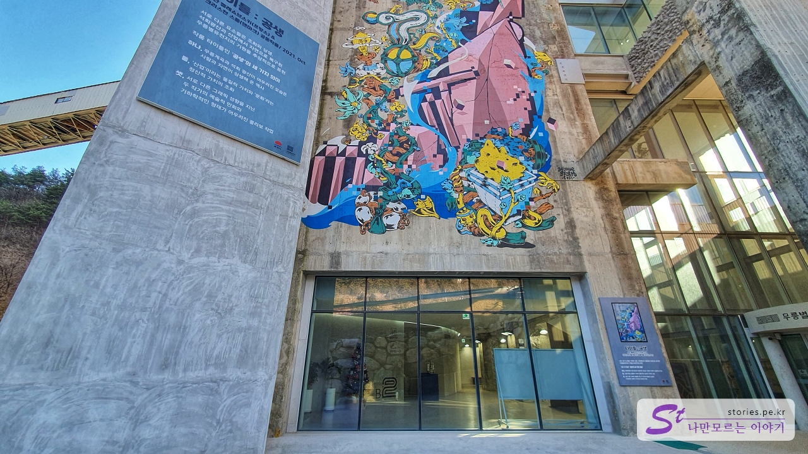

지하 2층 입구에 그라피티 같은 멋진 벽화가 그려져 있습니다. 어느 유명 작가의 공동작품이라고 하네요.

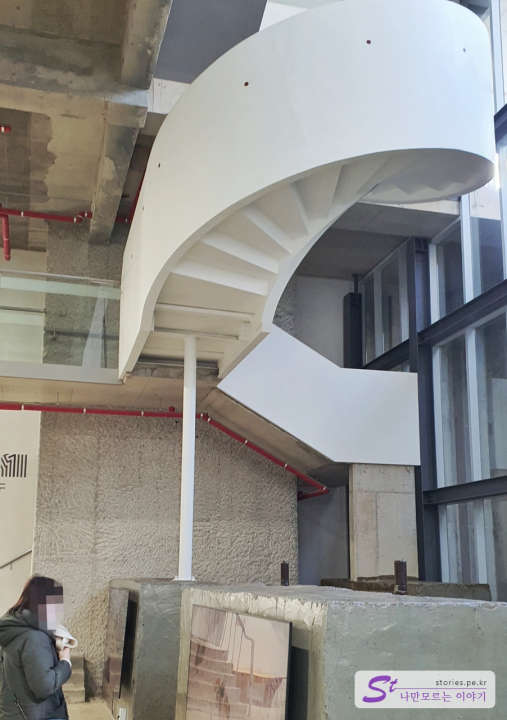

지하 2층에는 멀티미디어홀이라고 TV를 통해 채석에 관한 다양한 동영상을 보여주고 있습니다.  
계단을 통해 1층 로비로 가도 되고 엘리베이터를 타고 1층으로 가도 됩니다.

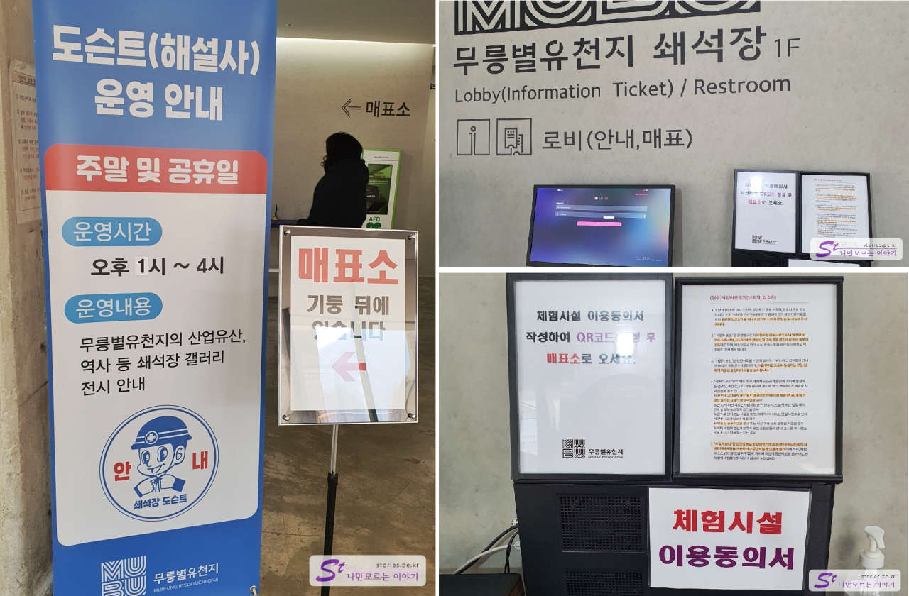

1층에서 매표를 할 수 있습니다. 주말 및 공휴일 등 사람이 많은 날에는 도슨트도 운영을 한다고 하네요.  
체험시설을 이용하려면 이용 동의서를 작성해야 합니다. 체험시설이 다소 위험할 수 있어서 동의를 받는 것 같네요.

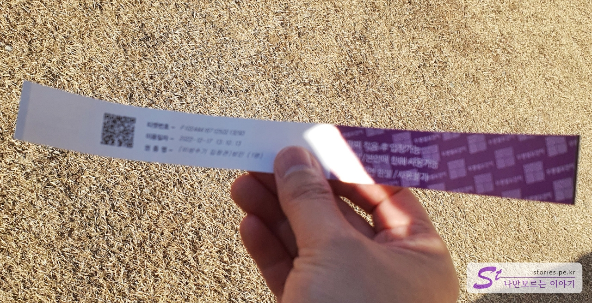

체험 없이 입장만 할 경우 **인당 4000원 ~ 6,000원** 정도를 지불하면 됩니다. 입장권은 손목에 차는 형태지만 굳이 손목에 찰 필요는 없습니다. 출구로 나갈 때, 들어올 때 입장권에 있는 QR코드만 찍으면 됩니다.  
그리고 입장권이 있으면 무릉별 열차나 버스를 탑승할 수 있습니다.

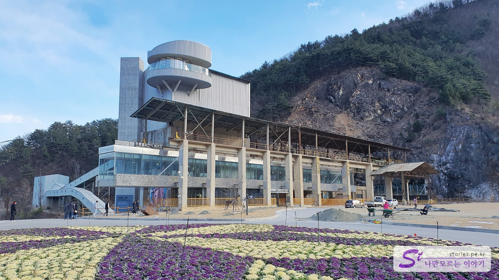

입구를 나와서 뒤돌아보면 우리가 나온 쇄석장 건물을 볼 수 있습니다. 주위를 둘러보면 황량하지만 다양한 조경을 볼 수 있습니다.

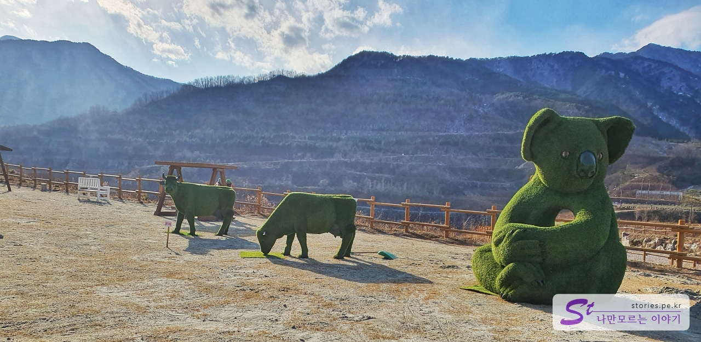

쇄석장으로 황폐해진 풍경을 조금이라도 녹색으로 만들기 위해 노력하는 모습이 보입니다. 잔디도 깔고 송아지, 코알라 모양의 토피어리도 만들어놨네요.

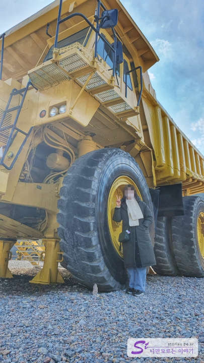

바로 뒤쪽으로는 채석장 장비를 전시해 놨는데 트럭 바퀴가 사람보다 더 크네요.

## 두미르 전망대

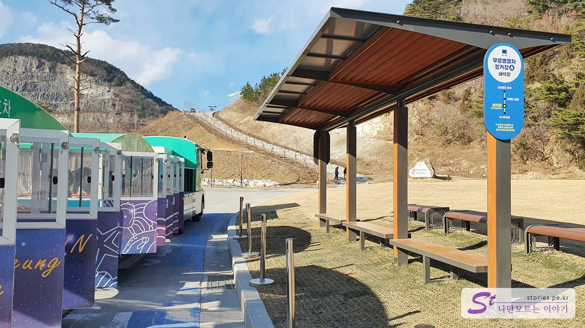

이제 쇄석장에서 **두미르 전망대**를 보기 위해 이동해야 합니다. 걸어갈 수도 있으나 거리가 상당히 멀어서 걸어가기보다는 무릉별 열차를 타기로 했습니다. 입장을 했다면 무료로 탑승할 수 있으니 굳이 걸어갈 필요는 없겠지요. 열차는 20 ~ 30분 단위로 왕복합니다.

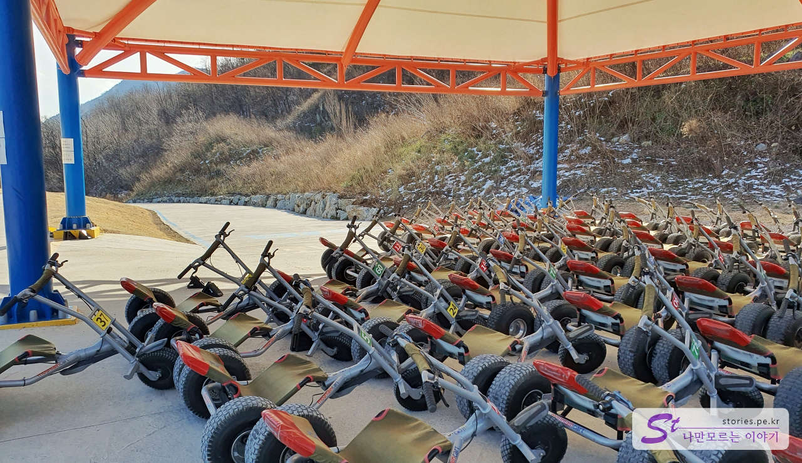

열차를 타고 약 5분 정도 이동해서 마지막 정류장인 C 정류장까지 갑니다. C 정류장은 오프로드 루지의 출발지이자 두미르 전망대로 가기 위한 정류장입니다.

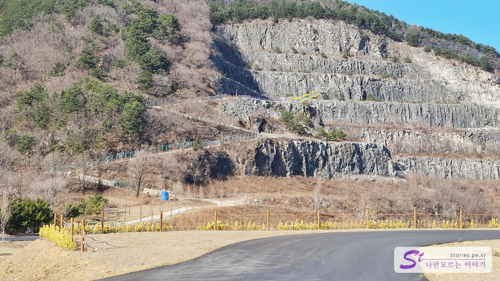

우리는 루지를 탈것은 아니기 때문에 반대쪽에 보이는 두미르 전망대로 가야 합니다. 거리가 만만치 않습니다.

조금만 더 가면 길을 다 아는데 굳이 있는 이정표가 보입니다. 두미르 전망대 방향으로 갑니다.  
**두루미**가 아니고 **두미르**입니다. 어설프게 알면 다들 **두루미 전망대**라고 하더라고요. ㅎㅎㅎㅎ  
평지가 아니고 산을 타고 경사로를 올라가야 하는 길이라 쉽지 않은 길입니다.

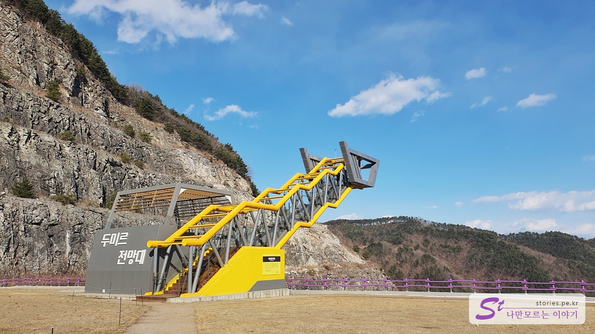

힘들게 걸어서 드디어 전망대에 올라왔습니다. 두미르 전망대가 보이네요.

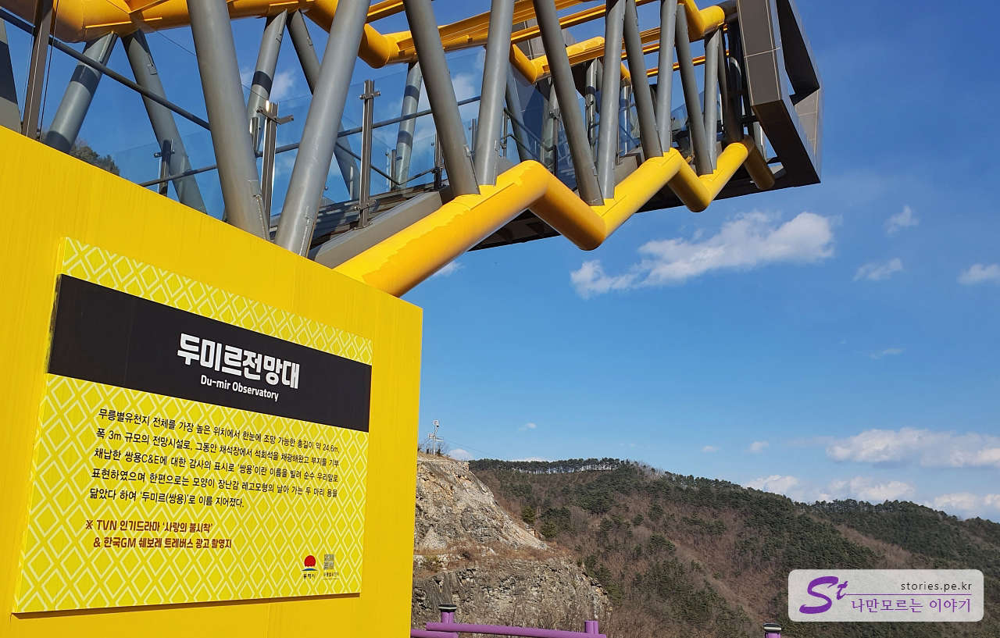

쌍용C&E가 채석장으로 사용하다가 채석장을 기부채납해서 감사의 표시로 전망대의 이름을 두미르라고 지었다고 하네요. 두미르는 순수 우리말로 쌍용을 말한다고 하네요. **두(둘) + 미르(용)** 이런 건가 봅니다.

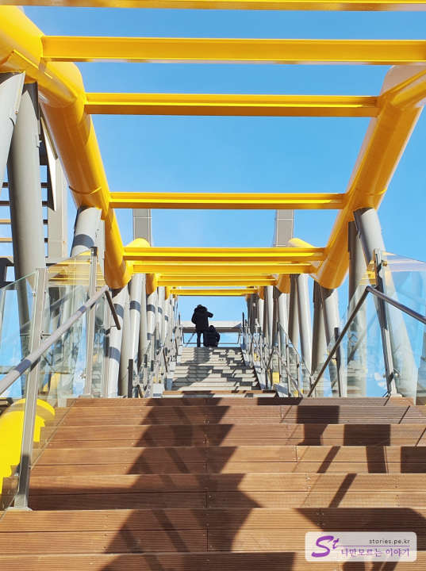

전망대 위로 올라가서 전망을 볼 수 있는데 기둥 때문에 생각만큼 전망이 좋지는 않습니다.

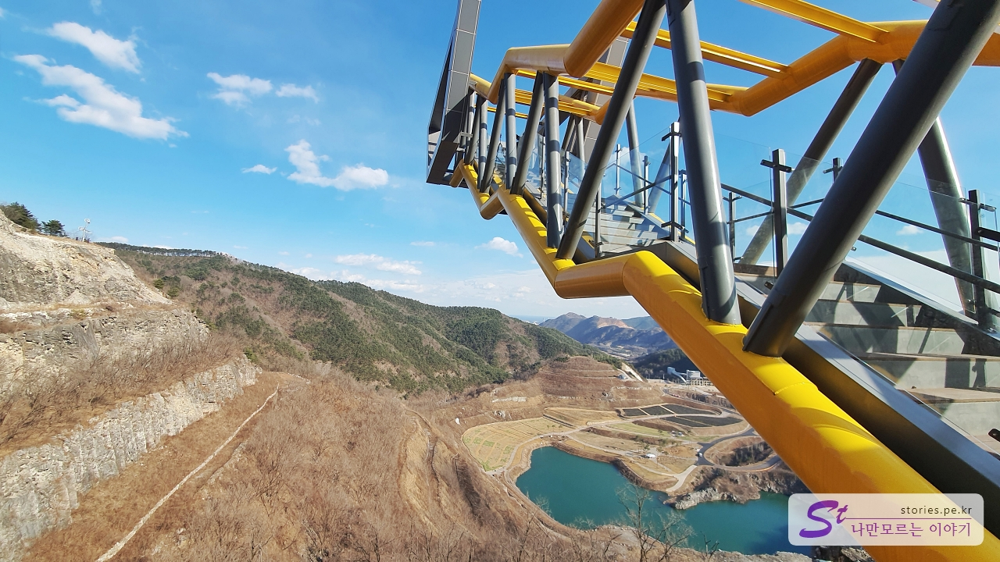

전망대에서 바라본 **금곡호**입니다.

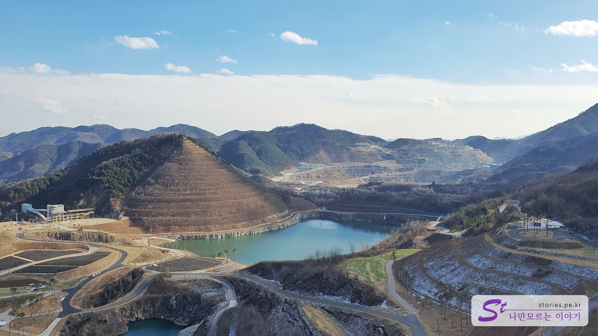

전체 전망입니다. 이렇게 보면 너무 멋진 풍경입니다. 사진 오른쪽에 보면 우리가 내린 무릉별 열차 C 정류장입니다.

## 시멘트 아이스크림

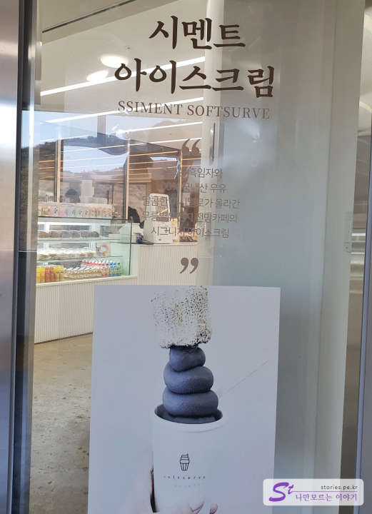

다시 무릉별 열차를 타고 **출발했던 쇄석장으로 돌아와서 건물의 4층으로 올라갑니다.** 4층에는 카페가 있고 이곳에서 시그니처인 시멘트 아이스크림을 판매합니다.

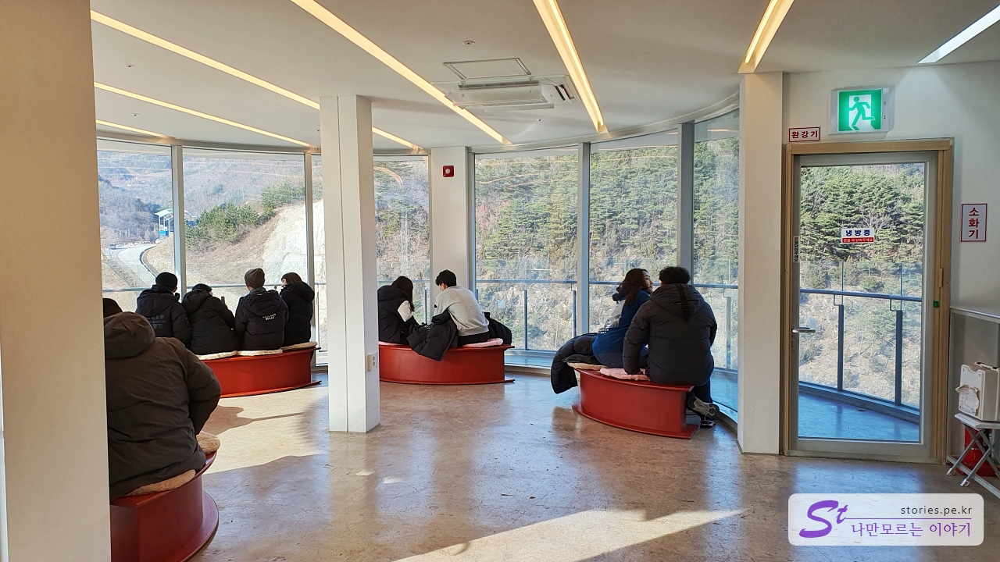

쇄석장 4층에는 전망 카페가 있고 아이스크림이나 음료를 마시면서 쉴 수 있는 장소가 있습니다. 넓은 유리창이 사방으로 있고 유리 바깥쪽인 테라스로 나갈 수도 있습니다.

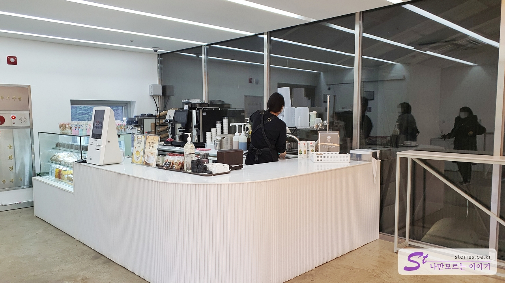

매장은 생각보다 크지 않습니다. 운영자도 1명이고요. 이곳에서 음료와 간단한 쿠키도 팝니다. 그리고 시멘트아이스크림도 판매를 하고 있습니다.

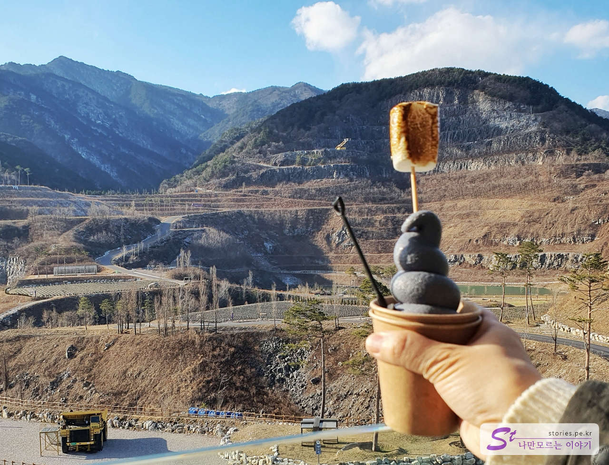

이게 시멘트 아이스크림입니다. 색상을 흑임자로 내었나 봅니다. 시중에서 이런 색의 아이스크림을 팔면 불호가 더 많을 텐데, 채석장이다 보니 시그니처 아이스크림이 되었네요. 마시멜로를 하나 꽂아놨고 아이스크림을 퍼먹는 수저는 삽 모양입니다. ㅋㅋ **가격은 생각보다 비싼 6,500원**이네요.

## 비용

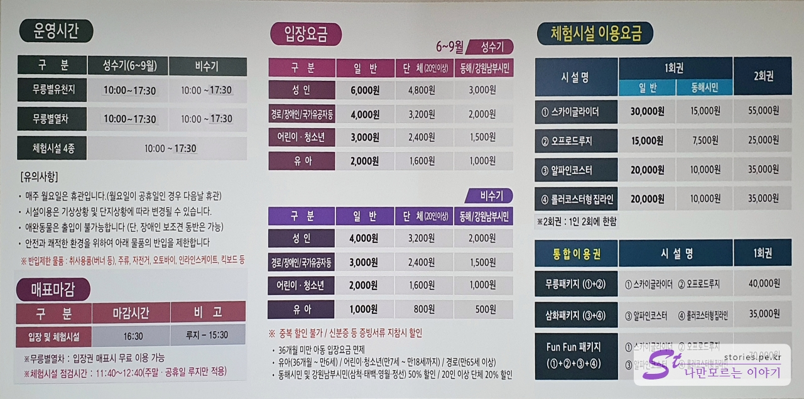

비용은 입장료와 체험시설 이용료로 크게 나누어지고 입장료는 성인 기준 비수기 때는 인당 4,000원, 성수기 때는 6,000원입니다. 할인 대상자가 있으므로 위의 사진을 참고하시면 됩니다.  
체험시설은 **시설 1회권**이 있고 몇 가지를 같이 이용할 수 있는 **통합 이용권**이 있습니다.

## 운영 시간

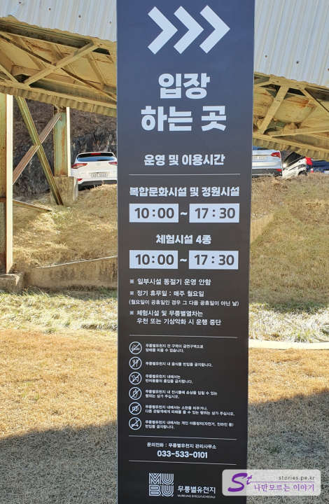

- 운영시간 : 10:00 ~ 17:30
- 휴무일 : 매주 월요일(월요일이 공휴일인 경우 그다음 공휴일이 아닌 날)

## 여행지 정보

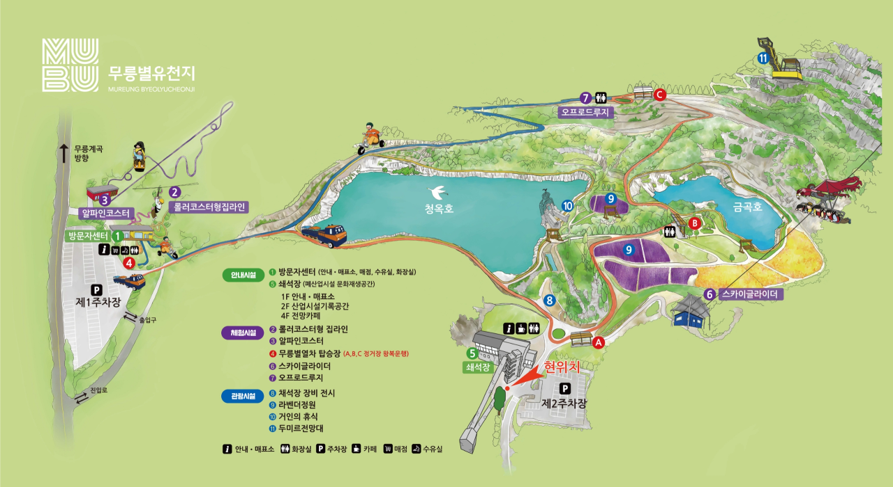

단지는 제1주차장과 제2주차장이 있고 제2주차장은 쇄석장과 바로 연결이 되어 있습니다. 중앙에 청옥호와 금곡호인 호수 2개가 위치해 있습니다.
입장하면 무료로 탑승이 가능한 무릉별 열차 또는 버스가 대략 20~30분 단위로 왕복 운행을 하고 있어서 체험시설 및 관람시설을 편하게 이동할 수 있습니다.

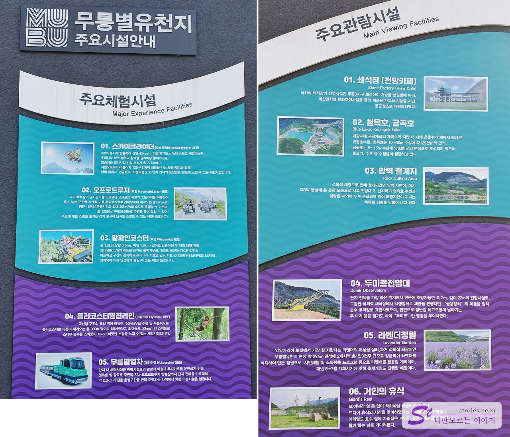

### 체험시설

4개의 체험시설과 무릉별 열차가 있습니다.
롤러코스터형 짚라인과 알파인코스터, 오프로드 루지는 제1주차장에 주차하는 것이 접근성이 좋습니다.

- (1주차장) 롤러코스터형 짚라인 : 레일에 매달려 무동력으로 타고 내려오는 체험 시설
- (1주차장) 알파인코스터 : 2개의 레일 위를 카트를 타고 내려오는 체험시설
- (1주차장) 오프로드 루지 : 오프로드를 무동력 카트를 타고 내려오는 체험시설
- (2주차장) 스카이 글라이더 : 방송에 가장 대표적으로 나오는 체험시설로 4명이 동시에 탑승하여 줄에 매달려 내려오는 체험시설

### 관람시설

관람시설은 채석장 장비 전시, 라벤더 정원, 거인의 휴식, 두미르전망대가 있으며 제2주차장에 주차하는 것이 접근성이 좋습니다.

- 주소 : 강원 동해시 이기로 97(삼화동) 무릉별유천지
- 연락처 : 033-533-0101
- URL : https://dh.go.kr/tour/mubu

<iframe src='https://www.google.com/maps/embed?pb=!1m18!1m12!1m3!1d3166.6134663725534!2d129.02982161557085!3d37.46984733741662!2m3!1f0!2f0!3f0!3m2!1i1024!2i768!4f13.1!3m3!1m2!1s0x3561bd8ae6d8f651%3A0x3537eb8a3e9a197f!2z66y066aJ67OE7Jyg7LKc7KeA!5e0!3m2!1sko!2skr!4v1672115627505!5m2!1sko!2skr' class='embed-responsive-item' allowfullscreen></iframe>

## 주차정보

주차장은 제1주차장과 제2 주차장으로 되어있으며 유료로 운영이 되고 있습니다. 저희는 제2주차장으로 갔습니다.
**알파인코스터, 롤러코스터형 짚라인, 오프로드 루지를 체험할 계획이라면 제1주차장**으로 가시는 것이 좋고 **스카이 글라이더나 관람으로 가시는 것이면 제2주차장**으로 가시는 것이 접근성 면에서 좋습니다.

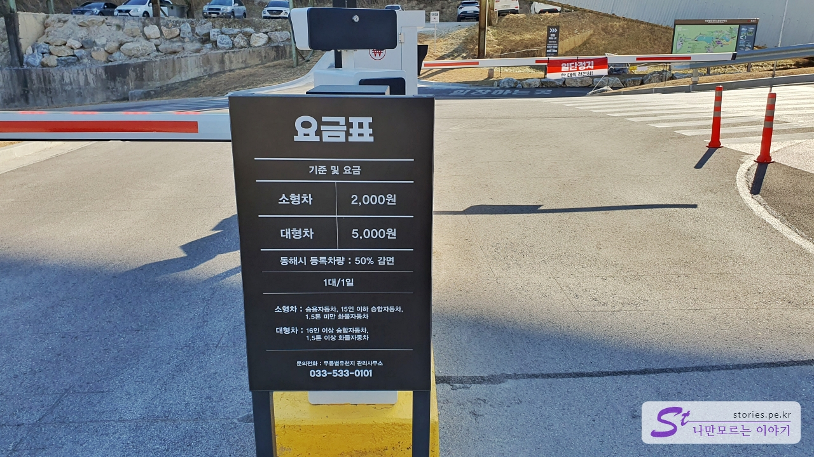

주차요금은 자가용이면 2,000원이라고 보시면 됩니다. 지하 2층에 주차요금 정산기가 있으니 실내에서 하셔도 되고 주차장에서 정산하셔도 됩니다. 모두 무인정산입니다.

## 인근 맛집

> [[동해 맛집] 요즘 잘나가는 맛집 초당쫄면순두부](https://blog.stories.pe.kr/610)
