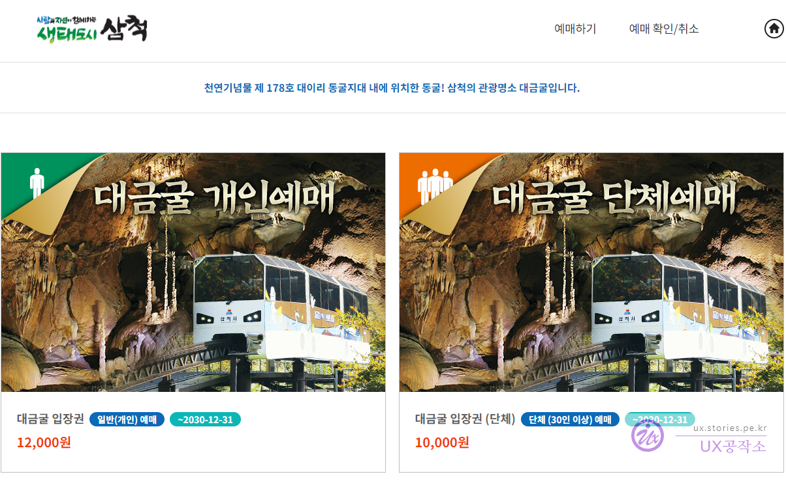
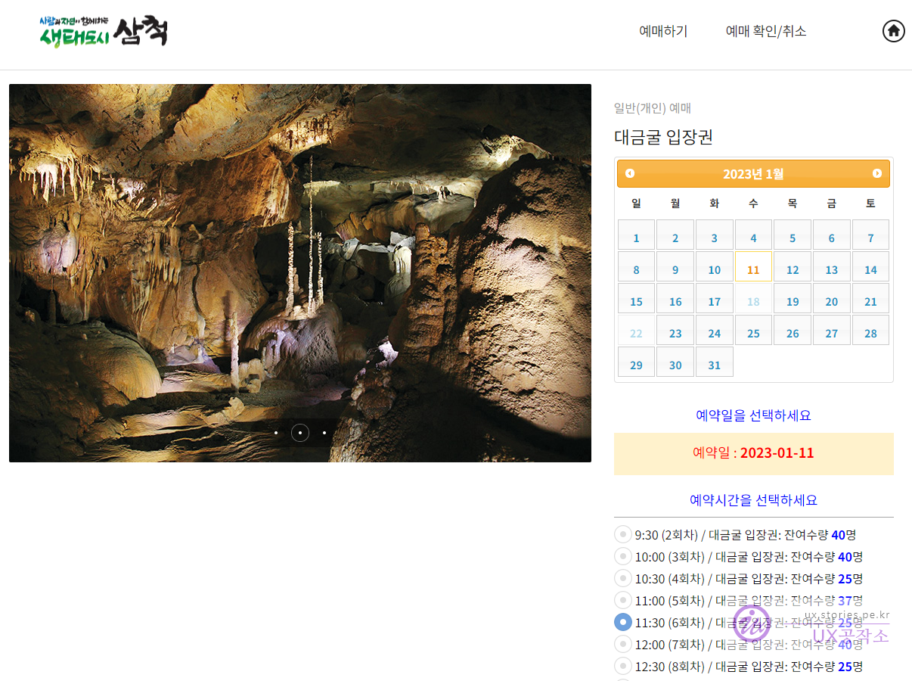
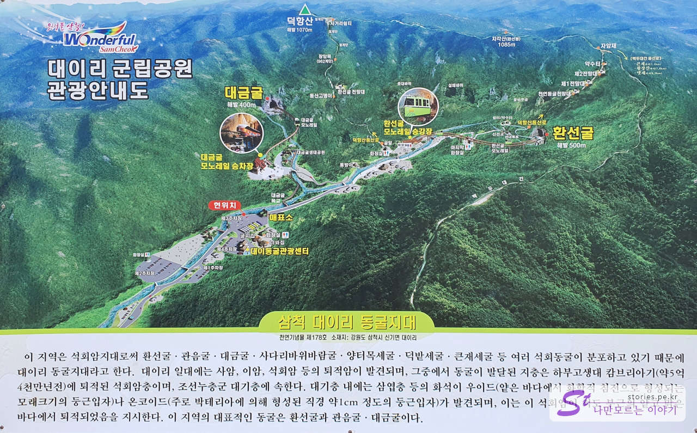
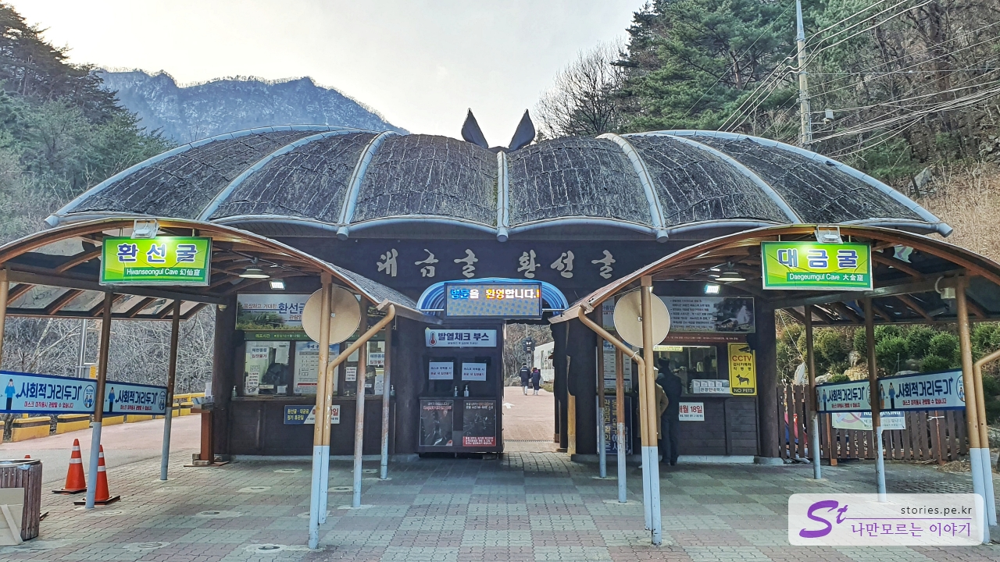
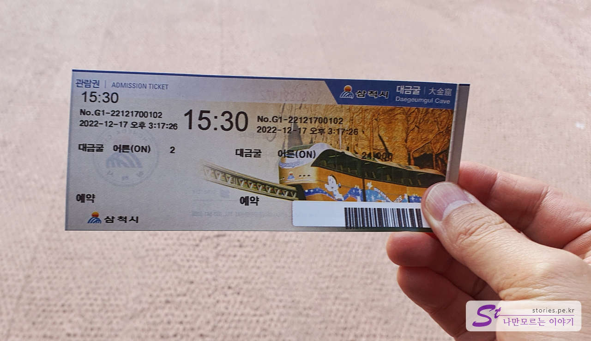
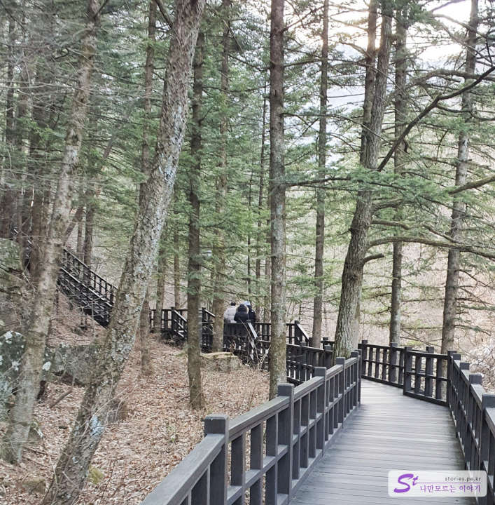
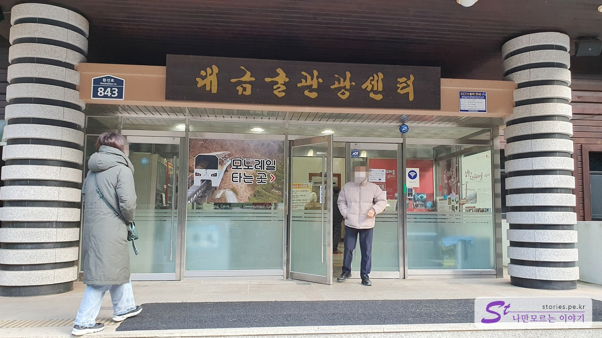
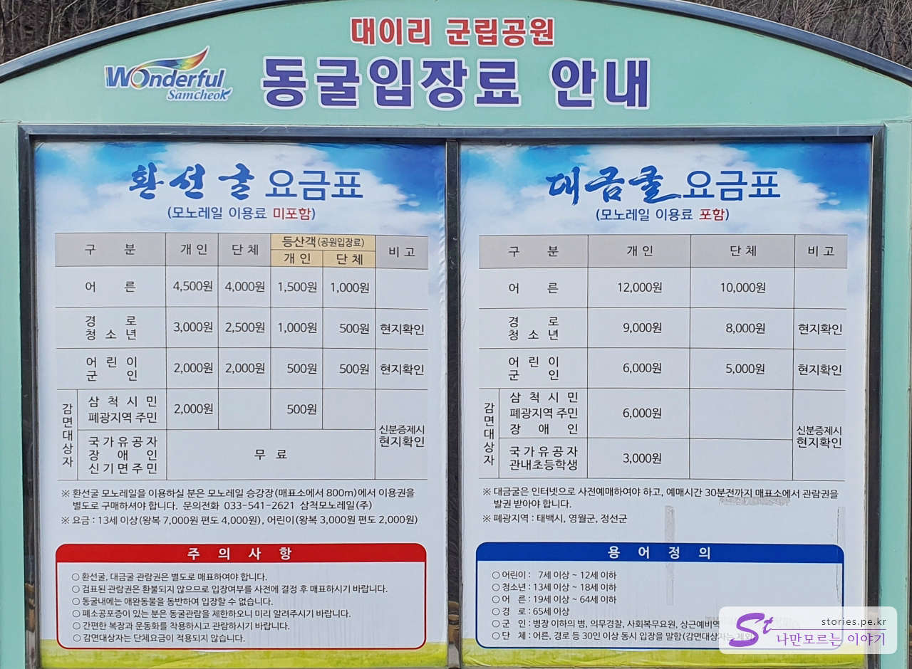

There are Hwanseongul Cave and Daegeumgul Cave in Samcheok near Donghae City. Hwanseongul Cave can be visited and photographed without on-site tickets or time reservations, but Daegeumgul Cave requires reservation of the visit date and time in advance and photography is prohibited inside the cave. In other words, Daegeumgul Cave was much more difficult to access and there were no pictures on the Internet, so it felt mysterious. And we tried that hard thing this time. Haha

# Daegeumgul Cave

## To make an Internet reservation

Daegeumgul Cave must book and pay for the visit date and visit time (times) on the Internet in advance.

> [Shortcut to book Daegeumgul Cave](https://home-ticket.co.kr/dgg/views/productList.jsp)

There's a 2,000 won difference between the individual and the group. We chose **Daegeumgul individual reservation**.

Select the reservation date and the reservation time (times). It was cut on the screen, but there is also a button to pay below. I'll pay for it here.

## Visiting

I park first. Parking is rather spacious. I don't think you need to worry too much about parking.

This is a guide map of the cave area in Daei-ri, Samcheok. The most famous places are Hwanseongul Cave and Daegeumgul Cave. I've been to Hwanseongul Cave before, so I'm going to Daegeumgul Cave this time.

The ticket office of Hwanseongul Cave and the ticket office of Daegeumgul Cave are on both sides. You don't need to make a reservation for Hwanseongul Cave, but you can enter after purchasing it on-site. Since we are Daegeumgul Cave, we lined up on the right. Even if you made a reservation online, you have to visit here and exchange it with an admission ticket.

If the current round is not fully booked, you can flexibly book on-site. It's just a hit or It's random. Luckily, our front team visited without a reservation, but there was a reservation left, so we visited right away. We also made a reservation at 16:00, but we arrived earlier than expected, so we changed it to 15:30 and were able to enter.

This is how you get the ticket. We will inspect it when we board the monorail later.

If you go up about 100m, you will see the fork of Hwanseongul Cave and Daegeumgul Cave. We went to the left because we had to go to Daegeumgul Cave.

You have to cross the stream bridge to get to Daegeumgul Cave.

It passes through the door that says Daegeumgul Cave. The roof looks like a bat

You have to walk about 2-300m across the bridge.

Then you can see Daegeumgul Tourist Center in a large building. You can ride the Daegeumgul Monorail here. There is no toilet in the cave, so it is recommended to use the toilet here if possible.

I ride the monorail and go up for about 5 minutes. The monorail goes to the mouth of the cave.

We arrived at the entrance of the cave. The entrance to the cave was not created naturally, but was drilled by people to develop the cave.

When I enter the cave, I decorated it with lights. I can't take any more pictures here. crying

## Cost

The cost is about three times that of Daegeumgul Cave. The reason why it is expensive is because there is one guide per episode, but I think it will be expensive due to labor costs. (Guess ^^)

It's 12,000 won per adult.

## Operating hours

- Operating hours: **Required to arrive 30 minutes before reservation time**
- Winter: Winter (November to February): 09:30 to 16:00
- Summer: Summer (March to October): 09:00 to 17:00
- Time required: It takes about 1 hour based on riding and getting off the monorail

## Travel destination information

There seems to be no separate explanation for Hwanseongul Cave, but in Daegeumgul Cave, one guide guides the cave for each round. Everyone is given a machine with earphones, and as the guide moves on, he explains the cave.

- Address: 800 Hwanseon-ro, Singi-myeon, Samcheok-si, Gangwon-do
- Contact point: 033-541-7600
- - URL : http://daegeumgul.co.kr/dgg/homepage/

<iframe src='https://www.google.com/maps/embed?pb=!1m18!1m12!1m3!1d3172.679554832704!2d129.018895215568!3d37.3264175456002!2m3!1f0!2f0!3f0!3m2!1i1024!2i768!4f13.1!3m3!1m2!1s0x3561a3d4f9b838e7%3A0xf0f013e925b41d34!2z64yA6riI6rW0!5e0!3m2!1sko!2skr!4v1672125217444!5m2!1sko!2skr' class='embed-responsive-item' allowfullscreen></iframe>

## What I felt

I don't know if Daegeumgul Cave will be more valuable if scholars look at it academically because there is nothing to eat at the famous feast, but from the eyes of ordinary people like us, Hwanseonggul Cave was better. I can't even take pictures
