동해시 인근에 있는 삼척에는 환선굴과 대금굴이 있습니다. 환선굴은 현장 매표나 시간 예약 없이 방문, 사진촬영이 가능한데, 대금굴은 미리 방문일과 시간을 예약해야 하고 동굴 내부에서는 사진촬영도 금지하고 있습니다. 말하자면 대금굴이 훨씬 접근이 어렵고 인터넷에 사진이 없으니 신비한 느낌이 들었습니다. 그리고 그 어려운 것을 저희가 이번에 해봤습니다. ㅎㅎ

# 대금굴

## 인터넷 예약하기

대금굴은 인터넷으로 미리 방문 일자와 방문 시간(회차)를 예약하고 비용을 지불해야 합니다.

> [대금굴 예매하기 바로 가기](https://home-ticket.co.kr/dgg/views/productList.jsp)

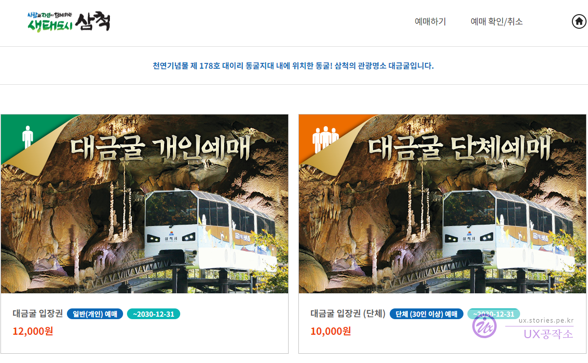

개인과 단체의 금액이 2,000원 차이가 나네요. 저희는 **대금굴 개인 예매**를 선택했습니다.

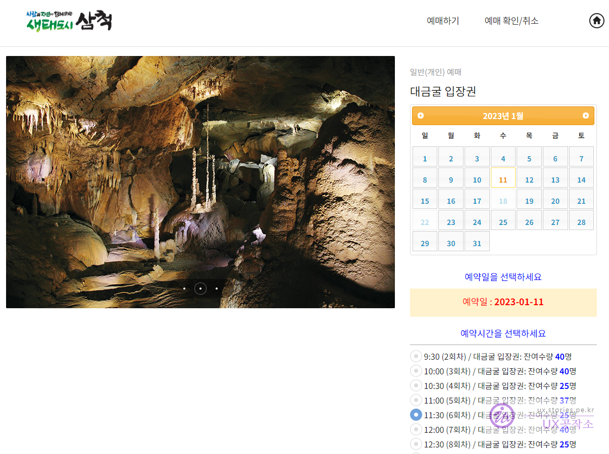

예약 날짜와 예약시간(회차)를 선택합니다. 화면에서는 잘렸는데, 아래에 결제하는 버튼도 있습니다. 결제까지 여기해서 해 줍니다.

## 방문하기

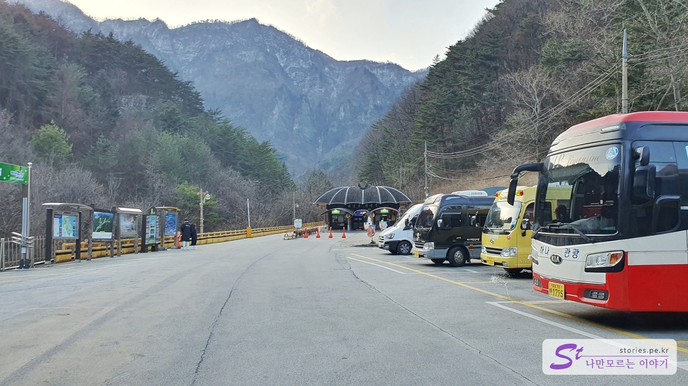

먼저 주차를 합니다. 주차는 넓은 편입니다. 주차 걱정을 크게 할 필요는 없을 듯합니다.

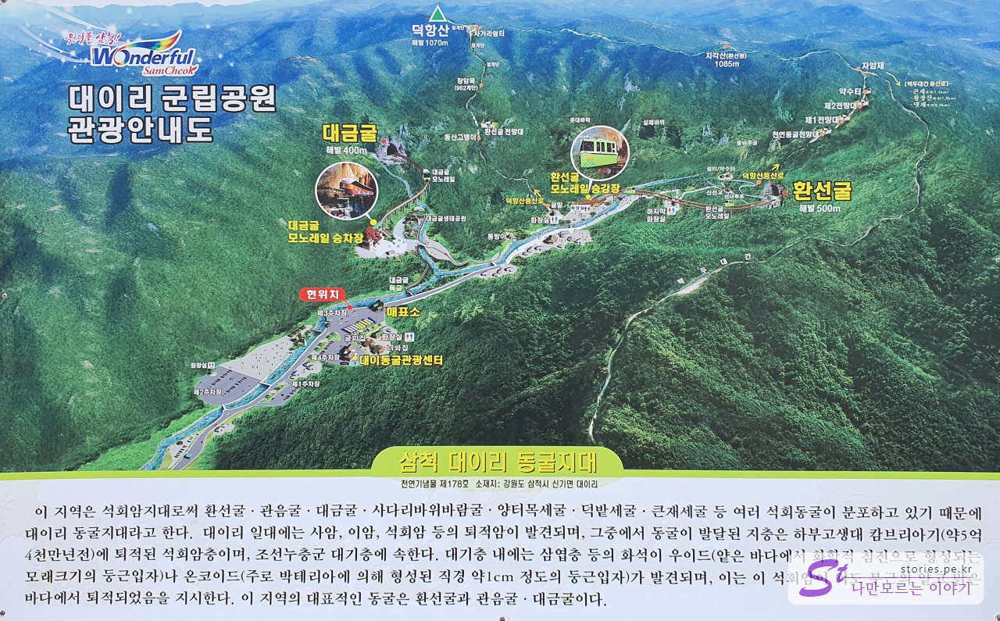

삼척 대이리에 있는 동굴 지대 안내도입니다. 가장 알려진 곳이 환선굴과 대금굴입니다. 환선굴은 예전에 다녀와서 이번에는 대금굴을 가보려고 합니다.

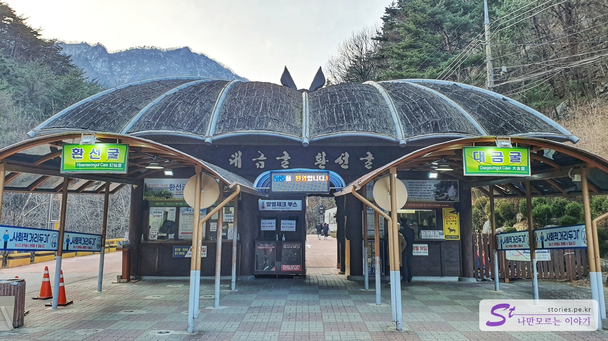

환선굴의 매표소와 대금굴의 매표소가 양옆으로 있습니다. 환선굴은 예약할 필요 없이 현장 구매 후 입장이 가능합니다. 저희는 대금굴이기 때문에 오른쪽에 줄을 섰습니다. 인터넷으로 예매를 했어도 이곳에 방문하여 입장권으로 교환을 해야 합니다.

현재 회차에 예약이 꽉 차지 않았다면 융통성 있게 현장에서 예매도 가능합니다. 다만 복불복이겠지요. 저희 앞 팀은 운 좋게도 예약 없이 방문하였다가 예약이 남아있어서 바로 방문을 하였습니다. 저희도 16:00에 예약을 했는데 생각보다 일찍 도착해서 15:30으로 변경해서 입장을 할 수 있었습니다.

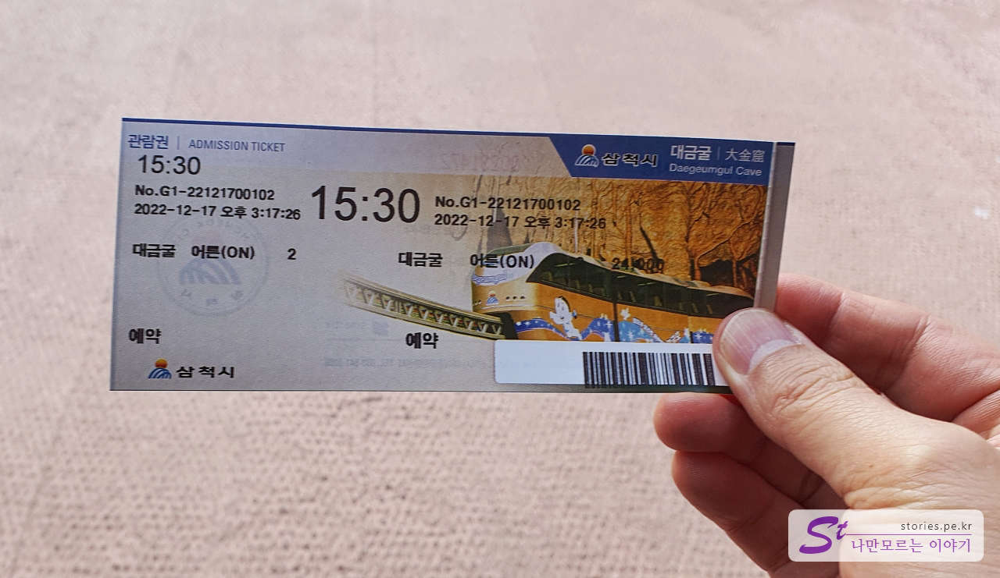

이렇게 입장권을 끊어 줍니다. 나중에 모노레일 탑승할 때 검사를 합니다.

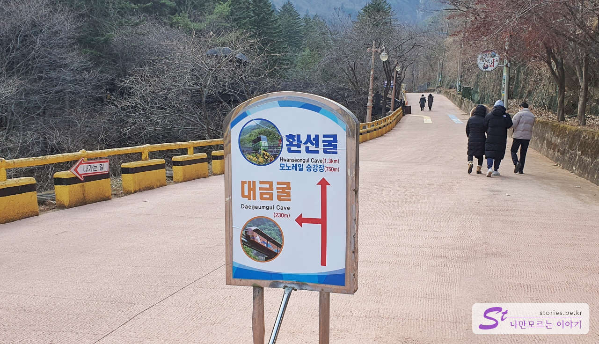

100m 정도 조금만 올라가면 환선굴과 대금굴의 갈림길이 나옵니다. 저희는 대금굴로 가야 하기 때문에 왼쪽으로 빠졌습니다.

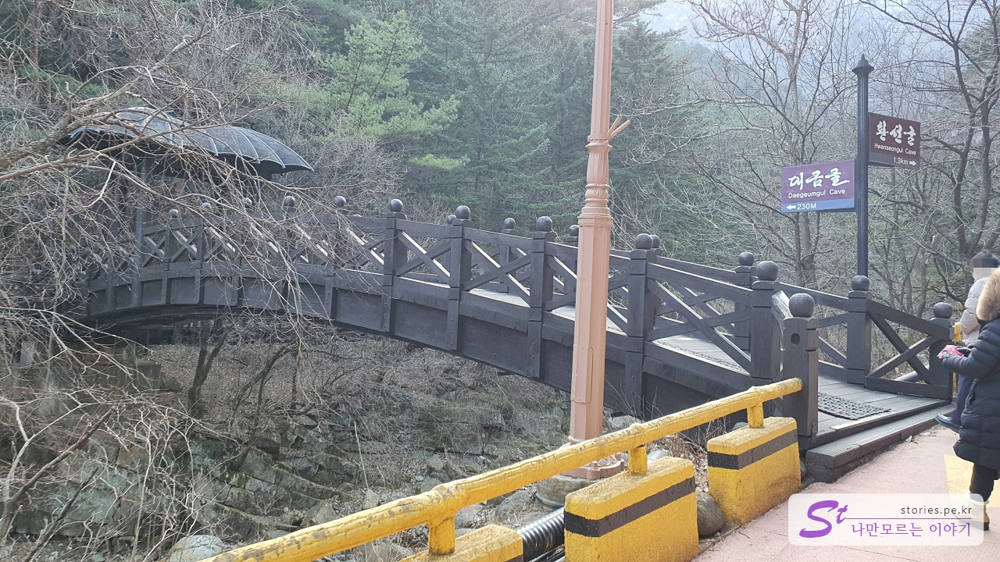

대금굴로 가려면 개울 다리를 건너야 합니다.

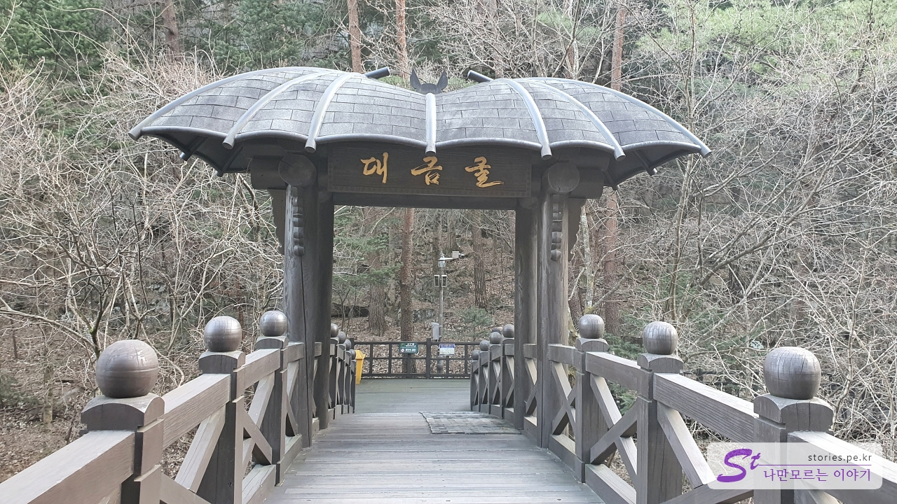

대금굴이라고 떡하니 쓰여있는 문을 통과합니다. 지붕이 박쥐 모양이네요 ㅎ

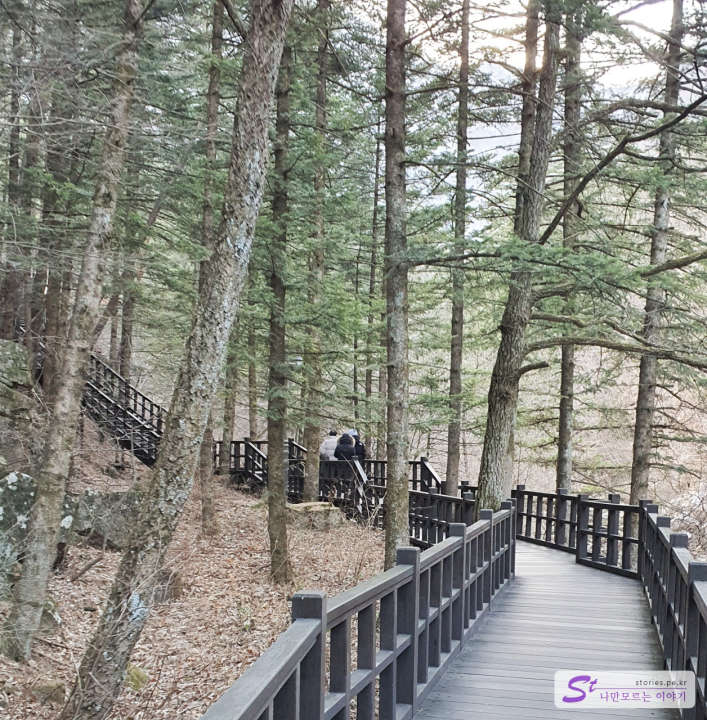

다리를 건너서 약 2~300m 정도 걸어서 올라가야 합니다.

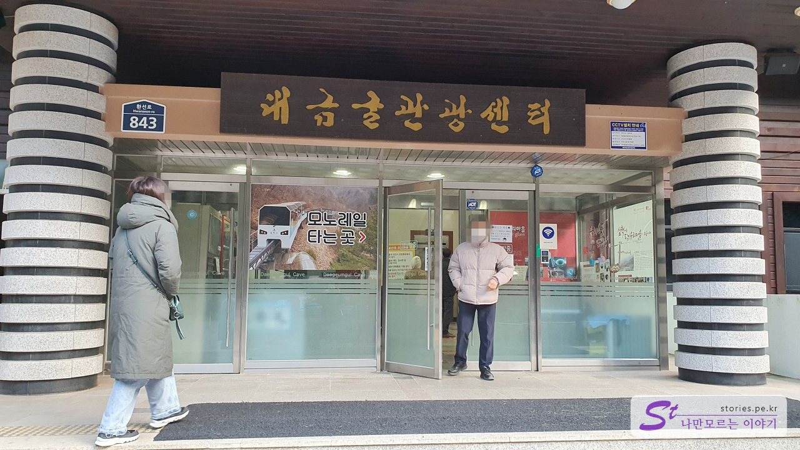

그러면 큰 건물에 대금굴 관광센터가 보입니다. 이곳에서 대금굴 모노레일을 탈 수 있습니다. 굴 안에는 화장실이 없으므로 가능하면 여기에서 화장실을 이용하는 것이 좋습니다.

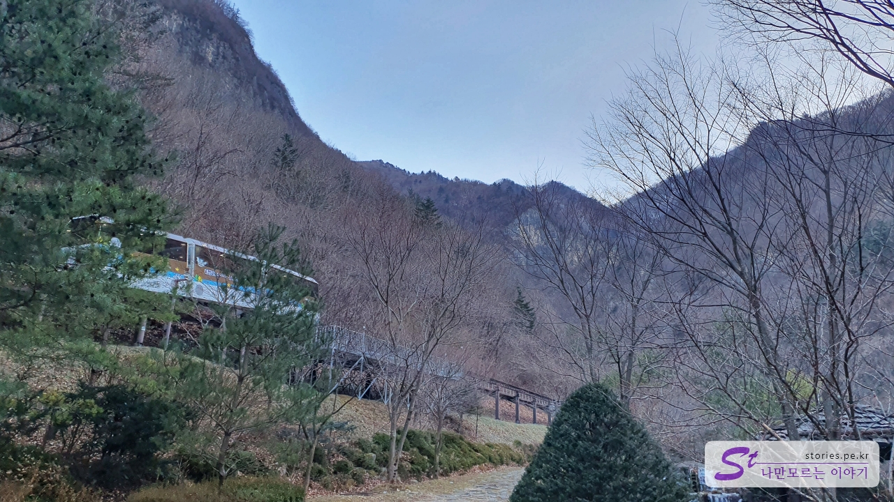

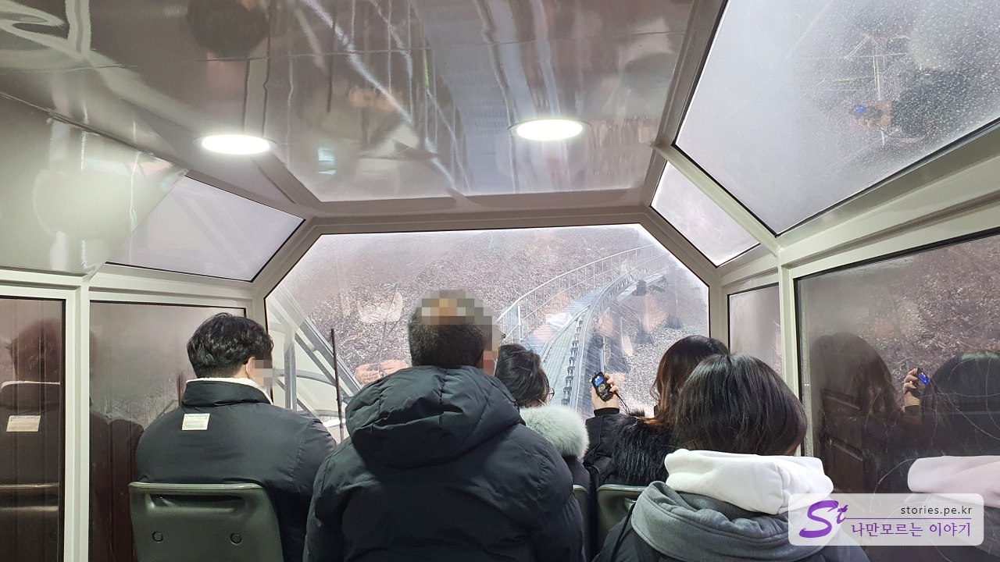

이렇게 모노레일을 타고 5분 정도 올라갑니다. 모노레일이 동굴 초입까지 들어갑니다.

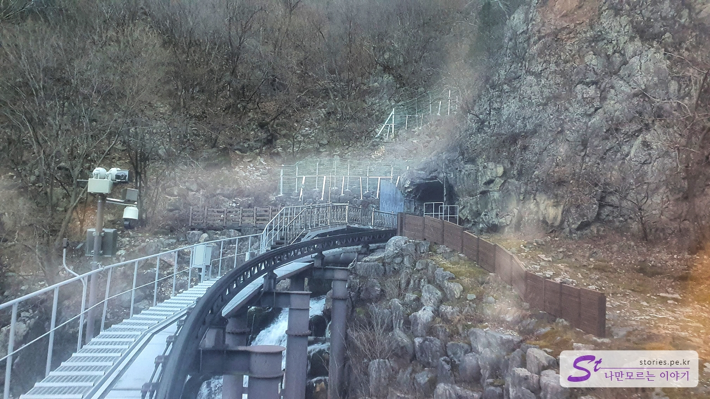

동굴 입구에 도착했습니다. 동굴 입구는 자연적으로 생긴 것은 아니고 사람들이 동굴을 개발하기 위해 뚫은 것입니다.

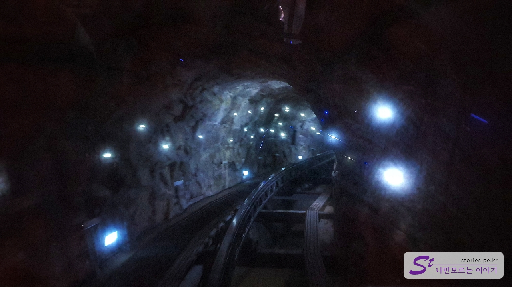

동굴에 들어서면 이렇게 조명으로 이쁘게 꾸며놨습니다. 여기를 마지막으로 사진촬영은 더 이상 할 수가 없습니다. ㅠㅠ

## 비용

비용은 대금굴의 3배 정도 더 비쌉니다. 비싼이유가 아무래도 회차당 가이드가 1명씩 있는데, 인건비 때문에 비싸지 않을까 합니다. (추측 ^^)

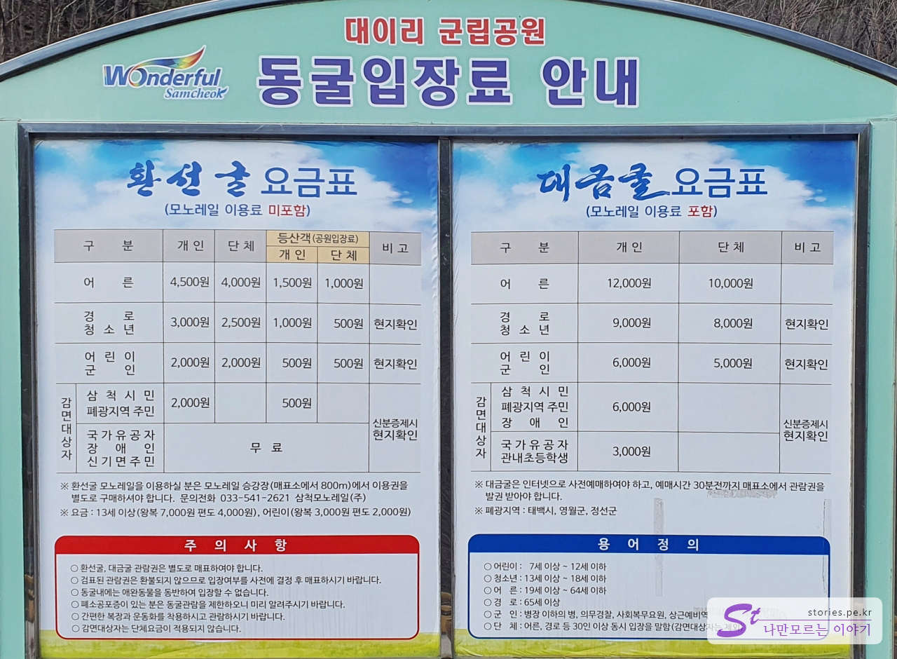

어른 기준 인당 12,000원입니다.

## 운영 시간

- 운영 시간 : **예매시간 30분 전 도착 필수**
- 동절기 : 동절기(11월 ~ 2월) : 09:30 ~ 16:00
- 하절기 : 하절기(3월 ~ 10월) : 09:00 ~ 17:00
- 소요시간 : 모노레일을 타고 내리는 것을 기준으로 대략 1시간 정도 소요

## 여행지 정보

환선굴은 별도의 설명은 없는 것 같은데, 대금굴은 각 회차당 1명의 가이드가 인도를 하며 동굴을 투어 합니다. 모든 사람에게 이어폰이 달린 기계를 나눠주는데 가이드가 이동하면서 그것을 통해 동굴에 대해서 설명을 해 줍니다.

- 주소 : 강원도 삼척시 신기면 환선로 800
- 연락처 : 033-541-7600
- URL : http://daegeumgul.co.kr/dgg/homepage/

<iframe src='https://www.google.com/maps/embed?pb=!1m18!1m12!1m3!1d3172.679554832704!2d129.018895215568!3d37.3264175456002!2m3!1f0!2f0!3f0!3m2!1i1024!2i768!4f13.1!3m3!1m2!1s0x3561a3d4f9b838e7%3A0xf0f013e925b41d34!2z64yA6riI6rW0!5e0!3m2!1sko!2skr!4v1672125217444!5m2!1sko!2skr' class='embed-responsive-item' allowfullscreen></iframe>

## 느낀 점

소문난 잔치에 먹을 것 없다고 학자들이 학술적으로 볼 경우는 대금굴이 더 가치가 있을지는 모르겠는데 저희 같은 일반 사람들의 눈으로 봤을 때 감흥은 환선굴이 더 좋았던 것 같습니다. 사진은 찍지도 못하고 ㅠㅠ
