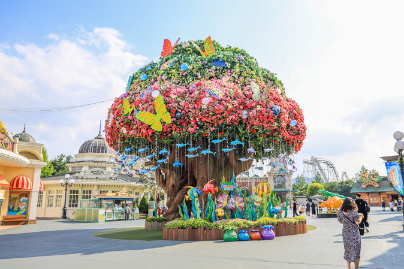
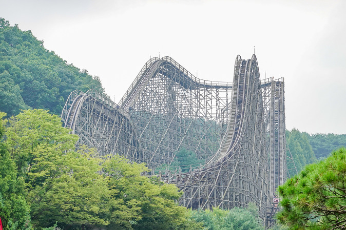
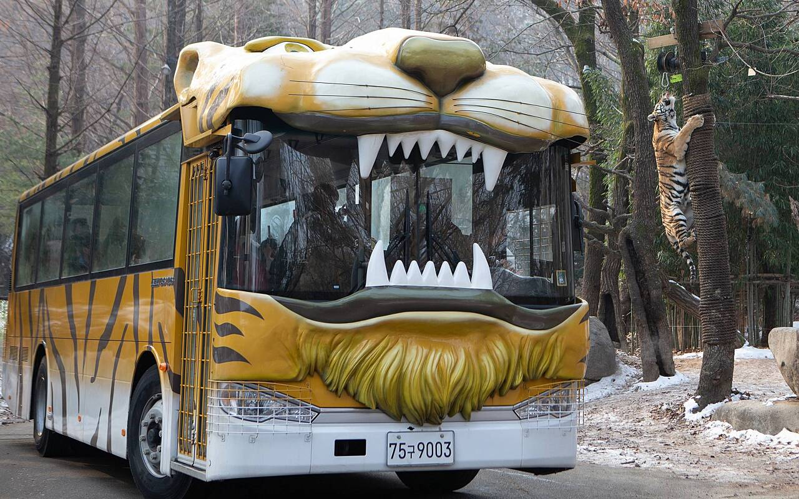
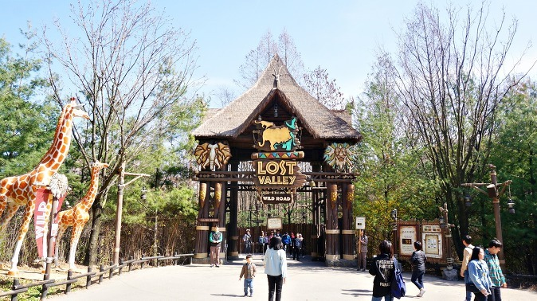
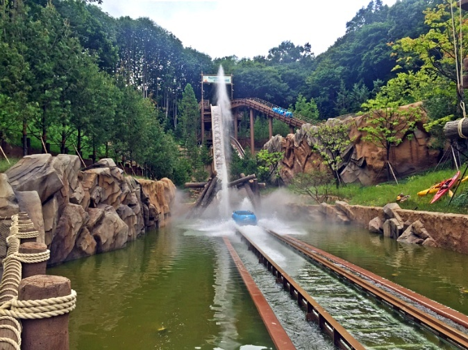
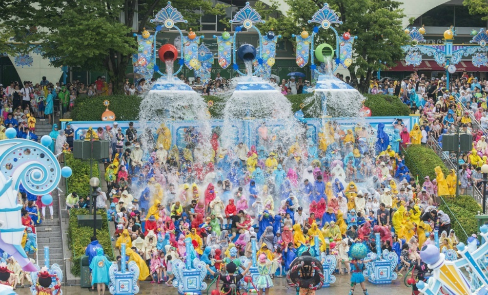

가족 및 친구들과 함께 재미있는 모험을 찾고 계십니까? 한국에서 가장 인기 있는 놀이공원 중 하나인 에버랜드만 있으면 됩니다. 40개가 넘는 명소와 풍부한 역사를 지닌 에버랜드는 모두를 위한 무언가를 제공합니다. 스릴 넘치는 롤러코스터부터 매혹적인 쇼와 동물 전시까지, 에버랜드에서는 지루할 틈이 없습니다.

## 에버랜드의 역사

에버랜드는 1976년 '자연농장'이라는 뜻의 '자연농원'으로 문을 열었습니다. 공원은 처음에 농업과 농업의 다양한 측면을 보여주기 위해 설계된 교육 시설이었습니다. 방문객들은 농작물과 가축, 그리고 한국의 전통 농법을 보고 배울 수 있었습니다.

그러나 1978년 놀이공원 구간이 추가되면서 에버랜드는 순식간에 인기 있는 관광지가 되었습니다. 공원은 수년에 걸쳐 계속 확장되고 발전하여 새로운 명소, 쇼 및 시설을 추가했습니다. 1996년에는 본격적인 놀이공원으로의 변신을 반영하여 '에버랜드'로 명칭을 변경하였습니다.

오늘날 에버랜드는 삼성물산이 운영하고 있으며 매년 수백만 명의 방문객을 끌어모으고 있습니다. 한국에서 가장 큰 테마파크이며 놀이기구, 어트랙션, 쇼로 수많은 상을 수상했습니다.

에버랜드 최고의 놀이기구와 어트랙션

40개 이상의 어트랙션이 있는 에버랜드에서 어디서부터 시작해야 할지 알기 어려울 수 있습니다. 공원에서 가장 인기 있는 놀이기구와 어트랙션은 다음과 같습니다.

## T-익스프레스

T-Express는 공원의 가장 상징적인 어트랙션 중 하나이며 세계 최고의 목재 롤러코스터 중 하나로 알려져 있습니다. 가파른 낙하와 급커브, 시속 104km의 최고 속도가 특징입니다. 스릴을 찾는다면 T-Express를 놓칠 수 없습니다.

## 사파리 월드

  
사파리 월드는 자연 서식지에서 동물을 가까이서 볼 수 있는 독특한 어트랙션입니다. 어트랙션은 사자 사파리, 곰 사파리, 새 공원 등 여러 섹션으로 나뉩니다. 방문객들은 각 구간을 특별 설계된 차량을 타고 자연 환경에서 동물들을 관찰할 수 있습니다.

## 로스트 밸리

로스트 밸리(Lost Valley)는 선사 시대 풍경 속을 스릴 넘치는 놀이기구로 안내하는 또 다른 동물 테마 명소입니다. 놀이기구는 지프 사파리와 유사하게 설계되었으며 방문자는 애니메트로닉 공룡 및 기타 선사 시대 생물을 볼 수 있습니다.

## 썬더 폴스

썬더 폴스(Thunder Falls)는 방문객을 급류와 폭포를 통과하는 야생 여행으로 안내하는 수상 놀이기구입니다. 라이더는 코스를 탐색하면서 회전하고 떨어지는 대형 원형 보트에 앉아 있습니다.

## 페스티벌 월드

Festival World는 라이브 쇼와 공연 전용 공원 섹션입니다. 아크로바틱 공연부터 한국 전통무용 공연까지 모든 것을 즐길 수 있습니다.

## 에버랜드의 기타 시설

놀이기구와 어트랙션 외에도 에버랜드에는 방문객이 즐길 수 있는 여러 가지 다른 시설이 있습니다. 여기에는 다음이 포함됩니다.

### 에버랜드 스피드웨이

에버랜드 스피드웨이는 관람객들이 고속 전기 카트를 타고 서로 겨루는 고카트 트랙입니다.

### 에버랜드 호암미술관

에버랜드 호암미술관은 국내외 작가들의 작품을 감상할 수 있는 현대미술관입니다.

### 에버랜드 장미원

에버랜드 장미원은 4000여 송이의 다양한 색과 품종의 장미로 가득한 아름다운 정원입니다.

### 음식 및 쇼핑

에버랜드에는 한국 길거리 음식부터 세계 각국의 요리까지 모든 것을 제공하는 다양한 레스토랑과 포장마차가 있습니다. 방문객들은 또한 공원의 많은 상점과 부티크에서 기념품과 선물을 구입할 수 있습니다.

### 결론

에버랜드는 재미있고 신나는 일을 찾는 사람이라면 꼭 가봐야 할 곳입니다.
