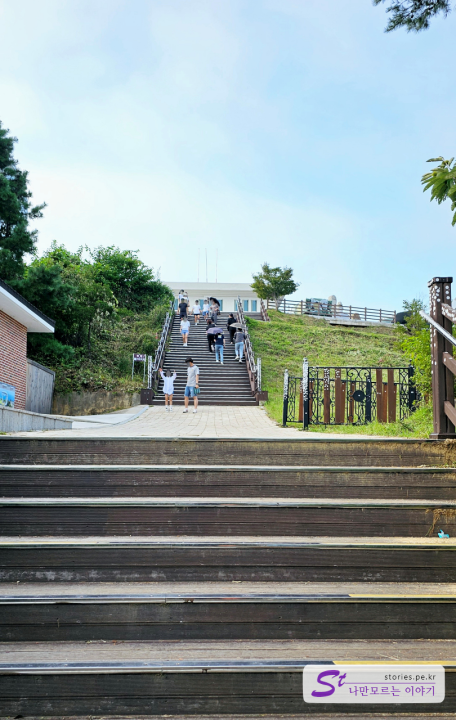
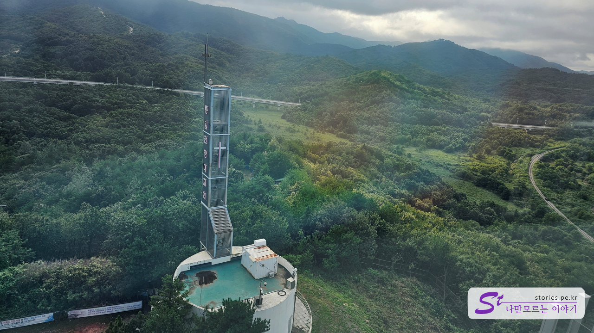
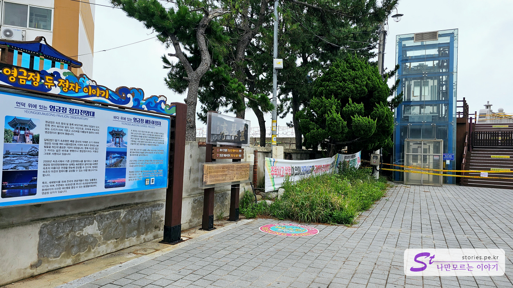

서울양양 고속도로가 개통이 되면서 동해안으로의 여행이 매우 쉬워졌습니다.  
이번에 1박 2일로 가장 북쪽에 있는 통일 전망대를 갔다가 속초 청초호와 영금정을 들러서 돌아왔습니다.

## 고성 통일 전망대

아침에 일찍 출발해서 서울양양 고속도로를 지나서 고성 통일전망대로 먼저 갔습니다.  
통일 전망대로 바로 갈 수는 없고 먼저 **출입 신고**를 먼저 해야 합니다.

### 통일 전망대 출입 신고소

통일전망대를 간다고 내비게이션을 통일 전망대를 먼저 찍고 가면 안됩니다. **통일전망대 출입 신고소에서 먼저 출입인원에 대한 신고를 해야 합니다**.

모두 내려서 확인할 필요는 없고 대표자 한 명만 내려서 등록을 하면 되고 명단은 모두 작성을 해야 합니다.

신고를 했다면 신고 서류를 들고 차를 타고 다시 통일 전망대 쪽으로 가시면 됩니다. 대략 5km 정도 차를 타고 달리다 보면 군인들이 지키고 있는 차량 출입통제소를 지나게 됩니다. 이곳에 신고 서류를 제출하면 통일 전망대 관람을 할 수 있는 표시판을 주는데 차량 앞쪽에 비치를 하면 됩니다.

받은 표시판은 나중에 돌아갈 때 동일한 장소에서 반납을 하시면 됩니다.
그렇게 또다시 5km쯤 더 들어가면 통일 전망대를 만날 수 있습니다.

### 통일 전망대

통일 전망대 주차장에 도착하면 6.25전시관을 만나게 되는데 저희는 들어가 보지는 않았습니다.

주차를 하고 언덕을 지나 계단을 올라가면 드디어 통일 전망대를 만날 수 있습니다.

멋지고 특이하게 생긴 통일 전망대가 보이네요.

계단을 타고 올라가면 비행기와 전차가 전시되어 있는 광장을 만날 수 있습니다.

원래 통일 전망대였던 구옥입니다. 예전에는 여기에서 전망을 했었습니다.

통일 전망대 구옥에서 새로 생긴 통일 전망 타워로 가는 길에 풍산개 2마리를 만날 수 있습니다. 이름은 해랑이와 금강이며 남북정상회담 당시 북으로부터 받은 선물이라고 하네요.

드디어 **고성 통일전망타워**입니다. 2018년 12월에 개관한 현대식 건물로 DMZ의 **D**자를 형상화했다고 하네요.

1층에 들어서면 바로 전망을 할 수 있는 장소를 만날 수 있습니다.

전망대에서 바라본 풍경입니다. 너무 멋지네요.
전망대는 3층에도 있습니다. 3층으로 올라가 봤습니다.

3층에도 관광을 할 수 있는 장소가 있습니다.

좌측에는 교회도 있네요. 통일전망대 교회라고 되어 있는데 예배를 드릴 수는 없는 구조로 되어 있는 것 같네요.

## 속초 청초호 엑스포 타워

고성에서 40분 정도 내려오면 속초가 나옵니다. 동해 여행에서 빠질 수 없는 여행 지역입니다. 보통 속초 중앙시장을 많이 방문하는데 저희는 너무 많이 가서 패스하고 바로 청초호에 있는 엑스포타워를 다녀왔습니다.

청초호 유원지에 있는 무료 주차장에 주차를 하고 걸어서 이동을 했습니다.

청초호유원지에 있는 포토 스폿이네요. 유원지도 한 바퀴 돌고 엑스포 타워 쪽으로 갔습니다.

타워에 올라서면 청초호와 유원지 전체를 볼 수 있습니다.

전망대의 입구입니다. 입구가 좀 초라해 보이긴 합니다.

입장료는 2,500원 정도 합니다.

입장권의 구입은 출입문 안쪽으로 들어가면 있습니다.

안쪽으로 좀 더 들어가면 에스컬레이터가 있습니다.

에스컬레이터를 타고 15층으로 올라가면 전망대가 나옵니다.

전망대에 도착하면 멋진 풍경이 펼쳐집니다.

전망대에는 유료 망원경도 있습니다. 그런데 굳이 볼일은 없을 것 같긴 해요.

청초호 유원지가 보입니다.

반대쪽 뷰입니다.

## 동명항과 영금정

청초호의 반대쪽에 있는 동명항 방파제와 영금정을 다녀왔습니다. 위치가 같은 곳에 있기 때문에 같이 다녀오는 것이 좋습니다.

주차는 동명항 주차장에 주차를 하면 됩니다. 주차비는 30분에 500월 ~ 1,000원 정도로 저렴합니다.

### 동명항 방파제

먼저 동명항 방파제로 먼저 걸어 봅니다. 사진 찍으라고 포토 스폿을 만들어 놨네요.

퀄리티 있는 고래와 문어와 오징어가 있네요. 문어가 무섭게 생겼어요~~

이런 것도 있네요.

속이 뻥~~ 시원한 바다가 보이네요.

동명 활어센터가 있네요. 지금 당장은 괜찮은 것 같은데 일본에서 오염수를 방류하면 손님이 더 빠지겠네요.

### 영금정

발길을 돌려 주차장을 지나 반대편으로 가면 바로 영금정으로 갈 수 있습니다.

저희가 갔을 때는 태풍으로 인해 영금정 해돋이 정자는 막혀있었습니다. 대신 언덕 위에 있는 영금정 정자 전망대로 올라갔습니다.

영금정을 바라볼 수 있는 정자 전망대입니다.

정자에서 동명항 방파제를 바라본 풍경입니다.

영금정 해돋이 정자입니다. 잘 보이지는 않지만 정자에 물이 가득 차 있네요.
