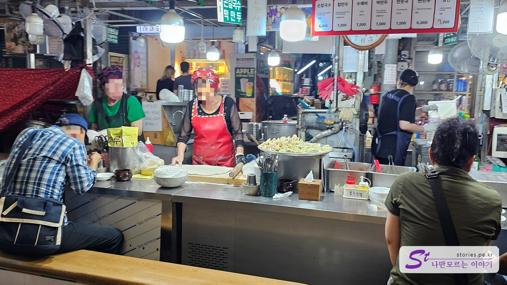
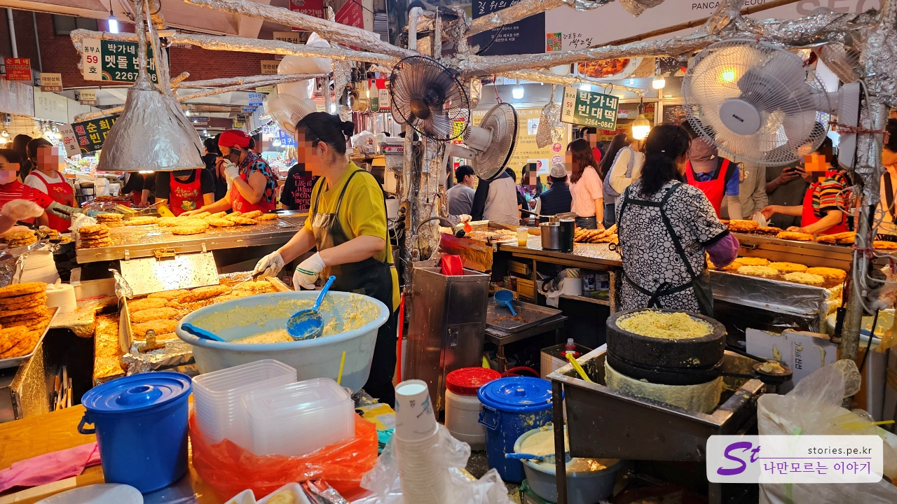
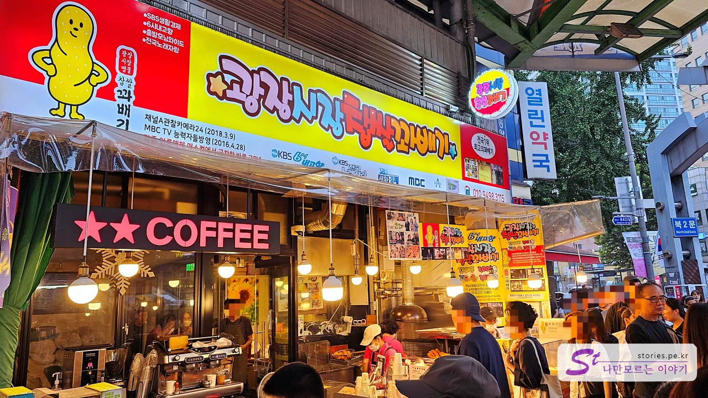
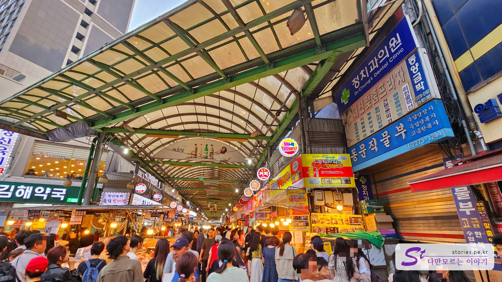

추석 연휴에 녹두전이 당겨서 광장시장을 방문했어요. 시간은 오후 5시쯤이었지만 사람들이 붐비더군요. 특이한 점은 외국인 관광객들도 많았어요. 아마도 광장시장의 명성이 국외에까지 퍼진 모양이겠죠?

저희는 청계천 쪽에서 출발했어요. 왼쪽이 방산시장이고 오른쪽이 광장시장입니다. 광장시장은 다양한 먹거리로 유명하죠.

청계천 쪽에서 광장시장으로 들어가는 입구에는 경주 십원빵 파는 곳에서 긴 줄이 서 있었어요. 경주 십원빵을 광장시장에서 파는 이유가 궁금해서 한 번 시켜봤어요.

가격은 개당 3,000원이었는데, 맛은 평범한 십원빵과 비슷했지만 모짜렐라 치즈가 들어가 있어 특이했어요. 그래도 긴 줄을 서서 먹을 가치는 아니었던 것 같아요.

경주에서 시작한 십원빵이 이제는 서울에서도 사 먹을 수 있게 되었네요. 도대체 유명한 이유가 뭐지?

십원빵을 하나 사 먹고 시장 안쪽으로 들어갔어요. 시장 골목에 역시나 먹거리들이 많이 있었어요.

### 만두, 칼국수, 비빔밥

광장시장 안으로 들어가니 먹거리 골목이 가득했어요. 비빔밥, 칼국수, 만두 전문 골목이었는데, 칼국수는 직접 반죽을 밀어서 주문받으면 끓여주고, 만두는 대량으로 주문을 받아서 파는 것 같았어요. 만두들이 모두 똑같은 모양이었기 때문에 맛은 알 수 없었지만 먹음직스럽게 보였어요. 비빔밥은 밥 위에 야채를 담아 내주는 스타일이었어요.

비빔밥은 남대문에서 먹어본 것처럼 밥 위에 야채를 담아서 내주는 식이에요. 진열대에 야채 그릇이 보이지요?  
만두나 비빔밥은 대략 6,000~7,000원 정도였어요. 적당한 가격이었죠.

생과일주스도 팔고 있었어요.

### 녹두빈대떡

광장시장의 가장 중앙에 위치한 박가네 빈대떡 골목에 도착했어요. 여기는 빈대떡, 육회비빔밥, 마약김밥으로 유명한 곳이에요.

  

가장 중앙에 있어서 사람도 많고 회전율도 좋은 박가네 빈대떡이에요.  
박가네 빈대떡은 포장해서 가져갈 수도 있고, 튀기기 전 반죽을 사서 집에서 만들어 먹을 수도 있어요.

계속 녹두를 갈면서 판매를 하고 있어요.

녹두전과 고기전이 둘 다 맛있었어요. 고기전은 사진에서 왼쪽에 있는 것이에요. 사람이 많아서 포장해서 집에서 먹기로 했어요. 녹두전과 고기전을 포장하고 굽기 전인 반죽도 한 통 구매해서 집에서 부쳐 먹었어요.  
녹두빈대떡의 가격은 5,000원이고, 고기 빈대떡과 녹두빈대떡 반죽 포장은 10,000원이에요.

원래는 없던 메뉴인데 추석이라 그런지 전도 파네요. 우리도 산적이 있는 전을 사 먹었는데 맛은 없었네요.

### 마약 김밥

마약김밥을 만드는 과정도 보고 왔어요. 김밥 집은 줄이 많지 않지만 맛은 좋아서 가보길 추천해요.

### 찹쌀 꽈배기

매스컴 덕분에 유명한 찹쌀 꽈배기 집이에요. 이곳도 항상 줄을 서야 먹을 수 있는 인기 매장이에요. 그럼에도 불구하고 회전율이 빠른 편이라 줄이 금새 줄어들어요.

꽈배기집은 십원빵집과 반대편 입구에 위치하고 있어요. 종로5가 큰길 입구 부근이에요.

맛도 좋고 가격도 비교적 저렴해서 부담 없는 먹거리라고 할 수 있어요.
