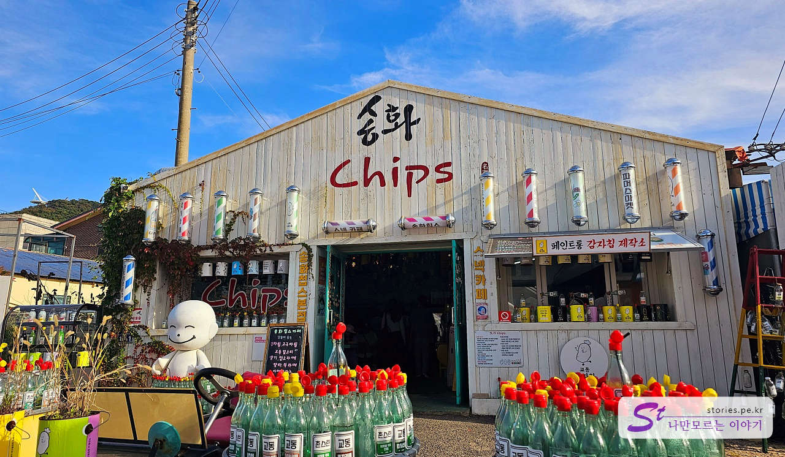
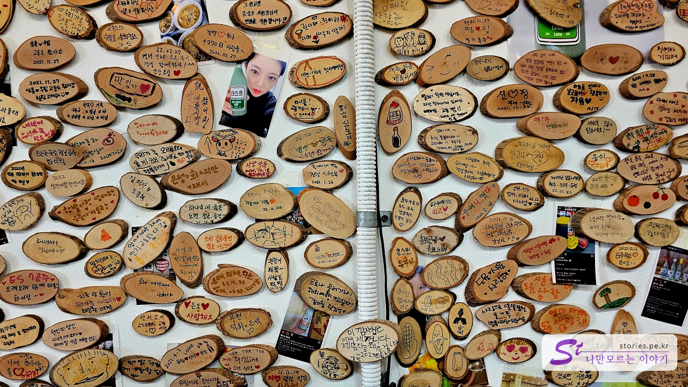
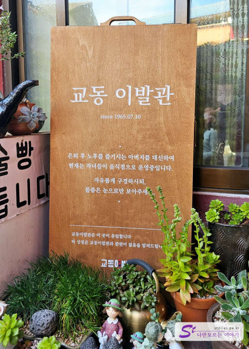

유행은 돌고 돈다고 사람의 손이 많이 닫지 않는 지역에 향수를 자극하는 레트로 시장이 있습니다. 지금에야 너무 많이 알려져서 사람의 손이 많이 닫는 지역이 되어서 이제는 골목을 지나가기가 힘들 정도로 사람이 많아졌습니다. 시장의 가게도 이제는 시골 시장의 느낌보다는 관광객을 위한 가게로 점점 바뀌어가고 있지만 그래도 아직 향수를 느낄 수 있는 장소이기도 합니다.
이곳을 가기 위해서는 강화도를 지나서 교동 대교를 건너야 하는데 그전에 출입등록을 해야 합니다. 교동도가 북한에 가까이 있어서 민간인 출입통제선(민통선)으로 되어 있기 때문입니다.

## 주차장

저희는 휴일에 방문해서 그런지 사람들이 많아서 제비집 앞 공용 주차장에 주차할 수 없어서 길 옆에 주차하게 되었습니다. 길 옆에 주차해도 따로 단속을 하는 것 같진 않았어요.

그렇게 주차를 하고 대룡시장으로 들어갔습니다.

## 송화칩

저희는 시장의 남쪽 방향으로 입장했어요. 시장에 들어가기 전에 특이한 컨셉의 건물이 있었는데 **송화 칩스**라는 카페였어요.

겉모습만 보면 이발소 같기도 하고 기름집 같기도 하고 페인트집 같기도 했어요.

페인트통에는 감자칩을 담아서 팔고 있었고, 참기름병에는 커피를 팔더라고요. 참기름병인데 아메리카노나 카페라떼를 담아서 판답니다. 아이디어가 참 신선했어요 ㅎㅎ

특이하지만 나름 아이디어가 좋은 카페였어요. 한 번쯤 들러보는 것도 좋을 것 같아요.

나무를 잘라서 낙서를 할 수 있게 푯말을 주더라고요. 무료로 주신다고 해서 하나 받아서 기념으로 걸어놓는 것도 괜찮을 것 같아요.

## 청춘부라보의 강아지떡

조금 더 들어가면 TV에서 자주 나오는 강아지떡집이 나왔어요. 인기가 좋아서 그런지 기다리는 사람들이 많았어요.

강아지떡을 파는 곳은 **청춘부라보**라는 집이에요. 여러 가지를 팔고 있지만 대부분 강아지떡을 사가지고 갔어요.

강아지떡은 찹쌀로 만든 매우 부드러운 떡이에요. 콩가루에 묻혀 팔고 있는데 부드럽기도 하고 맛도 좋았어요.

그림도 예쁘고 매력적이네요.

## 학교앞 문방구

역시나 향수를 자극하는 문방구가 있었어요.

이걸 아는 사람이라면 40대가 넘었을 겁니다. 말의 줄에 연결된 럭비공처럼 되어 있는 공을 누르면 말의 다리가 움직이면서 앞으로 이동하는 말 장난감이에요. 예전에는 이걸로 경기도 많이 했었는데...

## 뚱이 호떡

방송에서 많이 소개된 뚱이 호떡 가게예요. 호떡이 엄청나게 잘 팔리고 있었어요. 핫도그도 팔고 있었는데 우리는 다 호떡을 사서 먹었어요. 뜨거운 호떡을 입천장이 데지 않게 호호 불며 웃으며 먹었죠.

가격은 예전에 비해 올랐지만 그래도 너무 비싼 편은 아니었어요. 현금이 없다면 계좌 이체도 가능하다고 해요. 하지만 카드는 안 된 것 같았어요.

다양한 쌀강정도 판매하고 있었어요. 생각보다 바삭하고 맛도 좋았어요. 우리도 한 봉지 사서 먹었어요. 카드는 환영하고 현금은 더 환영한다고 써 있네요. ㅎㅎ

시장의 중앙에는 꽃차를 파는 곳이 있었어요. 남자들은 별로 관심이 없었는데 여자들은 그냥 지나치지를 못했어요. 꽃차가 예쁘고 아기자기해서 매력적이었어요.

골목 골목이 레트로 분위기를 풍기네요.

임득남 미용실이 웃기면서도 재미있었어요. 실제로 미용실을 운영하는 건 아닐 테지만요? 다른 골목에는 이발소도 있더라고요. ㅎㅎㅎ

다른 호떡집이 또 있었어요. 교동호떡인데 뚱이호떡이 방송에 더 자주 나와서 그런지 사람들이 더 줄서 있는 것 같았어요.

시골다방 같아요. 시골 다방 분위기가 느껴지지만 판매하는 티각태각은 관광지의 시장마다 판매하는 브랜드인 것 같아요. 예전에 동해의 시장에서도 같은 브랜드를 봤었고, 심지어 코스트코에서도 똑같은 브랜드를 본 적이 있어요.

우물 카페가 보여요. 예전에 이곳이 이 마을의 우물이 있던 자리라서 카페 이름을 그렇게 지었을 거예요. 들어가보진 않아서 카페 분위기가 어떤지는 잘 모르겠어요.

## 교동 이발관 국수집

교동 이발관이었어요. 간판은 이발관이지만 이곳에서는 이발이 아니라 국수를 팔고 있었어요. 맛도 상당히 좋았고요. 원래는 오랫동안 이발소로 운영되었던 곳이었지만 지금은 식당으로 운영되고 있었어요. 시대의 흐름에 따라 업종을 바꾼 것 같아요. 그래도 한쪽에는 이발소의자도 있고 간판도 바꾸지 않은 것을 보면 컨셉을 유지하고 있는 것 같았어요.

국수는 6,000~7,000원 정도라 비싸지 않았고 맛도 상당히 좋았어요.

원래는 아버지가 운영하던 이발소였는데 자녀들이 컨셉을 유지하면서 음식점으로 사용한다고 적혀 있네요.

1박 2일에서 은지원이 머리를 깍았던 그 이발소였어요.

새롭게 오픈하는 양조장도 있었어요. 양조장 앞에 항아리를 엎어놨는데 의자 역할도 하고 마당 역할도 해서 너무 좋았어요. 카페 같기도 하지만 아직은 오픈 전이라 지나가다 다리 아픈 사람들이 많이 앉아 있었어요. 양조장이니 이곳에서 막걸리나 술을 커피처럼 간단하게 판매하면 많이 사먹지 않을까 갑작스럽게 아이디어가 떠올랐어요.

반대편인 북쪽의 시장 입구였어요.

## 인근 관광지

> [[강화 가볼만한 곳] 강화도 교동 화개정원과 모노레일 바로가기](https://blog.stories.pe.kr/628)

인근에 화개정원과 모노레일, 그리고 전망대가 있어서 교동시장과 함께 여행 코스로 잡으면 정말 좋아요. 특히 주말이나 휴일에는 사람이 많아서 모노레일을 타려면 2~3시간을 기다려야 하는 경우도 있어요. 그래서 교동도에 먼저 도착해서 모노레일 탑승표를 예약하고, 기다리는 동안에 대룡시장을 구경하고 시간을 맞춰서 화개정원의 모노레일을 타는 것이 좋아요.
