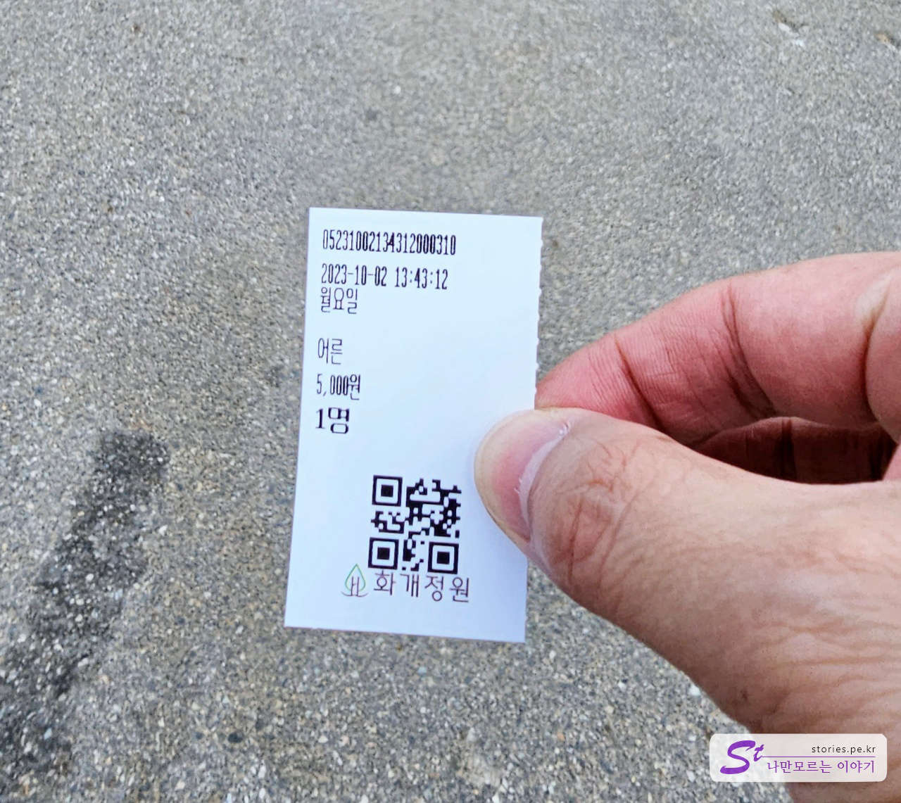
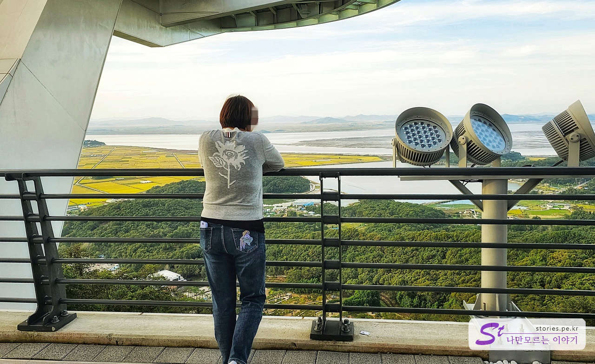

대룡 시장은 강화도 교동에 있는 유명한 관광지입니다. 최근에 또 다른 멋진 관광지가 새롭게 개발되었는데 대룡 시장과 함께 관광하기에 딱 좋을 거 같아요.

우선 화개산 모노레일에서 2~3시간 후에 탑승할 수 있게 표를 예매하시는 게 좋습니다. 기다리는 동안에 대룡 시장을 구경하시면서 기다리시면 좋을 거예요.

주차는 모노레일 건물 앞에 주차장이 있습니다. 그곳이 만차일 경우에는 아래에 큰 주차장이 있으니 주차 걱정은 하지 않으셔도 됩니다.

모노레일 건물은 매우 눈에 띄므로 찾기는 어렵지 않습니다.

화개산 모노레일을 이용하려면 먼저 화개정원 입장권을 따로 구입해야 해요. 화개정원에는 물의 정원, 문화정원, 평화의 정원, 추억의 정원, 그리고 치유의 정원이 있어요. 화개산 전망대까지 걸어서 올라갈 수 있으며 전망대에서 모노레일을 타고 내려오면서 구경하는 것도 좋을 거예요.

화개정원 입장료는 어른 기준으로 5,000원입니다. 화개정원 입장료는 모노레일 이용료와 별개이기 때문에 먼저 입장권을 구입한 뒤 건물 내부로 들어가서 모노레일을 다시 예약해야 해요.

화개정원을 들어갈 때 이렇게 표를 잘라서 주시는군요. 잘 보관하고 있다가 대 시장 구경 후에 다시 모노레일을 타러 돌아올 때 화개정원 입장 시에 보여줘야 재입장이 가능하다고 하네요.

> [[강화도 가볼만한 곳]오래 전 모습을 간직하고 있는 교동 대룡시장 방문기 바로가기](https://blog.stories.pe.kr/627)

대룡 시장을 구경하고 다시 화개정원으로 입장했습니다. 모노레일 탑승 시간까지 약간의 여유가 있어서 화개정원의 물의 정원까지만 구경했어요.

모노레일 탑승은 건물의 2층으로 올라가야 합니다.

모노레일의 탑승권은 여기 2층에서 탑승 시간을 선택하고 구매할 수 있어요. 예상보다 인기가 많아서 자리가 부족할 수도 있으니 가능한 빨리 가서 예약하는 게 좋습니다.

가격은 일반 왕복 기준으로 12,000원이에요. 곧 15,000원으로 다시 올라갈 것 같아요.

이렇게 표를 받을 수 있습니다. 저희는 오후 5시 10분 탑승으로 예약을 했습니다. 나중에 탑승할때 보여줘야 합니다.

2층에 빵집카페도 있어서 커피를 마시며 기다릴 수도 있습니다.

카페의 안쪽으로 조금 들어가면 게임기들도 몇개 있습니다. 어른들이 동심으로 돌아가는 시간이였습니다.

모노레일의 이용 안내와 전망대 이용 안내는 위의 입간판을 참고하면 되겠네요. 모노레일 상행과 하행을 합치면 40분 동안 타게 됩니다.

저희는 오후 5시 10분 탑승이라 5시까지 대기의자에 앉아서 기다렸습니다. 드디어 모노레일을 탑승합니다.

모노레일은 매우천천히 올라가는데 화개정원의 측면을 따라 올라가면서 멀리 바다까지 볼 수 도 있었습니다.

그렇게 올라가면 산 정상에 종점이 보입니다. 여기에서 5분정도 걸어가면 화개산 전망대로 올라갈 수 있습니다.

화개산 전망대가 보이네요. 강화도의 상징새인 저어새를 본따서 만들었다고 하는데, 어디가 닮았는지는 잘 모르겠네요. ㅎ

전망대 오르기전 1층에서도 고구저수지와 북쪽바다를 멋지게 볼 수 있습니다.

드디어 전망대에 올랐습니다. 바닥이 유리로 되어있는 스카이워크로 되어 있어서 아찔한 기분을 느낄 수 있습니다.

전망대가 아찔하게 설치가 되어있습니다.

전망대에는 스카이워크뿐만 아니라 바람과 비를 피할 수 있는 실내 공간도 있어요. 겨울에는 춥고 여름에는 더울 수 있으니 잠시 추위와 더위를 피할 수 있는 공간이 정말 유용할 거예요.

오후 5시에 올라갔기 때문에 멋진 낙조를 볼 수 있었어요. 낙조는 매일매일 있겠지만 운이 좋아야 정말 멋진 낙조를 만날 수 있어요. 우리도 정말 운이 좋았습니다.

해가 지는 멋진 낙조를 보고 멋진 사진도 하나 찍을 수 있었어요. 정말 운이 좋았어요. 실제로 보면 눈을 떼지 못할 정도로 아름답습니다. 제 삶도 이렇게 멋지게 마무리되었으면 좋겠네요.

그렇게 구경하고 대략 7시쯤에 다시 모노레일을 타고 내려왔습니다. 10월달이라 그런지 화개정원도 벌써 어두워졌네요.

## 비용

- 화개정원 입장료 : 5,000원
- 모노레일 왕복 : 12,000원

## 운영 시간

- 운영 시간 : 매일 09:00 - 18:00
- 소요시간 : 왕복 대략 1시간 30분 ~ 2시간 정

## 여행지 정보

- 주소 : 고구리 산233
- 연락처 : 032-932-2336

<iframe src='https://www.google.com/maps/embed?pb=!1m18!1m12!1m3!1d8918.54001303898!2d126.28819681817704!3d37.78581977388152!2m3!1f0!2f0!3f0!3m2!1i1024!2i768!4f13.1!3m3!1m2!1s0x357c736b0afad7e1%3A0xd79c60e97c4733e2!2z7ZmU6rCc7KCV7JuQ!5e0!3m2!1sko!2skr!4v1697381827131!5m2!1sko!2skr' class='embed-responsive-item' allowfullscreen></iframe>

