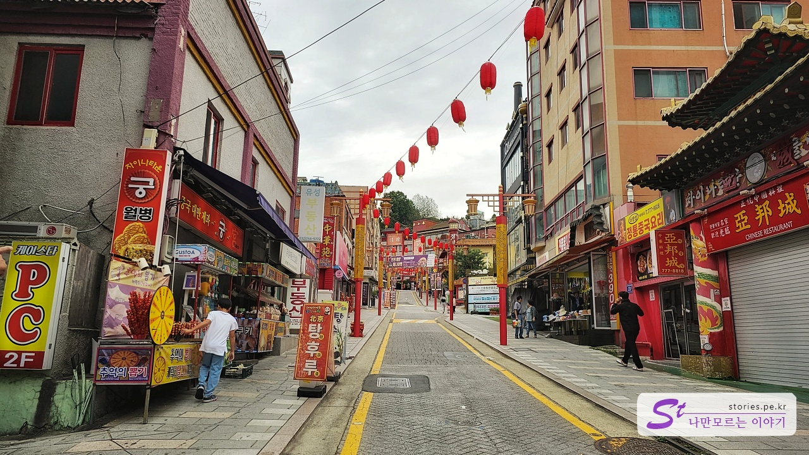
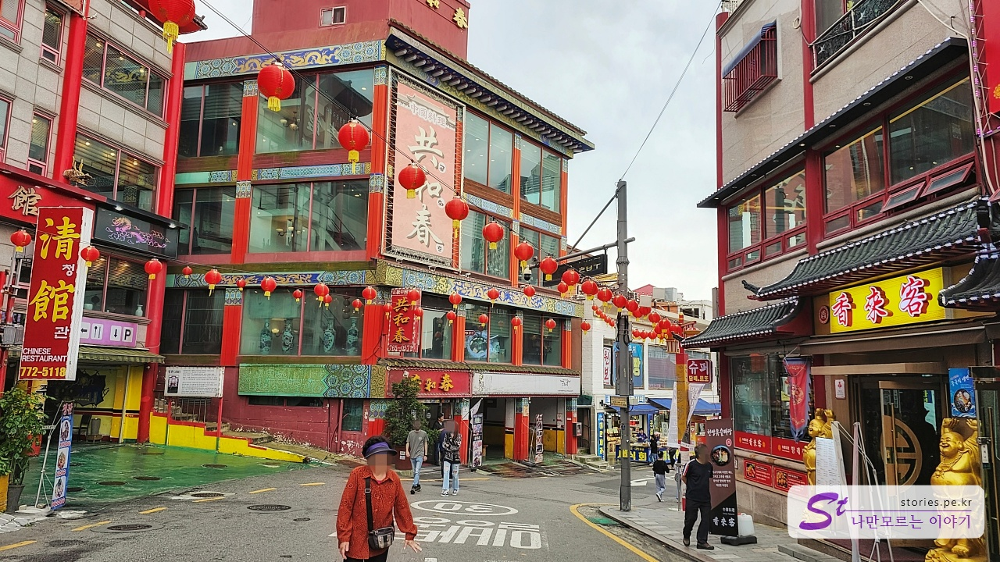
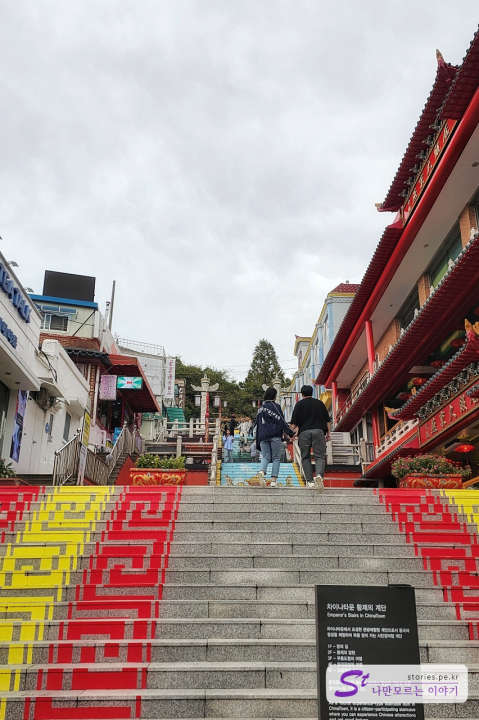
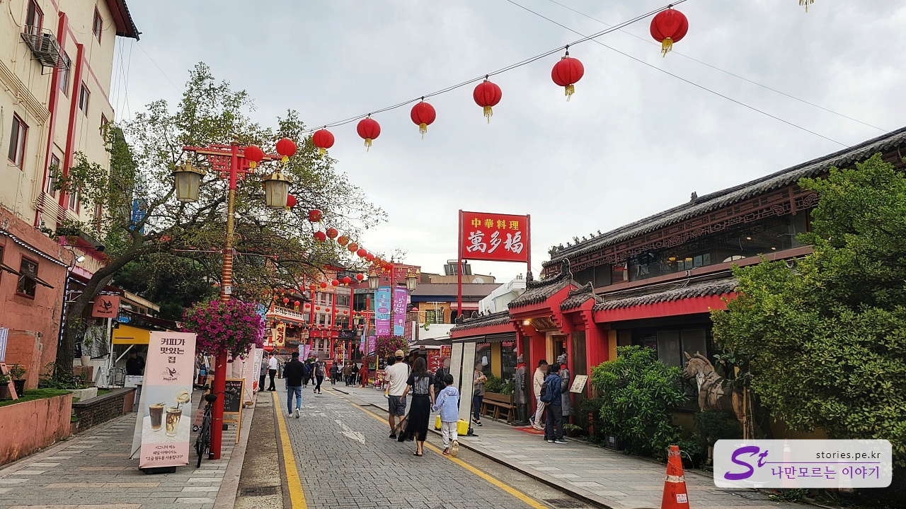

거의 5년 만에 찾아본 차이나타운입니다. 아침 일찍 가게가 오픈전에 방문해서 그런지 사진에서의 모습은 다소 한산합니다. 차이나타운에 있는 공영주차장에 주차를 했습니다.

공영주차장에 주차를 하고 차이나타운 매인 스트리트로 올라가는 길입니다. 아직 문이 열리지 않은 곳이 많이 있네요.

예전에는 양 꼬치에 쓰란 발라 먹는 것이 그렇게 맛이 좋았었는데, 이번에는 양 꼬치를 파는 가게가 많지 않아서 약간 섭섭한 느낌이 들었습니다.

아침 겸 점심으로 공화춘에서 코스요리를 먹고 나오니 사람들이 북적북적 많아졌습니다.

차이나타운에서 방귀께 나 낀다는 공화춘과 청관, 연경이 모여있는 거리입니다. 아직 한산하네요.
연경은 10시 30분에 오픈을 하고 공화춘은 10시에 오픈을 합니다. 저희가 10시쯤 도착을 했기 때문에 그냥 공화춘으로 들어가서 식사를 했습니다.
식사는 코스요리인 A 커플코스를 먹었는데 저는 가격에 비해 별로 마음에 들지는 않았습니다. 그냥 짜장면이나 먹을걸.... ㅠㅠ

연경 식당 옆으로 이어져있는 자유 공원으로 올라가는 계단입니다. 여기도 자리 잘 잡고 찍으면 사진 잘 나오는 포토 스폿입니다.

송월동 동화마을로 내려가는 길입니다. 저희도 동화마을을 한 바퀴 돌긴 했으나 세월의 흔적으로 인해 약간 흉물스러운 느낌이 있었습니다. 아니면 내가 동심을 잃어버린 걸 수도 있고요. (차마 사진을 찍지는 못했어요)

이번 차이나타운에서는 사진을 많이 찍지 못했네요.
