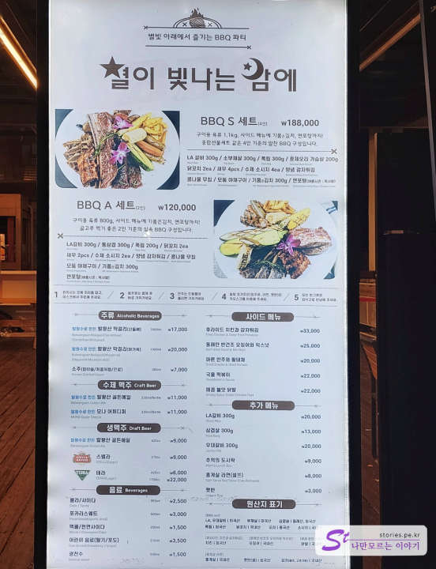

홈쇼핑에서 구매한 용평리조트 패키지권으로 1박 2일 여행을 다녀왔습니다. 이번 포스팅에서는 숙소 위주로 소개해드릴게요.

전체적으로 숙소가 오래돼서 낡긴 했으나 국내 대표 리조트라서 그런지 깔끔하게 유지는 되고 있는 느낌을 받았습니다. 저희가 묵었던 숙소는 모나 용평리조트의 드래곤밸리호텔입니다.

## 드래곤밸리 호텔

드래곤밸리 호텔은 지하주차장이 없습니다. 입구 앞에 몇 개의 주차장이 있고 건물 뒤로 돌아가면 상당히 넓은 주차장이 있습니다. 전기차 급속충전기가 1대 있고 완속 충전기가 2대 있습니다.

체크인하는 모습은 찍지 못했습니다. 원래는 **디럭스 더블**로 구매를 했으나 평일이라 그런지 **스위트룸**으로 업그레이드를 해주었습니다. 횡재!!!
체크인을 하고 로비의 오른쪽으로 걸어가다 보면 숙소로 올라갈 수 있는 엘리베이터가 있습니다.

복도를 지나 배정받은 스위트룸으로 들어갔습니다.

스위트룸은 거실과 침실이 따로 있어서 2명이 이용하기에는 상당히 넓었습니다. 시설은 낡았으나 청소는 잘되어 있었습니다.

소파에서 볼 수 있는 TV와 침실에서 볼 수 있는 TV로 총 2대가 있습니다.  
책장에는 성경, 경전 등이 있었고 통일교에서 운영하는 리조트라 그런지 통일교 교리도 있었습니다. (참고로 난 기독교인데... 모르고 왔음 ㅡㅡ;)

입구의 왼쪽으로 옷장이 있고 욕실이 있습니다. 옷장에는 털리기 쉽게 생긴 금고가 있고 목욕가운이 걸려있었습니다.

1개만 있어도 될 세면대가 쓸데없이 2개나 있을 정도로 욕실이 상당히 넓었습니다. 수건도 2명이 2일 동안 충분히 쓸 수 있게 비치가 되어 있었구요.

세면대 왼쪽에는 일을 보고 자리에서 일어나면 자동으로 물내림이 되는 고급스러운 양변기가 있습니다.

안쪽으로 TV가 있는 침실이 있습니다. 스키 슬로프를 바라볼 수 있는 커다란 창문이 달려있습니다.

침대는 상당히 고급스럽게 생겼지만 누워보면 무슨 합판 위에 누워있는 편안함이었습니다. (깨끗해 보여도 많이 낡긴 했어요~) 침대 머리받이도 낡아서 헤어져 있었어요. ㅠㅠ 이 정도면 벽 갈이 정도는 해야 할 것 같은데... 아쉽습니다.

창문에서 보이는 스키 슬로프로 인해 개방감이 너무 좋았습니다. 지금은 저녁이라 루미나리에도 보이고 식당과 공연장도 보이고..

저~ 위쪽에는 글램핑장도 보이네요. 저녁 9시쯤 됐는데 조명 때문에 그런지 사람들이 많이 나와서 즐기고 있었습니다.

루미나리에 불빛에 이끌리어 저희도 피곤하지만 어쩔 수 없니 내려가 봤습니다. 드래곤밸리호텔에서 바로 편하게 나갈 수 있는 통로가 있었습니다.

루미나리에 정문이 떡하니 서 있어서 사진 찍기에도 무척 좋았습니다.

모나 파크라고 쓰여있네요. 모나는 대자연을 뜻하는 **Mother Nature**의 앞 글자를 따서 만들었다고 하네요.

양옆으로 조명으로 만들어진 길이 쭉~ 이어져 있습니다.

잔디밭 쪽으로는 시원한 물을 뿜고 있는 분수가 있습니다. 여기도 포토스팟이네요.

잔디밭에서 산책도 하고 캐치볼도 하고 다양하게 즐기고 있는 사람들 때문에 더 생동감이 있어 보였습니다.

한쪽에는 바비큐장이 있었습니다. 야외의 테이블도 있고 파라솔 아래에서 가족들과 여럿이 먹을 수 있는 장소도 있었습니다.

9시라 그런지 거의 파장하는 느낌이었습니다.

식사는 **별이 빛나는 밤에** 에서 구매를 해서 먹을 수 있습니다. 가격은 좀 비싼 편이긴 한데.. 뭐.. 놀러 왔는데.. 이 정도는..

바비큐 가격이 좀 후덜덜 하긴 합니다.

이제 모닥불도 거의 꺼져가네요.. 우리도 30~40분 정도 돌아보고 숙소로 올라갔습니다.
