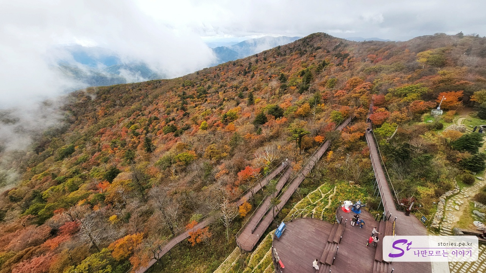
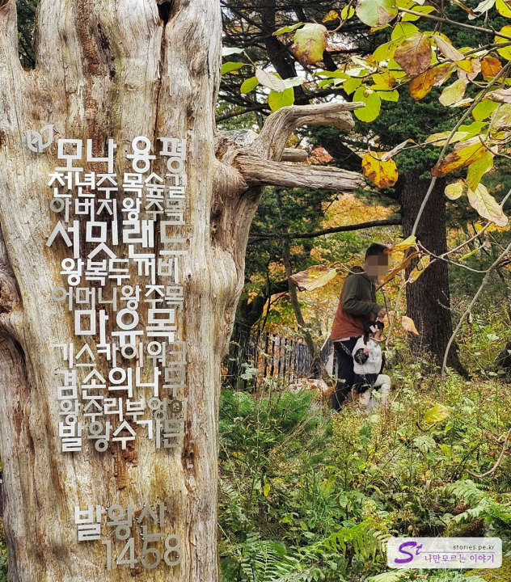

용평 리조트 드래곤밸리 호텔에서 숙박을 하고 같이 패키지로 묶여있는 발왕산 케이블카를 타러 갔습니다.  
케이블카는 드래곤플라자 건물의 2층에 있고 성인 기준으로 25,000원으로 탑승이 가능합니다. 상당히 긴 거리를 올라가기 때문에 케이블카 탑승 자체를 즐기기에도 비용이 아깝지 않습니다.

드래곤플라자로 들어서면 1층에 간식이나 음료, 기념품을 살수 있는 Shop이 있습니다. 스키 비수기이면서 아침이라 그런지 사람들이 많지는 않았습니다.

케이블카를 타기 위해서는 2층으로 올라가야 합니다.

우리가 탈 때는 대기인원이 좀 있기는 했지만 100여 대의 케이블카가 쉼 없이 운행을 하고 있기 때문에 바로바로 빠져서 금방 우리가 탈 차례가 왔습니다.

왕복 약 7.4Km, 해발 1,458m 높이까지 올라가는 국내 최대 길이의 케이블카라 이 자체만을 즐기기에도 만족스럽습니다.

케이블카에서 바라본 풍경은 너무 아름답고 멋집니다.

대략 20분 정도 오르면 발왕산 꼭대기에 있는 모나파크에 도착을 합니다.
아래에서는 날씨가 맑았었는데, 아쉽게도 산꼭대기에는 구름이 잔뜩 끼어 있었습니다. 다행히 몇 시간 지나자 다시 날씨가 맑아져서 좋은 풍경은 보고 내려왔네요.

모나파크에 내리면 중국 사람들이 좋아할 만한 아주 눈에 띄는 황금색 빨간 배경의 의자가 하나 있습니다. 사진 찍으라고 놔둔 것 같은데.. 사람들이 줄지어 사진 찍는 거 보면 촌스러워도 인기가 좋기는 합니다.

스카이워크를 가기 위해서는 4층으로 올라가야 합니다. 특별히 운동을 할 게 아니라면 엘리베이터를 타고 올라가는 것을 추천드립니다. 생각보다 많이 올라가더라고요.
여기는 4층의 통창에서 바라본 발왕산 풍경입니다.

천년주목숲길이 연결되어 있는 나무 데크가 보이네요. 여기도 걸어볼 예정입니다. 거리가 조금 있지만 나무데크로 되어 있어서 걷는데 부담스럽지 않으니 꼭 한번 걸어보시기를 추천드립니다.

이제 스카이워크로 나가 보겠습니다. 원형길을 통과하여 밖으로 나가면 하늘에 떠있는 듯한 느낌을 받게 됩니다.

아쉽게도 구름이 잔뜩 껴있어서 저 멀리 풍경을 바라볼 수가 없네요. 저번에 왔을 때도 이랬었는데, 좋은 풍경을 보는 것을 쉽게 허락하지 않습니다.

반대쪽을 보면 겨울에만 운영하는 슬로프가 보입니다. 이제 내려가서 파크 구경도 하고 천년주목숲길도 걸어볼까 합니다.

파크 앞쪽에도 다양하게 구경하고 사진을 찍을 수 있는 장소가 많이 있습니다. 이 앞부분만 구경하고 내려가도 나쁘지는 않습니다.

사진 찍기 좋게 무지갯빛 의자가 놓여있어서 많은 사람들이 배경으로 사진을 찍고 있었습니다. 우리도 줄을 잠시 서서 사진을 찍어봤네요.

이제 반대쪽 방향에 있는 **천년주목숲길**을 걸어 보려고 합니다. 여기를 걸으면서 잠시 발왕산 꼭대기와 평창평화봉까지 갔다 오려고 합니다. 한 바퀴 도는데 대략 1시간 ~ 1시간 30분 정도 생각하시면 되고 그렇게 힘이 들지는 않습니다.

가을이라 그런지 핏빛 같은 붉은색의 단풍이 눈에 들어와서 한번 찍어봤습니다.

한 5분쯤 들어가면 **겸손의 나무** 앞에 발왕산 정상에 있는 평창평화봉으로 길이 안내되어 있습니다. 여기는 비포장도로이기 하나 그렇게 어렵지는 않습니다. 그리 멀지 않으니 다녀와도 부담스럽지 않습니다.

머리를 숙이고 지나가야 한다고 해서 겸손의 나무라고 이름을 붙였네요. 여기 말고도 한 바퀴 도는 와중에 겸손의 나무가 몇 개 더 있었습니다.

이 정도의 비포장도로의 전형적인 산길을 지나가야 합니다.

약 10분 정도 걸어가면 정상을 도달하게 되며 **평창 평화봉**이 눈에 들어옵니다.

그리고 바로 옆에 1458m라고 적혀있는 발왕산 정상 비석이 서 있습니다.

다시 왔던 길로 내려옵니다. 다시 겸손의 나무가 있는 쪽으로 지나오시면 됩니다.

여기서부터 **천년주목숲길**로 이어지는 나무데크길이 나타납니다. 길 이름처럼 약 천 년간 살아오고 있는 멋진 주목나무들이 곳곳에 있습니다.

가을이라 그런지 단풍도 너무 이쁘네요.

이 나무가 **어머니왕주목** 나무입니다. 정말 거대하고 아름답네요.

여기도 천년은 되지 않았지만 주목나무가 흐드러져 있습니다.

물이 있는 곳에는 이끼도 있고요. 아주 깨끗하게 관리가 되고 있었습니다.

속이 파여있는 오래된 주목나무의 안쪽에서 위를 바라보고 찍은 사진입니다. 이렇게 찍어보라고 표지판에 안내가 되어 있네요. ㅎ

정말 오래되고 거대한 주목나무입니다. 이 나무가 **아버지왕주목** 나무입니다. 위에 있던 어머니왕주목나무에 비해 더 거대하네요.
여기가 가장 아래쪽입니다. 이제 위쪽으로 올라가면서 케이블카 탑승장으로 가시면 됩니다.

타이포가 이뻐서 찍어봤어요.

이곳은 유난히 다람쥐가 많이 있더라고요. 여러 군데에서 봤는데, 마침 나무 위에서 열심히 식사 중에 있어서 한번 집중해서 찍어봤습니다.

너무 귀엽네요.

이렇게 부엉이 조각상이 나타나면 거의 입구에 도달한 것입니다.

그리고 바로 서울대 나무가 보입니다. 여기를 만지면 서울대 가는 줄 알았는데, 그냥 모양이 서울대 출입구처럼 생겨서 서울대 나무라고 한 것이네요.

이렇게 한 바퀴를 돌아서 케이블카 탑승장에 도착했습니다.
저희는 출발할 때 날씨가 좋지 않아서 스카이워크를 제대로 즐기지 못했었지만 천년주목숲길을 돌고 오니 다시 날씨가 맑아져서 다시 한번 스카이워크에 올라가서 멋진 풍경을 보고 내려왔습니다.

## 비용

비용은 케이블카 비용만 있으면 되고 성인 기준 25,000원입니다.

- 대인(왕복) : 25,000원
- 소인(왕복) : 21,000원

## 운영 시간

- 운영 시간 : 09:00 - 17:00
- 휴무일 : 매주 월요일 정기휴무
- 소요시간 : 케이블카 탑승만 왕복 대략 40분 정도 소요되며 천년주목숲길까지 다녀오시려면 2시간 정도 잡으시면 됩니다.

## 여행지 정보

- 주소 : 강원 평창군 대관령면 올림픽로 715
- 연락처 : 033-330-7423
- URL : https://www.yongpyong.co.kr

<iframe src='https://www.google.com/maps/embed?pb=!1m18!1m12!1m3!1d3159.237739144103!2d128.68016993218924!3d37.64361444350984!2m3!1f0!2f0!3f0!3m2!1i1024!2i768!4f13.1!3m3!1m2!1s0x35618bbda182d507%3A0xbbafd7bd44af7294!2z67Cc7JmV7IKwIOq0gOq0key8gOydtOu4lOy5tA!5e0!3m2!1sko!2skr!4v1697730455930!5m2!1sko!2skr' class='embed-responsive-item' allowfullscreen></iframe>

