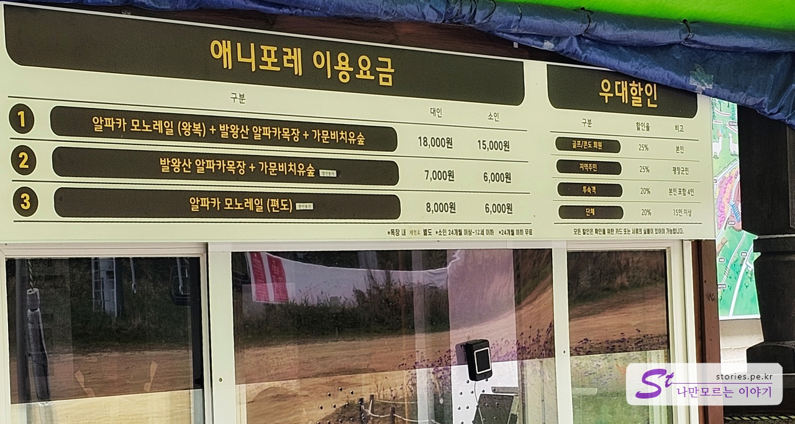
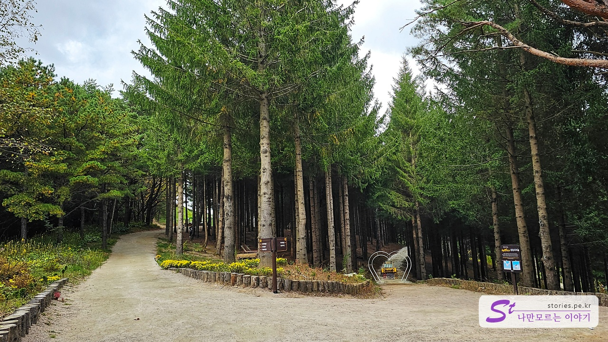
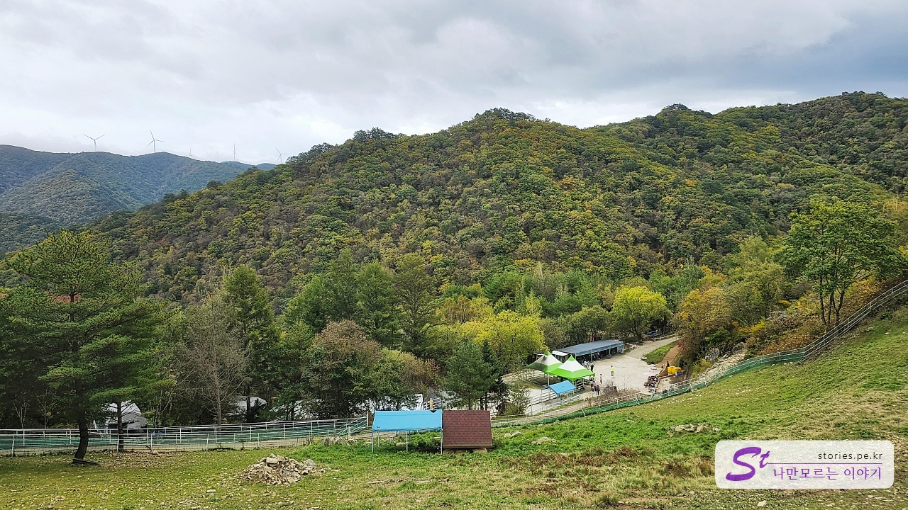

많이 기대를 하지 않았지만 매우 만족스러웠던 곳이 용평리조트의 **애니포레**였습니다. 아기들이나 구경하는 곳이겠거니 했지만 막상 가보니 너무 마음에 들었습니다. 가문비나무숲은 아이들뿐만 아니라 어른들이나 연인들에게도 매우 좋은 데이트 코스였습니다.

먼저 모노레일 타고 올라가서 가문비 치유숲과 알파카 목장을 둘러보고 다시 모노레일을 타고 내려오는 기본 코스가 성인 18,000원, 소인 15,000원입니다. 편도도 있지만 거의 대부분은 첫 번째 기본 코스를 이용합니다.

날씨도 쌀쌀하고 모두들 기대를 하지 않아서 그런지 기다림 없이 모노레일을 타고 올라갈 수 있었습니다. 순환하는 모노레일이라 바로바로 다음 차가 옵니다.

모노레일은 2명이 앉을 수 있는 의자가 3줄로 되어 있습니다. 대략 5분~10분 정도 올라가게 됩니다.

차 안에는 안전 수칙이 있으니 올라가면서 읽어보세요.

모노레일의 종착역쯤 오면 창밖으로 보라색 꽃들이 피어 있는 것을 볼 수 있습니다.

종착역에도 안전을 위해 역무원이 계십니다. 요기에서 내리게 됩니다.

어설프지만 둥그런 비닐하우스 통로를 지나면 멋진 가문비 숲이 나타납니다.
비도 살짝 오고 날씨도 추워서 인지 사람이 별로 없어서 좋았습니다.

드디어 애니포레에 도착을 했습니다. 원래는 화전민이 살던 곳이었는데 1968년에 화전민이 떠난 자리에 가문비나무를 심어서 지금의 숲이 이루어졌다고 합니다.

바로 알파카 목장의 입구가 보입니다.

대문을 들어가면 오른쪽과 왼쪽으로 길이 나누어져 있습니다. 길이 연결이 되어 있기 때문에 아무 쪽으로 나 이동해도 됩니다.
사진의 왼쪽으로 가면 **라온 목장길**로 가는 방면이고 오른쪽은 **가문비나무 숲길**로 가는 길입니다.

라온 목장 길로 조금만 더 들어가면 알파카 나뭇조각 상이 보입니다. 여기서도 동일하게 왼쪽이 라온 목장 길, 오른쪽이 가문비나무 숲길입니다.

라온 목장 길로 가면 그네도 있고 목장도 있습니다.

가문비나무숲은 배경이 너무 아름답습니다.

사진기가 있다면 어디서나 영화의 한 장면과 같은 사진을 찍을 수 있습니다.

이렇게도 저렇게도 한번 찍어봤어요.

나무를 활용해서 테이블도 만들어놨네요. 앉기에는 조금 부담스러웠어요

어디서 많이 봤던 나의 뱃살을 시험해 보는 필수 코스입니다. 뻔한 줄 알면서도 기어이 여기를 통과해 봐야 직성이 풀리네요.

라온 목장 길로 가다 보면 포토 스폿이 보입니다. 사진 한 장 찍어봐야죠

올라가다 뒤를 돌아보면 저 멀리에 발왕산 꼭대기에 있는 스카이워크가 보입니다.
발왕산 스카이워크에 대한 포스팅을 보려면 아래 링크를 참고하세요.

> [용평리조트 발왕산 케이블카 타고 천년 주목나무 숲길 방문기](https://blog.stories.pe.kr/631)

바로 하늘 그네가 있습니다. 하늘을 보면 그네를 타면 하늘을 나는 듯 아찔한 경험을 할 수 있습니다.

옆쪽으로 커다란 목장이 보이고 그 안에 모나파크 글자가 보입니다.

여기는 양떼 목장입니다. 사진에는 잘 보이지 않지만 양들이 사진 가운데 있는 집에 옹기종기 모여서 쉬고 있습니다.

사육사 아저씨가 사료를 가져가자 부지런한 놈들부터 우르르 밥을 먹으러 나오더라고요

조금 내려가면 알파카 농장이 있습니다. 저는 실제로 알파카를 처음 보네요. 생각보다 너무 귀엽게 생겼더라고요. 위의 사진은 아기 알파카입니다. 매우 시크하네요.

여기는 여러 마리의 어른 알파카들이 있습니다. 암컷과 수컷이 있고 수컷은 꼭 암컷이 오줌 싼 곳에 오줌을 또 싼다고 하네요.

알파카 형제들입니다.

## 비용

- 알파카모노레일(왕복)+발왕산 알파카목장+가문비치유숲
  - (대인) : 18,000원
  - (소인) : 15,000원
- 발왕산 알파카목장+ 가문비치유숲
  - (대인) : 7,000원
  - (소인) : 6,000원
- 알파카모노레일(편도)
  - (대인) : 8,000원
  - (소인) : 6,000원

## 운영 시간

- 매표시간 : 09:30 - 16:30
- 모노레일 운행시간 : 09:30 - 17:30
- 소요시간 : 왕복 대략 1시간 30분 ~ 2시간 정

## 여행지 정보

- 주소 : 강원 평창군 대관령면 올림픽로 715 애니포레
- 연락처 : 033-330-7166
- URL : https://blog.naver.com/anifore2019

<iframe src='https://www.google.com/maps/embed?pb=!1m18!1m12!1m3!1d789.8521765487028!2d128.68504768307727!3d37.639594318404306!2m3!1f0!2f0!3f0!3m2!1i1024!2i768!4f13.1!3m3!1m2!1s0x35618be734c00797%3A0xa2cc8f79325efde0!2z7JWg64uI7Y-s66CIIOuNlCDqs6jrk5wg7KO87LCo7J6l!5e0!3m2!1sko!2skr!4v1697814975372!5m2!1sko!2skr' class='embed-responsive-item' allowfullscreen></iframe>
 

