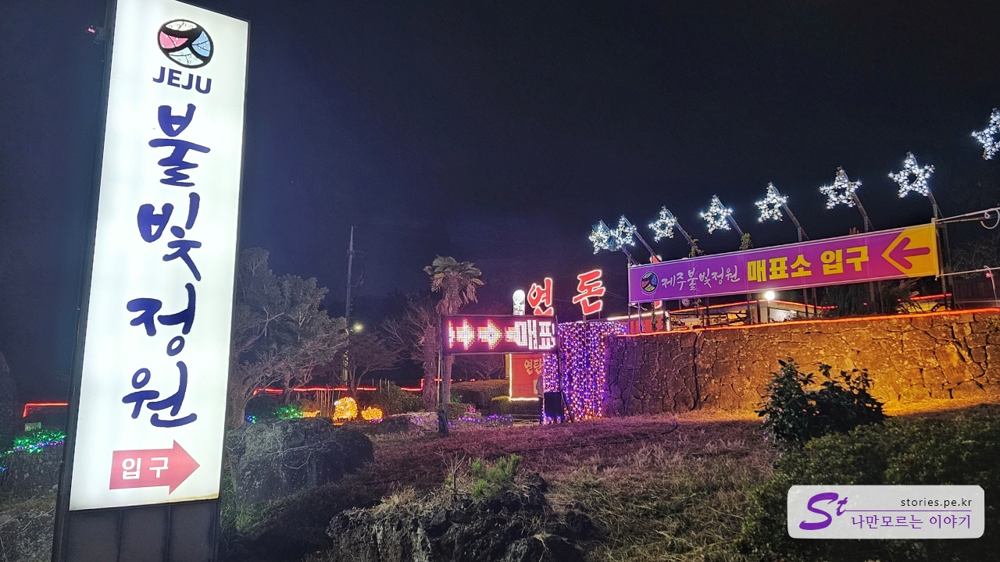
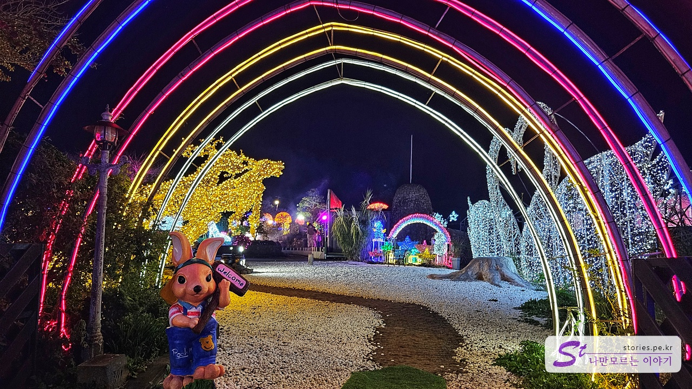
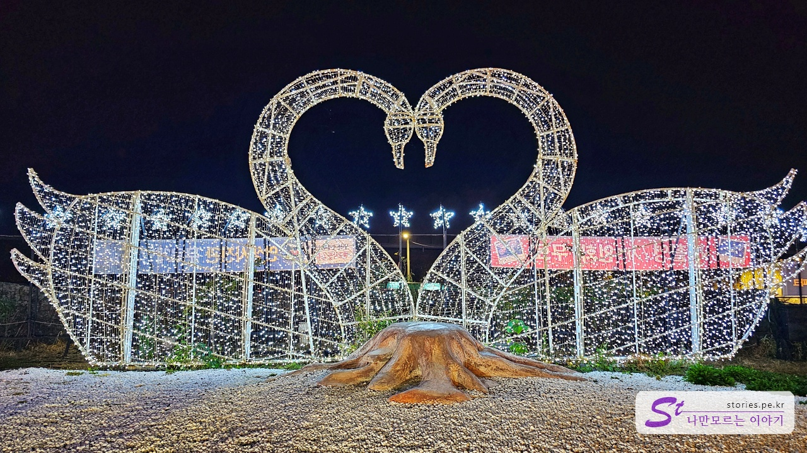
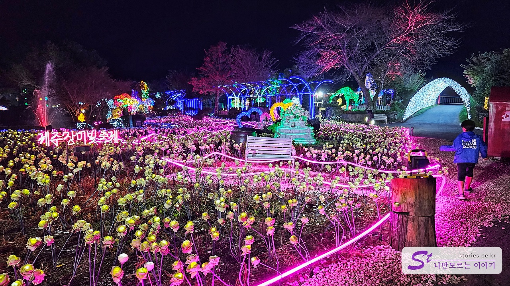
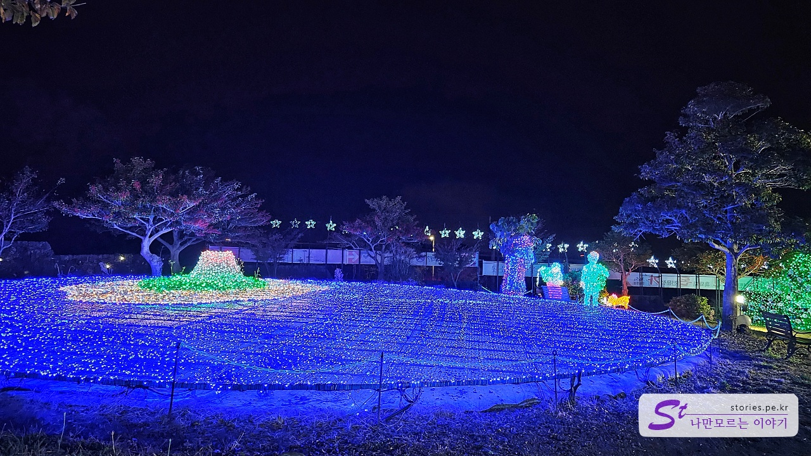
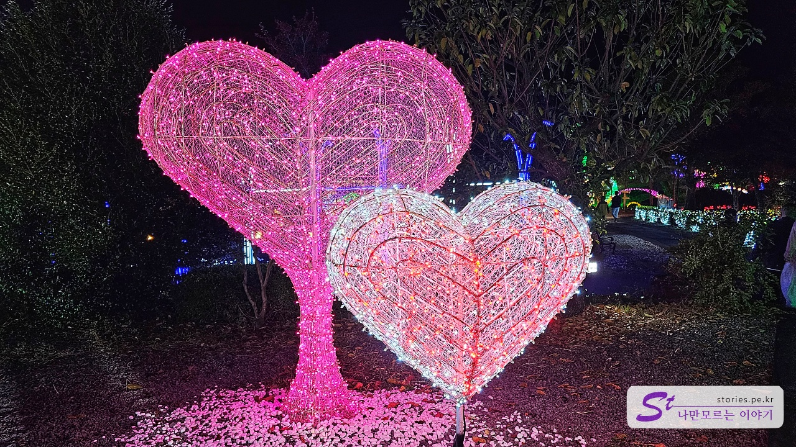
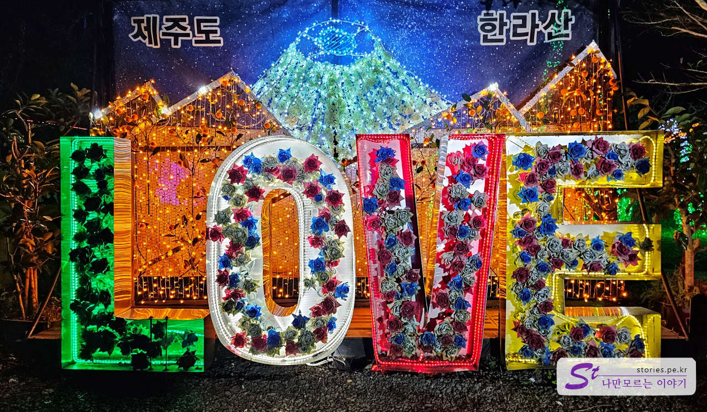
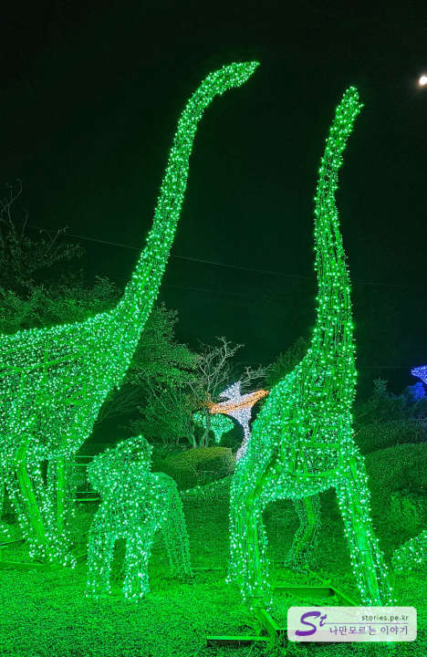
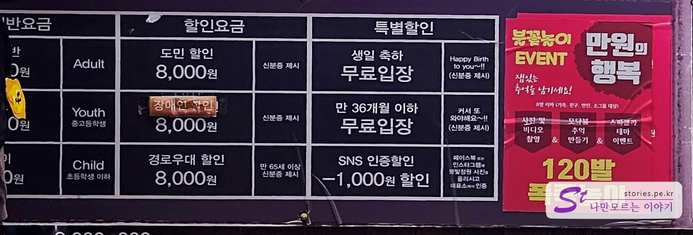

보통 제주도의 여행지는 대부분 오후 6시쯤이면 문을 닫기 시작하는데요.
늦게까지 제주를 즐기고 싶은 경우 가볼 만한 여행지가 있습니다.

바로 애월에 있는 제주 불빛 정원입니다.

제주 평화로 인근에 있기 때문에 중문에서도 대략 30분이면 도착할 수 있는 거리라서 접근성도 좋아요.

입장하자마자 불빛 잔치가 펼쳐집니다.

입구 앞쪽에는 **사랑의 백조** 조형물이 먼저 나타납니다.
백조의 크기가 상당히 커서 단체사진 찍기에도 좋아요.
그리고 반대쪽에도 조명이 있어서 역광을 방지해 주고 있네요

중앙에 있는 **장미 정원**입니다. 역시 조명이 한 목 하네요. 사진 찍기에 너무 좋게 되어 있습니다.

**불빛 제주도** 조형물입니다. 중앙에 한라산이 강조된 제주도가 있고 주위에는 파란색으로 바다를 표현하고 있습니다. 보기는 좋은데 사진 찍기는 조금 애매하더라고요.

하트 조형물입니다. 연인끼리 사진 찍기 좋아요. 조형물 자체도 너무 이쁘고요.
크기는 사람이 서있으면 머리 아래쪽에 하트가 들어오기 때문에 서서 사진 찍기 좋습니다.

**제주 LOVE** 조형물입니다. 생각보다 이쁘고 사진 찍기에도 좋습니다.

**쥐라기 공원** 조형물입니다. 크기가 상당히 크네요. 아이들이 좋아할 것 같아요.

## 비용

가격도 많이 비싸지는 않습니다. 사진상에는 일반 요금이 가려져서 보이지 않네요 ㅎ  
일반 요금은 **어른 12,000원**, **중고등학생은 10,000원**, **초등학생 이하는 8,000원**입니다.

## 추가 정보

사진에는 없지만 카페가 있는 실내공간이 더 있어요. 인생 사진관과 유리 방도 있어서 구경하거나 사진 찍기에도 좋은 장소가 있습니다.
그리고 불빛 정원에서 스마트폰으로 찍은 사진 중에 2장을 출력해 주는 서비스도 있습니다.

모닥불이 항상 켜져 있어서 불 멍하기도 좋고 낭만적인 느낌도 있네요.

## 운영 시간

- 운영 시간 : 17:00~24:00 (입장마감 23:00)
- 소요시간 : 대략 1시

## 여행지 정보

- 주소 : 제주시 애월읍 유수암리 1083 (평화로 2346)
- 연락처 : 064-799-6996
- URL : http://www.rosestar.kr

<iframe src='https://www.google.com/maps/embed?pb=!1m18!1m12!1m3!1d3330.0383715635035!2d126.40667827621893!3d33.42224395073229!2m3!1f0!2f0!3f0!3m2!1i1024!2i768!4f13.1!3m3!1m2!1s0x350c5894f884f791%3A0x946470e5ed22f7f!2z7KCc7KO867aI67mb7KCV7JuQ!5e0!3m2!1sko!2skr!4v1699449552282!5m2!1sko!2skr' class='embed-responsive-item' allowfullscreen></iframe>

