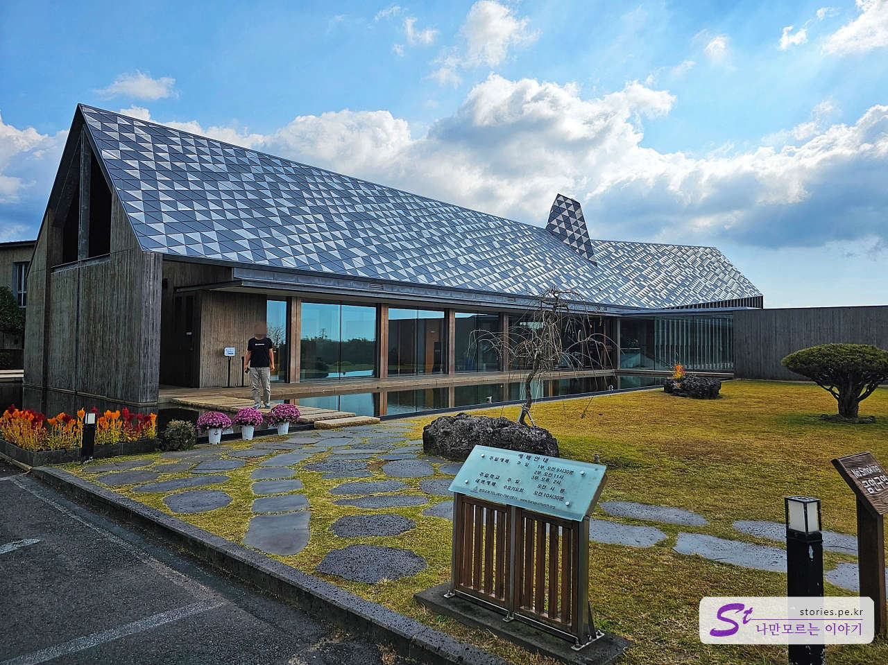
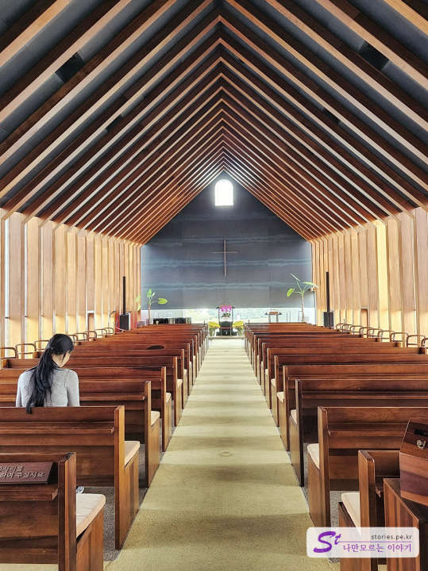
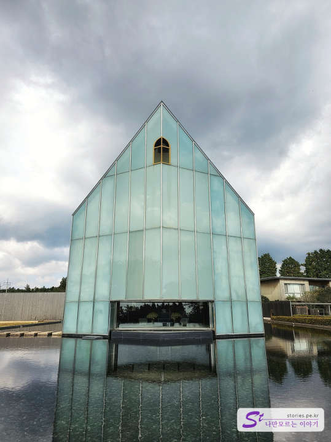

방주 교회는 신자들이 제주도를 방문할 때 자주 찾는 장소 중 하나입니다. 이 교회는 제주 서부의 안덕면 산록남로에 위치한 유명한 건축가의 작품 중 하나입니다. 산록남로를 따라 지어진 유명 건축가의 건물은 **이타미 준**이 설계한 방주교회, 수풍석박물관, 포도호텔이 있고 **안도 다다오**가 설계한 본태 박물관도 그 옆에 있습니다.
안도 다다오가 일본을 대표하는 유명 건축가라면 이타미 준은 일본에서 태어났지만 끝까지 한국 국적을 포기하지 않은 유명한 건축가입니다. 이타미 준은 예명이며, 실제 본명은 유동룡이라고하며 재일 교포입니다.

방주교회는 노아의 방주를 모티브로 제작하여 물 위에 떠있는 형태로 물과 빛, 나무 그리고 ZINC 소재의 메탈로 이루어진 성전 건축물입니다. 보는 위치에 따라 햇빛에 부서지는 지붕의 메탈이 하늘과 지붕과 땅을 멋지게 이어주고 있습니다.

방주교회는 건축 모형만 있는 것이 아니라 실제로 예배를 드리는 교회입니다. 그래서 예배시간에는 내부 관람과 외부 잔디밭을 개방하지 않고 있습니다. 그래서 관람을 하실 목적이라면 예배시간은 피해서 가셔야 합니다.

> 주일 예배 : 매주 주일 1부(09:30), 2부(11:00), 3부(14:00)  
> 수요 예배 : 수요 기도회(10:30)

교회의 뒤쪽으로 돌아가면 물과 어우러지는 건물의 웅장한 모습을 볼 수 있습니다.

## 여행지 정보

- 주소 : 제주 서귀포시 산록남로762번길 113
- 연락처 : 064-794-0611
- URL : http://www.bangjuchurch.org

<iframe src='https://www.google.com/maps/embed?pb=!1m18!1m12!1m3!1d1178.938193113669!2d126.38666168691587!3d33.30467541027392!2m3!1f0!2f0!3f0!3m2!1i1024!2i768!4f13.1!3m3!1m2!1s0x350c5bc9843121f7%3A0x73c683f9d3f005f2!2z67Cp7KO86rWQ7ZqM!5e0!3m2!1sko!2skr!4v1700056549962!5m2!1sko!2skr' class='embed-responsive-item' allowfullscreen></iframe>

## 주차정보

약 18대정도를 주차할 수 있는 전용 주차공간이 있습니다.
