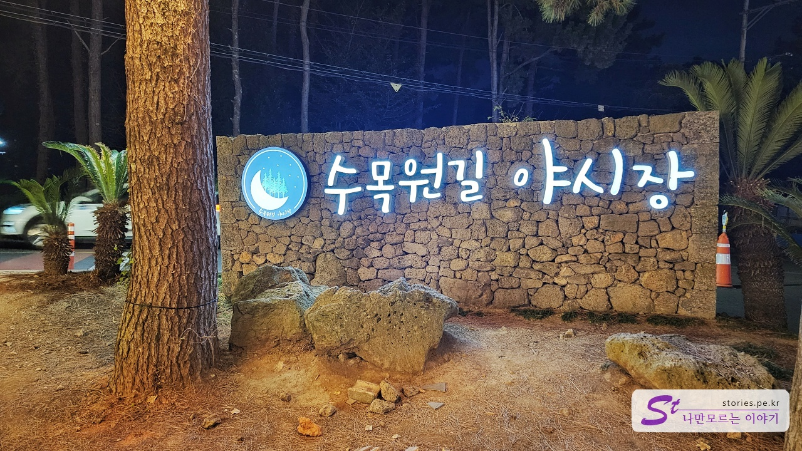
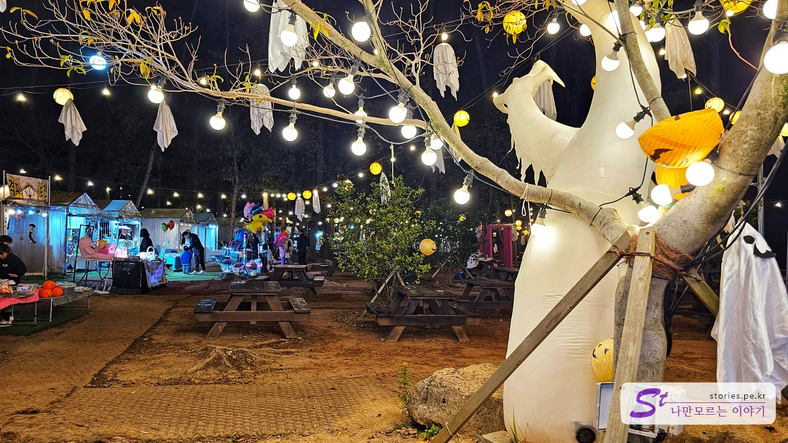
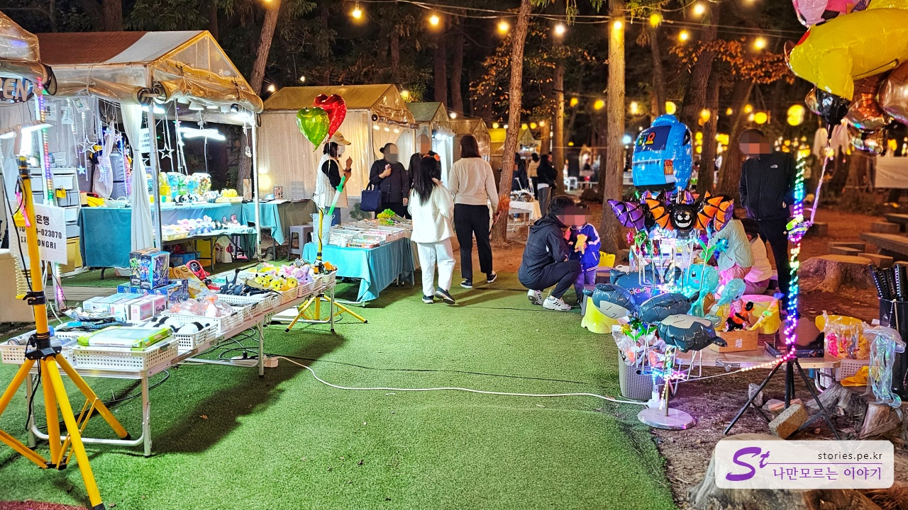
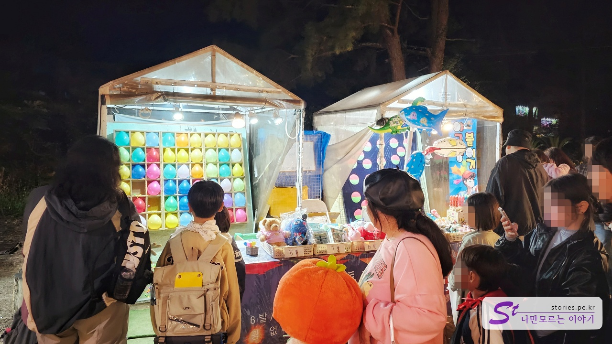
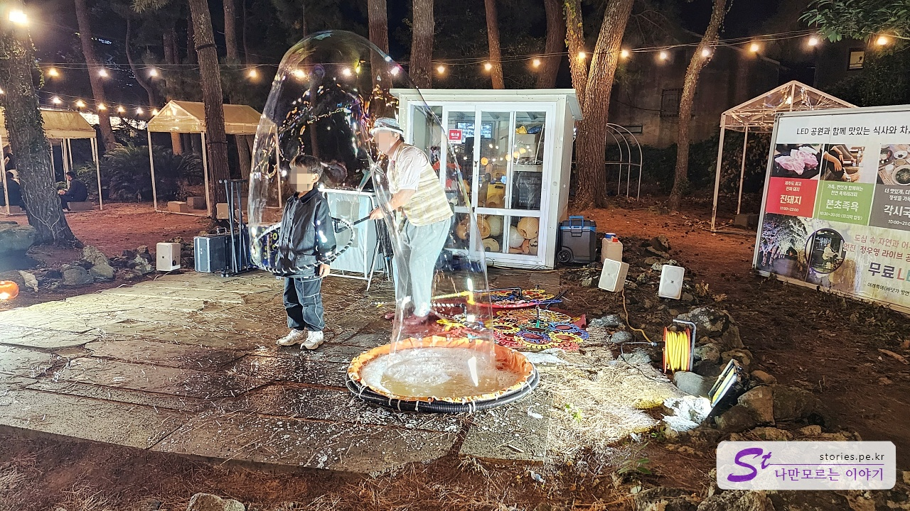
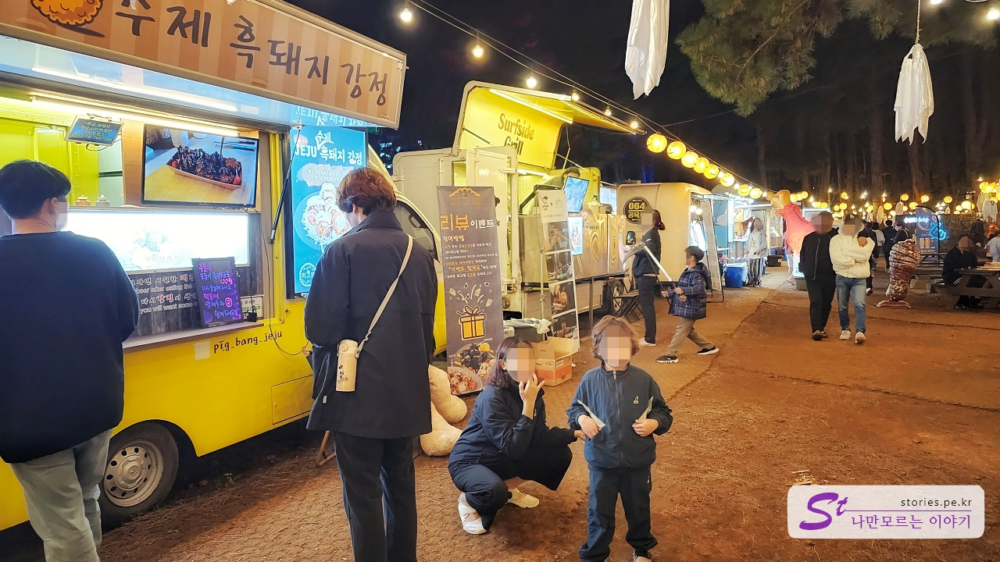
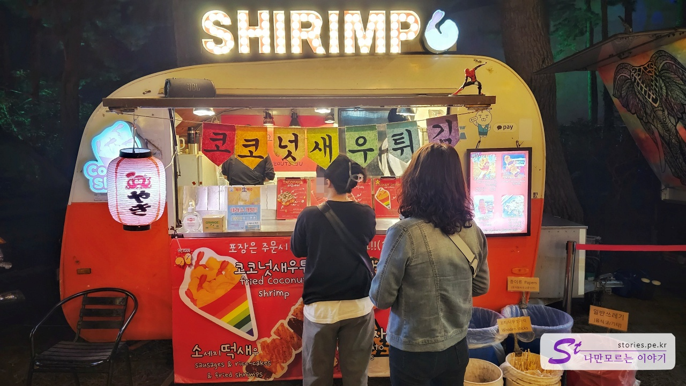
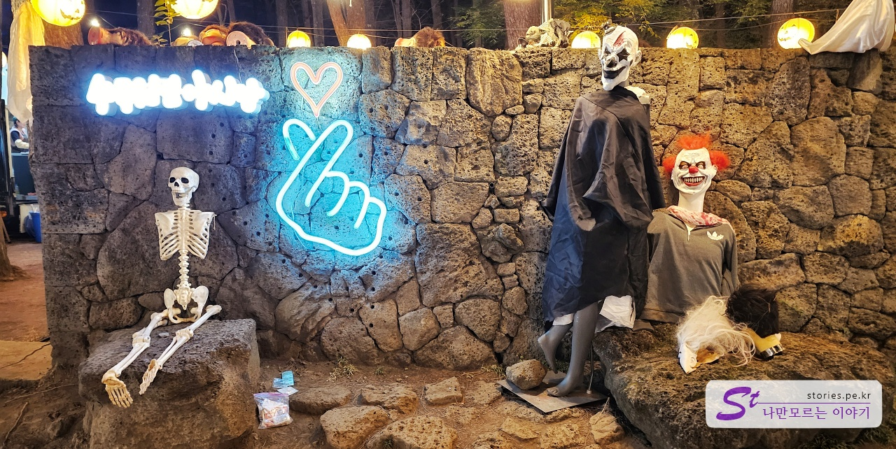
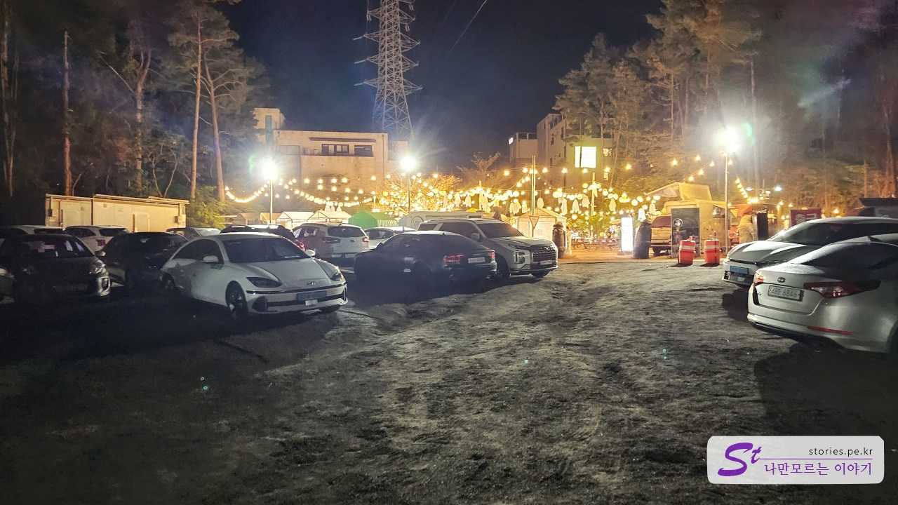

늦은 비행기로 제주도에 도착하자 오후 8시 이후의 제한된 활동으로 인해 실망감을 느꼈습니다. 옵션을 찾다가 우연히 **수목원길 야시장**을 발견했는데, 공항에서 단 10분 거리에 있는 편리하고 접근하기 쉬운 곳이었습니다.

가장 눈에 띄는 장점은 주변에 주차장이 많아 주차걱정이 덜하다는 점이었습니다. 이러한 접근성 덕분에 우리는 번거로움 없이 야시장을 둘러볼 수 있었습니다.

제주도에서 6시 이후에는 관광과 식사 옵션이 제한될 수 있지만, 수목원길 야시장은 제주도에서 저녁을 최대한 즐기고자 하는 이들에게 환영받는 솔루션이라고 할 수 있습니다.

**수목원길 야시장**이라고 커다랗게 써있어서 찾지 못할 일은 없을 것 같습니다.

저희는 8시 30분쯤 도착했는데, 이미 야시장이 전성기를 맞이하고 있었습니다. 여기저기 조명으로 환해진 분위기가 특유의 야시장 분위기를 연출하고 있었습니다.

플리마켓처럼 여러가지 물건을 팔고 있었습니다.

다양한 게임을 즐길 수 있어 가족이나 커플끼리 즐기기에 좋았습니다. 또한, 볼거리, 먹거리, 그리고 즐길 거리가 다양하게 마련되어 있어 저희는 즐거운 시간을 보낼 수 있었습니다.

비눗방울 쇼는 어린이와 부모 모두에게 매우 인기가 있습니다. 놀라운 거품을 뒤집어 쓰는 모습을 지켜보고, 부모는 행복한 어린 아이들의 멋진 사진을 찍을 수 있습니다. 온 가족이 즐길 수 있는 간단하고 즐거운 경험입니다!

야시장의 음식을 놓치지 않는 것이 좋습니다. 여러 가지 음식을 판매하는 푸드 트럭이 있어요. 흑돼지 강정, 새우튀김, 음료 등이 다양하게 준비돼 있습니다. 가격은 싸지 않고 맛은 그리 좋지 않지만, 야시장의 분위기에서 먹으면 여행 중인 기분이 들어서 좋습니다.

저희가 사먹어본 새우튀김입니다. 가격을 뺀다면 나름 나쁘지 않았습니다.

10월 30일이라서 그런지 할로윈데이 소품도 있네요.

인근 주차장중 한곳인 비포장 주차장입니다. 주말이라면 어떨지 모르겠지만 평일이라면 주차걱정은 필요없을 듯 합니다.

## 운영 정보

- 운영 시간 :
  - 6월 ~ 9월 : 18시 ~ 23시
  - 10월 ~ 5월 : 18시 ~ 22시

## 여행지 정보

- 주소 : 제주 제주시 은수길 69
- 연락처 : 064-742-3700
- URL : http://www.sumokwonpark.com/theme/case2/sub/030101.php

<iframe src='https://www.google.com/maps/embed?pb=!1m18!1m12!1m3!1d9509.26000105844!2d126.48620754528582!3d33.508163702971025!2m3!1f0!2f0!3f0!3m2!1i1024!2i768!4f13.1!3m3!1m2!1s0x350cfb741e131395%3A0x7c84f5cbf937b13a!2z7IiY66qp7JuQ6ri4IOyVvOyLnOyepQ!5e1!3m2!1sko!2skr!4v1700146692020!5m2!1sko!2skr' class='embed-responsive-item' allowfullscreen></iframe>

