처음 연돈이 제주도에 오픈했을 때 돈가스를 한번 먹어보기 위해서는 밤새 웨이팅을 해야만 겨우 먹을 수 있었다고 합니다. 그 이후 테이블링이라는 모바일앱으로 예약하는 방법으로 바꾸면서 앱 오픈과 동시에 미친 듯이 광클을 해야 겨우 예약을 할 수 있었지만 저는 3~4번의 기회를 모두 놓쳤던 기억이 있습니다. 나름 광클에 성공률이 높은 나였지만 자존심이 구겨지는 경험도 해봤습니다. 그래서 아예 안되는구나라고 연돈 돈가스 먹기를 포기했었는데, 이번에 또 웨이팅 방법을 변경하면서 먹어볼 수 있게 되었습니다.

지금의 웨이팅 방법은 오전 10시에 예약을 시작하는데, 보통 9시쯤 와서 웨이팅을 하고 있다가 10시가 되면 문 앞에 있는 예약기기에 전화번호를 등록해서 웨이팅을 걸어 놓을 수 있습니다. 입장 30분쯤 전에 카카오톡으로 입장시간을 알려주기 때문에 웨이팅을 걸어놓고 관광지 1~2군데 정도 관광을 하고 오면 돈가스를 먹을 수 있습니다.
사실 꼭 9시부터 대기할 필요는 없습니다. 좀 늦게 와서 현장 예약 등록을 하더라도 좀 늦게 먹을 뿐 몇 시간 후에는 먹을 수 있습니다. 다만 연돈에서 인기가 있는 치즈돈가스 같은 경우는 하루 한정수량만 판매를 하기 때문에 그것은 먹지 못할 수는 있습니다.

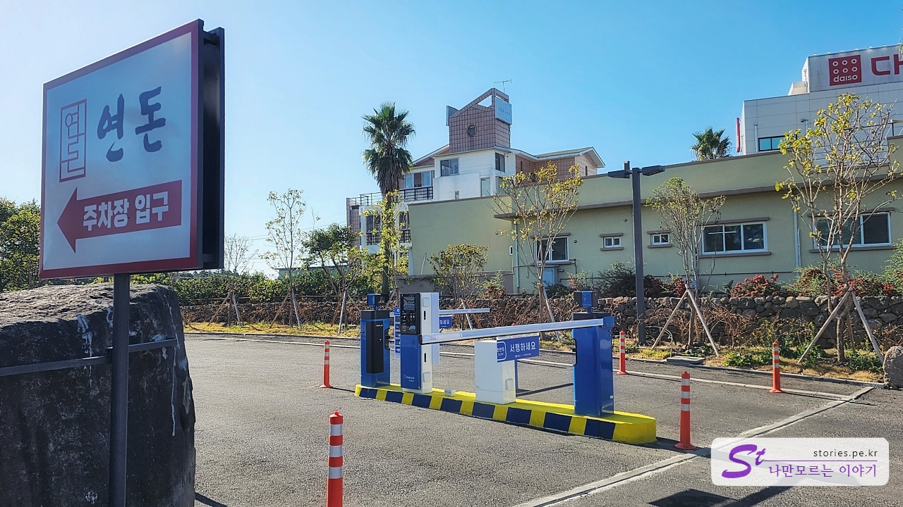
연돈은 더본호텔 옆쪽의 건물에서 지금은 바로 앞쪽의 건물로 이전을 했습니다. 입구는 주차장을 지나서 들어가면 됩니다.

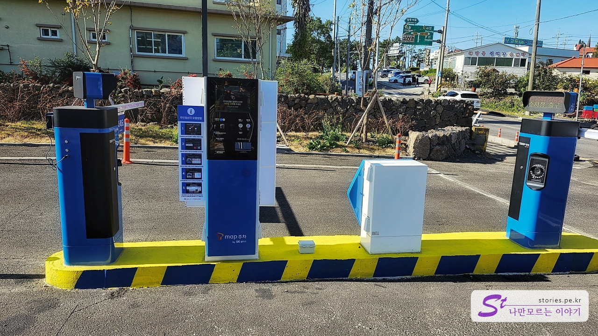
Tmap주차로 유료로 운영을 하는 것 같은데 우리가 갔을 때는 무료 주차를 할 수 있었습니다.

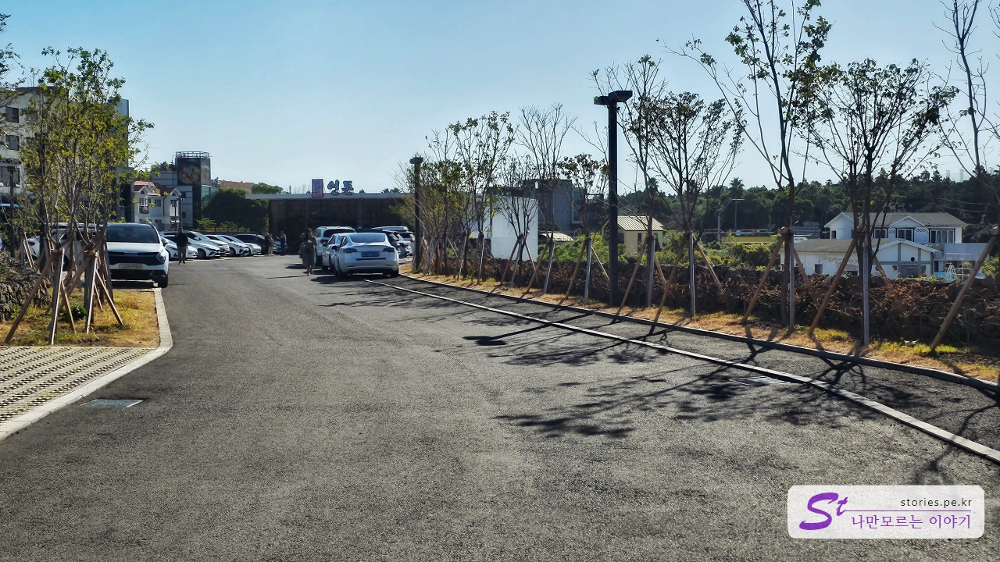
입구를 지나 50M 정도 들어가면 연돈 단독 건물이 나타납니다.

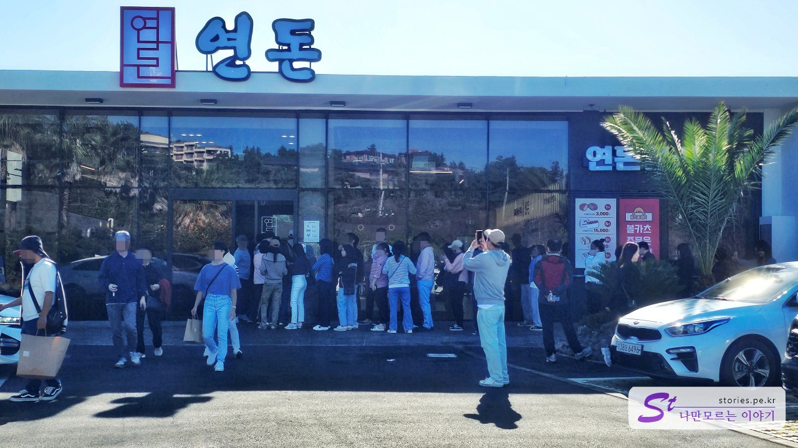
평일(화요일) 현재 시간 10시의 웨이팅 모습입니다. 저는 9시 30분쯤 도착해서 웨이팅을 시작했습니다.

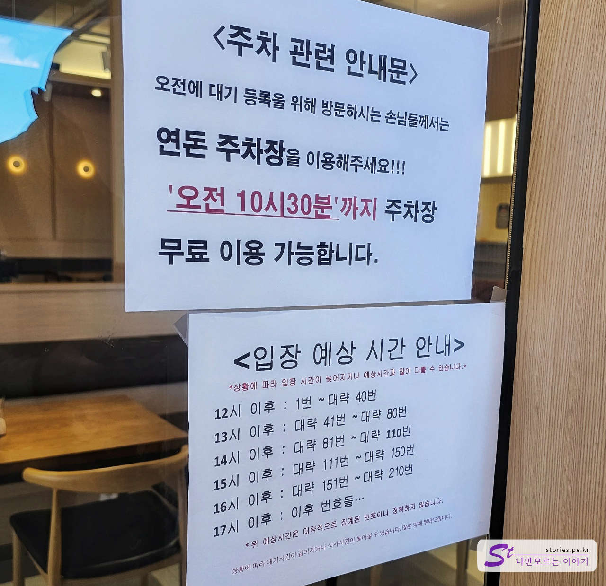
오전 대기 등록을 위해 방문할 경우 10시 30분까지 무료로 주차를 할 수 있게 해 놨습니다. 나름 합리적인 모습이네요. 실제 식사의 시작은 12시부터 하게 되고 입장 시간은 대략 위의 사진과 같습니다.

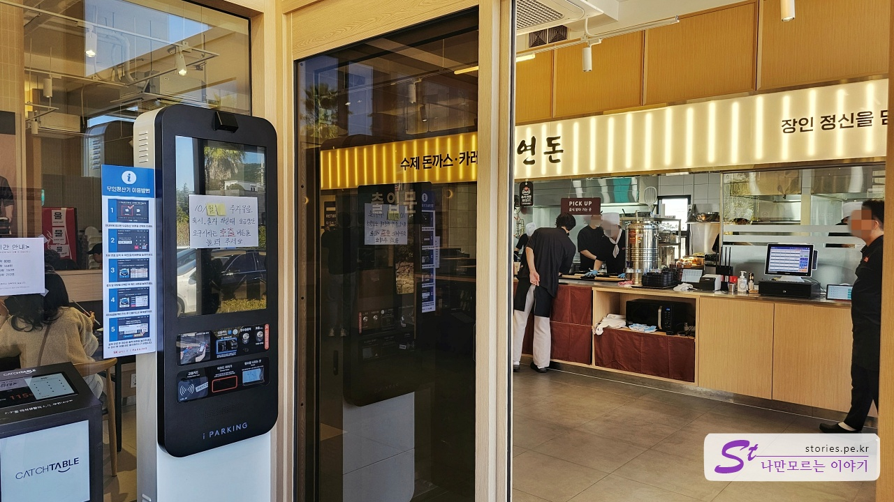
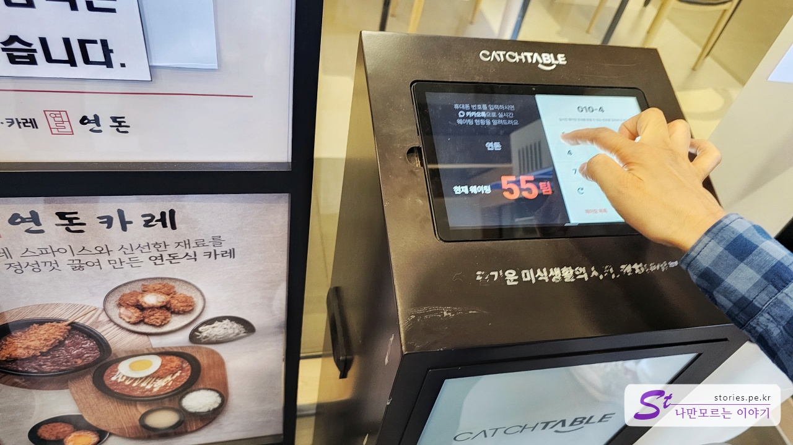
대기 등록은 전화번호를 등록하게 되는데, 진행 상황은 카카오톡 문자로 보내줍니다. 이렇게 대기 등록을 하고 나면 대략 2시간 ~ 4시간 정도의 텀이 생기게 되는데 그러면 중문 근처에 있는 관광지를 한두 곳 둘러보고 오면 대략 시간이 맞게 됩니다. 입장할 때 현장에 없으면 넘어가 버리니 10~20분 정도 여유를 가지고 도착해서 대기하고 있어야 합니다.
우리는 1시 30분쯤에 대기가 걸렸기 때문에 기다리는 동안 **1100고지 습지** 한곳만 다녀왔습니다.

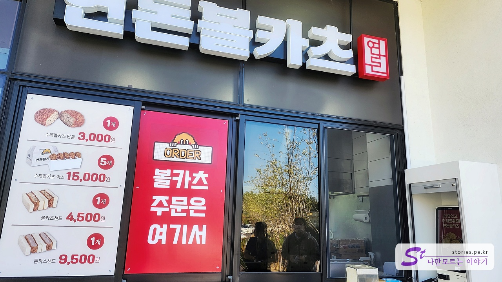
대기를 하고 나오면서 보니 옆쪽에 연돈볼카츠가 있었습니다. 연돈은 현재 프랜차이즈화 되어 있지 않지만 연돈볼카츠는 백종원 대표와 함께 프랜차이즈화 시킨 것으로 제주뿐만 아니라 육지 여기저기에 있습니다.

## 대표 메뉴와 가격(가성비)

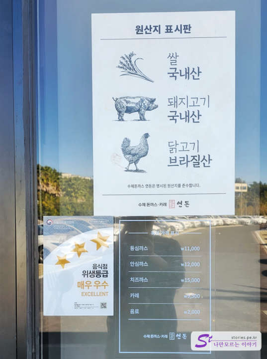
대표 메뉴는 치즈까스 15,000원, 등심까스 11,000원, 안심까스 12,000원이며 카레도 맛이 좋았습니다.
쌀과 고기는 국내산을 사용하고 닭고기는 브라질산을 사용한다고 하네요.

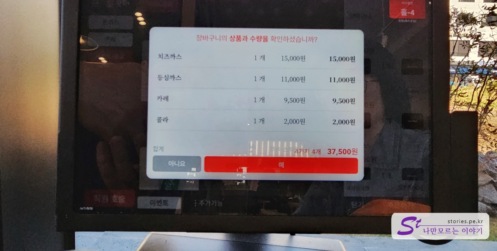
웨이팅을 마치고 식탁에 앉으면 각 식탁마다 주문 장치가 있어서 직접 주문하고 결제를 하게 됩니다.

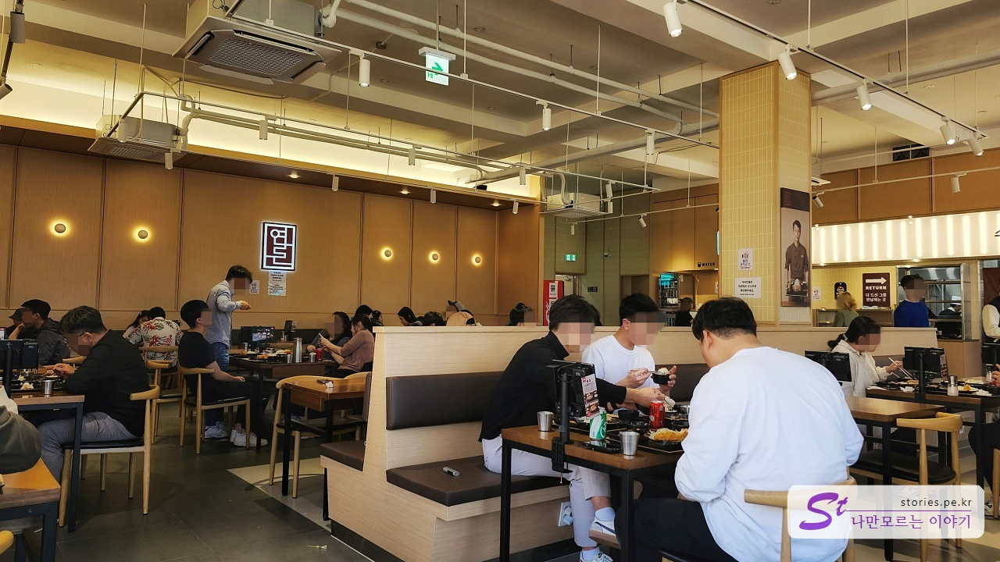
주문을 하고 식당을 둘러봤습니다. 너무 빡빡하고 꽉 차게 손님들을 채우는 것 같지는 않아서 좋았습니다.

## 먹어본 음식

우리는 치즈까스와 등심까스, 카레를 주문했습니다.

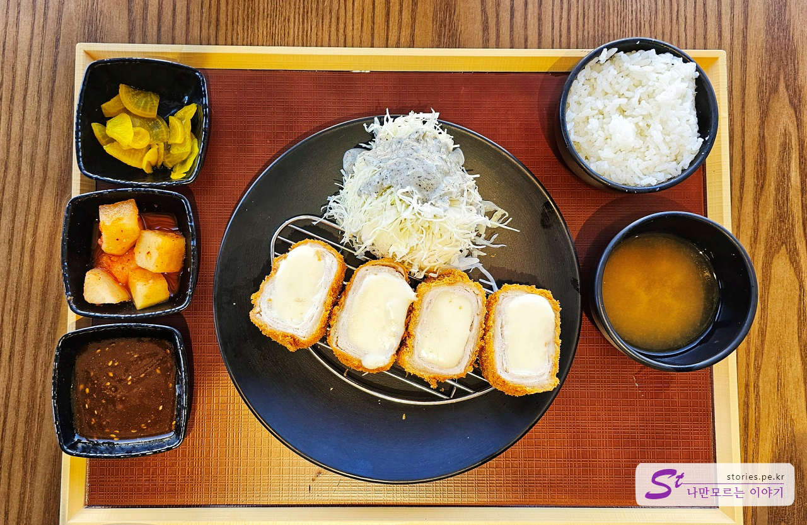
15,000원짜리 치즈까스 입니다. 치즈까스는 하루 100개 한정수량만 판매를 하고 한 테이블당 1개만 주문 가능하다고 하는 것 같았는데, 주문 장치로 치즈까스를 또 눌러보니 주문이 되는 것 같긴 했습니다. 마지막 결제에서 멈췄지만...
가격도 적당하고 맛도 좋았습니다. 고기를 둘러싼 튀김옷이 정말 바삭해서 식감이 좋았습니다.

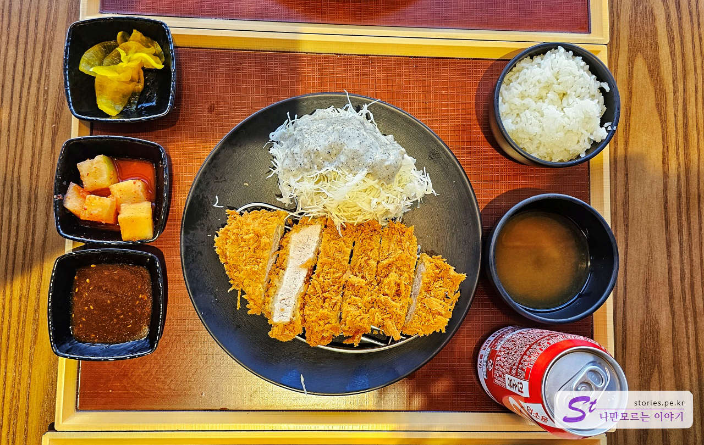
등심까스 입니다. 평범한 듯 평범하지 않은 맛이었습니다. 고기의 맛은 평범한 것 같았으나 튀김옷이 바삭해서 좋았습니다.

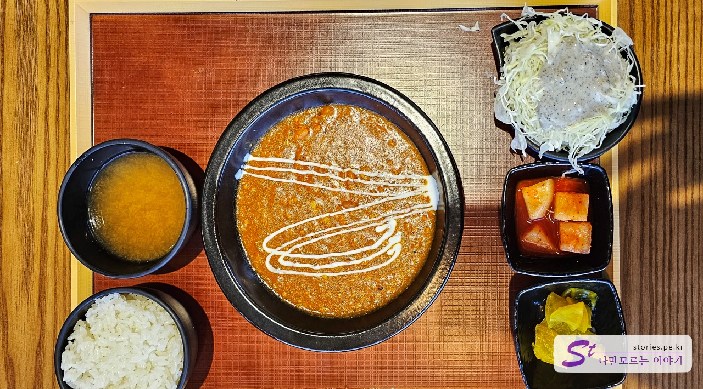
카레도 맛은 좋았으나 2명이 소식을 하는 먹성이라 양이 좀 많은듯했습니다. 그래도 꾸역꾸역 다 먹고 나오긴 했어요.

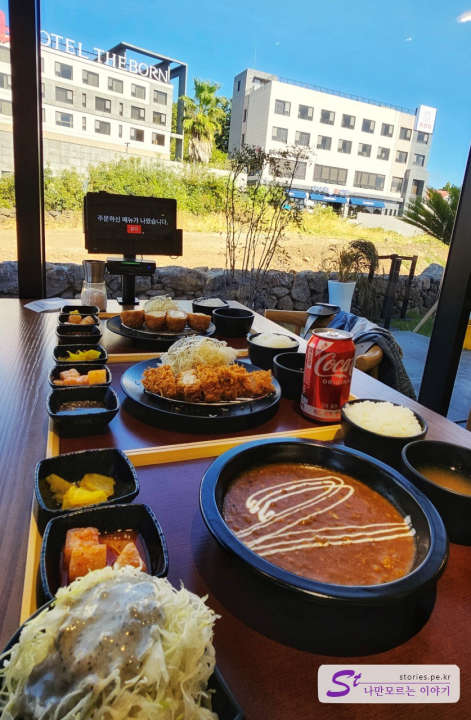

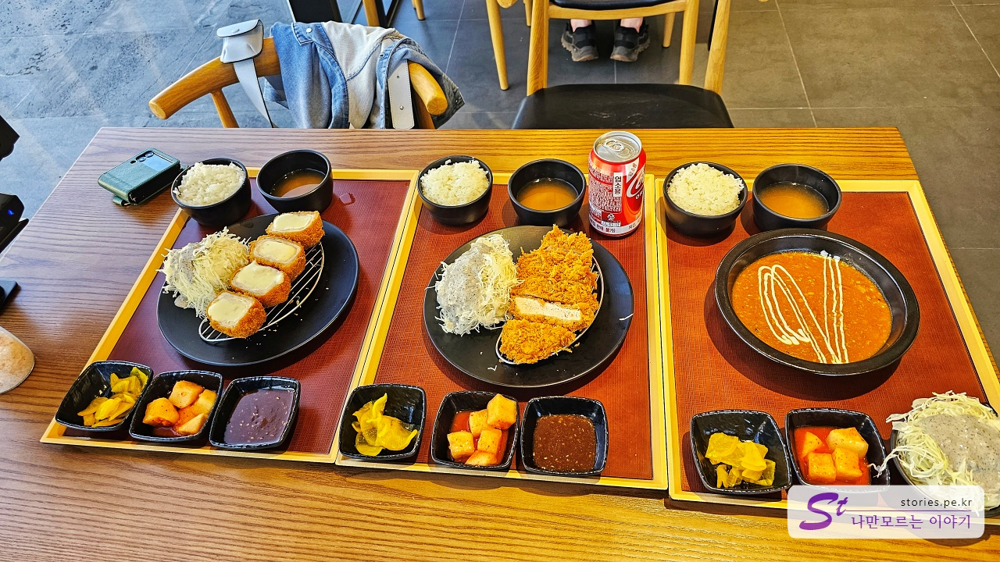

## 맛 평가 (지극히 주관적임)

극단적인 웨이팅을 하면서까지 먹어야 할 정도는 아니지만 지금처럼 웨이팅을 해놓고 관광 한 번 하고 와서 먹을 정도는 되는 것 같습니다.

<b>주관적인 맛 점수 : </b> ★★★★☆

## 식당 운영 시스템

프랜차이즈의 대가 백종원 대표와 관련이 있어서 그런지 운영 시스템은 나쁘지 않았습니다.
식탁에서 주문과 결제를 하고 음식이 나오면 손님이 직접 셀프로 가져다 먹으면 됩니다. 다 먹은 그릇도 셀프서비스입니다.

<b>운영 시스템 : </b> ★★★★☆

## 청결도

청결 도는 따로 말을 하지 않아도 너무 잘 알려져 있어서...

<b>청결도 : </b> ★★★★☆

## 친절도

셀프로 서빙을 하기 때문에 특별히 친절하다고는 느끼지 못했습니다. 그냥 적당해요.

<b>친절도 : </b> ★★★☆☆

## 식당과 주차 정보

주차는 유료로 운영하고 있으나 저희가 방문했을 때는 무료였습니다. 아직은 무료지만 조만간 유료로 될 것 같습니다. 식사를 하면 할인해 줄 것 같긴 한데 아직 그것에 대한 안내는 없었습니다.

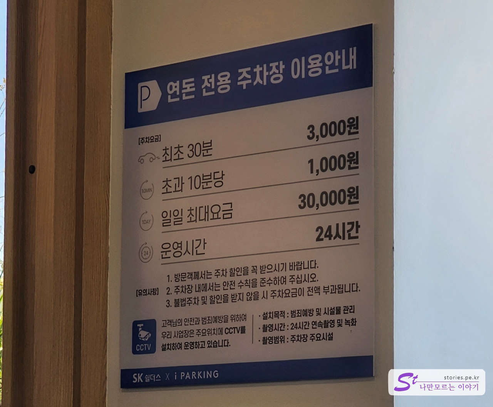
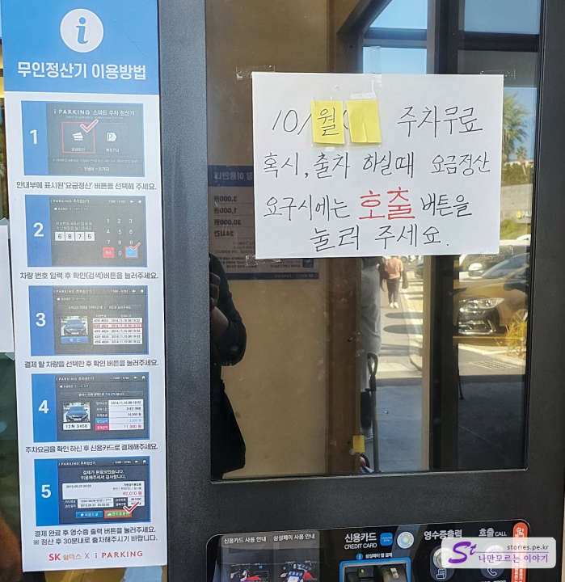

- 주소 : 제주 서귀포시 색달로 10 2층 연돈
- 연락처 : 0507-1386-7060
- 영업시간 : 12:00 - 21:00
- 웨이팅 시작 : 10:00 ~
- 라스트 오더 : 19:15
- 주차 : 현재는 무료이나 곧 유료가 될 것 같음

<iframe src='https://www.google.com/maps/embed?pb=!1m18!1m12!1m3!1d1002.4066194847483!2d126.40583189147493!3d33.2589713277531!2m3!1f0!2f0!3f0!3m2!1i1024!2i768!4f13.1!3m3!1m2!1s0x350c5bc3e1cdc0bd%3A0x22be2eedc74c07a4!2z7Jew64-I!5e1!3m2!1sko!2skr!4v1700242861713!5m2!1sko!2skr' class='embed-responsive-item' allowfullscreen></iframe>

