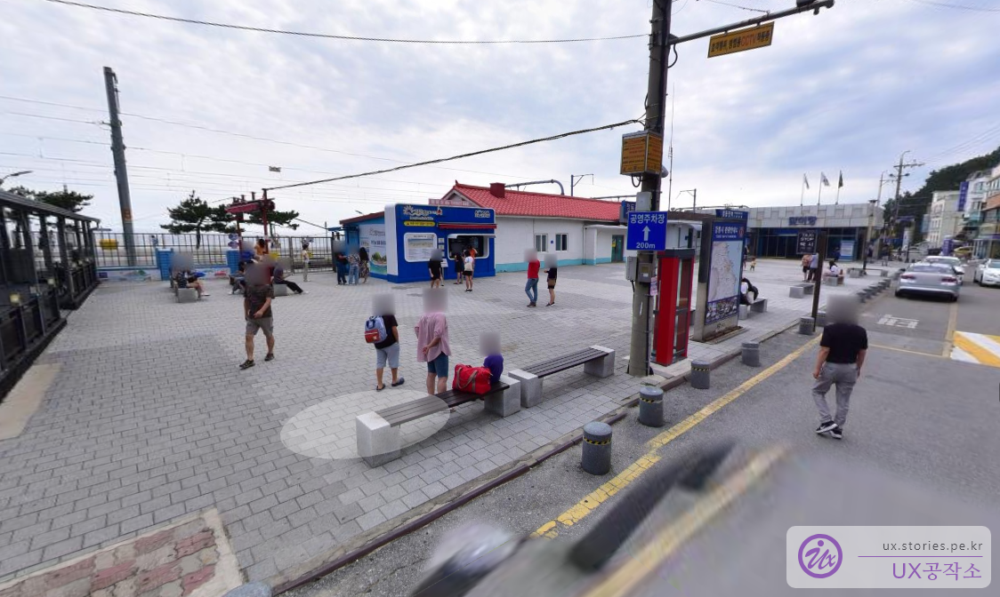

정동진은 너무나 유명한 동해의 관광명소인데요. 이제는 너무 많이 와봐서 약간 식상한 느낌도 듭니다. 정동진은 크게 정동진역과 모래시계 공원으로 되어 있습니다. 정동진이 유명해지기 시작한 계기는 1995년도에 고현정, 최민수, 박상원 등이 출연했던 **모래시계**라는 드라마 때문인데요. 당시 엄청난 인기에 힘입어 고현정이 방문했던 정동진역도 덩달아 유명세를 치르게 되었습니다. 고현정이 끌려갈 때 뒤로 보이는 소나무와 바다가 정말 멋진 장면을 연출했었고 덕분에 그 소나무를 고현정 나무라고 해서 지금도 인기 있는 포토 스폿이 되었을 정도입니다.  
정동진역은 작은데 관광객이 계속 몰려와서 그런지 역 옆으로 모래시계공원을 별도로 만들어놔서 그쪽으로 관광객을 소화하고 있는 상황입니다.

## 정동진역

정동진역은 지금도 운영을 하고 있어서 서울에서 기차를 타고 올 수도 있고 자가용을 타고 올 수도 있습니다. 또한 바다를 끼고도는 레일바이크도 같이 운영을 하고 있어서 2가지 역할을 하고 있습니다. 그 외에는 별로 먹고 즐길 거리는 별로 없습니다.

정동진역은 레일바이크를 타기 위해서 오거나 기차를 타기 위해서 오늘 손님들이 대부분입니다.

고현정 나무를 보기 위해서는 역 안으로 매표를 하고 들어와야 합니다. 앞에 보이는 소나무가 고현정 나무입니다.
드라마에서 보던 그때보다 무척이나 풍성해진 모습을 하고 있네요. 자본주의 덕분에 살이 많이 찐 것 같네요.

정동진역의 주차장은 역 바로 앞에 있는 유료주차장과 역의 오른쪽으로 좀 더 들어가면 있는 무료주차장이 있습니다. 유료주차장의 경우는 레일바이크를 타는 손님들이 많이 방문을 하는 것 같았습니다. 저희는 그냥 무료 주차장에 주차를 하고 나왔습니다.

주차장 입구 바로 앞에는 바닷가 해변으로 바로 갈 수 있는 길과 정동진역으로 갈 수 있는 2갈림길이 있습니다.
해변을 통해서는 길을 막아놔서 정동진역으로 갈 수는 없습니다.

이 길 아래로 내려가면 바로 바닷가로 갈 수 있습니다.

정동진 바닷가입니다. 앞쪽에 정동진역이 있으나 이쪽으로는 역으로 들어가지 못하게 막혀있습니다. 당연하겠지요. 아직도 열차가 운행하고 있으니 무임승차를 막아야 하니까요.

## 정동진 모래시계 공원

넘치는 관광객을 유치하기 위해 정동진 아래쪽에 모래시계 공원을 만들어놨습니다. 만든지도 꽤 오래되긴 했습니다.

모래시계공원 주차장에 주차를 하고 다리를 건너면 모래시계 공원으로 들어갈 수 있습니다.

다리 바로 앞에는 기차를 활용해서 만들어 놓은 **정동진 시간 박물관**이 있습니다.

레일바이크 탑승은 정동진역에서 하는 것으로 알고 있는데 여기서 매표는 할 수 있는가 봅니다.

정동진 시간 박물관 입구에는 느린 우체통도 있고 그러네요. 정동진 시간 박물관은 유료로 운영되고 있으며 어른 기준으로 9,000원 정도 했던 것 같습니다. 저희는 들어가 보지 않아서 내부는 잘 모르겠네요.

모래시계 공원의 중앙에 있는 모래시계 구조물입니다. 좀 더 잘 좀 만들지... 별로 이뻐 보이지는 않네요.

해변의 바로 앞쪽으로 레일바이크가 달릴 수 있는 레일이 깔려있습니다. 저 멀리 배 모양의 썬 크루즈 리조트가 보이네요.

실제로 레일바이크가 해변 앞을 달리고 있습니다. 수동과 전동을 같이 같이 사용해서 별로 힘들지는 않을 것 같습니다.

## 헌화로 드라이브 코스

정동진 인근에 있는 국내 최고의 드라이브 코스 중 하나라 할 수 있는 헌화로 드라이브 코스입니다. 이왕 정동진에 왔는데 이곳은 꼭 와보기를 추천드립니다. 헌화로 드라이브 코스는 바다와 가장 가까운 도로하고 하더라고요.

헌화로 드라이브 길입니다. 길 옆에 잠깐 차를 세울 수 있는 공간이 있습니다.

걸어서 산책하기에도 좋은 코스입니다.

대충 찍어도 정말 멋진 사진이 나옵니다.

## 여행지 정보

- 주소 : 강원 강릉시 강동면 정동진리 6-2
- 연락처 : 033-640-4533
