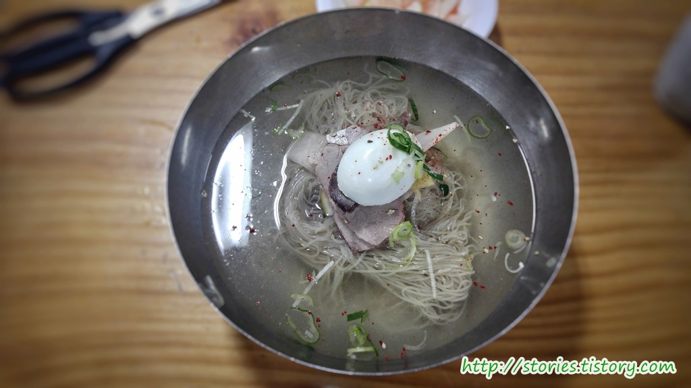

의정부에서 손꼽는 맛집이라고 한다면 [`의정부 부대찌게`](http://jos39.tistory.com/41), `고산떡갈비`, 그리고 `평양냉면`을 꼽을 수 있습니다.

의정부 **평양면옥**은 평양냉면의 전통을 잇는 대표 맛집이라고 할 수 있습니다. 평양냉면 전통의 싱겁고 슴슴한 맛을 자랑하고 있습니다. 처음 먹어보는 사람이야 "**이것이 뭔 맛인가!!**"라고 할 수 있지만 한번 빠지면 헤어나올 수 없는 맛이라고 합니다.

## 대표 메뉴와 가격(가성비)

보통 비빔냉면의 대표는 함흥식 냉면이고 물냉면의 대표는 평양식 냉면이라 할 수 있습니다. 여기는 제목처럼 평양냉면이기때문에 **물냉면**이 대표메뉴라 할 수 있습니다.

냉면이 `10,000원`이라면 싼가격은 아닌것 같습니다.  
제가 평양냉면의 매니아 였다면 가성비의 별이 4~5개는 됐겠지만 매니아가 아닌 관계로 2개로 정해 봤습니다.  
맛이 없다기보다는 가격이 비싸다는 이유 입니다.

## 먹어본 음식

대표메뉴인 물냉면을 먹었습니다.  
냉면에 파와 고추가루가 뿌려져 있는 것이 특이했고 국물은 먹어보면 자극적이지 않지만 은근히 고기 육수의 맛이 우러나기는 합니다. **평양냉면 마니아들이 찾는 맛**이 이 맛일 것 이란 것은 알것 같습니다. 하지만 **평양냉면**에 문외한인 저는 그냥 밍밍하기 그지 없었습니다.

반찬은 아주 단촐합니다. 메밀을 끓인 물과 흔한 냉면에 나오는 무, 2가지 있습니다.  
보통 냉면집은 따뜻한 **고기 육수**가 나오는데 여기는 특이하게 **메밀을 끓인 물**이 나옵니다. 이 또한 밍밍합니다. 하지만 고기육수 끓인 물이 나왔다면 냉면육수와 겹치기 때문에 차라리 메밀을 끓인 물이 더 조화가 맞을 것 같습니다.

밍밍한 맛이 뭔가 아쉬워 식초를 넣었습니다. 그러자 갈비탕 같은 육수의 맛이 사라져 버렸습니다.
그래서 겨자를 넣어봤습니다...... 망했습니다.....
**평양냉면을 드실때는 절대 식초나 겨자를 넣지 마세요** 평양냉면의 매니아는 아니지만 식초와 겨자는 넣지 않는것이 맞는것 같습니다.

> 몇일 전에 `수요미식회`에서 `남북정상회담` 시 평양 **옥류관**에서 직접 랭면을 먹고온 사람에 의하면, 식당에서 랭면을 먹는 방법을 알려줬다는데 냉면을 젓가락으로 집고 식초를 면에 뿌려서 먹는 것이라는.. ㅎㄷㄷ

## 청결도

식당의 청결도는 보통입니다.
50년 전통치고는 그런대로 깨끗하다고 할 수 있겠습니다.

## 식당 운영과 친절도

식당이 커서 그런지 좀 기다리기는 했지만 회전율이 빠른 편이라 금방 식당안으로 들어갈 수 있었습니다.  
식당의 운영 시스템은 그런대로 괜찮은것 같습니다. 체계화 된것 같아 보이진 않지만 그렇다고 손님이 불편함을 느낄 정도는
아닌것 같습니다. 또한 직원 분들도 친절한 편입니다.

## 식당 정보와 주차 여부

- 주소 : 경기도 의정부시 평화로439번길 7
- 연락처 : 031-877-2282
- 영업시간(휴무일) : 매일 11:00 - 20:30 (명절 휴무, 화요일 휴무)
- 주차 : 주차장은 넓은 편입니다. 하지만 휴일일 경우는 주차장이 만차일 수 있습니다. 제가 갔을때도 만차여서 인근 골목길에 주차를 했었습니다.

<iframe src="https://www.google.com/maps/embed?pb=!1m18!1m12!1m3!1d4462.491308872775!2d127.04351604988803!3d37.73240132625048!2m3!1f0!2f0!3f0!3m2!1i1024!2i768!4f13.1!3m3!1m2!1s0x357cc7492368a9d1%3A0xc333027510bc3924!2z7Y-J7JaR66m07Jil!5e0!3m2!1sko!2skr!4v1498311658089" width="728" height="300" frameborder="0"  allowfullscreen></iframe>

## 기타 사항

평양냉면의 매니아는 좋아하겠으나 그렇지 않다면 맛에 대해 어느정도 감안을 하고 가시는 것이 좋을 것 같습니다
