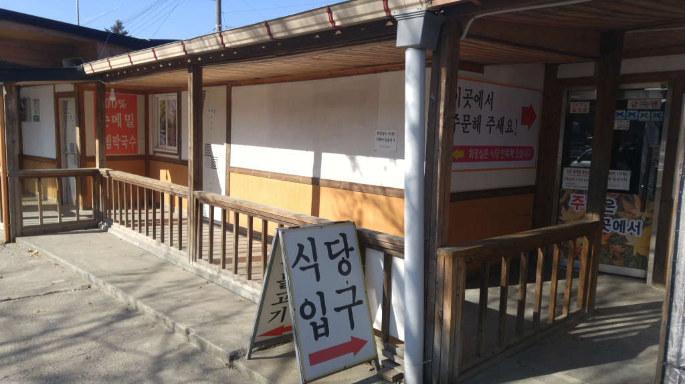

남양주에 맛집으로 방송에도 많이 나왔던 `광릉불고기 본점`입니다. 광릉불고기 지점이 여기저기 많이 있기는 한데 본점이 제일 잘 되 있습니다.
제가 여러번 먹어본 결과 실제 맛집으로 인정할만 합니다. 처음에는 불맛나는 불고기가 맛이 있으나 몇번 다녀보면 반찬이 더 맛있어서 찾아오게 됩니다.

먼저 어렵게 찾아 도착을 하면 주차장 너머 식당입구가 보입니다.
간판은 없으나 식당이 작지는 않습니다. ^^

식당입구라고 커다랗게 써있습니다.

## 대표 메뉴와 가격(가성비)

대표메뉴는 **돼지 숯불고기** 입니다. 고기에 숯불향이 은근히 베어 있어서 풍미를 자극합니다. 그리고 무엇보다도 기본으로 제공되는 **반찬**이 그렇게 맛이 있습니다. 몇번 다니다 보면 반찬때문에 찾아 가기도 합니다.

**돼지 숯불고기**가 `9,000원`이고 **밥**이 `1,000원` 입니다. 그래서 1인분 `10,000원`에 식사를 할 수 있습니다.

**메밀 비빔막국수**는 8,000원이고 맛도 꽤 괜찮습니다.

**가성비 : ** ★★★★☆ 

## 먹어본 음식

먹어본 음식은 **돼지숯불구이**와 **메밀 비빔막국수** 입니다.
**돼지숯불구이**는 불향이 베어 있어 있어서 풍미가 좋습니다.  
**메밀 비빔막국수**는 100% 메밀을 사용하여 만들었다고 합니다. 메밀의 특징처럼 면발이 부드럽고 쉽게 끊어집니다.

이상하게 들릴지 모르겠지만.. 사실 저는 여기에 주로 반찬을 먹으러 갑니다.
반찬이 맛있습니다. ㅋ  
반찬은 찾아갈때마다 계절에 맞는 반찬으로 조금씩 바뀌어 내 놓고 있으며 그 맛 또한 모두 정갈하고 맛이 있습니다.

## 청결도

청결도는 보통 입니다.
식당 자체가 시골에 있고 분위기도 함바집 같아서 완전 깨끗하다고는 할 수없습니다. 다만 화장실의 청결도를 보고 판단해보면 그래도 식당의 청결에 신경을 쓰고 있는것 같습니다. 그리고 반찬 또한 정갈하고 재활용하지 않는 것 같습니다.

**청결도 : ** ★★★☆☆ 

## 식당 운영과 친절도

식당의 운영 시스템은 여느 다른 식당에 비해서 손에 꼽을 정도로 잘 되어 있습니다. 간판없는 집으로 유명해서 사람도 많이 찾아오고 많이 기다려야 하지만 기다리는 동안에도 크게 스트레스를 받지 않도록 배려가 되어 있습니다.  
이 집은 식사를 하는 공간과 대기를 하는 공간이 별도로 구분되어 있으며 사장님은 대기하는 장소에서 CCTV를 보면서 자리를 확인하고 순서를 지정하여 손님을 배정 해 줍니다.
이 운영 시스템의 장점은 식당에서 식사를 하는 사람도 마음 급하지 않게 식사를 할 수 있고 대기하는 사람도 나보다 늦게 온 놈이 먼저 들어갈까 불안해 하지 않아도 됩니다. 또한 대기 장소에 TV도 있고 커피도 있고 책도 있고 해서 지루하지 않습니다. 또한 대기 장소 밖에도 쉴 수 있는 공간이 또 있어서 밖의 풍경도 볼 수 있습니다.

한가지 주의할 점은 대기장소에서 한번 식사를 주문하면 식당 안에서는 추가 주문이 불가하다는 것입니다. 먹는 사람 입장에서는 불편한 점일 수 있으나 기다리는 사람 입장에서 생각해보면 좋은 방법이라 할 수 있을 것 같습니다.  
반찬도 처음에만 종업원이 플레이팅을 해주고 그 이후는 셀프서비스로 반찬 배식대를 통해 자율적으로 먹을 수 있게 해 놨습니다. 다시말하지만 반찬이 정말 맛있습니다. ^^

**식당운영과 친절도 : ** ★★★★★ 

## 식당 정보와 주차 여부

- 주소 : 경기 남양주시 진접읍 광릉내로82번길 40-1
- 연락처 : 031-574-6631
- 영업시간(휴무일) : 매일 11:00~20:00 (월요일 휴무)
- 주차 : 주차는 넓은 주차공간과 주차관리를 해주시는 분이 계십니다. 아직까지 주차때문에 스트레스 받은적은 없습니다.

<iframe src="https://www.google.com/maps/embed?pb=!1m18!1m12!1m3!1d2167.338227647958!2d127.20483054382274!3d37.745659844345624!2m3!1f0!2f0!3f0!3m2!1i1024!2i768!4f13.1!3m3!1m2!1s0x357ccea13379fb85%3A0x221f0474b4663e33!2z6rSR66aJ67aI6rOg6riwIOuzuOygkA!5e0!3m2!1sko!2skr!4v1498314075486" width="728" height="300" frameborder="0"  allowfullscreen></iframe>

다만.... 식당까지 찾아가기가 쉽지 않습니다. 좁은 시골길을 굽이굽이 찾아가야 합니다. 길 같지 않아도 네비게이션을 밑고 가셔야 합니다.

## 기타 사항

서울에 사신다면 베어스타운을 갈때 들려도 좋은 위치에 있습니다.
