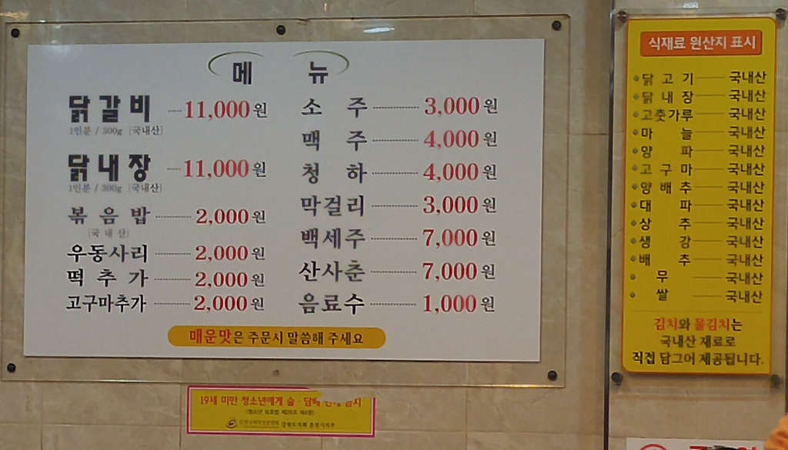
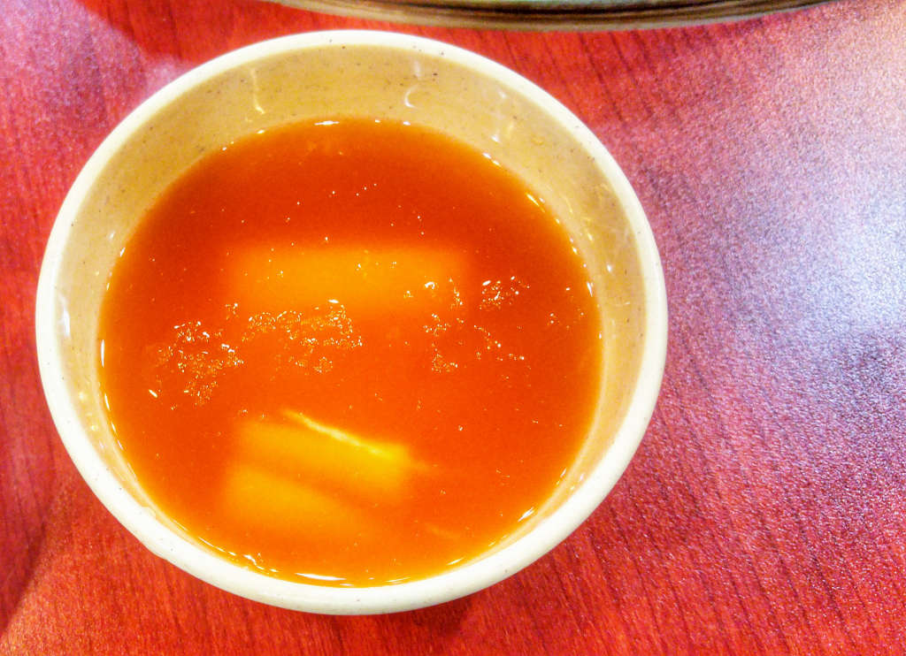
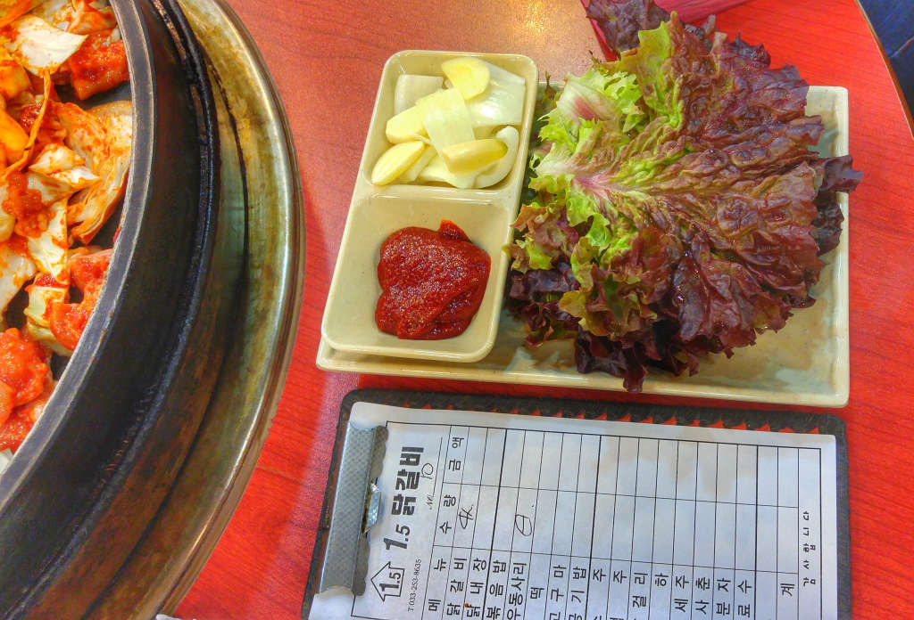
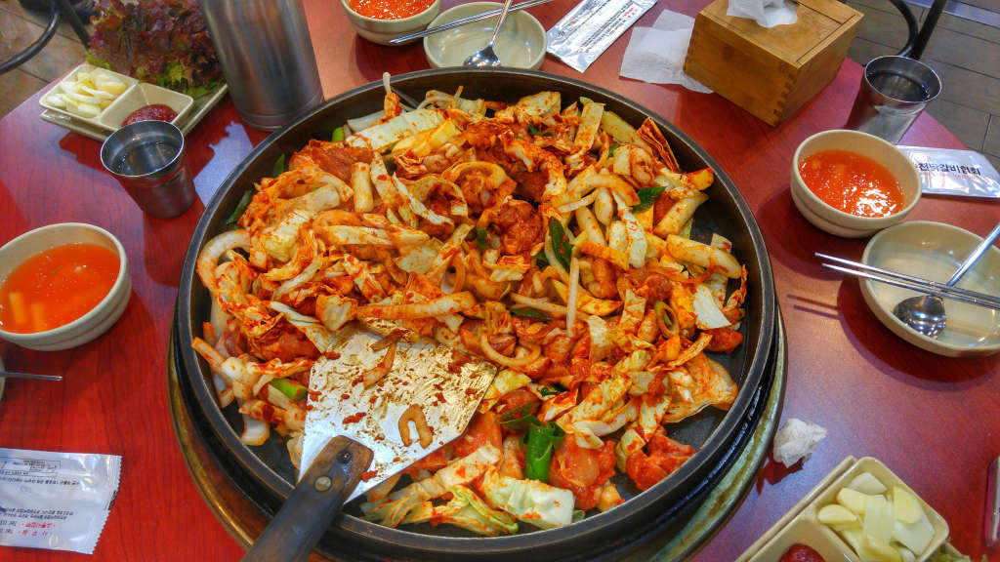
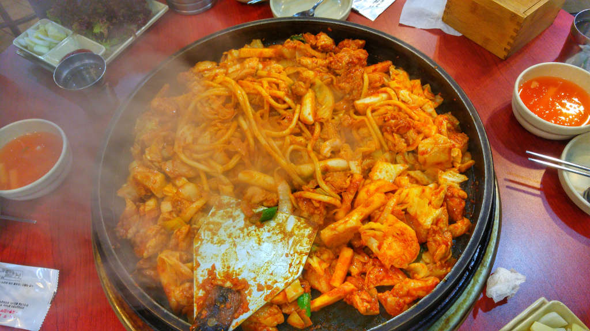
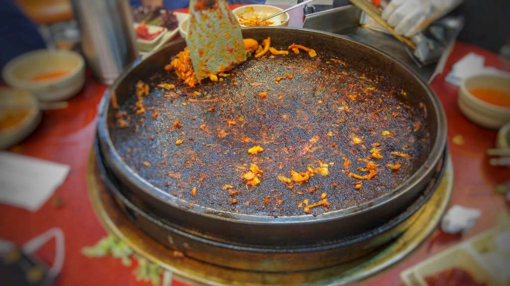
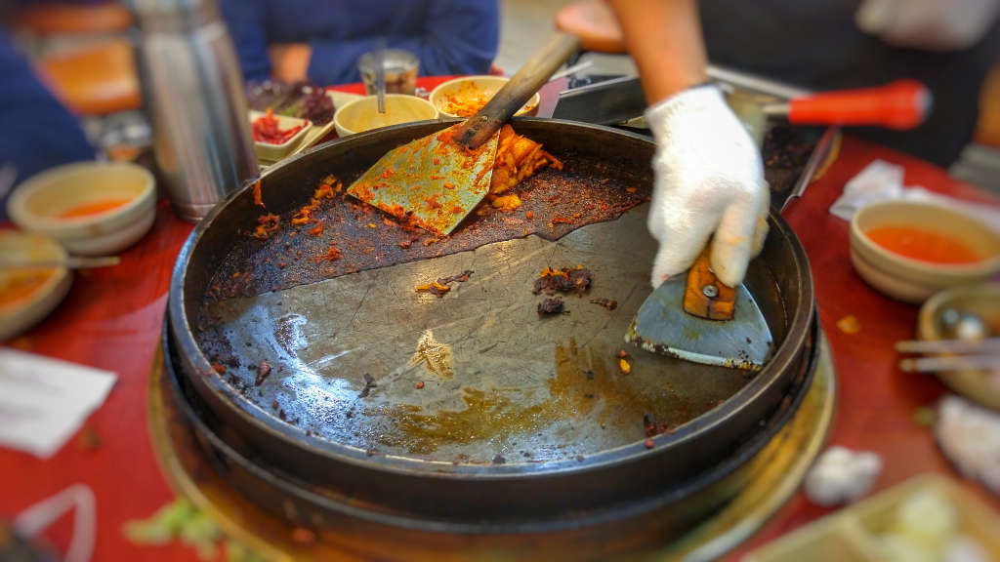
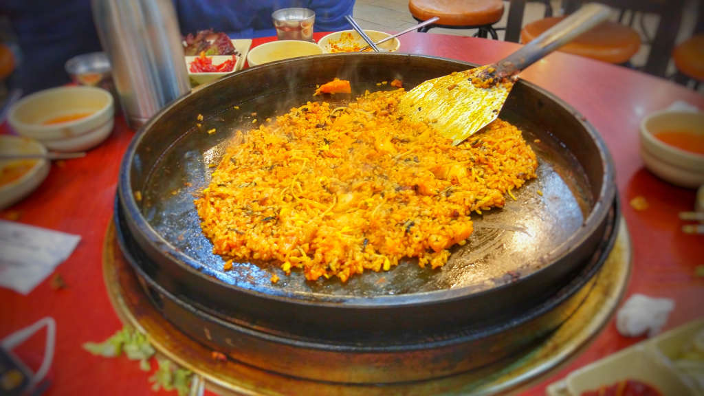
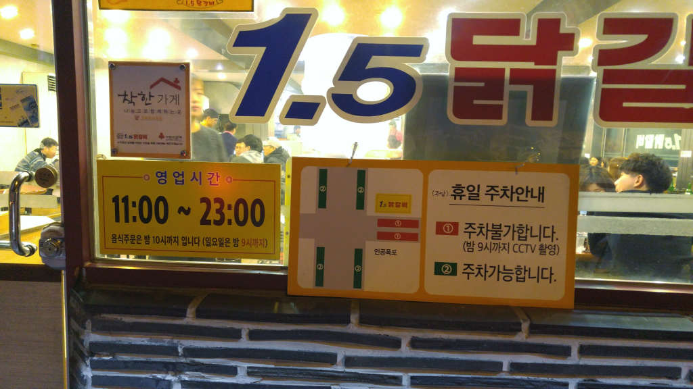
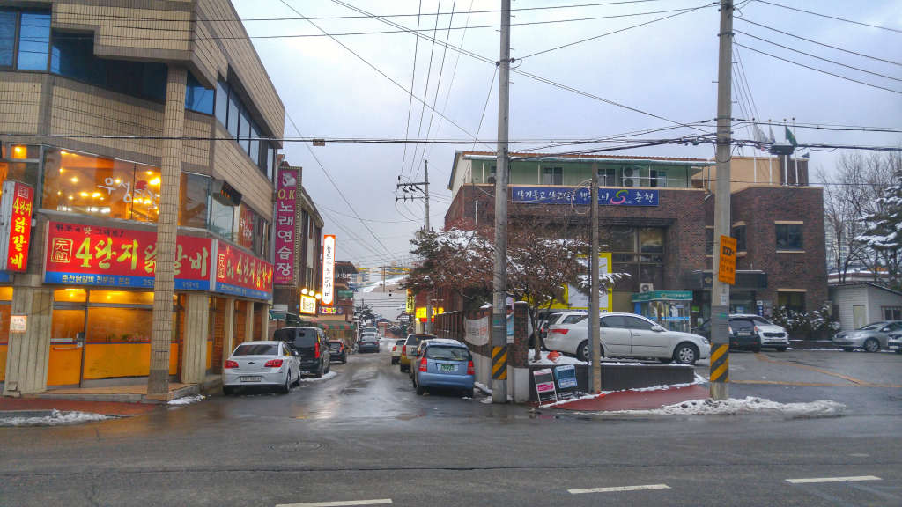

강원도나 동해쪽으로 놀러갈때 거의 매번 들려서 먹고오는 닭갈비집입니다. 가격에 비해 양도 많고 맛도 좋습니다. 주말이나 휴일 때 가면 번호표를 받고 기달렸다가 들어가야 할 정도로 인기가 있습니다.

## 대표 메뉴와 가격(가성비)

대표메뉴는 역시 닭갈비 입니다.
닭내장도 있지만 내가 먹지를 않기 때문에 패쓰~
푸짐한 양과 맛으로 가성비가 높은 편입니다. 다만 초창기에 비해 가격이 조금씩 올라서 이제는 `11,000원`까지 올라갔네요.
그래도 타 지역보다는 양이 푸짐합니다.

**가성비 : ** ★★★★☆ 

## 먹어본 음식

닭갈비는 다른 지역에서 먹는 것보다 양이 푸짐합니다. 맛 또한 너무 맵지도, 너무 달지도 않아서 대부분의 사람들이 먹기에 적당합니다.
저는 가끔 강원도쪽 동해로 넘어갈때나 홍천에서 물놀이 하고 집에 올때

▲ 닭갈비와 같이 나오는 김칫국. 닭갈비의 감칠맛을 더해줍니다.

▲ 닭갈비를 싸서 먹을 수 있게 상추와 고추장이 나옵니다.

▲ 익기 전의 닭갈비 입니다.

▲ 한참 익어갈때의 닭갈비 입니다. 어느 정도 익으면 떡과 우동사리를 먼저 먹을 수 있습니다.

▲ 닭갈비를 거의 먹었으면 밥을 볶아서 먹을 수 있습니다. 밥을 볶아달라고 하면 먼저 무쇠솥에 눌러붙은 탄 부분을 먼저 면도칼로 긁어 냅니다.

▲ 묶은 때를 벗길때 처럼 시각적으로도 시원한 맛을 느낄 수 있습니다.

▲ 탄 부분을 모두 긁어낸 후 밥과 김치와 남아 있는 닭갈비 등을 섞어서 볶음밥을 만들어 줍니다.

## 청결도

청결은 일반적입니다. 많이 더럽지도 않고 그렇다고 막 깨끗하지도 않습니다.

**청결도 : ** ★★★☆☆ 

## 식당 운영과 친절도

오랜동안 맛집으로 알려져서인지 식당 운영은 나름대로 잘 되고 있습니다.
대부분 맛집이 그렇듯이 도착하면 먼저 카운터로 가서 존재를 알려야합니다. 일점오닭갈비는 번호순으로 입장을 시켜줍니다.
따로 대기하는 장소는 없고 그냥 길에서 대기하거나 줄 비슷하게 서서 기다립니다.
자리에 앉으면 손님이 요리를 할 필요는 없습니다. 일하시는 분들이 왔다갔다 하시면서 적절히 뒤집어도 주시고 불도 조절해 주시고 먹으라고 알려도 주십니다.
일하시는 분들끼리는 서빙을 할때 뭔가 규칙을 가지고 있는 듯 적절할 때에 닭갈비를 뒤집어 주십니다.
친절도는 다소 좋은 편이라 할 수 있습니다.

**운영/친절도 : ** ★★★★☆ 

## 식당 정보와 주차 여부

일점오닭갈비도 지점이 몇군데 있는것 같습니다. 본점은 후평동에 있으니 잘 찾아가셔야합니다.
새로운 주소로는 후만로 77 로 나오네요.

- 주소 : 강원도 춘천시 후만로 77 1.5닭갈비 (강원도 춘천시 후평3동 801-13)
- 연락처 : 033-253-8635
- 영업시간 : 오전 11시~ 오후 11시
- 휴무일 : 추석과 설날 당일에만 휴무합니다.
- 주차 : 주차장이 없는게 최대 단점입니다. 다만 인근에 있는 후평3동동사무소에 주차를 하면 되는데.. **좁아요.** 그렇지 않으면 식당 뒤편으로 골목길에 빈자리 찾아서 주차를 하면 됩니다.
  주말이나 휴일에는 일점오닭갈비집앞 길의 옆쪽의 길가로는 주차가 가능하다고 합니다.

<iframe src="https://www.google.com/maps/embed?pb=!1m18!1m12!1m3!1d936.2990494422729!2d127.75280924008581!3d37.87615038633941!2m3!1f0!2f0!3f0!3m2!1i1024!2i768!4f13.1!3m3!1m2!1s0x3562e5bd788926c3%3A0x853f64306094e02c!2zMS41IOuLreqwiOu5hA!5e0!3m2!1sko!2skr!4v1498315251403" width="728" height="300" frameborder="0"  allowfullscreen></iframe>

▲ 영업시간은 오전 11시에서 오후 11시까지 입니다.  
휴일에만 인근 도로에 주차가 가능하고 평일에는 주차가 불가 합니다. 평일때는 식당 뒷쪽에 있는 골목길에 주차를 해야 합니다.

▲ 휴일이나 6시 업무시간 이후에는 후평3동 행정복지센터에 주차를 할 수 있습니다. 사진은 예전사진이고 현재는 건물을 새로 지어서 다른 모습입니다. (주말, 휴일, 저녁 퇴근이후 시간에 주차가 가능합니다.)
