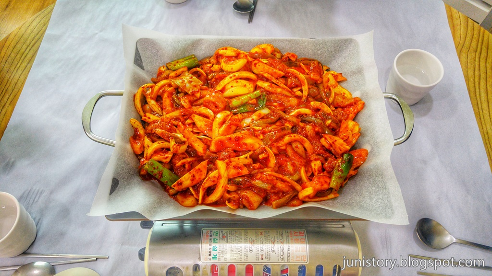
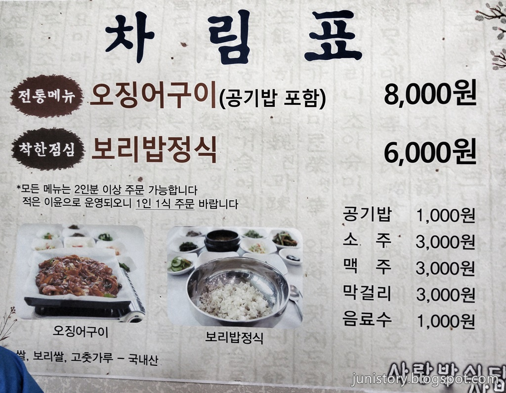
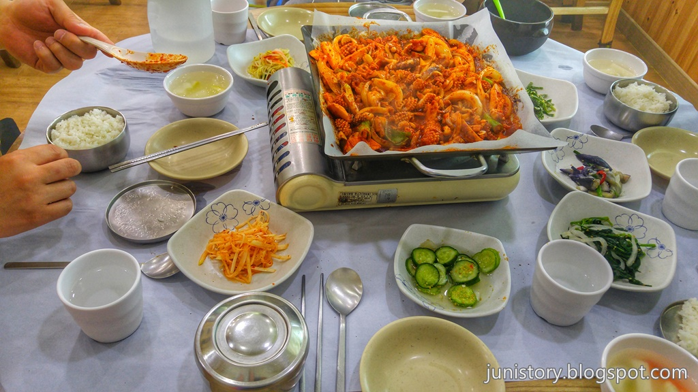
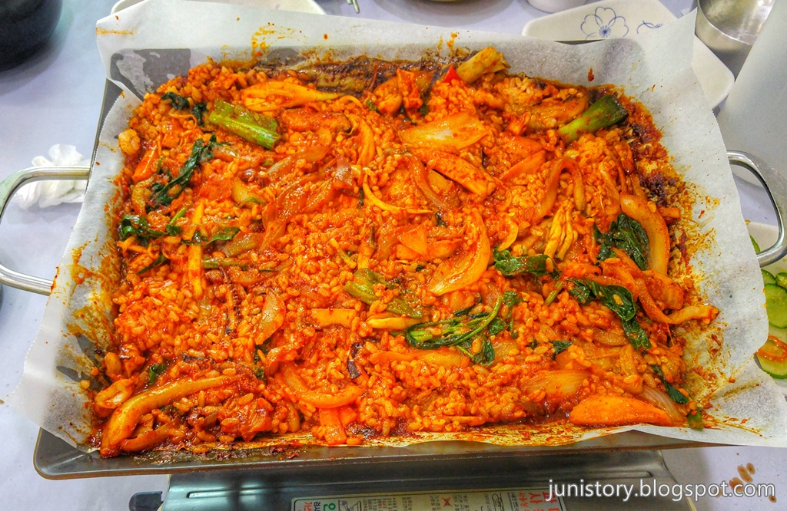
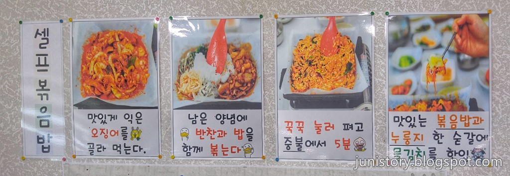

영월여행을 마치고 제천으로 넘어가기 전에 들른 **사랑방식당**입니다. 현지인에게도 맛집으로 소문났다고 하기에 방문해 봤습니다.

## 대표 메뉴와 가격(가성비)

메뉴는 **오징어구이**와 **보리밥정식** 2가지이며 `대표메뉴`가 **오징어구이**이고 보리밥정식이 서포트를 하고 있는 것 같습니다.

가격은 오징어구이가 8,000원, 보리밥정식이 6,000원으로 가성비가 높다고 볼 수 있으며 이윤이 적어서 꼭 1인 1식을 주문해달라고 합니다.

## 먹어본 음식

저희는 **오징어구이**를 먹었습니다. 보리밥정식을 먹어보지 못한것이 약간 아쉽기는 하지만 또 언제올지 모르는 영월여행이라 일단 대표메뉴만을 먹어봤습니다. 밑반찬도 깔끔하게 잘 나오는 편이고 오징어도 먹을만큼 충분히 나왔습니다.

다 먹고나서는 밥을 비벼먹을 수 있습니다.

## 먹는 방법

벽쪽에 먹는 방법이 친절히 설명되어 있습니다.  
그냥 밥과 같이 오징어를 집어먹어도 되고 오징어를 집어 먹다가 마지막에 밥과 반찬들을 비벼서 먹을 수도 있습니다.

## 청결도

식당은 그래도 상당히 깨끗한 편입니다. 불판에 기름종이를 깔고 요리를 하기 때문에 청결도를 높게 주었습니다.

 **청결도 : ** ★★★★☆ 

## 식당운영시스템과 친절도

손님이 많음에도 막힘없고 지루함 없이 무난히 서빙을 받았습니다. 또한 주인이 직접 서빙을 해서 그런지 친절도도 높습니다.

다음번 또 인근지역을 여행할 때 다시한번 들러보고 싶은 식당입니다.

 **친절도 : ** ★★★★☆ 

## 식당과 주차 정보

- 주소 : 강원 영월군 영월읍 절무리골길 12
- 연락처 : 033-374-4655 (예약이 가능합니다.)
- 영업시간 : 매일 11:30 - 20:00까지 영업합니다.
  - 14:00~17:30 까지 Break time으로 저녁준비로 식사를 제공하지 않습니다.
  - 일요일 휴무
- 주차 : 적당한 주차장이 있습니다. 손님이 많을 경우는 주차하기가 힘들 수도 있습니다.

<iframe src="https://www.google.com/maps/embed?pb=!1m18!1m12!1m3!1d3178.878282783569!2d128.45569151483465!3d37.179363479872244!2m3!1f0!2f0!3f0!3m2!1i1024!2i768!4f13.1!3m3!1m2!1s0x152e1b0baac55f4d%3A0x11e03f5438157f16!2z7IKs656R67Cp7Iud64u5!5e0!3m2!1sko!2skr!4v1500108555522" width="800" height="400" frameborder="0"  allowfullscreen></iframe>

## 기타 사항

우리가 거의 제일 먼저 도착을 해서 자리를 잡았는데 예약손님들이 스물스물 몰려와서 5번째로 식사를 받았습니다. 다시말해 `예약이 가능합니다`.
식당에 먼저 전화를 해서 예약을 하셔도 됩니다.
