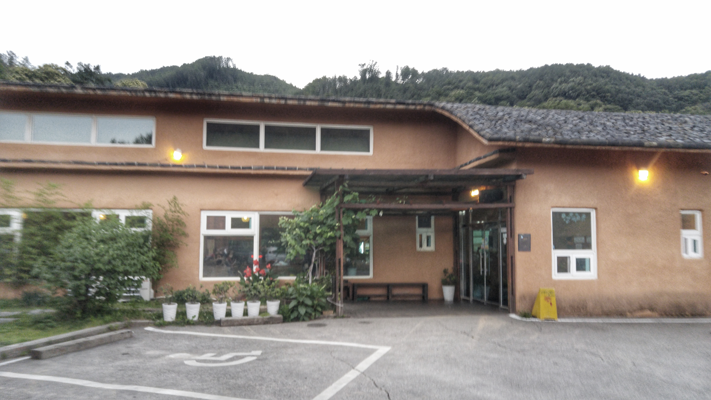
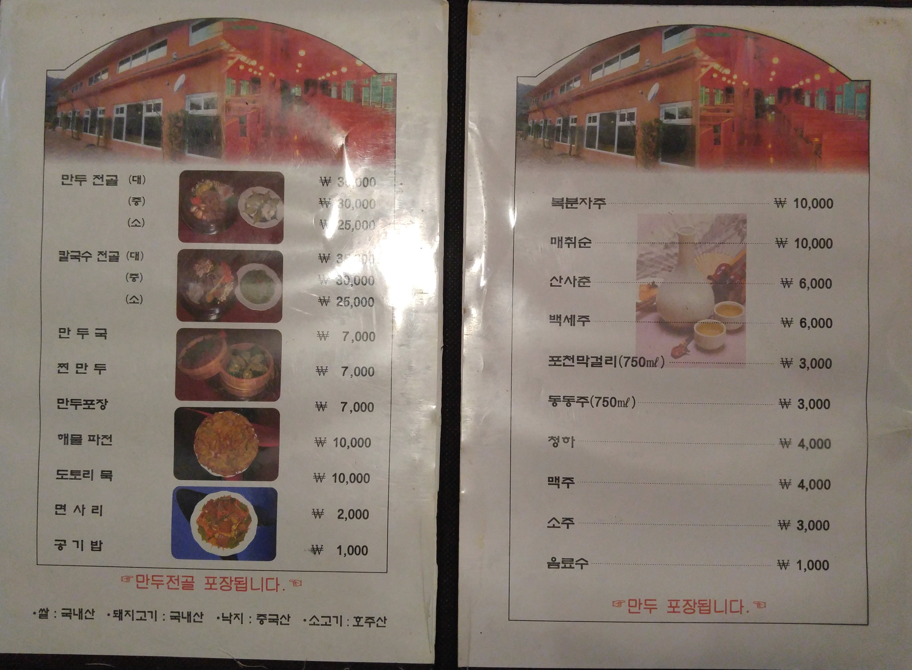
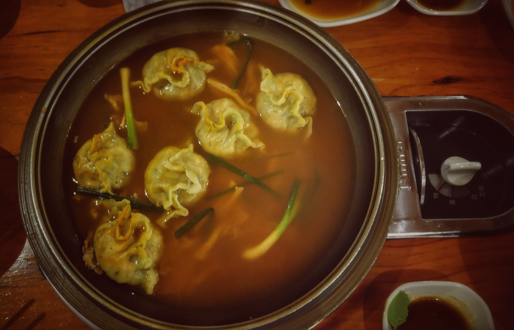
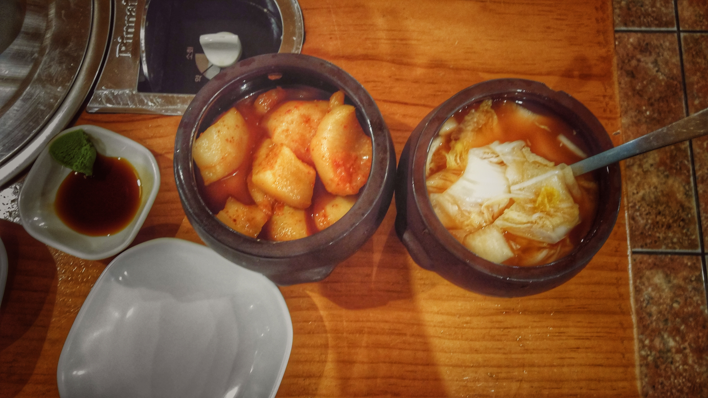
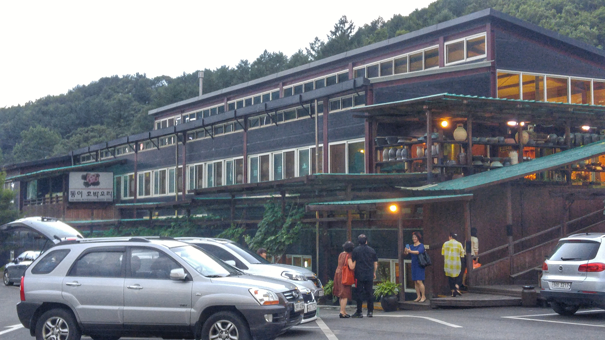

아직 방송에 나오지는 않았지만 그 지역에서 그래도 유명세를 타고있는 만두요리 전문점인 포천 고모리 **동이손만두**를 다녀왔습니다. 광릉수목원을 구경하고 집에 오기 전에 한끼를 해결하기에 적절한 위치에 있습니다.

## 방문시기

2017년 여름의 초입에 있는 6월달에 가족과 함께 다녀왔습니다. 평일 저녁이라서 그런지 사람이 많지는 않았습니다.

▲ 시선을 옆으로 돌리면 울창한 숲을 볼 수 있습니다.

## 대표 메뉴와 가격(가성비)

대표메뉴는 **만두전골**이지만 2명 이하라면 그냥 **만두국**을 먹는것이 가성비면에서 좋습니다. 만두전골은 2명이 먹기에는 양이 많습니다.
굳이 가성비를 따지지 않는다면 **만두전골**을 추천드립니다.

## 먹어본 음식

저희가 이번에 먹어본 음식은 **만두국**입니다. 만두국과 만두전골의 다른점은 눈앞에서 끓여지느냐 끓여서 가지고 오느냐입니다. 물론 만두전골에 들어가는 버섯과 고기와 두부가 실하긴 하지만 그냥 **만두**를 먹는 것이 목적이고 **가성비**를 생각한다면 만두국도 나쁘지 않습니다.
**만두국 1인분**에 만두 4알과 공기밥 1/3 이 나오지만 보통사람이라면 양이 부족하지는 않습니다.

▲ 만두국입니다. 블로거의 본분을 망각하고 사진을 찍기 전에 먹어버렸습니다. ㅠㅠ;

▲ 주문을 하면 **물김치**와 **무김치**가 나옵니다. 물김치는 깔끔하고 매콤한 맛이 일품입니다.

## 청결도

전통이 있는 식당이라 식당자체는 완전 깨끗한 편은 아니지만 그래도 위생에는 상당히 신경을 쓰고 있는것 같습니다. 일단 수저와 식기류는 고온살균처리를 하고 있습니다. 그리고 주방도 개방이 되어 있어서 식사를 하면서 주방을 볼 수 있게 되어 있습니다.

 **청결도 : ** ★★★★☆ 

## 식당운영시스템과 친절도

**식당운영시스템**은 비교적 잘 되고 있는 것 같습니다. 좀 바쁠때 와 봐야 **식당운영시스템**에 대해서 정확히 확인할 수 있겠지만... 서빙을 보고 계시는 분도 여러 분 계시고 대부분 친철 하십니다. 실수로 젓가락을 떨어뜨렸는데 따로 요청을 하지 않았음에더 바로 새 젓가락을 가져다 주시더군요.

 **친절도 : ** ★★★★☆ 

## 식당과 주차 정보

- 주소 : 경기도 포천시 소흘읍 광릉수목원로 700-5
- 연락처 : 031-541-6870
- 영업시간(휴무일) : 매일 오전 11 :00 ~ 오후 09:00
- 주차 : 주차는 넓은 주차공간이 있습니다. 주차때문에 스트레스 받지는 않을것 같습니다.
<iframe src="https://www.google.com/maps/embed?pb=!1m18!1m12!1m3!1d3153.7015348812756!2d127.15620171485536!3d37.7735959797597!2m3!1f0!2f0!3f0!3m2!1i1024!2i768!4f13.1!3m3!1m2!1s0x357ccf1a73ef7b3f%3A0x87df9e5b175c1834!2z64-Z7J207IaQ66eM65GQ!5e0!3m2!1sko!2skr!4v1498578973366" width="800" height="300" frameborder="0"  allowfullscreen></iframe>

## 기타 사항

▲ **동이호박오리**식당과 주차장을 같이 사용하고 있습니다.
