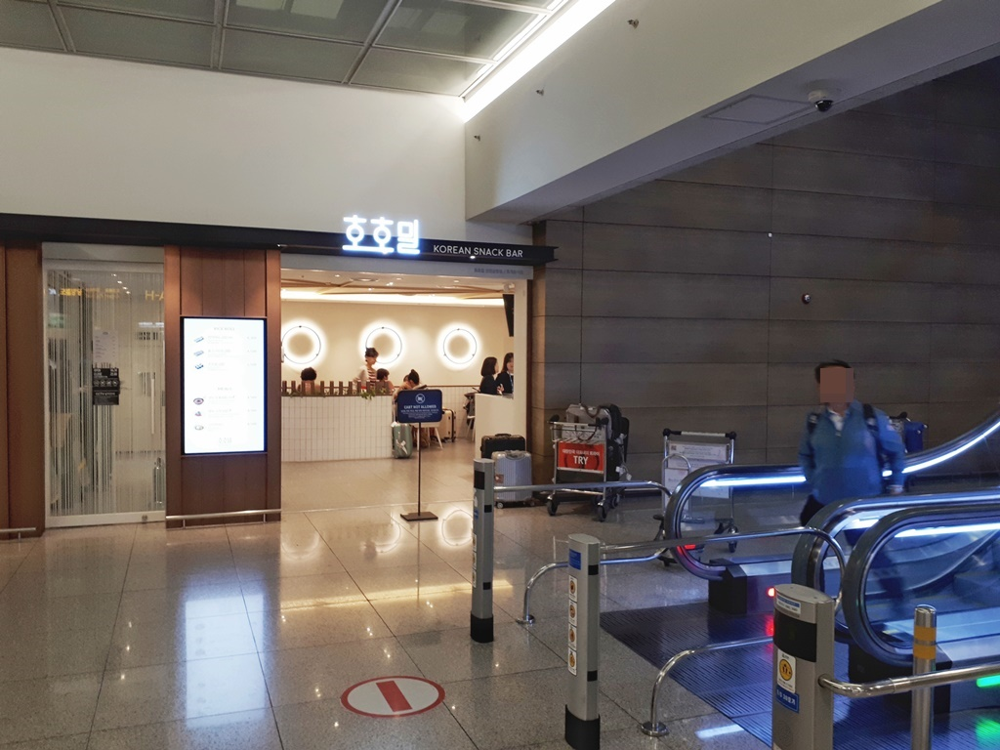
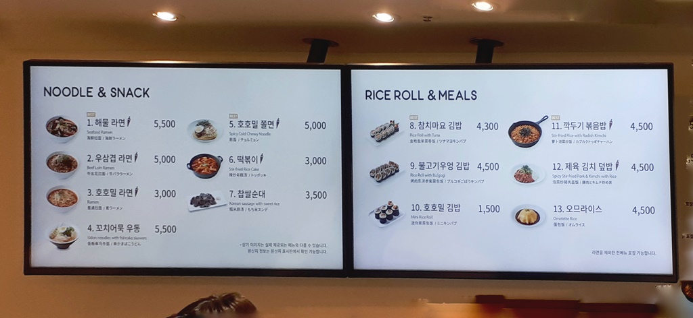

일반 서민층인 저희는 주로 식당을 찾을 때 맛좋은 음식만을 찾지 않고 **가성비가 좋은 식당**을 주로 찾아 다닙니다.  
보통 **인천공항**의 식당들은 뭐 좀 제대로 먹을려면 가격이 후덜덜 합니다.  
하지만 인천공항 내에서도 맛도 있고 가격도 저렴한 가성비 좋은 식당이 있습니다.

## 가성비 좋은 식당 **호호밀**

예전에도 지하에 분식점으로 있었고 주로 공항 직원들이 이용을 했었습니다.  
이번에 베트남 갔다오면서 들렸었는데 이름을 **호호밀**이라고 바꾸고 내부도 깨끗하게 수리를 했습니다.

▲ 호호밀은 인천공항 **제1터미널** 중간지점의 **지하 1층**에 위치해 있습니다. 에스컬레이터를 타고 내려오면 바로 앞에 있습니다.  
스튜어디스나 면세점직원, 기타 공항에서 일하시는 분들이 주로 찾습니다. 그리고 몇몇 이 식당을 알고 있는 사람들이 찾아 옵니다.

호호밀은 **`오전 6시30분에 오픈하고 오후 10시에 닫는다고 합니다.`**

▲ 가격표입니다. 다 싸다고는 할 수 없지만 **제육김치덥밥**이나 **오므라이스** 같은 경우 `4500원`이면 정말 싼 편입니다.

식당 선택할 때 가성비를 따지는 분이라면 출국하거나 입국할때 이용하시면 좋을것 같습니다.
