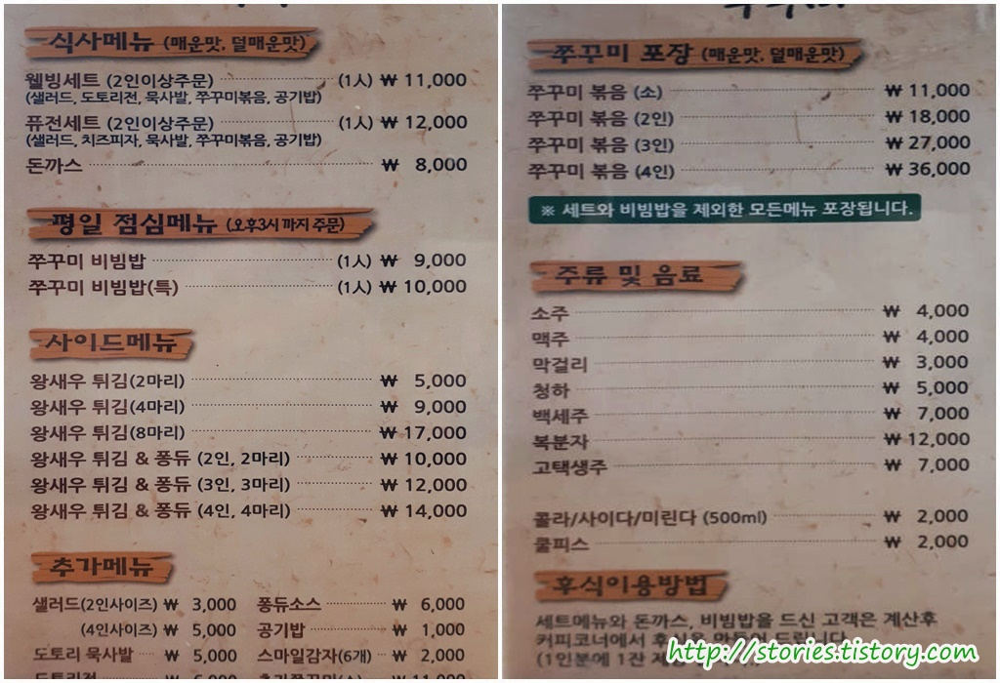
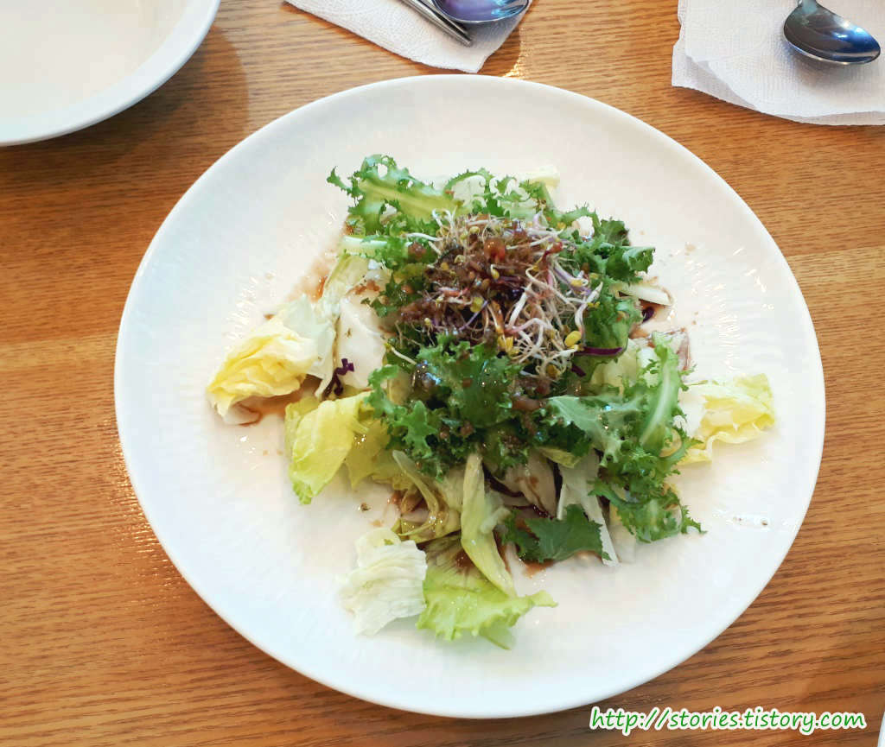
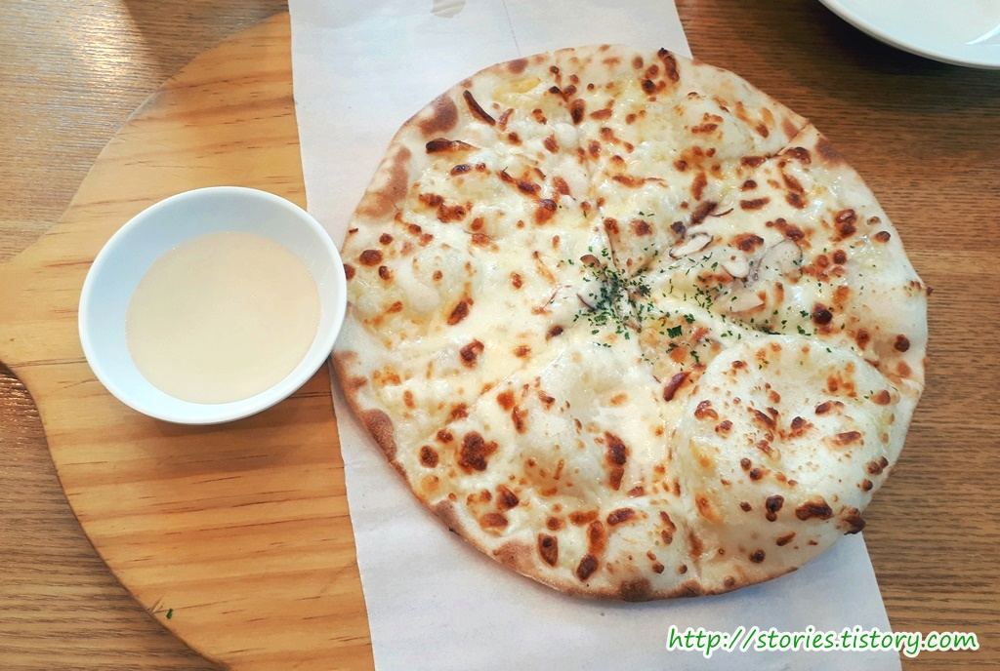
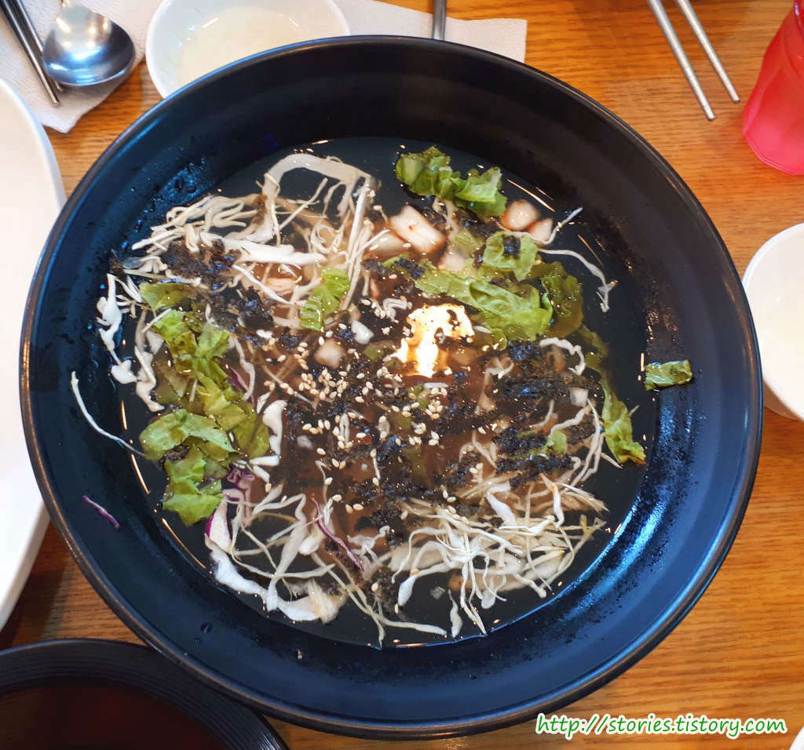
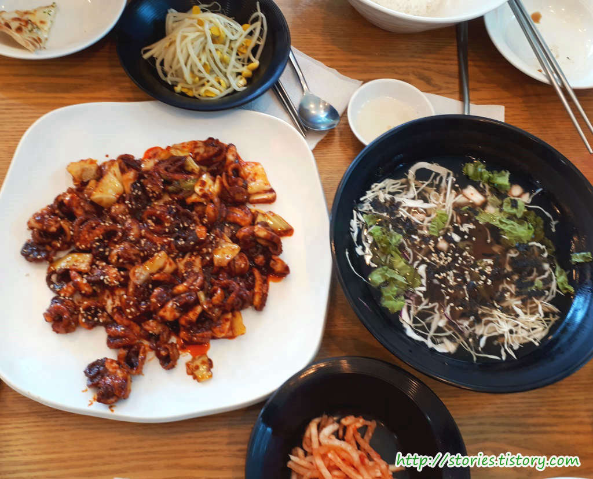
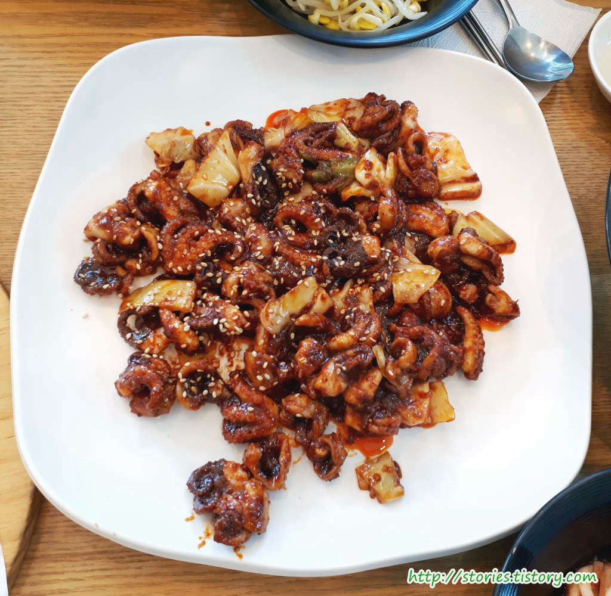
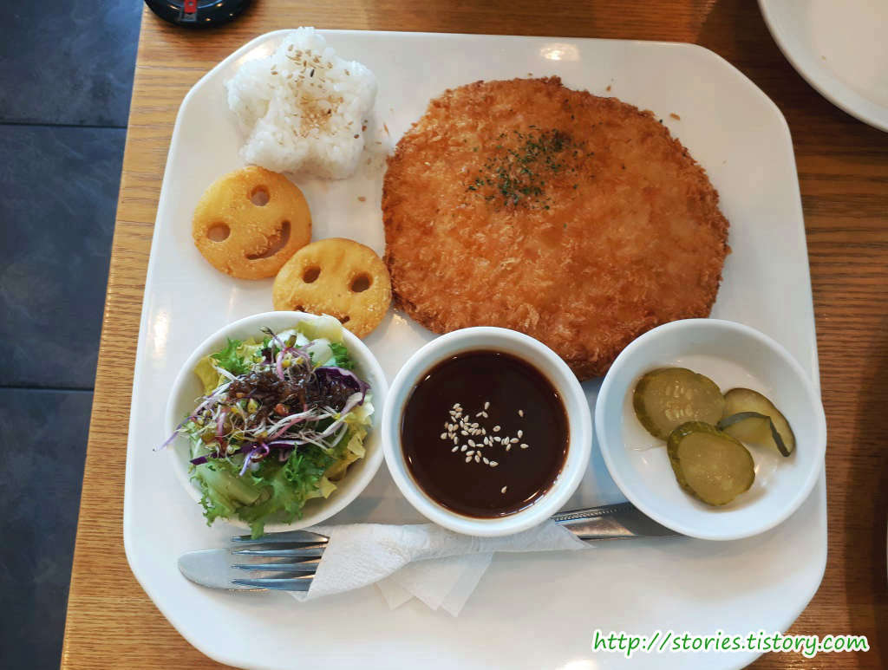
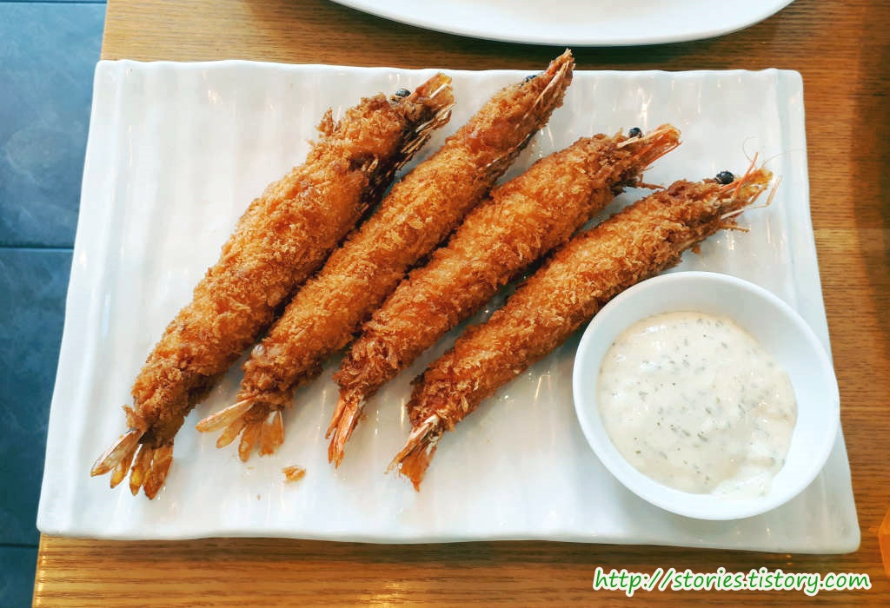
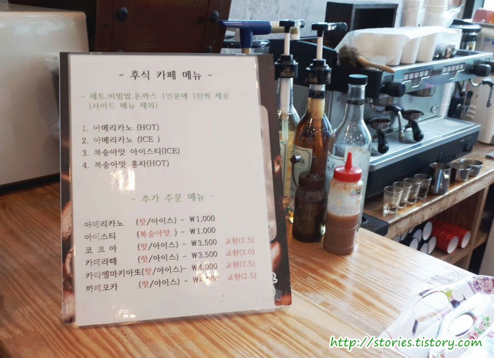

의정부에 몇안되는 알려진 맛집 중에 맛있게 매운 쭈꾸미맛이 일품인 불만난쭈꾸미를 소개합니다.  
생긴지는 대략 5~6년정도 된것 같은데 그때부터 자주 찾아가서 먹을 정도로 맛이 있습니다.

## 방문시기

예전부터 자주 다니던 곳입니다. 오늘도 쭈꾸미 먹으러갔다가 사진을 몇장 찍어봤습니다.

## 대표 메뉴와 가격(가성비)

주 메뉴는 **쭈꾸미 웰빙세트**와 **쭈꾸미 퓨전세트** 입니다. 하지만 여기서는 사이드 메뉴인 **왕새우 튀김**은 꼭 먹어봐야 합니다.
참고로 대부분은 퓨전세트보다는 **웰빙세트**를 많이 먹지만 우리는 오늘 퓨전세트로 시켰습니다.

평일에는 가본적이 없어서 먹어보지는 못했는데 점심식사하시는 분을 위한 쭈꾸미비빔밥도 있습니다.

- **쭈꾸미 웰빙세트** : 11,000원 (1인당 11,000원이고 최소 2인분이상 주문)
- **쭈꾸미 퓨전세트** : 12,000원 (1인당 11,000원이고 최소 2인분이상 주문)
- 돈까스 : 8000원

## 먹어본 음식

오늘 먹어본 음식은 **쭈꾸미 퓨전세트**, **돈까스**, **왕새우튀김** 4마리입니다.

**쭈꾸미 웰빙세트**나 **쭈꾸미 퓨전세트**를 주문하면 먼저 셀러드가 나옵니다. 새싹 채소에 발싸믹소스를 뿌려서 애피타이져 형식으로 먼저 나옵니다.

세트메뉴에 포함되어 있는 **치즈피자** 입니다. 세트메뉴를 2인분만 시켰기 때문에 사이즈가 그렇게 크지는 않습니다.  
 따뜻할때 먹는 치즈피자는 정말 진리입니다. 맛있어요.

쭈꾸미가 맵기 때문에 같이 먹을 수 있는 **시원한 묵사발**은 필수 입니다. 항상 불만인 것은 **겨울시즌**에는 묵사발 대신에 **따뜻한 쌀국수**가 나오는데 그러지 말았으면 합니다. 따뜻한쌀국수 보다는 시원한 묵사발이 훨~씬 좋습니다. 그래서 저는 겨울철에는 거의 가지 않습니다.

매인요리인 불만난 쭈꾸미 입니다. 메뉴이름처럼 쭈꾸미에 불맛을 입혀서 나옵니다.  
매운맛과 덜매운맛중에 선택을 할 수 있으며 우리는 매번 덜 매운맛을 선택을 합니다.
참고로 사진에 나온 양은 2인분의 양이고 우리는 2인분과 공기밥을 시켜서 3명이서 먹습니다.

우리집에 매운것을 싫어하는 1인이 있어서 돈까스도 하나 시켰습니다. **돈까스**는 그냥 평타입니다. 맛이 없지도 않고 그렇다고 특색있게 맛있지도 않습니다.

사이드 메뉴지만 존재감만은 갑인 **왕새우튀김**입니다. 다른곳에서 나오는 새우튀김과는 차원이 다릅니다. 일단 사이즈가 크고 바싹함이 뛰어납니다. 머리까지도 바짝 튀겨서 머리까지도 니다.먹을 수 있습니다. **강추** 입니다.

세트메뉴를 먹고나면 후식으로 아이스티나 커피를 무료로 줍니다. 물론 커피전문점에서 먹는것 하고는 비교할 수 없지만 식사 후에 간단히 입가심하기에는 좋습니다.

## 청결도

청결도는 보통입니다. 그냥 서민이 먹기에 그정도의 적당한 수준입니다.

 **청결도 : ** ★★★☆☆ 

## 식당운영시스템과 친절도

식당운영시스템은 불편하지 않습니다. 사람이 어느정도 있어도 착오나 실수없이 잘 운영되고 있는것 같습니다.
친절도도 보통입니다.

 **운영시스템 : ** ★★★☆☆ 

 **친절도 : ** ★★★☆☆ 

## 식당과 주차 정보

- 주소 : 경기도 의정부시 산성로 11
- 연락처 : 031-837-3359
- 주차 : 주차는 약 5~7대정도 주차를 할 수 있고 길 건너편에도 몇대 주차를 할 수 있습니다.

<iframe src="https://www.google.com/maps/embed?pb=!1m18!1m12!1m3!1d6307.809562013895!2d127.03623065774379!3d37.76883080739296!2m3!1f0!2f0!3f0!3m2!1i1024!2i768!4f13.1!3m3!1m2!1s0x357cc6cd74e67b39%3A0x7108f3f0843a37a4!2sTAKE5DVD!5e0!3m2!1sko!2skr!4v1530956316524" width="600" height="450" frameborder="0"  allowfullscreen></iframe>
