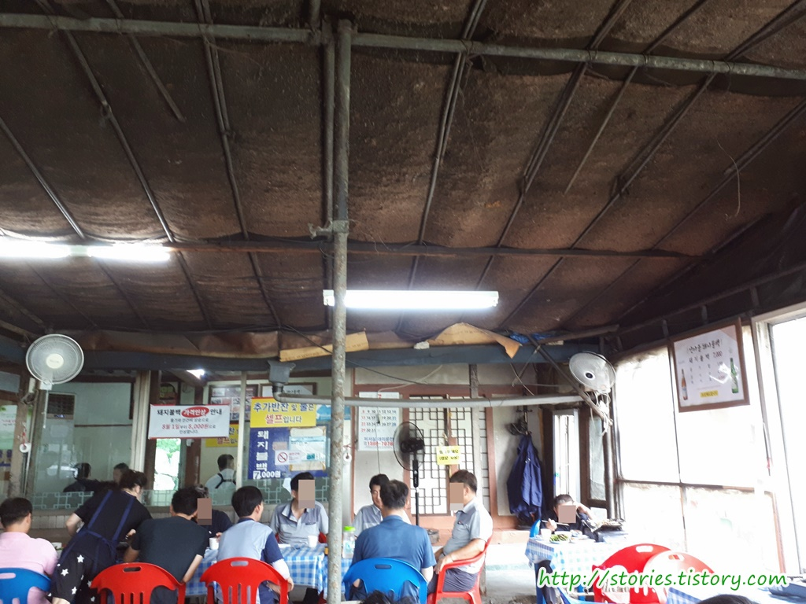
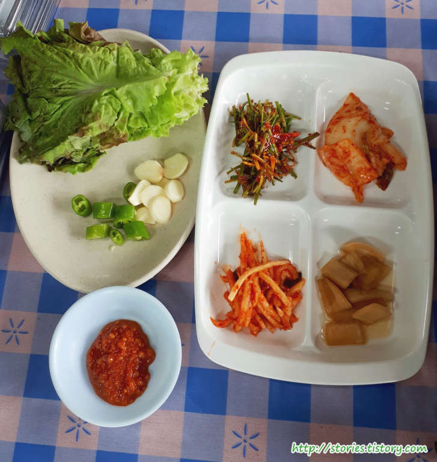
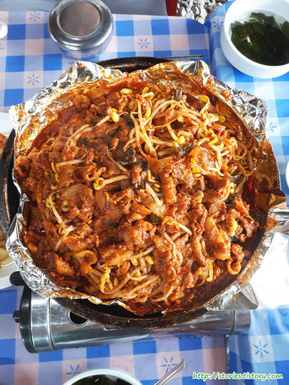
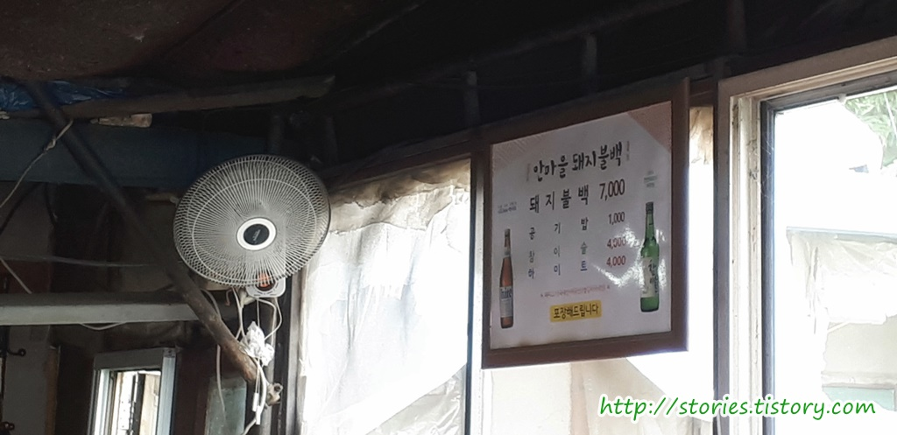
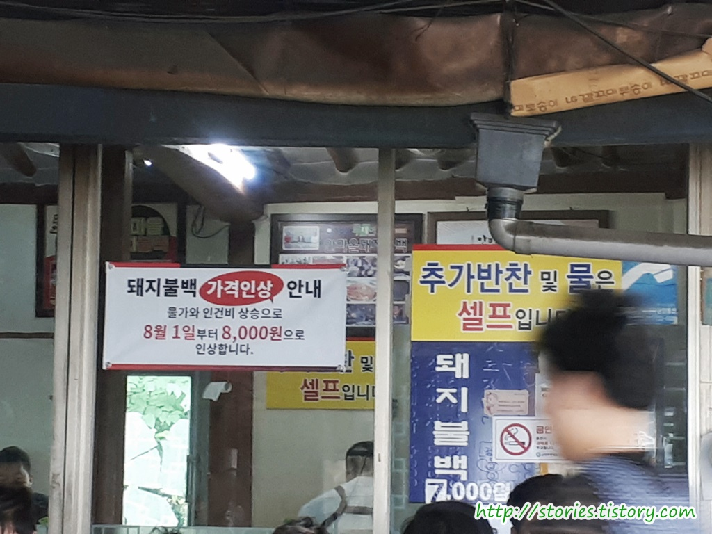

여행을 떠나서 점심을 먹기위해 맛집을 검색한 결과 `백종원의 3대천왕`에서 소개가 되었다고 하는 남양주 진접에 위치한 **안마을 돼지불백**에 다녀왔습니다.

방송을 다 믿는 편은 아니지만 크게 선택의 여지가 없어서 정오 쯤 해서 도착을 했습니다. 다행히 빈자리는 있었으나 12시 20분쯤 되니 자리가 모두 꽉 찾습니다.  
 큰 도로가의 가정집을 식당으로 개조한 형태를 하고 있어서 실내에도 자리가 있고 마당에도 식탁을 몇개 갖다놓고 활용하고 있습니다.

## 대표 메뉴와 가격(가성비)

일반식당과 다르게 안으로 들어가면 상당히 허름해 보입니다. 우리는 자리가 없어서 실내로 들어가지 못하고 마당의 식탁에 자리를 잡았습니다.

반찬은 상추와 쌈장 그리고 밑반찬 4가지가 나옵니다. 반찬의 상태를 보면 재활용하지는 않는것 처럼 보였습니다.

매인요리인 **돼지불백**입니다. 여름이라 그런지 주방에서 모두 익혀서 나오기 때문에 따로 불을 피울 필요없이 그냥 먹기만 하면 되게 나옵니다. 다른 계절 때도 익혀서 나오는지는 모르겠네요.
그 덕분에 에어컨이 없는 마당이지만 땀이 나지는 안았습니다.

돼지불백은 먹으면서 돼지냄새가 나지 않을 정도로 신선했습니다. 돼지불백 자체는 너무 맛이 있었습니다.

늘~ 맛집이 그렇듯 메뉴는 딱! **돼지불백**만 있습니다.
그리고 공기밥과 소주, 맥주....
공기밥은 기본으로 1인당 1그릇씩은 나옵니다. 추가로 요청할 경우만 `1,000원`의 값을 받습니다.

다행히 7월달에 방문해서 7,000원으로 먹었지만 **2018년 8월 1일부터 8,000원**으로 인상을 한다고 합니다.  
여기도 방송을 타서 그런지 가격이 점점 사악해 지려고 하는 것은 아닌가 합니다.

## 청결도

청결도부분에서는 좀 아이러니한 부분이 있습니다.  
일단 매인 음식인 불고기는 회전율이 좋아서 그런지 신선한 것 같습니다. 고기에서 잡내가 나지 않습니다.  
반찬도 재활용하는 것 같진 않습니다. 주방을 자세히 살펴 보지는 못했지만 다 먹고난 식탁을 정리할때 보면 그냥 짬을 시켜서 버리고 있었습니다. 나온 반찬들도 신선해 보이고 깨끗해 보였습니다.

다만 식당 자체는 깨끗하지 않습니다. 더욱이 마당도 그렇고 식탁도 깨끗하지 않습니다.  
식당의 주 고객이 인근의 상점, 공장, 공업사, 택시기사님, 경찰분들이 일을 하시다가 점심을 해결하러 바로 오시기 때문에 좀 그렇습니다. ^^;

**청결한 것을 좋아하시는 분이라면 비추**고 오로지 맛 만을 추구하신다면 추천할 만 합니다.

 **청결도 : ** ★★☆☆☆ 

## 식당운영시스템과 친절도

식당운영시스템은 나름 나쁘지 않은것 같습니다. 친절도도 딱히 모나지 않구요. 평범합니다.

 **친절도 : ** ★★★☆☆ 

## 식당과 주차 정보

- 주소 : 경기도 남양주시 진접읍 금강로 1001
- 연락처 : 031-571-7235
- 영업시간(휴무일) : 매일 09:00 - 21:00 (일요일 휴무)
- 주차 : 식당 앞에 5~6대정도, 길가에 4~5대정도 주차할 공간이 있습니다만 찾는 사람이 많아서 그런지 주차가 좀 힘들긴 합니다.  
  주차를 관리해 주시는 분이 계시긴 합니다.

## 기타 사항

음식이 맛도 있고 좋지만 가족 중에 분위기와 청결도에 민감한 사람이 있어서 다시 가지는 않을 것 같습니다.

**식당 방문 리얼후기** 였습니다.
