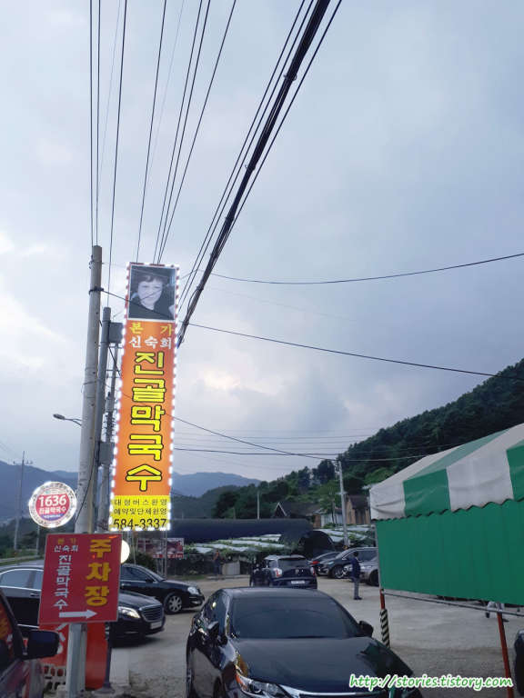
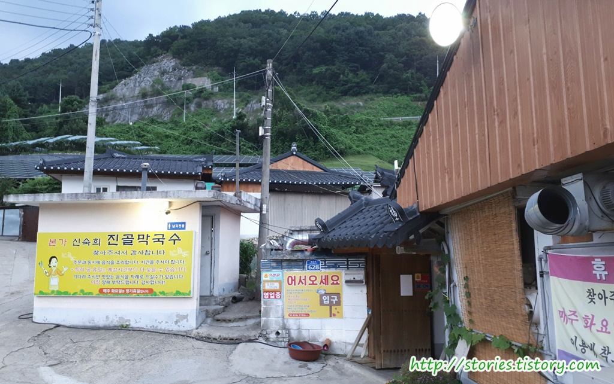
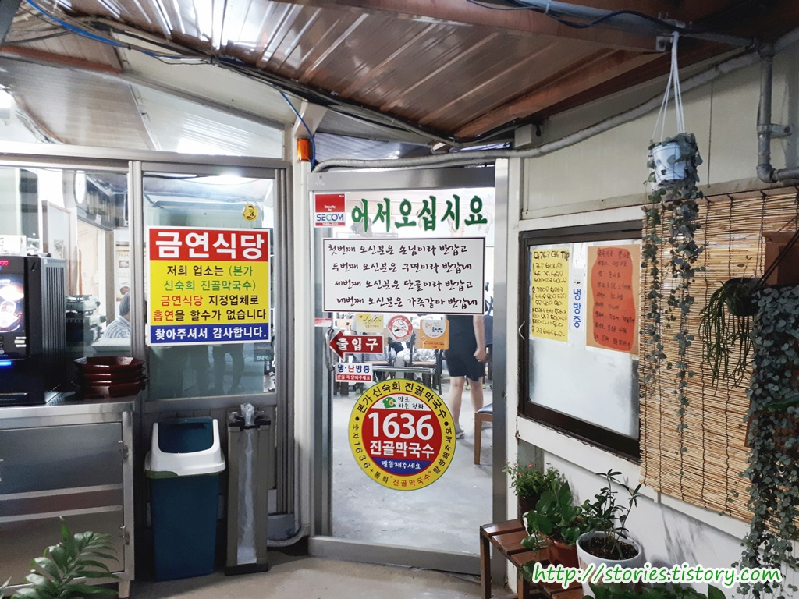
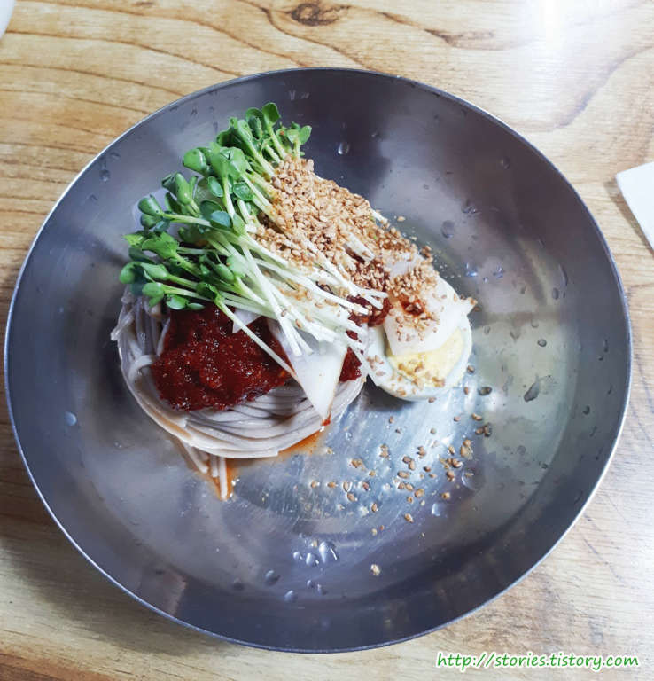
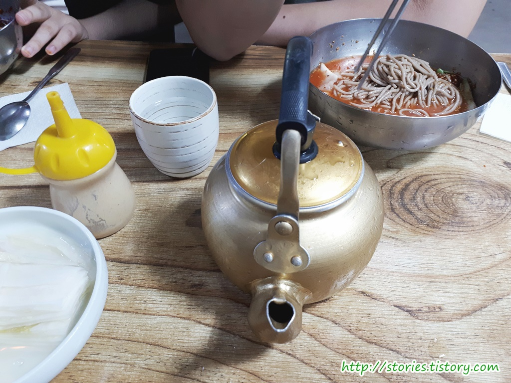
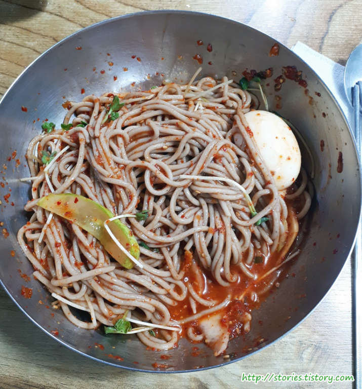
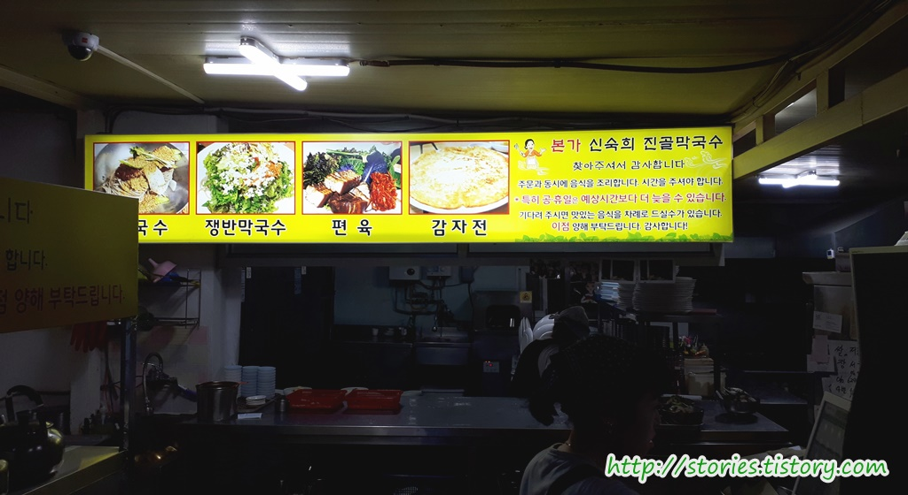
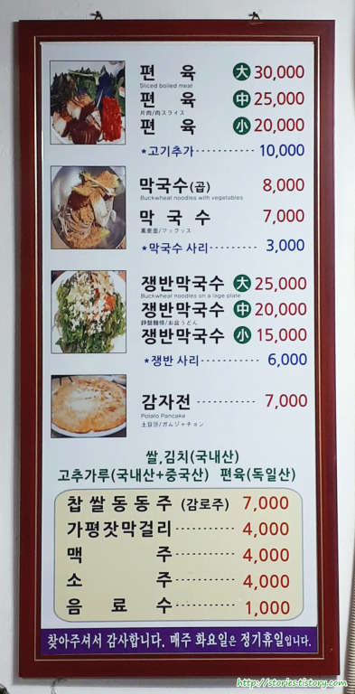

가평 여행 중에 재대로된 막국수를 먹기 위해 폭풍검색 후 송원막국수를 찾았으나 문이 닫혀서 차선책으로 `본가 신숙희 진골막국수`를 다녀왔습니다.

진골막국수집은 `아침고요수목원`으로 가는 길목에 있습니다.  
큰 글씨로 간판이 서 있어서 쉽게 찾을 수 있었습니다.

주차를 하고 입구에 들어서면 "어서오세요"라는 간판을 만날 수 있습니다.  
여기가 입구인가? 하는 정도의 입구같아 보이지 않은 입구로 들어서면 됩니다.

입구로 들어서면 또하나의 입구를 만날수 있습니다.
금연이라는 문구와 말로하는 전화 1636 마크가 크게 붙어 있습니다.
말로하는 전화는 또 뭘까요? 처음 접해보는 방법이네요.

## 대표 메뉴와 가격(가성비)

막국수 집이니 대표메뉴는 막국수 입니다.  
가격은 `7,000원`, 곱배기는 `8,000원`입니다. 1,000원 추가로 한덩어리를 더 먹을 수 있으니 막국수를 좋아한다면 곱배기를 추천합니다.
저는 1인분만 시켜서 사진에는 메밀국수가 한덩어리만 있습니다.

먹는 방법은 `식초`와 `설탕`과 `겨자`를 넣고 육수를 넣고 잘 섞어서 드시면 됩니다.

육수를 조금만 넣으면 비빔막국수가 되고 많이 넣으면 물막국수가 됩니다.  
개인마다 호불호가 다르겠지만 육수를 조금만 넣어서 비빔식으로 드시는 걸 추천합니다.

충분히 섞이도록 비벼서 드셔야 본연의 맛을 느낄 수 있다고 합니다.  
막국수는 냉면과 달리 면 자체가 잘 끊어지기 때문에 가위없이 그냥 드시면 됩니다.

이 집에서 내세우는 대표메뉴는 `막국수`, `쟁반막국수`, `편육`, `감자전`입니다.

## 청결도

청결도는 괜찮은 편입니다.

 **청결도 : ** ★★★☆☆ 

## 식당운영시스템과 친절도

식당의 운영 시스템과 친절도도 좋은 편입니다. 그다지 불편함을 느끼지는 못했고 손님의 요청을 잘듣고 들어 주십니다.

 **친절도 : ** ★★★☆☆ 

## 식당과 주차 정보

- 주소 : 경기도 가평군 상면 청군로 628
- 연락처 : 031-584-3337
- 영업시간(휴무일) : 매일 11:30 - 21:00 (매주 화요일 휴무)
- 주차 : 주차장은 20대 정도는 주차할 수 있을 정도의 크기입니다. 저희가 갔을때는 아슬아슬하게 주차를 했습니다.
