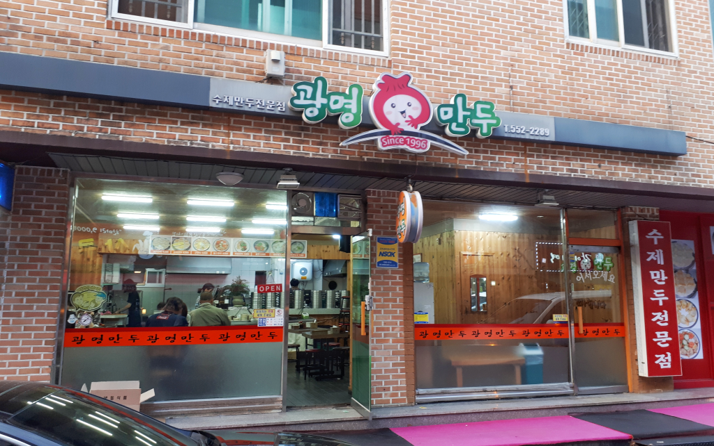
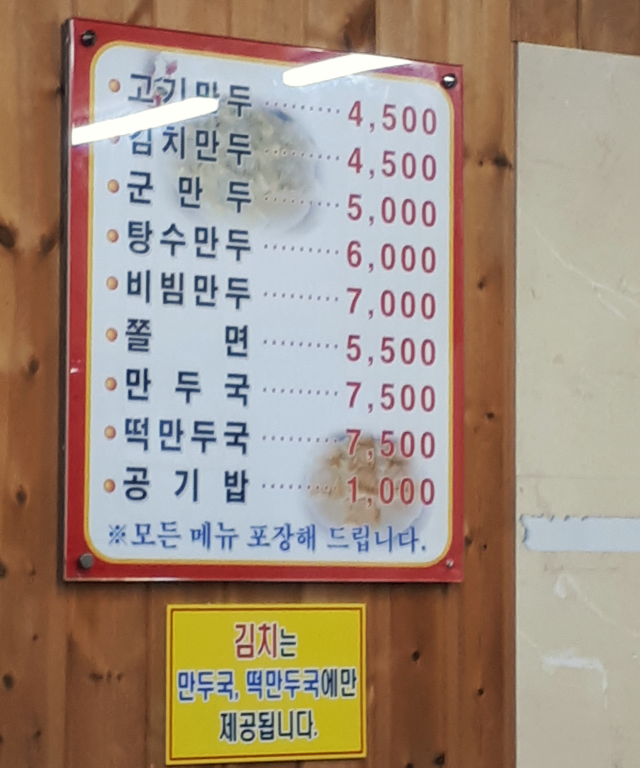

## 방문시기

2018년 10월달 천안여행을 하면서 평일 5시쯤에 일부러 찾아간 광명만두집입니다.  
평일날 저녁시간 전에 방문해서 그런지 사람이 그렇게 많지는 않았습니다.

## 대표 메뉴와 가격(가성비)

여러가지 메뉴가 있지만 솔직히 대표메뉴가 무엇인지는 모르겠습니다. 그래도 김치만두와 고기만두가 맛은 있습니다.

가격은 근래에 500원정도 올라서 4,500원에서 7,500원 선을 유지하고 있습니다.

## 먹어본 음식

우리는 `비빔만두`와 `김치만두`, `고기만두`를 먹었습니다.  
아쉽게도 김치만두와 고기만두는 사진을 찍지 못했네요.

`비빔만두`는 군만두 4알과 쫄면을 섞어서 주는 구성인데 모습은 그럴싸해 보이지만 별로 맛있다는 생각이 들지는 않았습니다. 쫄면은 좀 달고 군만두하고 어우러진 맛을 내지는 못하는 것 같았습니다.  
그냥 김치만두와 고기만두가 훨씬 맛있는것 같았습니다. 김치만두와 고기만두의 만두피가 얇고 속이 알차서 맛집이 그냥 소문만은 아니라는 것을 알 수 있습니다.

## 청결도

청결도는 보통입니다.

별점 : ★★★☆☆

## 식당운영시스템과 친절도

직원이 충분히 있어서 주문과 음식내오는 것이 순조로웠습니다. 주문 후 먹기까지 많이 기다리지도 안았고 포장도 금방 나왔습니다.

별점 : ★★★☆☆

## 식당과 주차 정보

- 주소 : 충남 천안시 서북구 두정중4길 1
- 연락처 : 041-552-2289
- 영업시간(휴무일) : 매일 10:30 - 21:00 (일요일 휴무)
- 주차 : 주차장이 넓지는 않습니다만 몇 대는 주차가 가능합니다.
  [지도] http://naver.me/Fg8szmr3

내먹개평 (내돈 내고 먹은 개인적인 평가) 

