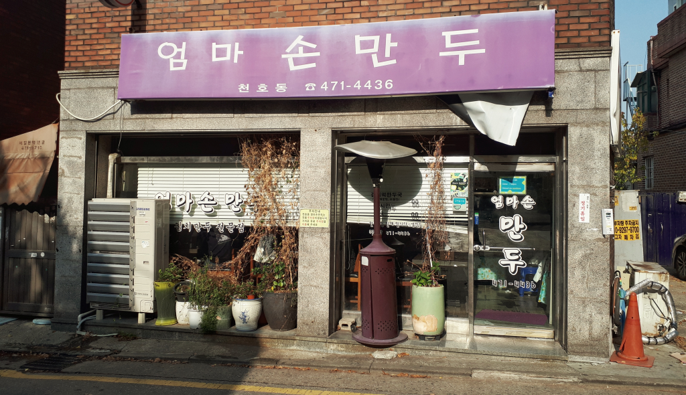
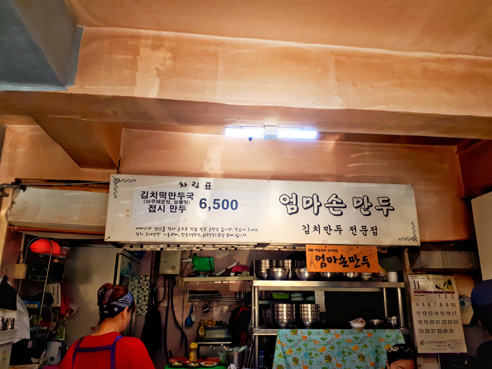
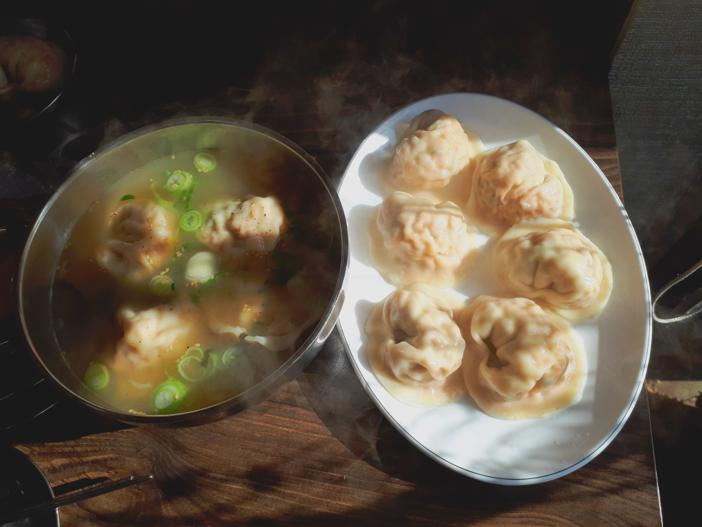
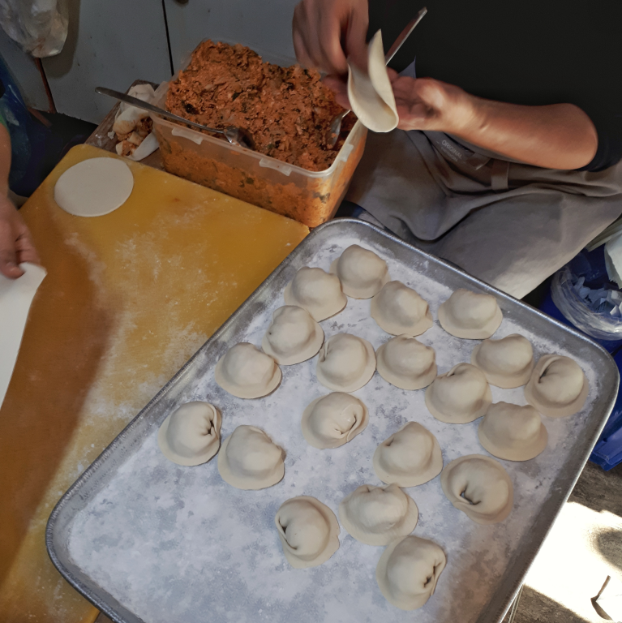

## 방문시기

2018년 11월 어느 토요일에 일이 있어 천호동에 방문한 김에 `백종원의 3대천왕`에서 맛집으로 소개된 엄마손만두를 다녀왔습니다.  
개인적으로 만두, 그 중에서도 김치만두를 좋아하기 때문에 예전부터 맛집리스트에 저장해 놨던 터라 기대를 가지고 방문했습니다. 날씨가 약간 쌀쌀해서 만둣국을 기대하며 다녀왔습니다. 

## 대표 메뉴와 가격(가성비)

일단 베이스는 김치만두입니다. 김치만두만 있습니다.  
**김치떡만두국**과 **접시만두**가 있고 **아주매운맛**과 **보통맛**으로 나누어져 있습니다.

가격은 모두 `6,500원` 통일입니다.

## 먹어본 음식

만두국이 많이 땡기기는 했지만 그냥 만두국 하나와 접시만두를 모두 먹어봤습니다.  
만두국에는 만두가 5알이 들어 있고 접시만두에는 6알이 들어있습니다. 

 
만두국의 국물 맛은 자극적이지 않으면서 계속 먹게되는 참 맛있는 맛입니다.  
접시만두는 증기에 찐 것인지 물에 삶은 것인지 정확히 모르겠으나 아마도 물에 삶은듯한 느낌의 김치만두가 접시에 담아져서 나옵니다. 날씨가 쌀쌀할 때는 아무래도 만둣국이 제격인것 같습니다.

만두피는 약간 두꺼운 편입니다. 만두피가 얇은 것을 선호하시는 분은 좀 싫어 할 수도 있겠지만 두꺼워도 맛이 좋습니다. 집에서 만든 것 처럼 정감이 가는 맛입니다.  

한켠에서는 2 ~ 3분이 계속 만두를 만들어 내고 있습니다. 만두피도 손수 밀고 만두속도 계속 채우고 계십니다. 

우리는 식당에서 만두국과 접시만두를 시키면서 같이 접시만두 2개를 포장해서 집으로 가져왔습니다. 가져오는 시간동안 만두가  식었지만 식은데로 맛이 좋았습니다.  

## 청결도

청결도는 너무 기대하지 않는 것이 좋습니다. 들어서는 입구부터 어수선합니다. 죽은 화분들이 그대로 있고 실내도 그다지 깨끗하지는 않습니다. 주방쪽의 모습도 깨끗해 보이지는 않았습니다. 

별점 : ★★☆☆☆

## 식당운영시스템과 친절도

식당의 운영은 어느정도 잘 되는 듯 합니다. 일단 기다리는 사람이 불편하거나 억울하지 않게 주문순서대로 잘 내오고 있었습니다.  또한 일하시는 분들도 대부분 가족분들인지 친철했습니다. 

별점 : ★★★☆☆

## 식당과 주차 정보
- 주소 : 서울특별시 강동구 올림픽로76길 19
- 연락처 : 02-471-4436 
- 영업시간(휴무일) : 매일 11:30 - 19:00 (일요일 휴무)
- 주차 : 주차장은 따로 없습니다.   
         `주차 팁!!` : 가게 앞에 **2001아울렛**이 있습니다. 아울렛에서 물건을 사면 1~3시간정도 무료 주차를 할 수 있으니 물건을 사고 잠깐 나와서 `엄마손만두`를 먹고 가면 적당합니다.
         
[지도] http://naver.me/GbK4KaNP

내먹개평 (내돈 내고 먹은 개인적인 평가) 

