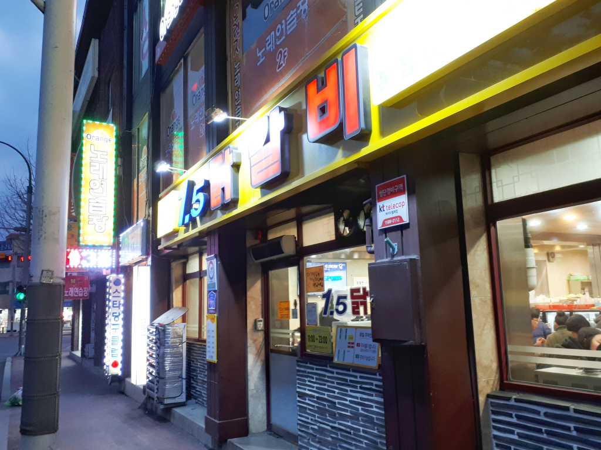
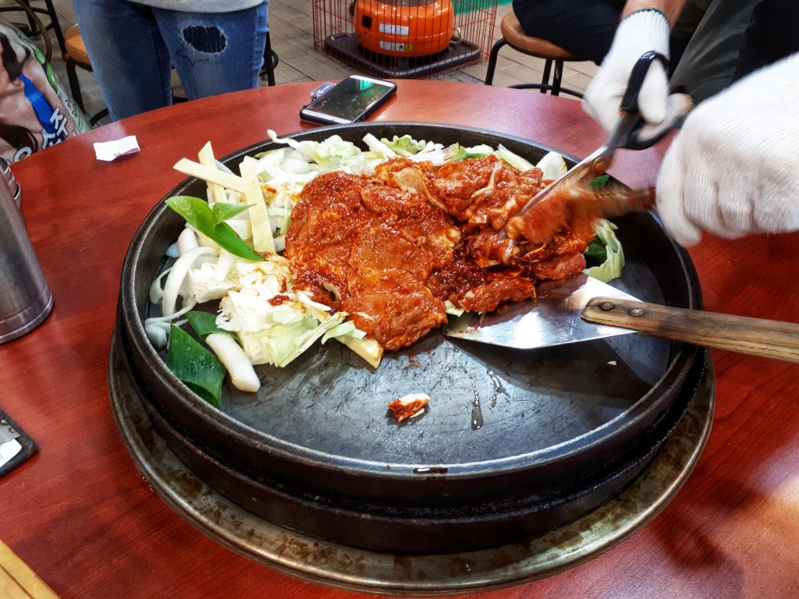
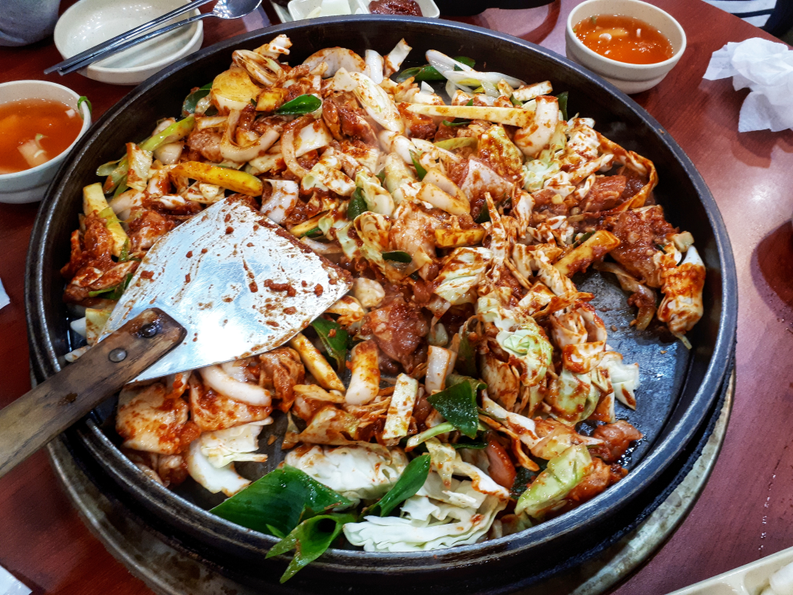
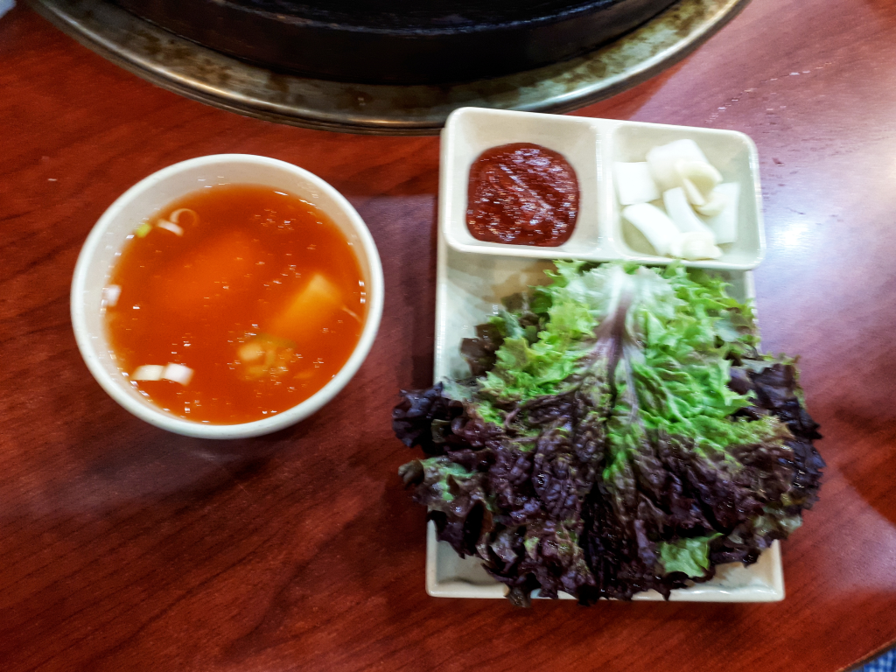
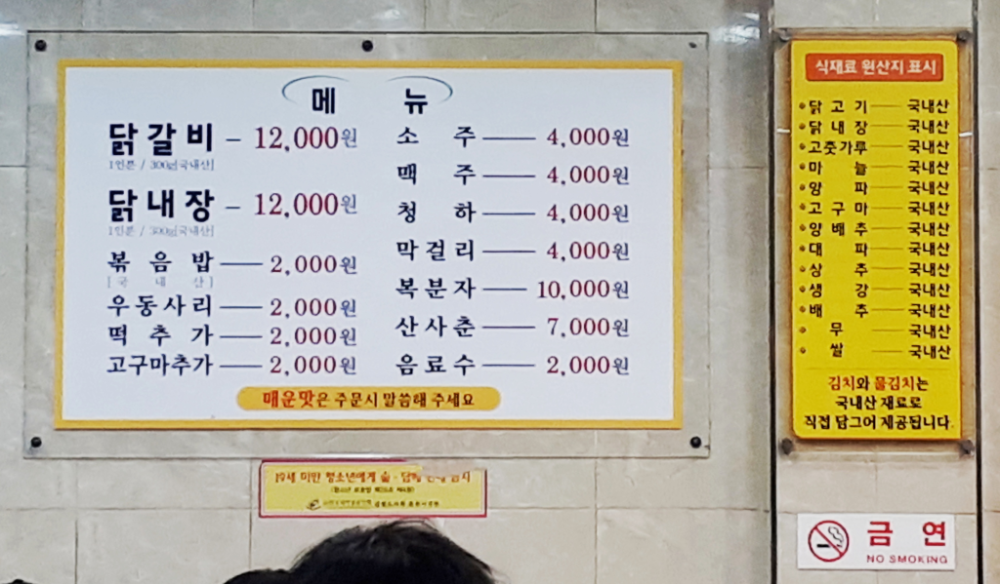
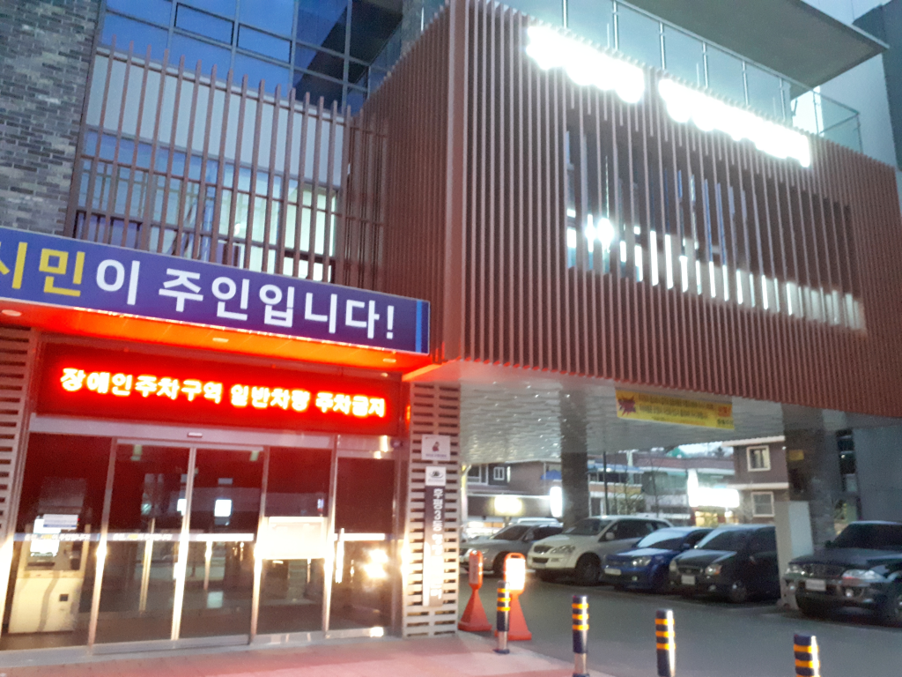
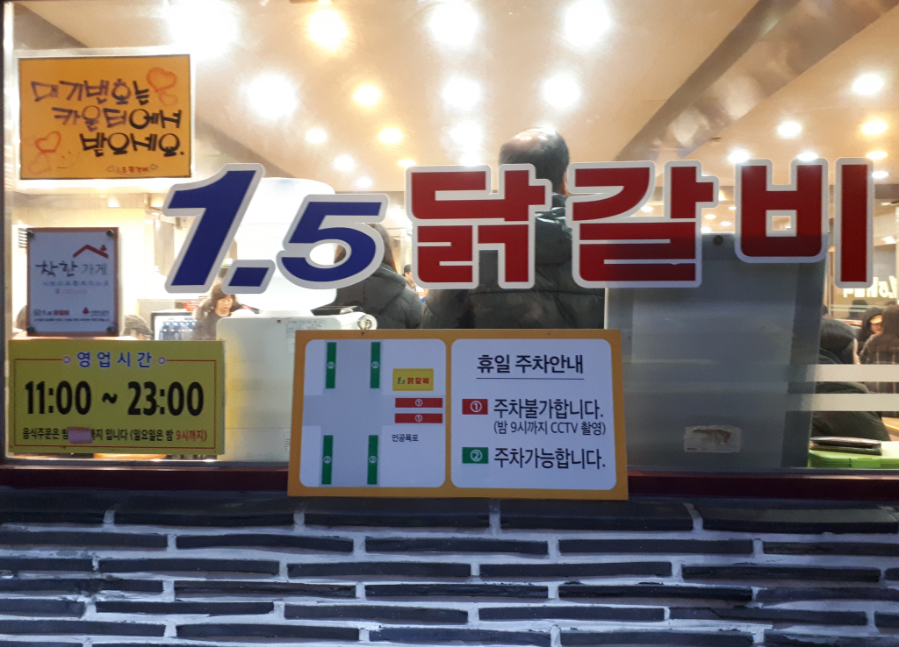

춘천이라 멀긴하지만 크리스마스날 기념으로 열심히 달려서 일점오닭갈비를 다시 다녀왔습니다.  
역시 맛은 옛날에 먹던 맛 그대로 입니다. 하지만 점점 가격이 사악해 지는 기분이 듭니다. 

  
작년까지만 해도 11,000원이였는데..... 지금은 12,000원까지 올라버렸네요. 
9,000원에서 10,000원 오르는 것은 오래 걸렸는데, 10,000원에서 12,000원까지 오르는 데는 2년이 안걸리네요.  
작년에 포스팅 한 내용을 참고하세요  
[춘천의 맛집 후암동 일점오닭갈비(1.5닭갈비)](http://stories.tistory.com/276)

가격말고는 변한 것은 없는것 같습니다. 

## 대표 메뉴와 가격(가성비)

   
닭갈비를 3인분 주문했습니다. 다른곳에서 먹는 것에 비하면 양은 모자란 양은 아닙니다.  

  
이제 끓기 시작합니다. 손님은 그냥 단지 앉아만 있으면 됩니다. 일하시는 분이 적절한 시간에 귀신같이 오셔서 타지않게 뒤집어 주십니다. 

  
사이드메뉴는 단촐합니다. 김칫국, 상추, 양파, 고추장이 전부입니다. 

### 가격
가격은 1년만에 1000원이 더 올라서 `12,000원` 이네요..  

  
차림표에 의하면 모든 재료는 국내산이네요.

## 청결도
청결은 일반적입니다. 많이 더럽지도 않고 그렇다고 막 깨끗하지도 않습니다.

**청결도 : ** ★★★☆☆ 

**운영/친절도 : ** ★★★★☆ 

## 식당과 주차 정보
- 주소 :  강원도 춘천시 후만로 77 1.5닭갈비 (강원도 춘천시 후평3동 801-13)
- 연락처 : 033-253-8635
- 영업시간 : 오전 11시~ 오후 11시
- 휴무일 : 추석과 설날 당일에만 휴무합니다.
- 주차 : 주차장이 없는게 최대 단점입니다. 
휴일이거나 6시이후 공무원 업무가 종료된 시간에는 인근에 있는 후평3동 주민센터에 주차를 하면 됩니다. 그곳에 자리가 없으면 식당 뒤편에 있는 골목길 빈자리를 찾아서 주차를 하면 됩니다.

  

주말이나 휴일에는 일점오닭갈비집 앞 길의 옆쪽의 길가로는 주차가 가능하다고 합니다.

  
