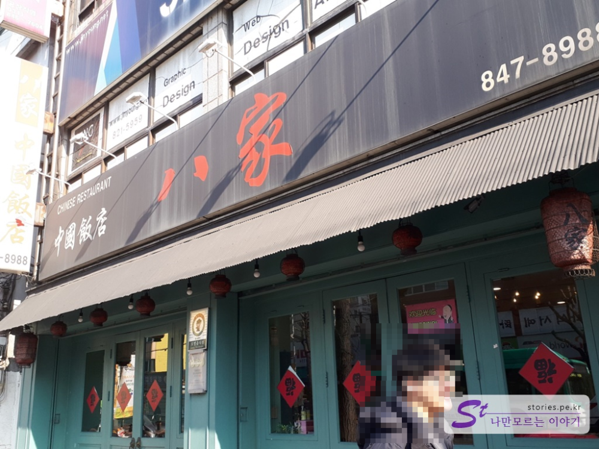
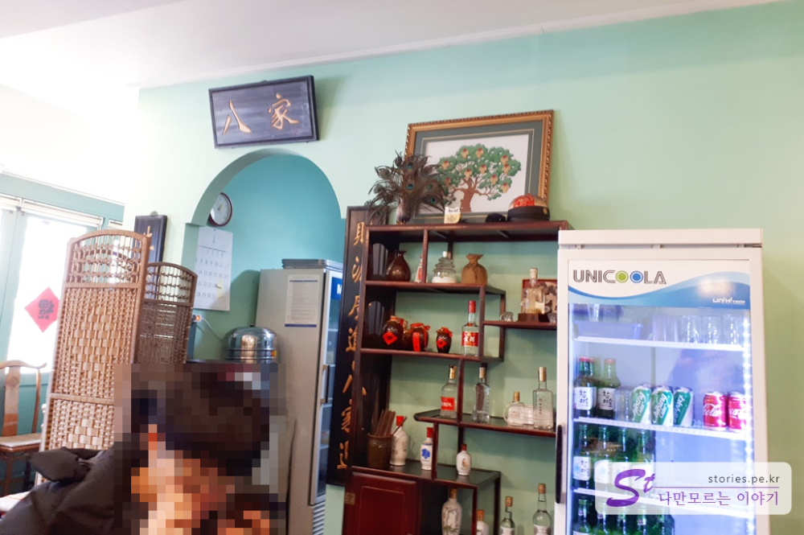
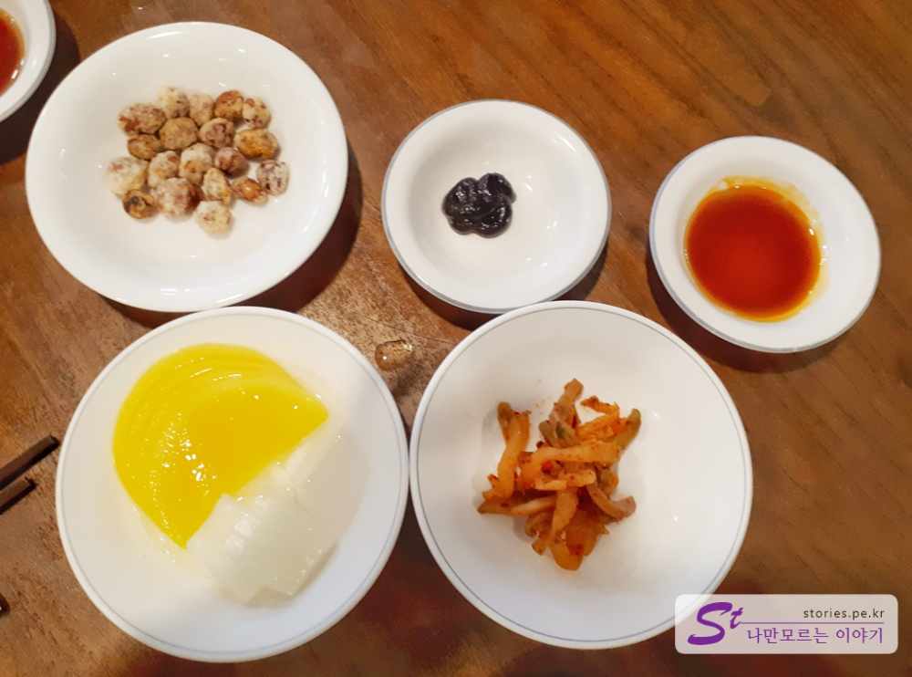
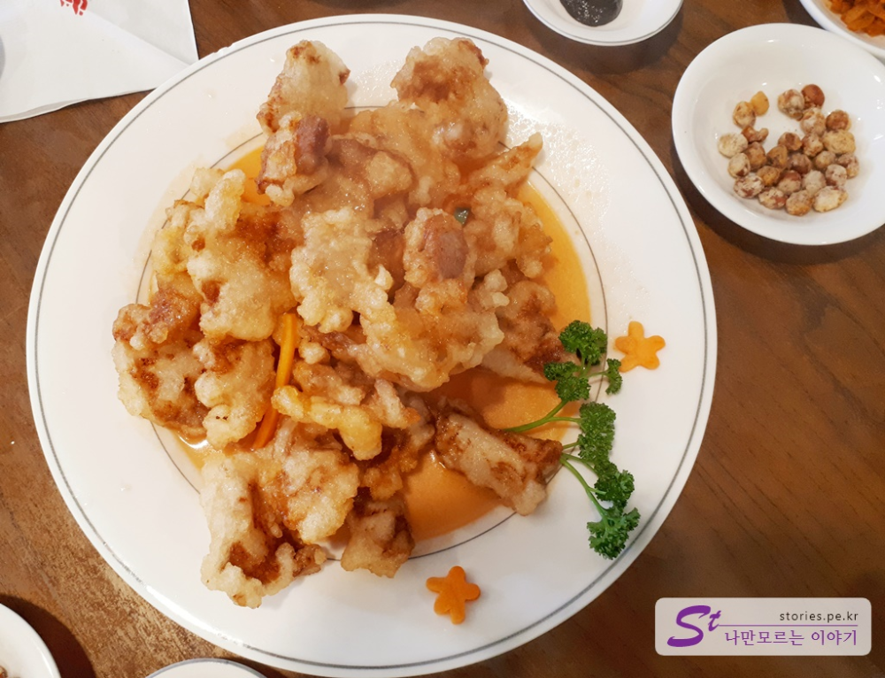
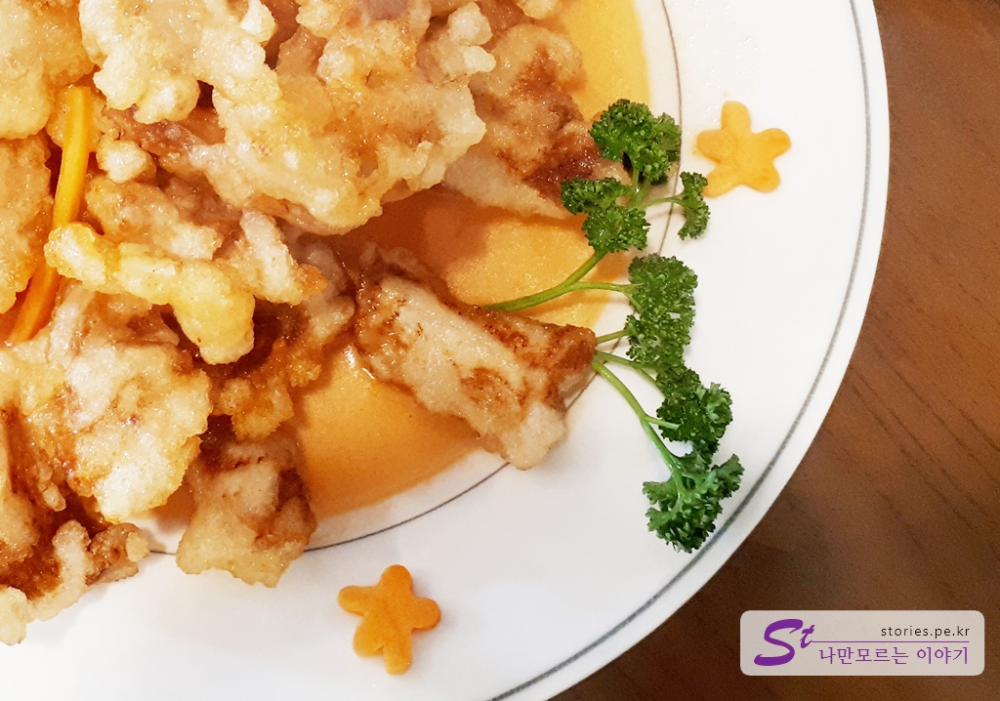
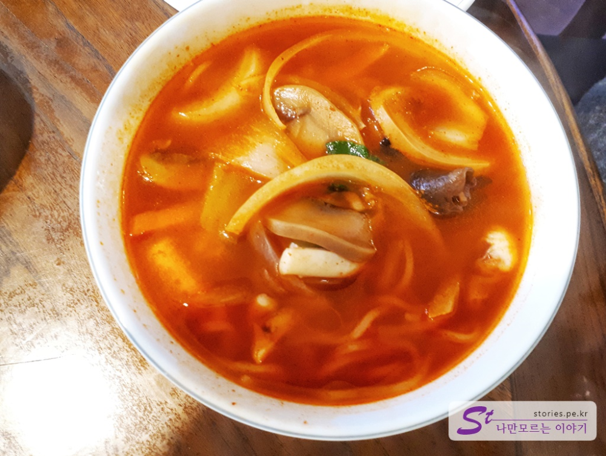
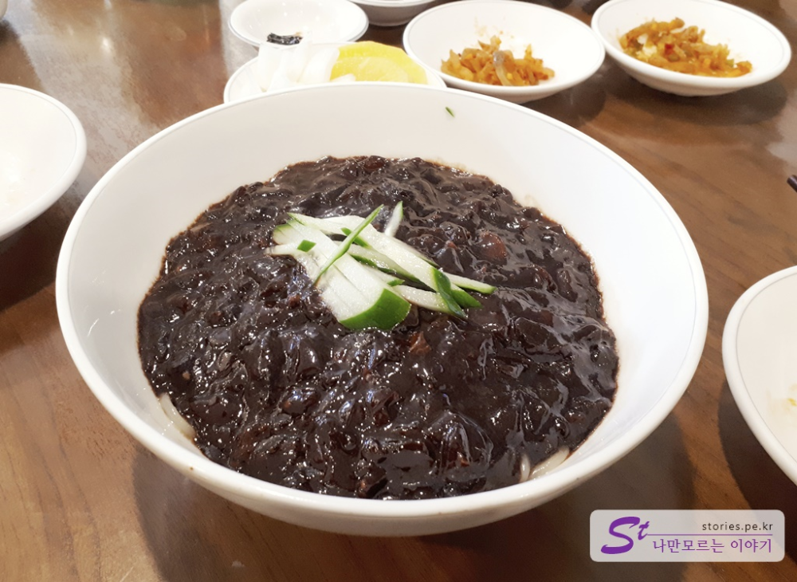
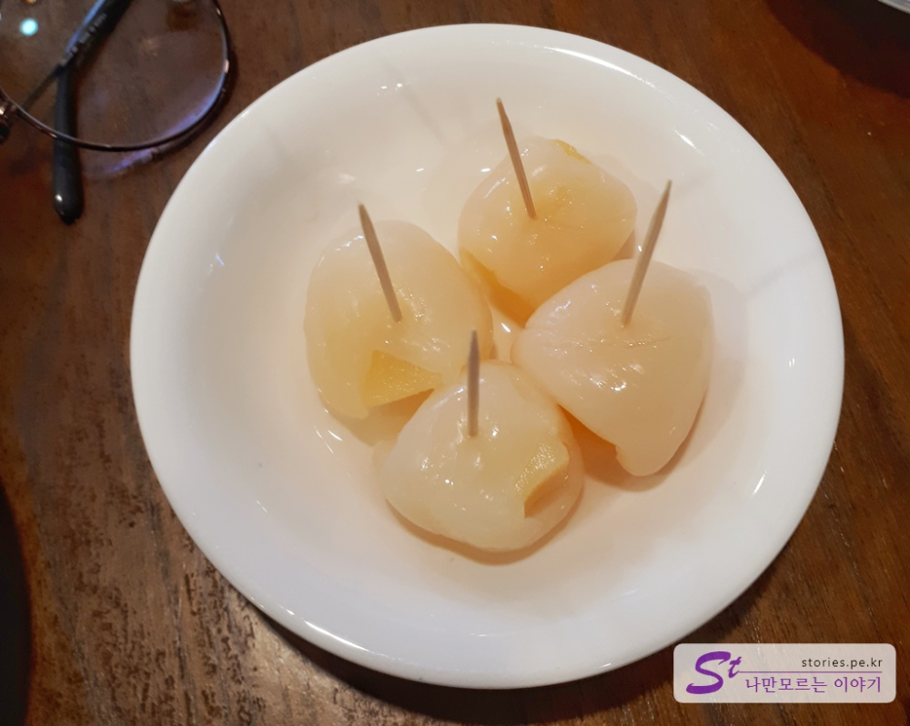
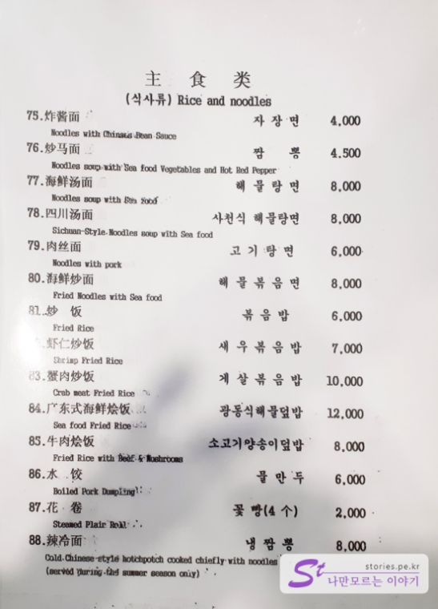

의정부에서 많이 알려져 있지 않지만 중식이 먹고 싶을 때 항상 찾아가는 곳인 **팔가(八家)** 를 소개해 드릴까 합니다.  
의정부역 근처에 있으며 배달은 하지 않고 레스토랑처럼 운영을 하고 있는 곳입니다. 주방장이 화교 분 인지 아니면 조선족인지 모르겠지만 어째튼 중국어 비슷한 언어를 가끔 사용하는 것을 봐서는 한국사람은 아닌 듯 합니다.  

## 방문시기  
이곳을 알고 식사를 시작한지는 거의 8년 이상 된것 같고 이번에 포스팅은 **2019년 1월**에 식사를 하고 포스팅하는 것입니다.  

의정부 역에서 시내쪽 방향으로 나와서 녹양역 방면으로 5~10분정도 걸어가다 보면 만날 수 있습니다.  워낙 건물 색상이 에메랄드색으로 특이해서 한눈에 알아 볼 수 있습니다.  

  
실내도 애메랄드색이고 딱 봐도 중국스러운 분위기를 하고 있습니다. 의자와 식탁은 어디서 구했는지 모르겠지만 딱 중국 스타일로 구성되어 있습니다. 

## 대표 메뉴와 가격(가성비)  
대표메뉴는 중국식 탕수육인 **꿔바로우**입니다. 꿔바로우가 뭔지 모르고 먹었을 때는 그냥 중국식 찹쌀 탕수육으로 알고 먹었었는데 이게 꿔바로우라고 하더군요.  
또한 자장면과 짬뽕도 맛있습니다. 저희는 주로 꿔바로우 하나와 짜장, 짬뽕을 조합으로 먹습니다.   

## 먹어본 음식  
이번에 먹은 음식도 꿔바로우 중(中)자 1개, 짜장면 2개, 짬뽕 1개를 2개로 나누어서 4명이서 먹었습니다. 

  
주문을 하면 먼저 밑반찬, 식초간장과 튀긴 땅콩을 줍니다. 요리가 준비되는 동안 집어먹으면 좋습니다.   

  
꿔바로우는 주문을 하면 바로 요리를 시작해서 주기 때문에 시간이 좀 걸립니다.  
약간 세콤한 쏘스가 뭍어 있는 꿔바로우를 간장에 찍어 먹으면 정말 쫄깃하며 식감이 좋고 맛도 좋습니다.  

  

꿔바로우를 거의 다 먹었을 때 쯤이면 같이 주문한 자장면과 짬뽕을 줍니다.  

  
사진만 봐서는 잘 모르겠지만 짬뽕도 정말 맛있습니다. 먹으면 입이 얼얼하게 맵지는 않지만 맛있는 매운맛 이라고 할 수 있습니다. 맛있어요 ^^  

  
같이 나온 자장면입니다. 잘 못하는 집 같은 경우 자장이 쓰거나 짜거나 할텐데, 팔가의 자장면은 정말 맛있습니다. 가격도 `4000원`으로 저렴해서 탕수육과 같이 먹기에 가격면에서 부담이 없습니다. 

또한 짜장면도 그렇고 짬뽕도 그렇고 반씩 나누어서 달라고 하면 1인분 음식을 2개의 그릇에 나누어서 담아 줍니다.   
예를 들어 2명이 방문해서 꿔바로우 하나와 짜장면 하나를 두개로 나누어 달라고 하거나, 또는 짬뽕 하나를 두개로 나누어 달라고 하면 2명이 먹기에 딱 적당한 구성이 됩니다. (몰상식하게 요리없이 자장면만 2개로 나누어달라고 하면 안되요 ㅋ)

  
다 먹고 나면 후식으로 통조림 과일같은데 이름은 모르겠고 파인애플과 열대과일을 낑가서 한사람당 하나씩 먹을 수 있게 줍니다. 입가심하기에 좋습니다.   

  
차림표는 몇장이 됩니다. 그만큼 요리가 많다는 것이구요. 저는 대표적인 식사 부분만 찍어 봤습니다. 꿔바로우 가격은 나와 있지 않지만 
꿔바로우 `소(小)자가 15,000원`, `중(中)자가 19,000원` 입니다. 대(大)자는 없습니다. 

## 청결도  
청결도는 식당 분위기는 깨끗할것 같지 않은 분위기 인데 잘 살펴보면 꽤 깨끗하게 관리를 하고 있는것 같습니다.  

**청결도 : ** ★★★★☆ 

## 식당운영시스템과 친절도  
식당 운영도 잘 하고 있습니다. 당연한 말이지만 음식도 먼저 온 손님이 먼저 먹을 수 있게 서빙을 잘 하고 있고 따로 요청을 하지 않아도 밑반찬이나 땅콩도 알아서 보충해 주십니다.  
서빙을 보실때도 웃는 얼굴로 잘 응대 해 주시구요.

**친절도 : ** ★★★★☆ 

## 식당과 주차 정보
- 주소 : 경기도 의정부시 평화로 564
- 연락처 : 031-847-8988 
- 영업시간(휴무일) : 매일 11:30 - 21:30 (명절 당일 휴무)
- 주차 : 가능하면 차는 가지고 가지 마세요. 건물 뒤에 5~7대 정도 주차할 수 있는 작은 주차장이 있기는 한데 건물 전체에서 사용하는 곳이라 거의 만차 입니다. 
[지도] : http://dmaps.kr/egut4 

